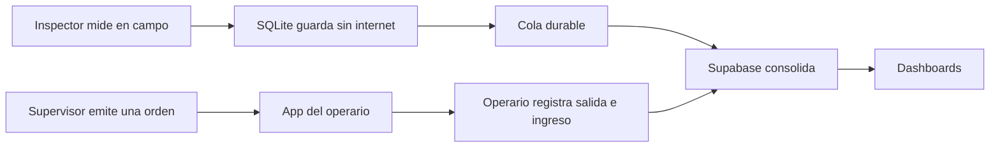
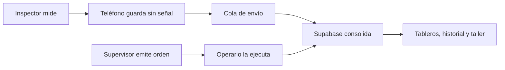
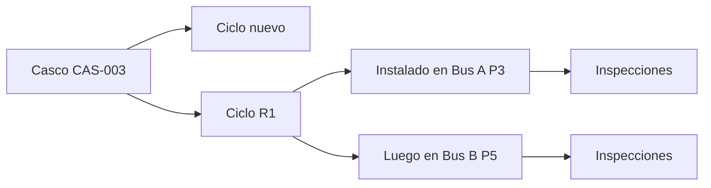
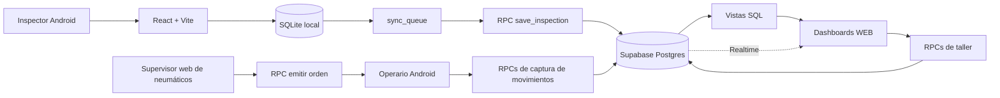
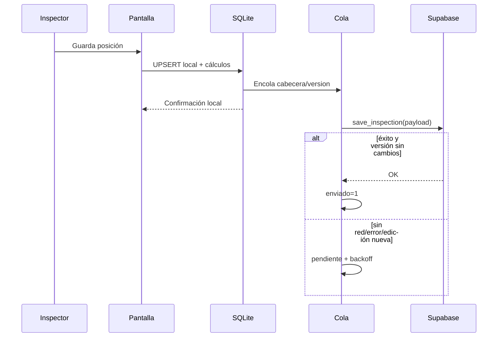
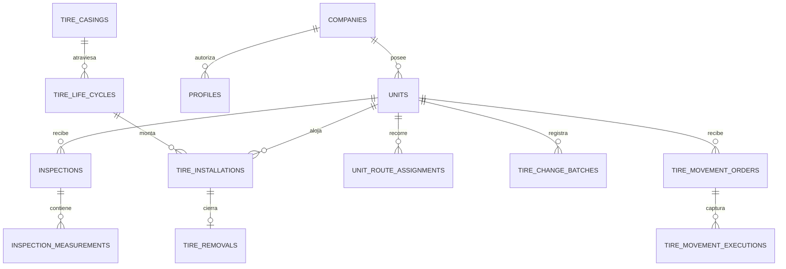

# RENOVA INSPECTOR — conocimiento completo consolidado

**Fecha de corte:** 26 de julio de 2026  
**Propósito:** fuente única para NotebookLM, preparación de presentaciones y transferencia a otra IA.  
**Alcance:** auditoría crítica del estado actual + copia exacta de todas las notas Markdown de
`knowledge/human` y `knowledge/ai`, incluida la bitácora completa.  
**Importante:** este archivo es una copia aparte. No reemplaza ni modifica las notas originales.

## Cómo leer este documento

1. Leer primero esta auditoría: corrige contradicciones y datos que quedaron viejos en las notas.
2. Leer después la guía humana para entender RENOVA sin tecnicismos.
3. Consultar las notas de IA cuando se necesiten contratos, decisiones, deuda o historia.
4. Las notas originales están reproducidas literalmente entre marcadores `BEGIN EXACT NOTE` y
   `END EXACT NOTE`. Cada marcador incluye una huella SHA-256 para poder comprobar la copia.
5. Si una nota copiada contradice esta auditoría, usar la corrección documentada aquí y volver a
   contrastar con código, migraciones y pruebas antes de cambiar el sistema.

## Dictamen corto

La auditoría inicial encontró que `knowledge/human` era una buena introducción, pero no estaba
completa ni totalmente vigente. Esa guía fue actualizada después de la auditoría.

**Al cierre de este documento, `knowledge/human` ya contiene una explicación sencilla y actual de
las áreas necesarias para entender RENOVA:** producto, inspección offline, SQLite/Supabase, vida del
neumático, web/taller, reglas, fallos, estado, seguridad, deuda, pruebas, despliegue y mapa técnico.

Se corrigieron específicamente:

- fechas y estado posteriores al 12 de julio;
- Inventario vigente frente a Comparativo retirado;
- app del operario, buscador, filtros y Servicios ejecutados;
- presión en frío y fórmula actual de Rendimiento;
- riesgo real de las tres RPC anónimas;
- reconciliación pendiente y calidad de datos;
- eliminación de los workflows automáticos de APK/web;
- diez enlaces heredados que apuntaban a archivos inexistentes.

`knowledge/ai` conserva todavía algunas afirmaciones históricas o vencidas dentro de notas que
necesitan mantenimiento. Por eso este consolidado mantiene la auditoría y copia también el contexto
técnico completo.

El archivo incluye las **16 notas humanas** y las **39 notas técnicas/bitácoras de IA**, además de
este bloque de correcciones verificadas.

## RENOVA explicado de forma sencilla y actual

RENOVA es un sistema para registrar, conservar y aprovechar la historia de los neumáticos de una
flota.

Tiene cuatro superficies principales:

1. **App de inspección:** el inspector mide junto al bus. La app guarda primero en el dispositivo,
   incluso sin internet, y sincroniza después.
2. **App de movimientos del operario:** el operario inicia sesión, recibe órdenes del supervisor y
   registra qué neumático sale y cuál entra en cada posición.
3. **Supabase:** guarda la verdad central, separa empresas, ejecuta operaciones completas y entrega
   vistas comunes para evitar que cada pantalla haga cuentas distintas.
4. **Web de supervisión:** permite consultar inspecciones, rendimiento, historial, inventario y
   servicios; también permite emitir órdenes desde la vista de una unidad.

El dato más importante sigue este recorrido:



### Qué funciona hoy

- Captura de inspecciones en Android y navegador de desarrollo.
- Guardado local offline-first y cola durable con reintentos.
- Precarga de empresa, unidad y datos conocidos.
- Cálculos de RTD, IDI, presión en frío, VUR, tasa y severidad.
- Umbrales RTD configurables por empresa y medida.
- Rangos de presión en frío por empresa, medida y tipo de eje.
- Sincronización idempotente de inspecciones.
- Modelo central separado en casco, ciclo, instalación, retiro e inspección.
- Login y separación por empresa en dashboards y app del operario.
- Tableros web de inspecciones por fecha, inspecciones por unidad, rendimiento, historial,
  inventario, importación y servicios ejecutados.
- Buscador global de unidades y neumáticos.
- Filtros facetados en Inspecciones, Rendimiento y Servicios.
- Inventario de consulta con Retén y Descartados.
- Emisión de órdenes por el supervisor y captura por el operario.
- Operaciones SQL de instalación, retiro, traslado, línea base, rutas y lotes de movimientos.
- Pruebas automáticas amplias: **411 pruebas ejecutadas y verdes** el 26 de julio de 2026.
- Lint de la app, validación documental y builds de ambas apps en verde en la misma revisión.

### Qué no debe confundirse

- **Inventario sí existe hoy**, como pantalla nueva de consulta. Lo retirado fue el Inventario
  antiguo con operaciones propias y la pantalla Comparativo.
- El modo **Servicios** dentro de “Inspecciones por unidad” emite y sigue órdenes. La página
  `servicios.html` es otra superficie: consulta servicios ya ejecutados.
- La pantalla del supervisor no confirma por sí sola el movimiento físico. La ejecución técnica la
  registra el operario.
- Las ejecuciones del operario todavía no están reconciliadas con casco/ciclo/instalación: en la
  base remota revisada hay **8 de 8 pendientes**.
- Una inspección detecta lo que está físicamente en la unidad, pero un cambio de identidad visto en
  la inspección no actualiza automáticamente la instalación canónica.
- La pantalla Rendimiento describe la vida/ciclo actual. El total de todas las vidas pertenece al
  Historial.
- Una fecha de última inspección no equivale a una ventana de consumo. La función de consumo en
  30/60 días no se entregó porque faltan mediciones enlazadas suficientes.

## Reglas de negocio vigentes que conviene poder explicar

### RTD y desgaste

- RTD MOVI es el menor canal medido: se usa el más delicado para no esconder riesgo.
- IDI es la diferencia entre el canal más alto y el más bajo.
- El estado RTD se evalúa en orden: cambio, próximo y normal.
- Los umbrales RTD no son constantes universales: cambian por empresa y medida.
- Rendimiento usa profundidad útil: `OTD del ciclo − umbral de retiro`.
- El porcentaje de desgaste usa `RTD gastado / profundidad útil`.
- Un neumático que llegó al umbral de retiro marca 100 %.
- Km/mm se agrega como razón de sumas, no como promedio simple.
- Una medición cuyo RTD crece frente a la anterior se muestra, pero queda fuera de los KPI y se
  explica el motivo.

La guía humana dice que todavía falta acordar la fórmula final de porcentaje de desgaste. Esa frase
quedó vieja: ADR-0011 la cerró el 26 de julio. Lo que sigue abierto es D6, la decisión de
costo/km proyectado.

### Presión

- En frío se usan rangos absolutos mínimo–máximo por medida y tipo de eje.
- La regla general cargada es 100–125 PSI.
- La medida 315/80R22.5 en eje direccional usa 105–125 PSI.
- Los extremos son inclusivos.
- La regla para neumático caliente sigue sin datos ni decisión. El sistema no debe inventarla:
  devuelve estado desconocido para `HOT`.

### Vida del neumático

- Casco: cuerpo físico permanente.
- Ciclo: una banda N, R1, R2, etc.
- Instalación: tramo del ciclo en una unidad y posición.
- Retiro: cierre de la instalación.
- Inspección: fotografía de lo observado en una fecha.
- Una rotación o traslado no reinicia el ciclo.
- Un reencauche sí abre otra vida.
- El RPC de retiro no crea todavía el siguiente ciclo R1/R2.

### Servicios

- Un servicio es una **posición atendida**: lo que sale y lo que entra en esa posición.
- Una rotación entre dos posiciones cuenta como dos servicios.
- Un desecho con reemplazo en una posición cuenta como un servicio.
- Presión, torque y alineación sin desmontar no están incluidos en la pantalla de Servicios.
- El origen de un neumático que entra se deriva si salió de otra posición en la misma orden. Si
  viene de retén, reparación o es nuevo, el origen queda honestamente indeterminado.

## Arquitectura técnica actual

| Zona | Responsabilidad |
|---|---|
| `app/` | App React/TypeScript/Capacitor del inspector |
| SQLite local | Trabajo sin señal, catálogos, inspecciones y cola |
| `app movimientos/` | App React/TypeScript/Capacitor del operario |
| `supabase/migrations/` | Esquema, RLS, vistas, RPC, Storage y Realtime |
| `WEB/` | Siete dashboards HTML/JS modulares |
| `reference/` | Referencia Python y datos golden para fórmulas |
| `specs/` | Reglas y flujo deseados |
| `decisions/` | Once decisiones de arquitectura y negocio |
| `knowledge/` | Notas vigentes y bitácora; no reemplaza las fuentes primarias |

La jerarquía correcta es:

1. Specs y ADR vigentes para saber qué se desea.
2. Código, migraciones y pruebas para saber qué está implementado.
3. `knowledge` para entender y navegar.
4. `docs/run*`, `tasks_*`, `FASE_02` y deuda histórica para reconstruir el pasado, no para asumir
   automáticamente que algo sigue pendiente.

## Estado remoto comprobado el 26 de julio

La revisión fue de solo lectura sobre el proyecto Supabase configurado por RENOVA.

- Proyecto activo y saludable, PostgreSQL 17.
- 23 tablas públicas de negocio listadas, todas con RLS activo.
- 24 vistas públicas: todas con `security_invoker` y lectura concedida a `authenticated`, no a
  `anon`.
- 4 empresas.
- 269 unidades al tomar el snapshot SQL.
- 288 inspecciones y 2.247 mediciones.
- 40 cascos, 41 ciclos y 45 instalaciones.
- 4 órdenes de movimientos y 8 ejecuciones.
- 8 ejecuciones pendientes de reconciliación.
- 2 unidades marcadas como datos de prueba.
- Realtime publica solamente `inspections` e `inspection_measurements`.
- Las migraciones remotas incluyen los cambios del 25 y 26 de julio sobre presión, seguridad,
  unidades de prueba y Rendimiento.

Estos números son una fotografía: pueden cambiar con el uso normal. Los contratos y riesgos son más
importantes que conservar el conteo como constante.

## Seguridad: lo sólido y lo riesgoso

### Lo sólido

- Las tablas públicas tienen RLS.
- Las vistas comprobadas ejecutan con permisos del usuario.
- Las vistas no conceden lectura a `anon`.
- Los dashboards exigen sesión.
- La app del operario deriva la empresa desde el perfil; no deja elegir otro tenant.
- Las operaciones complejas usan RPC transaccionales e idempotencia.

### Riesgo crítico aceptado para el piloto

La app de inspección no tiene identidad de inspector. Para que sincronice, tres RPC
`SECURITY DEFINER` siguen abiertas a `anon`:

- `get_unidad_preload`;
- `get_umbrales_rtd`;
- `save_inspection`.

Esto significa que la pantalla de login del dashboard no protege por sí sola esas API. Con la clave
publicable, una persona puede consultar datos de una unidad conocida y también intentar escribir
inspecciones. El asesor remoto de Supabase volvió a detectar exactamente estas tres exposiciones.

La salida recomendada documentada es una cuenta de dispositivo por empresa como paso intermedio, y
la identidad real del inspector como solución final. Debe cerrarse antes de crecer con varios
clientes reales en volumen.

### Otros avisos remotos

El asesor mostró 19 avisos de seguridad y 20 de rendimiento.

- Seguridad: además de las tres RPC anónimas, detecta `btree_gist` dentro de `public`, protección de
  contraseñas filtradas desactivada y varias RPC `SECURITY DEFINER` ejecutables por usuarios
  autenticados. Estas últimas no son automáticamente fallas: muchas son la API intencional y
  validan rol/empresa dentro de la función, pero cada una debe conservar pruebas de autorización.
- Rendimiento: 17 claves foráneas sin índice de cobertura y 3 índices todavía no utilizados. Son
  candidatos para medir, no una orden de crear o borrar índices sin `EXPLAIN` y carga real.

## Deuda activa priorizada

### Prioridad crítica: seguridad e integridad

- Quitar la dependencia anónima de la app de inspección.
- Reconciliar ejecuciones de movimientos con casco/ciclo/instalación.
- Resolver cambios de identidad detectados por inspección pero no registrados como movimiento.
- Completar la línea base por empresa sin inferir fechas ni instalaciones.
- Aislar o retirar de forma auditada los datos QA; no borrarlos de oficio.
- Normalizar variantes de mayúsculas/minúsculas en marcas.
- Dar identidad navegable a cascos sin código.
- Definir el flujo del ciclo siguiente tras reencauche.

### Prioridad operativa

- Probar APK real: SQLite nativo, cámara, pérdida/retorno de red y cierre del día.
- Completar pruebas de campo autenticadas y aislamiento entre dos empresas.
- Provisionar cuentas reales de supervisor y operario por empresa.
- Definir criterio de “listo para operar” para taller y rutas.
- Publicar movimientos en Realtime o conservar de forma consciente el polling cada diez segundos.
- Paginar Servicios antes de superar el límite explícito de 2.000 filas.

### Sincronización y catálogos

- La cola no se despierta sola justo cuando vence el backoff.
- La precarga puede volver a encolar datos espejo y producir un envío redundante.
- Pull, versionado y borrado seguro de catálogos siguen incompletos.
- El umbral de presión local de SQLite existe, pero no participa del flujo remoto vigente.
- Hay mapeos y snapshots heredados que necesitan saneamiento sin inventar datos faltantes.

### Rendimiento y datos

- D6: definir costo/km proyectado.
- Configurar por empresa el límite de frescura hoy fijo en 30 días.
- Mejorar el enlace de mediciones a ciclos antes de ofrecer consumo por ventana o tendencias.
- Sanear datos y medir antes de agregar índices por intuición.
- Mantener el esquema local fiel al remoto y dejar de tratar `schema_draft.sql` como autoridad.

### Mantenibilidad y producto

- La navegación se repite a mano en siete HTML.
- Evaluar React para dashboards solo como fase futura con ADR y migración gradual; no es requisito
  para mejorar el diseño actual.
- Completar consola administrativa, importaciones auditables y reporte Excel canónico.
- Validar otras configuraciones de vehículo después de cerrar buses.
- La presión en caliente sigue abierta por falta de datos reales.

## Contradicciones y correcciones que debe conocer NotebookLM

| Afirmación vieja o todavía copiada en notas técnicas | Corrección verificada |
|---|---|
| “Inventario y Comparativo retirados” | Comparativo sigue retirado. Inventario volvió el 15 de julio como consulta de Retén/Descartados. |
| “No hay pantalla separada de Inventario” | Esa frase de `knowledge/ai/01` está vencida. Sí existe `WEB/inventario.html`. |
| “Inventario no es superficie vigente” | La alineación histórica de Diseño quedó vieja; Inventario sí es vigente. |
| “Falta acordar `% DESGASTE`” | ADR-0011 cerró desgaste útil y ponderación el 26 de julio. D6 de costo/km sigue abierta. |
| “CI/CD genera APK y publica web” | Los workflows `build-apk.yml` y `web-preview.yml` fueron eliminados en el commit actual. Los builds locales funcionan, pero esa automatización ya no está presente. |
| “Automatización para APK y publicación web ya existe” | La afirmación humana quedó vieja por la eliminación de workflows. Existe armado local de bundle; no la automatización descrita. |
| “Las vistas de Rendimiento conservan grants a anon” | El remoto comprobado niega lectura `anon` en las 24 vistas. La deuda persiste en las tres RPC móviles, no en las vistas. |
| “Servicios está planificado pero no ejecutado” | `deuda_tecnica/00-inventario.md` quedó viejo: Servicios ya tiene vista, página, pruebas y smoke; conserva deuda propia. |
| “19 vistas de dashboard” | El snapshot actual contiene 24 vistas públicas protegidas. |
| “270 unidades / 289 inspecciones” | Los conteos variaron durante la auditoría; el snapshot SQL final dio 269/288. Son datos vivos, no contratos. |

## Problemas de navegación corregidos

El índice humano anterior enlazaba los siguientes archivos como si estuvieran junto a la guía, pero
no existían dentro de `knowledge/human`:

- `modelo-datos-supabase.md`;
- `rls-tenancy-supabase.md`;
- `sync-app-supabase.md`;
- `calculos-reglas-negocio.md`;
- `app-frontend-sqlite.md`;
- `dashboards-html.md`;
- `decisiones-arquitectura.md`;
- `evolucion-modelo-datos-descartado.md`;
- `sync-payload-descartado.md`;
- `2026-07-08_supabase-rls-login-dashboards-realtime.md`.

Esos enlaces fueron retirados. El índice actual apunta a las 15 páginas ordenadas de la guía y
orienta hacia las notas reales de `knowledge/ai`. La validación final no encontró enlaces wiki
rotos.

## Qué fue validado y qué no

### Validado en esta auditoría

- Árbol del repositorio y estado de Git.
- Las 55 notas Markdown de `knowledge`.
- Specs, ADR recientes, deuda y documentación de operación relevante.
- Contradicciones textuales contra código y commits.
- 411 pruebas, lint, chequeo documental y dos builds.
- Proyecto Supabase activo, tablas/RLS, vistas/grants, migraciones, Realtime, métricas y advisors.
- Integridad byte a byte de la copia que aparece después de esta sección.

### No validado como prueba de campo nueva

- Instalación de APK en un teléfono físico.
- Cámara real y Storage desde dispositivo.
- Corte de señal real durante una inspección.
- Flujo completo con cuentas de todos los roles de todas las empresas.
- Exactitud de cada fila histórica frente al vehículo físico.
- Costo/km final, presión en caliente y decisiones humanas todavía abiertas.

Por tanto, el sistema está **técnicamente verificable y con buena cobertura local**, pero no debe
presentarse como producto operativo completamente cerrado. La mayor brecha no es “que no haya
código”: es identidad/seguridad de la app de inspección, reconciliación de movimientos, calidad de
datos y validación de campo.

## Resultado de la revisión crítica

Esta auditoría fue revisada contra tres clases de evidencia:

1. **Texto:** knowledge, specs, ADR, deuda e historia.
2. **Implementación:** código, paquetes, migraciones, commit actual y archivos realmente presentes.
3. **Ejecución:** pruebas/builds locales y consultas de solo lectura al Supabase remoto.

Cuando dos fuentes discreparon, no se eligió la más nueva por intuición: se buscó el archivo o el
estado remoto que demuestra el comportamiento. Las cifras remotas se presentan como snapshot; las
decisiones abiertas siguen abiertas; los avisos automáticos se distinguen de vulnerabilidades
confirmadas. Las notas originales se conservan completas más abajo para que NotebookLM pueda
reconstruir contexto e historia sin que esta auditoría borre las contradicciones que encontró.

# Copia exacta de `knowledge`

A partir del siguiente punto se embeben todas las notas Markdown originales. El orden es:

1. `knowledge/human`;
2. notas temáticas de `knowledge/ai`;
3. bitácora completa de `knowledge/ai`.


---

## Copia exacta de `knowledge/human`


---

<!-- BEGIN EXACT NOTE: knowledge/human/GUIA RENOVA/00 - EMPEZAR AQUI.md | bytes=2334 | sha256=81940d691949c9de94c7fee3342227a92571b415d08697c47f622e60195f9884 -->
---
title: "Empezar aquí"
updated: 2026-07-26
status: vigente
sources: [CLAUDE.md, PRODUCT.md, repository audit 2026-07-26, Supabase read-only audit 2026-07-26]
---

# Empezar aquí

RENOVA INSPECTOR es, en criollo, un **cuaderno de inspecciones que no se pierde cuando no hay
internet**, más un archivo central que junta el trabajo de todos, organiza el taller y arma
tableros.

Se puede pensar como cuatro lugares:

1. **El teléfono del inspector** es la libreta que lleva al patio.
2. **La app del operario** recibe órdenes y registra qué neumático sale y cuál entra.
3. **Supabase** es el archivo central de todas las empresas.
4. **Los tableros web** son las ventanas donde el jefe y el taller consultan y dirigen el trabajo.



## Lo más importante

- Si se corta internet, el inspector debe poder seguir trabajando.
- El teléfono guarda primero y manda después.
- Una inspección no se borra del teléfono hasta que la nube confirme que la recibió.
- En las pantallas con login, cada empresa debe ver solo lo suyo.
- La app de inspección todavía sincroniza sin identidad de inspector. Por eso tres ventanillas
  técnicas siguen abiertas con la clave pública: es un riesgo aceptado solo para el piloto y debe
  cerrarse antes de crecer con varios clientes reales.
- Los límites de desgaste cambian por empresa y medida; no son números clavados para todos.
- La presión en FRÍO usa rangos por medida y eje.
- La presión con neumático CALIENTE todavía no tiene una regla confirmada.
- Una orden del supervisor no equivale a un trabajo ejecutado: el operario registra la ejecución.
- Los movimientos ejecutados todavía deben reconciliarse con la historia canónica del neumático.

## Qué está realmente comprobado

Al 26 de julio de 2026:

- las ocho suites automáticas suman 411 pruebas y están verdes;
- las dos apps compilan;
- Supabase está activo;
- sus tablas tienen separación por empresa y sus vistas exigen sesión;
- siguen faltando pruebas completas en teléfonos y condiciones reales de campo.

Seguir con [[01 - Que problema resuelve RENOVA]].

<!-- END EXACT NOTE: knowledge/human/GUIA RENOVA/00 - EMPEZAR AQUI.md -->

---

<!-- BEGIN EXACT NOTE: knowledge/human/GUIA RENOVA/01 - Que problema resuelve RENOVA.md | bytes=2543 | sha256=3155430a3fe0bf652c29b92e5cbac21b6151cd9d595852622f174a3ac45f95c7 -->
---
title: "Qué problema resuelve RENOVA"
updated: 2026-07-26
status: vigente
sources: [PRODUCT.md, specs/flujo_inspeccion.md, CLAUDE.md, knowledge/ai/01, repository audit 2026-07-26]
---

# Qué problema resuelve RENOVA

Antes, mucha información termina en Excel y hay que volver a ordenarla: qué bus se revisó, qué neumático estaba en cada lugar, cuánto remanente tenía, si estaba bajo de aire y si había que retirarlo.

RENOVA busca que el dato se escriba **una sola vez, al lado del bus**, y después sirva para todo:

- avisar cuál neumático necesita atención;
- comparar posiciones, marcas, diseños y rutas;
- saber qué está instalado, retirado o esperando reencauche;
- construir reportes sin rehacer cuentas a mano;
- conservar la historia aunque se cambie de teléfono.
- separar lo que el supervisor ordenó de lo que el operario realmente ejecutó;
- explicar de dónde salió cada número importante.

## A quién ayuda

- **Inspector:** captura aunque no tenga señal.
- **Supervisor de neumáticos:** revisa una unidad y emite órdenes por posición.
- **Operario:** recibe la orden y confirma lo que salió y entró.
- **Jefe de flota o taller:** consulta inspecciones, alertas, rendimiento, historial, inventario y
  servicios.
- **Administrador:** debería manejar empresas, usuarios, umbrales y catálogos; esta consola todavía
  no está completa.

## Ejemplo

El inspector mide la posición 3 del bus 5028. Anota tres profundidades, presión y una anomalía. El teléfono calcula el valor más delicado, guarda todo y lo manda cuando puede. El jefe ve la alerta y el taller puede decidir un retiro. Meses después, esa medición ayuda a calcular cuánto rindió la banda.

## Qué no intenta resolver todavía

- No reemplaza todas las tareas administrativas de una empresa.
- No tiene completa la administración de usuarios y catálogos desde una pantalla.
- No tiene cerrada la regla de presión en caliente.
- No crea automáticamente R1/R2 después de retirar para reencauche.
- No reconcilia todavía toda ejecución del operario con casco, ciclo e instalación.
- No puede atribuir una inspección a un inspector identificado porque la app de inspección aún no
  tiene login.
- No calcula consumo real en ventanas de 30/60 días porque faltan mediciones enlazadas suficientes.
- No significa que todo vehículo posible ya esté validado; la app empezó por buses.
- No significa que el APK ya esté probado en todas las condiciones reales de patio.

Seguir con [[02 - El viaje de una inspeccion]].

<!-- END EXACT NOTE: knowledge/human/GUIA RENOVA/01 - Que problema resuelve RENOVA.md -->

---

<!-- BEGIN EXACT NOTE: knowledge/human/GUIA RENOVA/02 - El viaje de una inspeccion.md | bytes=2231 | sha256=f4879b9de6576b2c745f47e36200f04398b7e5c3aedfe2548d248c3d991b1b73 -->
---
title: "El viaje de una inspección"
updated: 2026-07-26
status: vigente
sources: [specs/flujo_inspeccion.md, app/src/screens, app/src/db, app/src/sync, decisions/0009]
---

# El viaje de una inspección

## Paso a paso

1. El inspector abre la app y elige la empresa.
2. Busca el número o placa de la unidad.
3. La app trae lo conocido de la inspección anterior para no escribir todo de nuevo.
4. El inspector anota odómetro y recorre las posiciones.
5. En cada rueda carga código, medida, marca, diseño, remanentes, presión, válvula y anomalía.
6. La app guarda los datos y las cuentas de captura en el mismo teléfono.
7. Primero guarda en su base local.
8. Después pone la inspección en una cola para enviarla.
9. Supabase confirma la recepción y actualiza los tableros.

La app puede consultar previamente la unidad y los umbrales desde Supabase. Si esa consulta falla,
la captura local no debe bloquearse.

## Por qué guarda toda la inspección cada vez

La cola usa una ficha por inspección, no una ficha por rueda. Cuando cambia una posición, vuelve a mandar la foto completa de esa inspección. Como usa el mismo identificador, Supabase actualiza y no duplica.

Es parecido a corregir una planilla con el mismo número de documento: se envía la versión nueva, no
se crea otro documento.

## Al terminar el día

La app fuerza un último intento. Solo limpia del teléfono lo que la nube confirmó. Si algo no subió, queda guardado para otro intento. Esta regla existe porque “no veo una fila pendiente” no alcanza para asegurar que la nube la tenga.

## Límites actuales del viaje

- Cada error aumenta la espera hasta un máximo de cinco minutos, pero la cola no tiene un reloj que
  se despierte solo al vencer esa espera. Vuelve a intentar cuando ocurre otro disparador, como
  abrir, guardar, recuperar conexión o terminar el día.
- Precargar datos conocidos puede volver a encolar una copia y producir un envío redundante.
- La app envía como usuario anónimo porque todavía no tiene identidad de inspector.
- La presión en frío se clasifica en Supabase con el rango de la medida y el eje. La medición
  caliente queda sin veredicto.

Seguir con [[03 - Telefono SQLite y Supabase]].

<!-- END EXACT NOTE: knowledge/human/GUIA RENOVA/02 - El viaje de una inspeccion.md -->

---

<!-- BEGIN EXACT NOTE: knowledge/human/GUIA RENOVA/03 - Telefono SQLite y Supabase.md | bytes=2779 | sha256=6cb04639e79745bd7ae4954829db8501b1212568d71282006948e2823a71b525 -->
---
title: "Teléfono, SQLite y Supabase"
updated: 2026-07-26
status: vigente
sources: [app/src/db, app/src/sync, supabase/migrations, decisions/0001-tenancy.md, decisions/0010-exposicion-anon-de-la-app-de-inspeccion.md, Supabase read-only audit 2026-07-26]
---

# Teléfono, SQLite y Supabase

## SQLite: la libreta del teléfono

SQLite es un archivo-base de datos dentro del aparato. Guarda empresas, unidades, catálogos, inspecciones y la cola. No necesita internet. En el navegador de desarrollo se usa una imitación compatible para poder probar.

## Supabase: el archivo central

Supabase guarda la historia de todos los dispositivos, separa empresas y hace cuentas compartidas
para los tableros. También avisa en vivo cuando entran inspecciones.

Al 26 de julio, el remoto tiene RLS en sus tablas y las vistas de los tableros exigen una sesión.
Realtime avisa directamente los cambios de inspecciones y mediciones. Los servicios del operario
todavía usan una consulta periódica adicional porque su tabla no está publicada en Realtime.

## La cola: el cadete

La cola lleva una lista de sobres pendientes. Si entrega uno, lo marca entregado. Si falla, anota el error y espera un poco antes de repetir. Cada nuevo fallo aumenta la espera hasta un máximo de cinco minutos.

Si el inspector cambia una rueda mientras el sobre anterior viaja, la cola reconoce que hay una versión nueva. No deja que la confirmación del sobre viejo haga pasar la nueva como entregada.

## Quién manda

- Mientras no subió: manda la copia del teléfono.
- Cuando subió: Supabase es el archivo consolidado.
- Para saber por qué una rueda fue marcada: se conserva una copia de los límites usados ese día.
- Para saber qué trabajo se pidió: manda la orden del supervisor.
- Para saber qué ocurrió: manda la captura del operario.
- Para la vida canónica del neumático: mandan casco, ciclo, instalación y retiro; hoy falta
  reconciliar automáticamente varias capturas del operario contra esa historia.

## Seguridad en criollo

RLS es como un portero que mira el usuario y solo abre el archivador de su empresa. La clave pública
no es una contraseña secreta y puede estar en una app o navegador.

Pero RENOVA tiene una excepción importante: la app de inspección todavía no inicia sesión. Para que
pueda trabajar, tres RPC especiales siguen abiertas con esa clave pública. Esas RPC permiten buscar
una unidad, leer umbrales y guardar inspecciones. Como son `SECURITY DEFINER`, no pasan por el
portero normal de las filas.

En sencillo: **los dashboards están cerrados con login, pero esas tres ventanillas de la app móvil
todavía no**. Esto está aceptado solo para el piloto. Ver [[11 - Seguridad usuarios y empresas]].

Seguir con [[04 - La vida de un neumatico]].

<!-- END EXACT NOTE: knowledge/human/GUIA RENOVA/03 - Telefono SQLite y Supabase.md -->

---

<!-- BEGIN EXACT NOTE: knowledge/human/GUIA RENOVA/04 - La vida de un neumatico.md | bytes=2567 | sha256=9406f65d728333880a963f767a224331e97bd68209109515acc1471f973227e9 -->
---
title: "La vida de un neumático"
updated: 2026-07-26
status: vigente
sources: [docs/run2_tire_lifecycle_architecture.md, docs/ARCHITECTURE_DECISIONS.md, supabase/migrations, decisions/0011]
---

# La vida de un neumático

Para no mezclar historias, el sistema separa cuatro cosas.

## 1. Casco

Es el cuerpo físico. Sigue siendo el mismo aunque cambie de banda, bus o posición.

## 2. Ciclo

Es una vida de la banda: nueva, R1, R2, etc. Cada ciclo puede tener su costo y profundidad inicial. Cuando se reencaucha, empieza otro ciclo; el casco sigue siendo el mismo.

## 3. Instalación

Es el tramo en que ese ciclo estuvo montado en un bus y posición. Una transferencia cierra un tramo y abre otro.

## 4. Inspección

Es la foto de un día: cuánto marcó el odómetro y qué se midió en esa posición.



## Por qué tanta separación

Permite responder preguntas distintas:

- ¿Cuánto rindió esta banda?
- ¿En qué posición se gastó más?
- ¿Cuántos kilómetros dio el casco durante toda su vida?
- ¿Valió la pena reencaucharlo?

Una sola tabla “neumático” terminaría pisando o mezclando esas respuestas.

## Qué pasa cuando se mueve

- **Rotación o traslado:** cierra un tramo y abre otro, pero sigue el mismo ciclo.
- **Retiro:** cierra la instalación.
- **Retén:** el ciclo queda disponible para volver a montar.
- **Descarte:** termina definitivamente la vida del casco.
- **Reencauche:** debería abrir R1/R2, pero ese paso todavía no forma parte del RPC actual.

## La línea base

La flota no fue convertida de golpe al modelo de taller. Si una posición está vacía en la historia
canónica pero existe una inspección reciente, RENOVA la marca como `baseline_pending`: hay evidencia
de un neumático, pero no una fecha de instalación demostrada.

Una persona debe confirmar el primer montaje y declarar la fecha. El sistema guarda qué medición
sirvió como evidencia, pero no inventa que esa fecha fue la fecha real del montaje.

## Diferencias que todavía aparecen

Una inspección puede encontrar un código o marca diferente de la instalación activa. Eso puede ser
un cambio físico no registrado o un error de captura. Rendimiento lo señala si el RTD crece, pero no
reescribe solo la historia. Resolverlo exige un movimiento confirmado o una reconciliación humana.

Seguir con [[05 - Tableros inventario y taller]].

<!-- END EXACT NOTE: knowledge/human/GUIA RENOVA/04 - La vida de un neumatico.md -->

---

<!-- BEGIN EXACT NOTE: knowledge/human/GUIA RENOVA/05 - Tableros inventario y taller.md | bytes=4468 | sha256=fd9ab9c7b7ff7242973d0d0fef0cabd02dde6027563a04e258156c6ef5872f8e -->
---
title: "Tableros y taller"
updated: 2026-07-26
status: vigente
sources: [WEB, WEB/movimientos, WEB/inventario, WEB/buscador, WEB/shared, WEB/servicios, app movimientos, supabase/migrations, decisions/0005, decisions/0006, decisions/0008, decisions/0011, repository audit 2026-07-26]
---

# Tableros y taller

## Las siete pantallas web

- **Inspecciones por fecha:** muestra el último estado o una fecha histórica elegida.
- **Inspecciones por unidad:** baja al detalle de las posiciones de un bus y permite emitir órdenes.
- **Rendimiento:** calcula kilómetros, desgaste y proyección de la vida actual.
- **Historial:** cuenta la película completa de un casco.
- **Inventario:** separa Retén de Descartados.
- **Importar:** carga inspecciones mediante el mismo guardado central.
- **Servicios:** muestra el trabajo que ya ejecutaron los operarios.

Todas exigen sesión. La empresa se obtiene del perfil del usuario; no debería elegirse libremente
desde el navegador.

## Buscador y filtros

Las siete pantallas comparten un buscador global, que también abre con `Ctrl/Cmd+K`. Busca solo dos
cosas navegables:

- una unidad;
- un neumático/casco.

No ejecuta acciones. Los filtros dentro de una pantalla son distintos: reducen lo que se ve sin
navegar. Se pueden combinar por fecha, unidad, marca, medida, condición, eje y otras facetas. Cada
filtro queda visible como una etiqueta y también en la URL.

## El taller: ordenar no es ejecutar

Dentro de **Inspecciones por unidad** hay dos modos:

- **Inspección:** consulta lo medido.
- **Servicios:** el supervisor arma y emite una orden por posición.

La pantalla separada de Instalación se retiró por redundante. El flujo actual es:

1. El supervisor ve el dibujo de la unidad.
2. Elige la posición y el servicio.
3. Para una rotación elige la otra posición.
4. Para otros servicios elige debajo un neumático disponible del Retén.
5. RENOVA emite una orden.
6. El operario la toma en su app y confirma qué sale y qué entra.
7. La página **Servicios** permite consultar lo ejecutado.

La misma llanta de inventario no puede usarse en dos posiciones del mismo borrador.

## Cómo se cuentan los servicios

Un servicio es una **posición atendida**: el neumático que sale y el que entra.

- Rotar P3 con P4 cuenta como dos servicios, uno por posición.
- Desechar y reemplazar en P3 cuenta como un servicio.
- Montar sobre una posición vacía cuenta como instalación.
- Presión, torque y alineación sin desmontar no aparecen en esta pantalla.

La entrada puede mostrar de qué posición vino si salió en la misma orden. Si viene de Retén,
reparación o es nueva, el origen queda como no determinado. No se inventa.

## Inventario actual y lo retirado

**Inventario sí existe hoy.** Es una pantalla de consulta:

- **Retén:** ciclos activos disponibles para montar.
- **Descartados:** bajas definitivas que no pueden volver a montarse.

Permite abrir el Historial por código. Elegir un neumático del Retén para trabajar se hace desde el
modo Servicios de una unidad.

Lo que sigue retirado es:

- la pantalla Comparativo;
- las operaciones antiguas de reinstalar o reencauchar directamente desde Inventario;
- la pantalla separada de Instalación.

## Rendimiento sin números engañosos

Rendimiento usa la profundidad útil del ciclo. Un neumático en el umbral de retiro marca 100 % de
desgaste. Los grupos se calculan con los kilómetros y milímetros totales, no promediando cada fila
por igual.

Por defecto aparta inspecciones de más de 30 días y permite incluirlas con un filtro visible. Esto
es frescura del dato, no consumo ocurrido en treinta días. La comparación temporal real sigue
pendiente porque faltan series enlazadas suficientes.

## Rutas

Una unidad puede cambiar de ruta. La ruta se guarda como un período con fecha desde/hasta, no como
un texto pegado para siempre al bus. Así el rendimiento puede atribuirse al recorrido de cada
instalación. Las tablas y RPC existen, pero las rutas remotas estaban vacías durante la auditoría y
el proceso todavía requiere validación operativa.

## Estado prudente

Hay pruebas reales anteriores de movimientos y servicios, además de 411 pruebas automáticas verdes.
Eso no reemplaza:

- repetir el APK en campo;
- probar cámara y pérdida de señal;
- verificar todos los roles y dos empresas;
- reconciliar los movimientos ejecutados con la historia canónica.

Seguir con [[06 - Diccionario en criollo]].

<!-- END EXACT NOTE: knowledge/human/GUIA RENOVA/05 - Tableros inventario y taller.md -->

---

<!-- BEGIN EXACT NOTE: knowledge/human/GUIA RENOVA/06 - Diccionario en criollo.md | bytes=3396 | sha256=3cac27ac18c910c3aff8a972e9dc95f58690d29ccefc9eb3c5d8767d7bd2c80d -->
---
title: "Diccionario en criollo"
updated: 2026-07-26
status: vigente
sources: [specs/reglas_negocio.md, decisions, project terminology, Supabase schema 2026-07-26]
---

# Diccionario en criollo

- **RTD o remanente:** cuántos milímetros de dibujo quedan.
- **RTD MOVI:** el menor de los canales medidos; se toma el peor para no esconder riesgo.
- **IDI:** diferencia entre la parte más alta y la más gastada; ayuda a ver desgaste desparejo.
- **VUR:** estimación de cuántos kilómetros quedan antes del límite.
- **ISA:** peso para resumir gravedad de anomalías.
- **Desecho:** ya no conviene o no se puede recuperar según la causa.
- **Casco:** cuerpo físico permanente del neumático.
- **Ciclo:** una vida de banda nueva o reencauchada.
- **Instalación:** período de un ciclo montado en una unidad y posición.
- **Retiro:** evento que cierra la instalación.
- **Retén:** neumáticos activos disponibles para volver a montar.
- **Descartado:** baja definitiva; no vuelve a montarse.
- **N, R1, R2:** banda nueva, primer y segundo reencauche.
- **Snapshot:** foto del límite que se usó ese día.
- **OTD:** profundidad original de la banda al empezar un ciclo.
- **Profundidad útil:** OTD menos el límite de retiro.
- **Línea base:** primer montaje confirmado a partir de una inspección anterior.
- **Reconciliar:** unir una captura del operario con casco, ciclo e instalación canónicos.
- **Orden:** indicación que emite el supervisor.
- **Ejecución:** lo que el operario declara que realmente hizo.
- **Servicio:** una posición atendida, con salida y entrada cuando corresponda.
- **Faceta:** tipo de filtro, por ejemplo empresa, marca, fecha o medida.
- **Frescura:** cuánto tiempo pasó desde la última inspección; no es una ventana de consumo.
- **Offline-first:** primero queda seguro en el teléfono, después se manda.
- **Sync:** sincronizar la libreta local con el archivo central.
- **RPC:** una función de Supabase que ejecuta una operación definida; puede completar todo o
  rechazarlo sin dejar cambios parciales.
- **RLS:** portero que separa los datos de cada empresa.
- **Realtime:** aviso instantáneo para refrescar un tablero.
- **Migración:** cambio numerado y repetible en la estructura de la base.
- **Seed:** paquete inicial de catálogos/datos para arrancar.
- **Frontend:** lo que la persona ve y toca.
- **Backend:** la parte central que guarda, protege y calcula.
- **API:** ventanilla con reglas para pedir o mandar información.
- **Auth:** inicio de sesión e identidad del usuario.
- **Anon:** cliente sin una sesión de usuario.
- **Tenant o empresa:** grupo de datos que debe quedar separado de los demás.
- **Security invoker:** una vista que respeta los permisos de quien la consulta.
- **Security definer:** una función que trabaja con los permisos de su dueño; necesita controles
  internos porque puede saltarse RLS.
- **Idempotente:** repetir la misma operación produce un solo resultado y no duplica el trabajo.
- **Backoff:** espera que crece entre reintentos.
- **Polling:** volver a preguntar cada cierto tiempo cuando no llega un aviso Realtime.
- **Smoke test:** recorrido corto del flujo real para confirmar que abre, guarda, recarga y no deja
  errores.
- **Golden test:** ejemplo fijo cuya respuesta correcta se conserva para detectar cambios de
  fórmula.

Seguir con [[07 - Que pasa cuando algo falla]].

<!-- END EXACT NOTE: knowledge/human/GUIA RENOVA/06 - Diccionario en criollo.md -->

---

<!-- BEGIN EXACT NOTE: knowledge/human/GUIA RENOVA/07 - Que pasa cuando algo falla.md | bytes=3076 | sha256=41891c2890ea42cb6c630ef218c12f14a7ee02f2b27a5fec85c271a25d830d89 -->
---
title: "Qué pasa cuando algo falla"
updated: 2026-07-26
status: vigente
sources: [app/src/sync, WEB, app movimientos, supabase/migrations, knowledge/ai/10, CLAUDE.md]
---

# Qué pasa cuando algo falla

## No hay internet

La inspección queda en el teléfono. La cola vuelve a probar al abrir la app, recuperar conexión, guardar algo nuevo o cerrar el día.

## Se corta internet durante el envío

No se pierde lo local. Queda un error y un próximo intento. Un fallo no bloquea las otras inspecciones.

## El inspector cambia algo mientras se está enviando

La versión nueva queda pendiente. La respuesta vieja no puede marcarla como entregada.

## Se aprieta “terminar”

Solo se borra del teléfono lo confirmado en Supabase. Lo dudoso se conserva.

## Un tablero queda vacío

No asumir enseguida que no hay datos. Puede faltar sesión, permiso, configuración, respuesta de la vista o puede haber un error de JavaScript. Hay que mirar el badge y la consola.

## Una empresa ve datos de otra

Es un problema grave de seguridad. Dejar de publicar esa superficie y revisar RLS, perfil, grants y si la vista usa permisos del usuario.

## Alguien consulta una unidad sin login

Hoy puede ocurrir mediante las tres RPC de la app de inspección. No es una falla nueva ni significa
que RLS de todas las tablas esté roto: es una excepción conocida para mantener el piloto móvil.
Debe registrarse como riesgo crítico y cerrarse con identidad de dispositivo/inspector. Ver
[[11 - Seguridad usuarios y empresas]].

## Un número no coincide entre pantallas

Revisar si una pantalla todavía calcula por su cuenta. La meta es que todos lean la misma vista o regla probada. No arreglarlo copiando otra constante.

## El RTD aumenta de una inspección a otra

Puede ser un cambio de neumático no registrado o una medición incorrecta. Rendimiento deja la fila
visible, la saca del KPI y muestra el motivo. No crea automáticamente una instalación.

## El supervisor emitió pero no aparece en la historia

La orden y la ejecución pueden existir aunque sigan `pending` de reconciliación. Revisar la orden,
la captura del operario y después el casco/ciclo/instalación. No inventar una fecha o un movimiento
para hacer coincidir las pantallas.

## Servicios no se refresca al instante

La tabla de ejecuciones todavía no está publicada en Realtime. La pantalla vuelve a consultar al
recuperar foco y cada diez segundos mientras está visible. Si falla, conserva los datos anteriores
y se debe revisar conexión, sesión y consola.

## Hay más de 2.000 servicios

La pantalla muestra un aviso porque actualmente no pagina. No ignorar el aviso ni presentar el
recorte como un total completo.

## Prueba mínima después de un cambio

Abrir el flujo real, cargar datos, comprobar que se ven, recargar, confirmar que siguen y revisar
que la consola no tenga errores. Si toca nube, confirmar además la fila o respuesta real. Si toca
seguridad, probar al menos usuario correcto, otro usuario/empresa y cliente sin sesión.

Seguir con [[08 - Estado actual y futuro]].

<!-- END EXACT NOTE: knowledge/human/GUIA RENOVA/07 - Que pasa cuando algo falla.md -->

---

<!-- BEGIN EXACT NOTE: knowledge/human/GUIA RENOVA/08 - Estado actual y futuro.md | bytes=3314 | sha256=1788c880bf078bece99b4a227769023c71f26d0baf85a937fdef798eade8027b -->
---
title: "Estado actual y futuro"
updated: 2026-07-26
status: vigente
sources: [git, app/src, app movimientos/src, WEB, supabase/migrations, specs, decisions, knowledge/ai/10, repository and Supabase audit 2026-07-26]
---

# Estado actual y futuro

## Ya existe

- App de inspección para Android y navegador de prueba.
- App separada del operario con login, bandeja de órdenes y borrador local.
- Guardado local sin internet.
- Precarga de datos conocidos.
- Cálculos principales de captura.
- Umbrales RTD cambiables por empresa/medida.
- Rangos de presión en frío por empresa, medida y eje.
- Cola durable con reintentos y protecciones contra pérdida.
- Supabase con RLS por empresa y vistas protegidas para usuarios autenticados.
- Siete pantallas web: inspecciones por fecha/unidad, rendimiento, historial, inventario,
  importación y servicios.
- Buscador global de unidades/neumáticos y filtros facetados.
- Inventario actual de solo lectura: Retén y Descartados.
- Modo Servicios por unidad para que el supervisor emita órdenes.
- App del operario para tomar y completar esas órdenes.
- Servicios ejecutados contados por posición atendida.
- RPCs de taller, línea base, movimientos por lote y rutas temporales.
- Fórmula de desgaste por profundidad útil y agregación ponderada aprobada.
- 411 pruebas, lint, documentación y builds verdes el 26 de julio.

## Hay que terminar o validar

- Identidad del inspector o, como paso intermedio, cuenta de dispositivo por empresa.
- Cerrar la exposición anónima de las tres RPC móviles.
- Reconciliar ejecuciones del operario con casco/ciclo/instalación.
- Resolver cambios físicos detectados por inspección pero no registrados como movimiento.
- Prueba completa de taller y rutas con base real y roles.
- Envío automático justo al vencer la espera, aunque nadie toque la app.
- Evitar algunos reenvíos innecesarios al precargar.
- Completar sincronización/versionado de catálogos.
- Regla de presión CALIENTE.
- Definir costo/km proyectado; la fórmula de porcentaje de desgaste ya está acordada.
- Reporte Excel definitivo y consola administrativa.
- Definir el flujo futuro para abrir R1/R2 después de retirar por reencauche.
- Probar APK en condiciones reales de campo.
- Aislar o retirar de forma auditada datos de prueba.
- Normalizar marcas y mejorar identidad de cascos sin código.
- Paginar Servicios cuando el volumen llegue al límite.
- Definir publicación y entrega: los workflows automáticos de APK/web fueron eliminados del commit
  actual; los builds locales siguen funcionando.

## Plan a futuro razonable

1. Cerrar identidad y exposición anónima.
2. Reconciliar movimientos y completar la línea base.
3. Blindar lo existente con pruebas de extremo a extremo y APK real.
4. Convertir taller/rutas en proceso operativo aceptado.
5. Sanear datos y centralizar las cuentas repetidas que todavía queden.
6. Crear consola, reportes e importaciones auditables.
7. Sumar otras configuraciones de vehículo solo después de validar buses.

## Regla para leer tareas viejas

Una tarea que dice “pendiente” puede haber sido ejecutada sin actualizar la tabla. Primero mirar el programa y las migraciones; la tarea sirve para entender la intención y la historia.

Seguir con [[09 - Links para seguir aprendiendo]].

<!-- END EXACT NOTE: knowledge/human/GUIA RENOVA/08 - Estado actual y futuro.md -->

---

<!-- BEGIN EXACT NOTE: knowledge/human/GUIA RENOVA/09 - Links para seguir aprendiendo.md | bytes=1466 | sha256=1ff17f10103a96dc409d6521f7893d03e8d3d314ab8ff58ab29a9ebcc9388594 -->
---
title: "Links para seguir aprendiendo"
updated: 2026-07-26
status: vigente
sources: [official documentation checked 2026-07-26]
---

# Links para seguir aprendiendo

## Base y seguridad

- [Qué es la base de Supabase](https://supabase.com/docs/guides/database/overview)
- [RLS: cómo se separan las filas](https://supabase.com/docs/guides/database/postgres/row-level-security)
- [Cómo proteger la API de datos](https://supabase.com/docs/guides/api/securing-your-api)
- [Seguridad de productos Supabase](https://supabase.com/docs/guides/security/product-security)
- [Documentación de PostgreSQL](https://www.postgresql.org/docs/current/)
- [SQLite explicado por su documentación](https://www.sqlite.org/docs.html)

## App

- [React](https://react.dev/learn)
- [Vite](https://vite.dev/guide/)
- [TypeScript](https://www.typescriptlang.org/docs/)
- [Capacitor](https://capacitorjs.com/docs)

## Pruebas y notas

- [Vitest](https://vitest.dev/guide/)
- [Obsidian: enlazar notas](https://obsidian.md/help/links)
- [Obsidian: qué es un vault](https://obsidian.md/help/glossary#Vault)

## Orden recomendado

1. SQLite vs Supabase.
2. Tablas, filas y relaciones.
3. API/RPC.
4. Auth y RLS.
5. React/TypeScript.
6. Pruebas y migraciones.

No hace falta aprender todo para entender el negocio. Primero poder contar [[02 - El viaje de una inspeccion]] y [[04 - La vida de un neumatico]] sin palabras técnicas.

Seguir con [[10 - Flujo de trabajo para no olvidarme]].

<!-- END EXACT NOTE: knowledge/human/GUIA RENOVA/09 - Links para seguir aprendiendo.md -->

---

<!-- BEGIN EXACT NOTE: knowledge/human/GUIA RENOVA/10 - Flujo de trabajo para no olvidarme.md | bytes=4163 | sha256=175d2eb5d015c2eaa655a861332d098bdd83c990dacd70758dea5eb739d4cafe -->
---
title: "Flujo de trabajo para no olvidarme"
updated: 2026-07-26
status: vigente
sources: [scripts/sync-project-docs.mjs, scripts/knowledge-day.mjs, scripts/verify-all.mjs, CLAUDE.md, knowledge/ai/14]
---

# Flujo de trabajo para no olvidarme

## La idea corta

El programa cambia primero. Después se actualizan las explicaciones en `knowledge/`. Al final se copian a Obsidian.

**Obsidian es la copia cómoda para leer. La fuente que se conserva con el proyecto está en `knowledge/`.**

## Al empezar una sesión

Desde la carpeta principal del proyecto:

```bash
npm run docs:status
```

Esto compara el proyecto con la última vez que se mandaron las notas a Obsidian.

- **PEQUEÑOS:** se pueden acumular hasta terminar la sesión.
- **IMPORTANTES:** cambió una zona delicada como sync, base, reglas, dependencias o Supabase.
- **ENORMES:** cambiaron muchos archivos, varias zonas delicadas o una cantidad grande de contenido.

## Mientras se trabaja

No hace falta sincronizar por cada color, texto o arreglo pequeño. Conviene actualizar las notas cuando cambia alguna de estas cosas:

- cómo viaja o se guarda un dato;
- estructura de la base;
- reglas o fórmulas;
- pantallas o pasos importantes;
- permisos/usuarios/empresas;
- arquitectura, dependencias o despliegue;
- qué está terminado y qué falta.

## Saber qué se hizo cada día

Además de las explicaciones por tema, existe una bitácora ordenada por fecha. Para crear o
actualizar la entrada de hoy:

```bash
npm run docs:day
```

La nota queda en `knowledge/ai/bitacora/AÑO/AAAA-MM-DD.md`. Allí se escribe qué cambió, por qué,
qué archivos se tocaron, cómo se probó y en qué commit quedó. El comando también busca los commits
de esa fecha; si todavía no se hizo commit, lo deja claramente como pendiente.

Para reconstruir un problema más adelante:

1. Abrir la fecha aproximada en la bitácora.
2. Leer la razón y los riesgos anotados.
3. Usar el hash con `git show HASH`.
4. Comparar los archivos actuales con ese commit antes de revertir o corregir.

## Al terminar una sesión importante

1. Actualizar las notas correspondientes dentro de `knowledge/ai` y `knowledge/human`.
2. Dejar escrito qué funcionaba antes si explica una decisión importante. No hace falta guardar copias completas de todo.
3. Ejecutar la verificación integral:

```bash
npm run verify
```

Esto cuenta las ocho suites para no dar por bueno un resultado que omitió pruebas. También ejecuta
lint, chequeo documental y los builds de las dos apps.

4. Validar las notas por separado si se está trabajando solo en documentación:

```bash
npm run docs:check
```

5. Mirar qué se va a copiar:

```bash
npm run docs:sync -- --dry-run
```

6. Sincronizar:

```bash
npm run docs:sync
```

7. Confirmar que quedó al día:

```bash
npm run docs:status
```

Debe responder que la documentación está al día.

## Cuándo hacerlo sí o sí

- Después de un cambio grande.
- Antes de pasar el proyecto a otra IA.
- Antes de una demo o entrega.
- Cuando `docs:status` diga IMPORTANTES o ENORMES.
- Aunque no haya grandes cambios, una revisión semanal evita que se acumule demasiado.

## Qué conserva y qué reemplaza

`docs:sync` reemplaza en Obsidian las notas que administra. No toca contraseñas, `.obsidian/`, comandos personales ni otras notas manuales. Las versiones anteriores de las notas se recuperan desde Git si fueron guardadas en un commit; las decisiones importantes también deben quedar resumidas en la nota de historia.

## Publicar no es lo mismo que compilar

Al 26 de julio las dos apps compilan localmente, pero los workflows automáticos de APK y web fueron
retirados del repositorio. No decir “está publicado” solo porque `npm run build` termina bien.

Para una demo privada existe `npm run deploy:bundle`, que prepara `deploy-static/` para subirlo
manualmente a un hosting. La instalación del APK y la URL final deben verificarse por separado.

## Regla simple para recordar

> Si el cambio haría que otra persona explique mal cómo funciona RENOVA, hay que actualizar la documentación antes de sincronizar.

Seguir con [[11 - Seguridad usuarios y empresas]].

<!-- END EXACT NOTE: knowledge/human/GUIA RENOVA/10 - Flujo de trabajo para no olvidarme.md -->

---

<!-- BEGIN EXACT NOTE: knowledge/human/GUIA RENOVA/11 - Seguridad usuarios y empresas.md | bytes=3628 | sha256=020ee21fb6cb7599a558acbd90a8547285f1c6a2e9f2884d046ed1a52b32f695 -->
---
title: "Seguridad, usuarios y empresas"
updated: 2026-07-26
status: vigente
sources: [decisions/0001-tenancy.md, decisions/0010-exposicion-anon-de-la-app-de-inspeccion.md, knowledge/ai/08, Supabase read-only audit 2026-07-26]
---

# Seguridad, usuarios y empresas

## La idea sencilla

RENOVA guarda información de varias empresas en la misma base. La regla es que una persona debe ver
solo la empresa asociada a su cuenta.

Supabase aplica esa separación de dos maneras:

1. **Login:** demuestra quién es el usuario.
2. **RLS:** revisa a qué empresa pertenece y filtra las filas.

Una vista debe usar `security_invoker` para respetar los permisos de quien la abre. Una RPC de
taller además valida el rol permitido antes de escribir.

## Qué está protegido hoy

En la revisión remota del 26 de julio:

- las tablas públicas tenían RLS;
- las 24 vistas públicas respetaban los permisos del usuario;
- esas vistas permitían lectura a usuarios autenticados, no a clientes anónimos;
- la app del operario exigía login;
- el operario y el supervisor recibían la empresa desde su perfil.

Tener la URL de Supabase o una clave publicable no permite leer directamente todas esas tablas y
vistas.

## La excepción importante de la app de inspección

La app del inspector todavía no tiene login. Para que pueda buscar una unidad y sincronizar, tres
RPC siguen abiertas sin sesión:

- `get_unidad_preload`: busca los datos conocidos de una unidad;
- `get_umbrales_rtd`: entrega límites de desgaste;
- `save_inspection`: guarda una inspección.

Son funciones `SECURITY DEFINER`. Trabajan con permisos especiales y no pasan por la RLS normal de
las filas. El asesor de Supabase también las marca como expuestas.

En palabras simples:

> El login protege los dashboards, pero no cierra esas tres ventanillas móviles.

Una persona que tenga la clave pública y conozca empresa/placa puede intentar usarlas. Por eso no se
debe afirmar en una presentación que todos los datos exigen autenticación.

## Por qué no se cierran de inmediato

Si se revocan hoy, la app de inspección deja de sincronizar. El trabajo quedaría guardado en el
teléfono, pero no llegaría al archivo central.

La opción intermedia recomendada es una cuenta de dispositivo por empresa, iniciada de forma
silenciosa. La solución final es identidad real del inspector con una sesión que siga funcionando
sin señal.

Este riesgo está aceptado solo para el piloto. Debe cerrarse antes de operar en volumen con varios
clientes reales.

## Claves públicas y claves secretas

- La clave publicable o `anon` puede ir en una app o navegador; su seguridad depende de permisos,
  RLS y RPC bien cerradas.
- `service_role` y las claves secretas nunca deben ir en el APK, HTML, Git ni estas notas.
- Una contraseña de usuario tampoco debe copiarse a documentación compartida.

## Roles principales

- **Inspector:** todavía sin identidad propia en la app de inspección.
- **Operario:** toma y completa órdenes.
- **Supervisor de neumáticos:** emite órdenes.
- **Jefe de flota:** rol histórico admitido en algunas operaciones.
- **Administrador:** acceso más amplio, que debe seguir limitado por empresa y función.

## Si aparece una mezcla entre empresas

1. Detener la publicación o demo de esa superficie.
2. Confirmar usuario y empresa del perfil.
3. Revisar RLS, grants y `security_invoker`.
4. Revisar controles internos de la RPC.
5. Probar con dos cuentas de empresas distintas y con cliente sin sesión.
6. No “arreglar” el problema ocultando filas en JavaScript.

Seguir con [[12 - Deuda riesgos y decisiones pendientes]].

<!-- END EXACT NOTE: knowledge/human/GUIA RENOVA/11 - Seguridad usuarios y empresas.md -->

---

<!-- BEGIN EXACT NOTE: knowledge/human/GUIA RENOVA/12 - Deuda riesgos y decisiones pendientes.md | bytes=4074 | sha256=2649347207af58220c7964192cdce10d489c0e936f8106a856b9cacece5b86a8 -->
---
title: "Deuda, riesgos y decisiones pendientes"
updated: 2026-07-26
status: vigente
sources: [knowledge/ai/10, deuda_tecnica, decisions, repository and Supabase audit 2026-07-26]
---

# Deuda, riesgos y decisiones pendientes

Deuda no significa necesariamente que algo esté roto. Significa que existe una limitación conocida,
un trabajo deliberadamente postergado o una decisión que todavía necesita datos.

## Primero: seguridad e historia confiable

### Identidad del inspector

La app de inspección trabaja sin login. Hay que introducir una cuenta de dispositivo o identidad de
inspector y después cerrar las tres RPC anónimas.

### Reconciliación de movimientos

La orden y la ejecución del operario existen, pero todavía no se enlazan automáticamente con casco,
ciclo e instalación. En el snapshot remoto había 8 ejecuciones y las 8 seguían pendientes.

### Cambios físicos detectados por inspección

Una inspección puede mostrar otro código, marca o RTD sin un movimiento registrado. El sistema lo
señala, pero no debe inventar una instalación. Hace falta decidir el flujo humano de corrección.

### Línea base

Muchas posiciones históricas no tienen una instalación canónica. Deben confirmarse de manera
gradual, frente a la unidad, sin inventar fechas a partir de inspecciones.

### Datos de prueba y suciedad

Hay unidades y cascos de QA en la base, además de marcas escritas con distintas mayúsculas. Deben
aislarse, normalizarse o eliminarse con respaldo y aprobación. Nunca borrarlos de oficio.

## Operación de campo

- Probar APK en un teléfono real.
- Probar SQLite nativo, cámara, Storage, pérdida y retorno de señal.
- Repetir flujos con cuentas reales de supervisor y operario.
- Probar visualmente dos empresas para confirmar aislamiento.
- Definir qué evidencia convierte taller y rutas en “listos para operar”.

## Sincronización y catálogos

- La cola no se despierta sola justo al terminar el backoff.
- Una precarga puede volver a mandar datos que solo estaba copiando.
- Falta completar pull, versionado y borrado seguro de catálogos.
- Existe una tabla de presión local que no participa del flujo remoto actual.
- Algunos datos heredados no tienen todos sus snapshots.

## Rendimiento

Ya está acordado:

- desgaste sobre profundidad útil;
- 100 % al llegar al umbral;
- km/mm como razón de sumas;
- ponderación uniforme para una unidad o una flota;
- exclusión explicada de RTD creciente.

Sigue abierto:

- costo/km proyectado;
- presión en caliente;
- frescura configurable por empresa;
- consumo real por ventanas y tendencias, hasta tener más mediciones enlazadas;
- saneamiento y medición antes de crear índices por intuición.

## Taller e inventario

- Crear el ciclo R1/R2 después de un retiro por reencauche.
- Dar identidad útil a cascos sin código.
- Guardar en el esquema la relación exacta entre una solicitud y su ejecución.
- Guardar de forma estructurada cuando una salida deja la posición vacía.
- Determinar el origen externo de un neumático mediante reconciliación.
- Publicar ejecuciones en Realtime o aceptar conscientemente el polling.
- Paginar Servicios antes de que 2.000 filas sean insuficientes.

## Producto y mantenimiento

- Consola administrativa de empresas, usuarios, umbrales y catálogos.
- Reporte Excel central y auditable.
- Importaciones por lote con errores claros por fila.
- Navegación web compartida en vez de repetida en siete HTML.
- Más configuraciones de vehículo después de validar buses.
- Evaluar React para dashboards solo como fase futura con decisión y rollback; no es requisito para
  mejorar la interfaz actual.
- Definir nuevamente cómo se publican web y APK, porque los workflows automáticos fueron retirados.

## Cómo decidir qué hacer primero

1. Riesgo de exposición o mezcla de empresas.
2. Riesgo de perder o falsear historia.
3. Bloqueo del trabajo real en campo.
4. Datos que pueden producir decisiones equivocadas.
5. Mantenibilidad y mejoras futuras.

Seguir con [[13 - Como se prueba y despliega RENOVA]].

<!-- END EXACT NOTE: knowledge/human/GUIA RENOVA/12 - Deuda riesgos y decisiones pendientes.md -->

---

<!-- BEGIN EXACT NOTE: knowledge/human/GUIA RENOVA/13 - Como se prueba y despliega RENOVA.md | bytes=2892 | sha256=bc512c557d5ecca40ef8845d6c237abdfd5f1f4358c7abf6fd138b8dbc2d753f -->
---
title: "Cómo se prueba y despliega RENOVA"
updated: 2026-07-26
status: vigente
sources: [scripts/verify-all.mjs, package.json, app/package.json, app movimientos/package.json, HOSTING_PRIVADO.md, repository audit 2026-07-26]
---

# Cómo se prueba y despliega RENOVA

## La verificación integral

Desde la raíz del proyecto:

```bash
npm run verify
```

Este comando no se limita a decir “pasó”. Cuenta las pruebas de cada zona para detectar si una suite
desapareció sin avisar.

Al 26 de julio ejecutó 411 pruebas:

- app de inspección: 47;
- app de movimientos: 5;
- Movimientos web: 186;
- componentes web compartidos: 50;
- Servicios: 38;
- Rendimiento: 51;
- Buscador: 19;
- Inventario: 15.

También ejecutó:

- lint de la app;
- validación de las notas;
- build de la app del inspector;
- build de la app del operario.

Todo quedó verde en esa revisión.

## Qué no prueban esas 411 pruebas

Las suites automáticas no reemplazan:

- instalar el APK en un teléfono;
- comprobar SQLite nativo;
- sacar y subir una foto real;
- cortar internet durante un envío;
- trabajar bajo sol, con teclado y scroll reales;
- confirmar aislamiento visual entre dos empresas;
- comparar la unidad física con la historia guardada.

## Smoke mínimo de una pantalla

1. Abrirla mediante HTTP, no con doble clic `file://`.
2. Iniciar sesión con una cuenta de prueba controlada.
3. Ver datos reales o un estado vacío explicado.
4. Ejecutar el flujo permitido.
5. Recargar y confirmar persistencia.
6. Revisar que la consola no tenga errores.
7. Si escribe en Supabase, confirmar la respuesta o fila real.
8. Si toca permisos, repetir con otra empresa y sin sesión.

## Probar los dashboards localmente

```bash
cd WEB
python3 -m http.server 8080
```

Después abrir `http://localhost:8080/`.

## Preparar un bundle privado

```bash
npm run deploy:bundle
```

Genera `deploy-static/`, que puede subirse manualmente a un hosting privado.

## Estado real de publicación

Los workflows de GitHub que generaban APK y preview web fueron eliminados del commit actual. Por
eso:

- “compila” no significa “está publicado”;
- “existe `deploy-static/`” no significa que una URL esté activa;
- “Capacitor está configurado” no significa que el APK se instaló y probó.

Antes de una demo hay que registrar la URL exacta, fecha del bundle, commit y dispositivo probado.

## Cuándo decir que algo está verificado

- **Implementado:** existe código o migración.
- **Probado automáticamente:** una suite cubre el contrato.
- **Probado contra Supabase:** se verificó la respuesta remota y sus permisos.
- **Probado en navegador:** se recorrió la interfaz real.
- **Probado en campo:** se usó el APK y el proceso con personas/datos controlados.
- **Listo para operar:** negocio y responsables aceptaron criterios y evidencia.

Seguir con [[14 - Mapa tecnico sencillo]].

<!-- END EXACT NOTE: knowledge/human/GUIA RENOVA/13 - Como se prueba y despliega RENOVA.md -->

---

<!-- BEGIN EXACT NOTE: knowledge/human/GUIA RENOVA/14 - Mapa tecnico sencillo.md | bytes=3344 | sha256=b893d3d1e183c31a240168cd07b9186d752d1e15590a8cafd65db881f8798ee2 -->
---
title: "Mapa técnico sencillo"
updated: 2026-07-26
status: vigente
sources: [CLAUDE.md, repository tree, package.json, knowledge/ai/11, repository audit 2026-07-26]
---

# Mapa técnico sencillo

## Carpetas principales

| Carpeta | Qué contiene |
|---|---|
| `app/` | App del inspector: React, TypeScript, Vite, Capacitor y SQLite |
| `app movimientos/` | App del operario: login, órdenes y captura |
| `WEB/` | Siete pantallas web HTML/JavaScript |
| `WEB/shared/` | Buscador, filtros y reglas compartidas de interfaz |
| `supabase/migrations/` | Historia ejecutable de la base, permisos, vistas y RPC |
| `supabase/tests/` | Pruebas SQL de taller y movimientos |
| `specs/` | Reglas de negocio y flujo deseado |
| `decisions/` | Decisiones formales y alternativas descartadas |
| `reference/` | Fórmulas Python y ejemplos golden |
| `knowledge/` | Estas explicaciones y la bitácora |
| `tasks_*/`, `docs/run*`, `FASE_02/` | Historia y planificación; no son automáticamente pendientes actuales |
| `UI/` | Prototipos visuales, no la aplicación activa |

## Tecnologías

- React + TypeScript para las dos apps.
- Vite para desarrollo y build.
- Capacitor para Android.
- SQLite para trabajar sin señal.
- Supabase/PostgreSQL para la verdad central.
- HTML, CSS y módulos JavaScript para los dashboards.
- Vitest para pruebas de JavaScript/TypeScript.
- Pruebas SQL para contratos de la base.

## De dónde sale la verdad

No existe un solo archivo que mande sobre todo:

1. **Regla deseada:** `specs/` y decisiones aprobadas.
2. **Lo que realmente está implementado:** código, migraciones y pruebas.
3. **Explicación y navegación:** `knowledge/ai` y `knowledge/human`.
4. **Historia:** bitácora, tareas antiguas y documentos de auditoría.

Si una spec y el código no coinciden, no elegir en silencio. Puede ser un bug o una decisión de
negocio que no se documentó.

## Archivos que conviene conocer

- `CLAUDE.md`: límites e invariantes permanentes.
- `PRODUCT.md`: producto y usuarios.
- `DESIGN.md`: lenguaje visual.
- `specs/reglas_negocio.md`: fórmulas autoritativas.
- `specs/flujo_inspeccion.md`: recorrido del inspector.
- `knowledge/ai/00 - LEER PRIMERO.md`: entrada técnica.
- `knowledge/ai/10 - Roadmap deuda y riesgos.md`: deuda canónica resumida.
- `knowledge/ai/15 - Bitacora diaria.md`: historia por fecha.
- `scripts/verify-all.mjs`: verificación completa.

## Reglas para no romper RENOVA

- Nunca impedir el guardado local por falta de internet.
- Nunca borrar sin confirmación remota.
- Nunca inventar una tabla, campo, ruta o fórmula.
- Nunca hardcodear empresas, catálogos o umbrales dentro de una pantalla.
- Nunca mezclar orden del supervisor con ejecución del operario.
- Nunca inferir una instalación histórica solo porque existe una inspección.
- Nunca publicar una clave secreta.
- Nunca confiar en una tarea antigua sin mirar código y migraciones actuales.
- Nunca llamar “completo” a un total recortado o a datos insuficientes.

## Para transferir el proyecto a otra IA

1. Compartir el consolidado `RENOVA_CONOCIMIENTO_COMPLETO_2026-07-26.md`.
2. Indicar la fecha y el commit actual.
3. Avisar si hay cambios sin commit.
4. Pedir que lea primero la auditoría y después las copias exactas.
5. Exigir que contraste cualquier cambio con specs, código, pruebas y Supabase.


<!-- END EXACT NOTE: knowledge/human/GUIA RENOVA/14 - Mapa tecnico sencillo.md -->

---

<!-- BEGIN EXACT NOTE: knowledge/human/INDICE Y EXPLICACIONES/_INDICE.md | bytes=2503 | sha256=204462611be1345acdfbfd70f88753a1c9b75d368e146aedb7ae48c9613ac929 -->
---
title: "Índice RENOVA INSPECTOR"
updated: 2026-07-26
status: vigente
sources: [knowledge/human, repository and Supabase audit 2026-07-26]
---

# RENOVA INSPECTOR - Índice para entender el proyecto

> [!IMPORTANT]
> Esta es la entrada recomendada. La información fue revisada contra código, pruebas, migraciones y
> Supabase el **26 de julio de 2026**. No guarda contraseñas ni claves secretas.

## Aprender de cero, en orden

1. [[00 - EMPEZAR AQUI]]
2. [[01 - Que problema resuelve RENOVA]]
3. [[02 - El viaje de una inspeccion]]
4. [[03 - Telefono SQLite y Supabase]]
5. [[04 - La vida de un neumatico]]
6. [[05 - Tableros inventario y taller|05 - Tableros y taller]]
7. [[06 - Diccionario en criollo]]
8. [[07 - Que pasa cuando algo falla]]
9. [[08 - Estado actual y futuro]]
10. [[09 - Links para seguir aprendiendo]]
11. [[10 - Flujo de trabajo para no olvidarme]]
12. [[11 - Seguridad usuarios y empresas]]
13. [[12 - Deuda riesgos y decisiones pendientes]]
14. [[13 - Como se prueba y despliega RENOVA]]
15. [[14 - Mapa tecnico sencillo]]

## Para profundizar sin enlaces rotos

Las explicaciones técnicas versionadas están en `knowledge/ai`:

- `00 - LEER PRIMERO.md`: orden de lectura y jerarquía de fuentes.
- `03 - Arquitectura del sistema.md`: componentes y responsabilidades.
- `04 - Flujo de inspeccion y sincronizacion.md`: cola y payload.
- `05 - Datos y Supabase.md`: tablas, vistas y RPC.
- `06 - Reglas de negocio.md`: mapa de fórmulas.
- `07 - Web dashboards y taller.md`: pantallas y servicios.
- `08 - Infraestructura seguridad y despliegue.md`: permisos y publicación.
- `10 - Roadmap deuda y riesgos.md`: pendientes vigentes.
- `12 - Decisiones e historia.md`: ADR y decisiones superadas.
- `15 - Bitacora diaria.md`: cambios por fecha.

Las fuentes literales siguen estando en `specs/`, `decisions/`, código y migraciones.

## Advertencias que no deben perderse

- La app de inspección todavía usa tres RPC anónimas.
- Inventario sí existe; Comparativo y las acciones antiguas siguen retirados.
- La fórmula de desgaste ya fue acordada; costo/km proyectado sigue abierto.
- Los movimientos ejecutados aún necesitan reconciliación.
- Los builds locales pasan, pero los workflows automáticos de APK/web fueron retirados.
- 411 pruebas verdes no sustituyen una prueba completa de APK y campo.

## Información privada

Los accesos se mantienen fuera de estas guías. No repetir usuarios, contraseñas, tokens ni claves
secretas en documentación compartida.

<!-- END EXACT NOTE: knowledge/human/INDICE Y EXPLICACIONES/_INDICE.md -->

---

## Copia exacta de `knowledge/ai`


---

<!-- BEGIN EXACT NOTE: knowledge/ai/00 - LEER PRIMERO.md | bytes=4168 | sha256=ac82198ccbee966ae4dd6b005fc822d67d5cd2d1bdb5abe83e7dbca599f5220c -->
---
title: "RENOVA INSPECTOR - Leer primero"
updated: 2026-07-24
status: vigente
sources: [CLAUDE.md, PRODUCT.md, DESIGN.md, git]
---

# RENOVA INSPECTOR - Leer primero

> [!IMPORTANT]
> Fecha de corte: **2026-07-13**. Esta base orienta; no reemplaza las fuentes primarias ni la lectura del código, tests y migraciones que se modificarán.

RENOVA INSPECTOR digitaliza la inspección y gestión de neumáticos de flotas peruanas. El inspector captura en Android aun sin señal; SQLite conserva el trabajo; Supabase consolida la operación; los dashboards web muestran inspecciones, historial, rendimiento y operaciones de taller.

## Lectura mínima para una IA nueva

1. [[01 - Producto y alcance]]: problema, usuarios, límites y objetivos.
2. [[02 - Estado actual]]: qué existe de verdad y qué no debe darse por terminado.
3. [[03 - Arquitectura del sistema]]: componentes, responsabilidades y fuentes de verdad.
4. [[04 - Flujo de inspeccion y sincronizacion]]: recorrido exacto de una captura.
5. [[06 - Reglas de negocio]]: invariantes que nunca deben improvisarse.
6. [[10 - Roadmap deuda y riesgos]]: decisiones abiertas y siguiente trabajo.
7. [[15 - Bitacora diaria]]: cronología de cambios, razones, validaciones y commits.

## Reglas duras

- La app es **offline-first**. Un fallo de red nunca debe impedir guardar localmente.
- SQLite es la copia de trabajo del dispositivo; Supabase es la verdad consolidada.
- Los UUID de inspección nacen en el dispositivo. No usar autoincrementos de servidor.
- Umbrales, empresas, catálogos, configuraciones y número de posiciones no se hardcodean.
- `specs/reglas_negocio.md` manda sobre cualquier implementación de fórmulas.
- Presión CALIENTE no está definida. No inventar una referencia.
- Toda UI o persistencia web exige smoke test real, no solo build/tests.
- No exponer `service_role`, claves secretas ni contraseñas en app, dashboards o notas.

## Jerarquía de autoridad y conflictos

La autoridad depende de qué se intenta determinar:

1. **Comportamiento deseado:** especificaciones aprobadas en `specs/` y ADRs vigentes en `decisions/`.
2. **Estado implementado:** migraciones remotas en orden cronológico; código/esquema local actual y tests reproducibles.
3. **Mapa y estado resumido:** notas `status: vigente` de `knowledge/ai`, que deben citar sus fuentes.
4. **Historia o exploración:** `docs/run*`, los directorios `tasks_*/` (bitácora por iniciativa;
   `tasks_opencode/` es un flujo de trabajo abandonado, leer solo como archivo), `deuda_tecnica/`,
   `FASE_02/`, planes, ideas y notas marcadas `historico`.

El código demuestra qué ocurre hoy, pero no modifica por sí solo una regla aprobada. Si código y spec difieren, no elegir silenciosamente: registrar la evidencia y confirmar si es un bug o un cambio de negocio; después actualizar código, spec/ADR y knowledge juntos. Entre documentos contradictorios manda la fuente primaria vigente; si dos fuentes del mismo nivel siguen en conflicto, detener la decisión y pedir resolución humana. No copiar la contradicción a otra nota.

## Fuentes por tema

| Tema | Fuente primaria |
|---|---|
| Mapa permanente y restricciones | `CLAUDE.md` |
| Reglas y fórmulas | `specs/reglas_negocio.md` |
| Fijo vs configurable | `specs/reglas_fijas_vs_configurables.md` |
| UX de inspección | `specs/flujo_inspeccion.md` |
| Diseño visual | `DESIGN.md` y `PRODUCT.md` |
| Esquema remoto vigente | `supabase/migrations/` en orden cronológico |
| Esquema local | `app/src/db/sqlite.ts` y `app/src/db/schema.ts` |
| Estado comprobable | código + tests + Git; `STATE.md` es bitácora, no autoridad absoluta |
| Historia y alternativas descartadas | `docs/run*`, `tasks_*/` (incl. `tasks_opencode/`, abandonado), [[12 - Decisiones e historia]] |

## Navegación por tarea

- App/SQLite: [[04 - Flujo de inspeccion y sincronizacion]] y [[11 - Mapa del repo y runbook]].
- Supabase/RLS/RPC: [[05 - Datos y Supabase]] y [[08 - Infraestructura seguridad y despliegue]].
- Dashboard/taller: [[07 - Web dashboards y taller]].
- UI: [[09 - Diseno y UX]].
- Planificación: [[10 - Roadmap deuda y riesgos]] y [[12 - Decisiones e historia]].

<!-- END EXACT NOTE: knowledge/ai/00 - LEER PRIMERO.md -->

---

<!-- BEGIN EXACT NOTE: knowledge/ai/01 - Producto y alcance.md | bytes=2559 | sha256=e7154a052055025b53a3b03e1eaded43061e09fe49e837d899e9577722e3af6d -->
---
title: "Producto y alcance"
updated: 2026-07-12
status: vigente
sources: [PRODUCT.md, CLAUDE.md, specs/flujo_inspeccion.md]
---

# Producto y alcance

## Problema

RENOVA inspecciona neumáticos de buses y hoy reemplaza un proceso basado en Excel. El dato central es: **un inspector midió una posición de una unidad, para una empresa, en una fecha y con un odómetro**. El sistema debe evitar recaptura, errores de fórmula, pérdida de trabajo sin señal y reportes manuales inconsistentes.

## Usuarios

- **Inspector de campo:** selecciona empresa/unidad, registra odómetro, identidad del neumático, RTD, presión, válvula y anomalías.
- **Jefe de flota:** consulta cobertura, alertas, estado por unidad/fecha y rendimiento.
- **Taller:** instala, retira, transfiere y registra la salida de cascos a reencauche.
- **Administrador/supervisor:** configura empresas, usuarios, umbrales y catálogos; esta operación aún no tiene una consola completa.

## Alcance que existe

- App React/Vite/TypeScript empaquetable como Android con Capacitor.
- Captura local en SQLite y fallback web con `jeep-sqlite`/sql.js.
- Buses con configuraciones MVP 2-4 y 2-4-2 en la app de inspección.
- Sincronización durable de inspecciones a Supabase.
- Umbrales RTD por empresa/medida y snapshot histórico por medición.
- Dashboards HTML autenticados para inspecciones, flota, rendimiento e historial.
- Operaciones web de taller (instalar, retirar y trasladar) y atribución de rutas incorporadas el 2026-07-12.

## Fuera o incompleto

- La app móvil todavía usa acceso `anon`; no hay login de inspector implementado extremo a extremo.
- No hay pantalla separada de Inventario ni Comparativo; fueron retiradas por decisión de producto el 2026-07-12.
- Pull/versionado completo de todos los catálogos no está cerrado.
- Presión CALIENTE no tiene regla confirmada.
- Reporte Excel final por empresa y automatizaciones externas siguen siendo evolución futura.
- iOS no es prioridad; Android es el primer destino.
- La existencia de una migración o pantalla no equivale a validación completa en campo.

## Criterios del producto

1. Cero pérdida silenciosa de inspecciones.
2. Captura operable sin internet.
3. Fórmulas reproducibles con los umbrales vigentes al capturar.
4. Separación estricta de empresas en superficies autenticadas.
5. Datos derivados calculados en una fuente compartida, no copiados entre HTMLs.
6. Interfaz industrial, legible al sol, con objetivos táctiles grandes.

Ver [[09 - Diseno y UX]] y [[10 - Roadmap deuda y riesgos]].

<!-- END EXACT NOTE: knowledge/ai/01 - Producto y alcance.md -->

---

<!-- BEGIN EXACT NOTE: knowledge/ai/02 - Estado actual.md | bytes=4528 | sha256=3ae62b953ccbd34f737849aa12de0857028657a84892a3ec91afe41301fcf20b -->
---
title: "Estado actual verificado"
updated: 2026-07-19
status: vigente
sources: [git, app/src, WEB, supabase/migrations, supabase/diagnostics/baseline_profile.sql, tasks_puesta_en_marcha_movimientos/STATE.md, tasks_pantalla_inventario/STATE.md]
---

# Estado actual verificado

## Snapshot

| Subsistema | Estado al 2026-07-12 |
|---|---|
| App de inspección | Funcional, Android/Capacitor presente, tres rutas activas: empresa, unidad, inspección |
| App de movimientos | Android/Capacitor en `app movimientos/`: login de operario, empresa derivada del perfil, órdenes, captura salida/ingreso y borrador local |
| Persistencia local | SQLite versionado hasta v4, seed idempotente y repositorios |
| Cálculos | Motor TS con golden reference Python; RTD/IDI/presión FRÍO/VUR/tasa/ISA |
| Sync | Cola durable, upsert idempotente, backoff, guard contra carreras y cierre seguro del día |
| Supabase | Esquema, RLS, vistas, RPCs, Realtime y datos demo/operativos; procedencia y primer montaje de línea base aplicados |
| Web | Siete HTML en `WEB/`; Movimientos en la vista por unidad ya emite y sigue órdenes de operario |
| Taller | Operaciones de taller por lote y primer montaje guiado desde evidencia de inspección |
| Órdenes operativas | Roles `tire_supervisor`/`operator`, RPCs emitir→tomar→completar y hechos pendientes de reconciliación aplicados el 2026-07-19 |
| Rutas | Asignaciones temporales y atribución de instalaciones agregadas el 2026-07-12 |
| Tests app | 44 casos registrados en la última bitácora verificada; volver a ejecutar antes de confiar |
| CI/CD | GitHub Actions genera APK debug y publica app + `WEB/` en GitHub Pages |

## Qué quedó obsoleto en documentos viejos

- Flutter/FastAPI/Railway/PostgreSQL propio fue el stack inicial y está descartado.
- Las tablas de Lote 2/5 que dicen `PENDIENTE` no reflejan necesariamente el código actual.
- Task 14 de Supabase está materialmente implementada, aunque su fila histórica no se cerró.
- Task 18 pedía tests que ya existen parcialmente; `manualChunks` sigue ausente en `vite.config.ts`.
- La nota humana anterior decía que sync/umbrales seguían pendientes; eso ya no es correcto.
- La pantalla histórica de Inventario y Comparativo se retiró; el 15 de julio Inventario volvió
  como una superficie nueva y acotada de solo lectura. Sus acciones exclusivas siguen retiradas.

## Evidencia reciente

- `20260711000000` y `20260711010000`: metadata real de unidad y umbrales RTD.
- SQLite v4 + `syncQueueRepo`/`drainQueue`: cola durable y reintentos.
- 40 tests tras fixes de pérdida y 44 tras resolver la carrera del primer umbral.
- `20260712000000`: operaciones transaccionales de taller.
- `20260712010000`: rutas y asignaciones temporales.
- `20260716100000` / `20260716110000`: `record_origin`, evidencia de línea base,
  `confirm_baseline_mount` y el gate que impide montar inventario sobre evidencia pendiente.
- `20260720012248`: órdenes de movimientos para supervisor/operario; validación transaccional
  remota de emisión, toma y captura completa sin dejar datos ficticios.
- `WEB/movimientos`: la pestaña del supervisor dejó la ejecución directa; ahora emite únicamente
  `create_tire_movement_order` y sigue toma, finalización y captura técnica por Realtime.
- Commit `175e9ed`: retira `inventario.html`, `comparativo.html`, `reinstall_tire`, `retread_casing`, `v_removal_cause_ranking` y `v_comparison_cycle_rows`.

## Línea base de Movimientos

La flota **no** quedó sembrada de forma masiva. Una posición vacía con una medición reciente es
`baseline_pending`: la inspección es evidencia de un neumático, pero todavía no es una instalación
de taller. Al operar, una persona confirma el primer montaje; entonces queda el rastro
`origin='baseline'` y `source_measurement_id`. La fecha de instalación se declara en ese momento,
no se infiere desde la inspección.

El avance es gradual y se mide con Q6 de `supabase/diagnostics/baseline_profile.sql`; el conteo
actual de referencia es 2 094 posiciones pendientes. Las posiciones sin evidencia siguen siendo
vacías y aceptan el flujo normal de montaje.

## Interpretación prudente

`Implementado` significa que hay código/migración. `Verificado` exige prueba repetible. Las suites
SQL y las pruebas unitarias cubren los contratos de taller; el smoke autenticado de primer montaje
debe usar una unidad y un usuario de prueba acordados, nunca una unidad de cliente al azar.

Ver [[10 - Roadmap deuda y riesgos]] para pendientes vigentes.

<!-- END EXACT NOTE: knowledge/ai/02 - Estado actual.md -->

---

<!-- BEGIN EXACT NOTE: knowledge/ai/03 - Arquitectura del sistema.md | bytes=2777 | sha256=22e15afa4a043434ba64235da569ed8c7d756b8b44e0e29e21c7fc28f9b459b4 -->
---
title: "Arquitectura del sistema"
updated: 2026-07-19
status: vigente
sources: [CLAUDE.md, app/src, supabase/migrations, WEB, docs/ARCHITECTURE_DECISIONS.md]
---

# Arquitectura del sistema



## Responsabilidades

### Dispositivo

- UI, validación inmediata y cálculos de captura.
- SQLite como buffer durable y copia de trabajo.
- UUID v4 para que reintentar no duplique.
- Cola de sync que sobrevive recargas y falta de red.
- La app separada `app movimientos/` autentica al operario, conserva la última bandeja y
  borradores localmente, y nunca permite seleccionar otra empresa: el tenant viene del perfil.

### Supabase

- Verdad consolidada multiempresa.
- Auth y RLS para dashboards/operaciones autenticadas.
- RPCs transaccionales para escrituras complejas.
- Vistas SQL para estados y rendimiento compartidos.
- Realtime para refrescar superficies que observan inspecciones.

### Web

- HTML/JS estático publicado con la SPA.
- `renova-ready.js` coordina disponibilidad de configuración.
- `supabase-demo.js` centraliza sesión, lecturas, badge y Realtime.
- La pestaña Movimientos acepta `tire_supervisor`, `fleet_manager` histórico o `admin`, persiste solo el borrador de indicaciones,
  emite órdenes y observa la captura. No ejecuta retiros ni instalaciones canónicas.
- Los HTML deben presentar datos; las reglas compartidas deben migrar a SQL.

## Fuentes de verdad

| Dato | Fuente |
|---|---|
| Captura que aún no subió | SQLite del dispositivo |
| Historial consolidado | Supabase |
| Reglas de fórmula | Specs + implementación TS/SQL con paridad |
| Umbral usado históricamente | Snapshot de la medición |
| Umbral vigente | `rtd_thresholds` por empresa/medida |
| Identidad física | casco -> ciclo -> instalación |
| Evento operativo | inspección/medición o evento de taller |
| Orden y captura de operario | `tire_movement_orders` / `tire_movement_executions` |
| Métricas agregadas | vistas SQL, no columnas editadas a mano |

## Fronteras importantes

- La app puede operar sin Supabase configurado.
- La captura no depende de que el inventario de taller esté perfecto; la vinculación se resuelve por unidad/posición/ventana temporal.
- Una instalación es un intervalo; un retiro la cierra.
- Un casco no es un ciclo y un ciclo no es una instalación. Ver [[05 - Datos y Supabase]].

<!-- END EXACT NOTE: knowledge/ai/03 - Arquitectura del sistema.md -->

---

<!-- BEGIN EXACT NOTE: knowledge/ai/04 - Flujo de inspeccion y sincronizacion.md | bytes=2681 | sha256=2dc259fe9bdf59035f416ae61a852bf2d5227b836ed65935b17604f25dcabc10 -->
---
title: "Flujo de inspección y sincronización"
updated: 2026-07-12
status: vigente
sources: [specs/flujo_inspeccion.md, app/src/screens, app/src/db, app/src/sync]
---

# Flujo de inspección y sincronización

## Camino feliz

1. `AppProvider` inicializa SQLite, ejecuta migraciones/seed y trata de refrescar empresas.
2. Se restaura la empresa guardada o se abre `/empresa`.
3. Al elegir empresa se inicia `pullUmbrales()` en segundo plano.
4. En `/unidad` se busca la placa localmente; si falta metadata, puede precargarse desde `get_unidad_preload`.
5. Se crea/reutiliza `inspeccion_cabecera` con UUID local y se navega a `/inspeccion/:cabeceraId`.
6. Cada posición se precarga desde la inspección anterior y sigue siendo editable.
7. Antes del primer guardado, `waitForUmbralesPendientes()` espera como máximo 3 s al pull activo.
8. `inspeccionRepo.upsertNeumatico()` calcula derivados, guarda snapshot de umbrales y encola la cabecera.
9. Un debounce de 1200 ms dispara `drainSyncQueue()`; el guardado local ya terminó.
10. `pushInspeccionToSupabase()` arma cabecera + todas las posiciones y llama `save_inspection(payload)`.
11. El RPC hace upsert idempotente; la cola marca enviado solo si la versión (`created_at`) no cambió durante el vuelo.



## Fallos y garantías

- Sin configuración Supabase: no se intenta enviar y la app sigue local.
- Error aislado: no bloquea otras cabeceras.
- Reintento: `2^intentos` segundos, tope 300 s.
- Disparadores: montaje de app, evento `online`, nuevo guardado y cierre del día.
- No existe un temporizador autónomo que despierte justo al vencer el backoff.
- Edición durante push: el guard por `created_at` evita marcar como enviada una versión vieja.
- Cierre del día: solo borra local si existe confirmación positiva; cabeceras legacy sin cola se pushean directamente antes de borrar.

## Contrato del payload

La app envía empresa por nombre, placa, fecha, odómetro, tipo/configuración y posiciones con identidad, RTD, presión, anomalía, condición y snapshots RTD. `operation` no tiene fuente actual en la app y queda `NULL`. `not_measured` se infiere de presión nula.

Ver [[06 - Reglas de negocio]] y [[10 - Roadmap deuda y riesgos]].


<!-- END EXACT NOTE: knowledge/ai/04 - Flujo de inspeccion y sincronizacion.md -->

---

<!-- BEGIN EXACT NOTE: knowledge/ai/05 - Datos y Supabase.md | bytes=12716 | sha256=d63fd68f4c5510fc4dc0bdcfdf27bf86f589fe07a03dcbc5885f9cfbd35d4fc0 -->
---
title: "Datos y Supabase"
updated: 2026-07-22
status: vigente
sources: [app/src/db/sqlite.ts, app/src/db/schema.ts, supabase/migrations, docs/run2_tire_lifecycle_architecture.md, tasks_cambios_neumaticos/CONTRATOS_UI.md, tasks_pantalla_inventario/CONTRATOS_DATOS.md, tasks_buscador_global/CONTRATOS_DATOS.md, tasks_buscador_global/STATE.md, tasks_filtros_facetados/REVISION_FINAL.md, tasks_servicios/CONTRATOS_DATOS.md, tasks_servicios/REVISION_FINAL.md, tasks_servicios/PLAN_PAREO.md, decisions/0006-filtros-facetados-inspecciones-rendimiento.md, decisions/0007-definicion-de-servicio-ejecutado.md, decisions/0008-servicio-por-posicion-atendida.md]
---

# Datos y Supabase

## Modelo local

- `empresa`, `unidad`: contexto de captura.
- `inspeccion_cabecera`: empresa, unidad, fecha, odómetro, sincronización.
- `inspeccion_neumatico`: una fila por posición con captura, derivados y snapshots.
- `cat_*`: marcas, modelos, medidas, reencauches, anomalías, válvulas, configuraciones y condiciones.
- `umbral_rtd`, `umbral_presion`: tablas LOCALES de SQLite; RTD activo, presión sigue inerte ahí.
- `rtd_thresholds`, `pressure_thresholds`: umbrales remotos por empresa. Presión desde 2026-07-25
  (ADR-0009): rangos mín–máx por medida y tipo de eje, resueltos por `fn_effective_pressure_thresholds`.
- `sync_queue`: una fila durable por cabecera pendiente.

## Modelo consolidado



### Cuatro niveles del neumático

- **Casco:** identidad física permanente.
- **Ciclo:** banda N/R1/R2..., OTD y costo de esa vida.
- **Instalación:** tramo del ciclo en una unidad/posición.
- **Inspección:** observación fechada de la posición.

Separarlos permite medir rendimiento de una banda, posición y vida completa sin pisar historia.

## APIs SQL activas relevantes

- Captura: `save_inspection(jsonb)`.
- Lectura móvil: `get_unidad_preload(text,text)`, `get_umbrales_rtd(text)`.
- Taller: `register_full_installation`, `register_removal`, `transfer_tire`.
- Cambios en lote: `confirm_tire_change_batch(jsonb)` aplica de forma atómica retiros a retén,
  descartes, montajes e intercambios. `fn_mount_existing_cycle` es un helper interno sin
  `EXECUTE` para clientes.
- Rutas: `assign_unit_route`.
- Seguridad interna: `fn_require_workshop_profile`, `fn_validate_free_position`, `current_company_id`.
- Órdenes de operario: `create_tire_movement_order`, `claim_tire_movement_order` y
  `complete_tire_movement_order`. La primera exige `tire_supervisor`; las otras dos, `operator`.

## Vistas principales

- Captura/flota: `v_inspection_dashboard_rows`, `v_unit_tire_status`, `v_fleet_unit_status`, `v_fleet_status_summary`.
- Rendimiento: `v_rendimiento_dashboard_rows`, `v_axle_performance`, vistas de ciclo/casco/instalación definidas en la migración base.
- Taller/historial: `v_unit_position_state` entrega todas las posiciones configuradas, incluso
  vacías; `v_tire_inventory_available` entrega ciclos activos disponibles para montar;
  `v_inventory_status` clasifica cascos instalados, en inventario y descartados;
  `v_casing_history_summary`, `v_casing_installations`, `v_casing_inspections`.
- Rutas: `v_unit_current_route`, `v_installation_route_attribution`.

`v_removal_cause_ranking` y `v_comparison_cycle_rows` (junto con las RPCs `reinstall_tire`/
`retread_casing`) se eliminaron de Supabase al retirar `inventario.html`/`comparativo.html`
del dashboard web.

`v_rendimiento_dashboard_rows` expone remotamente `last_inspection_on`; Rendimiento la usa para
filtrar frescura sin recalcular la fórmula. La definición remota de `v_tire_performance` y esa
extensión no están representadas fielmente en la cadena local de migraciones: no tomar
`schema_draft.sql` como autoridad. La vista conserva grants amplios a `anon, authenticated`, deuda
registrada en [[10 - Roadmap deuda y riesgos]].

No existe una vista de historial RTD para consumo por ventana. La fase de filtros la descartó antes
del DDL por cobertura: al 2026-07-19 solo 64 de 2.247 mediciones enlazaban `life_cycle_id`, sin dos
mediciones por casco en ventanas de 30/60 días. La autoridad de ese hallazgo es
`tasks_filtros_facetados/REVISION_FINAL.md`.

La pantalla `WEB/inventario.html` consume las dos vistas existentes sin agregar DDL: Retén usa
todo `v_tire_inventory_available` (incluye ciclos montables sin retiro previo) y Descartados filtra
`v_inventory_status` por `inventory_status='discarded'`. La empresa no se recibe como filtro del
navegador: se conserva el aislamiento de sesión/RLS.

## Lotes de cambios de neumáticos

`tire_change_batches` conserva la identidad, solicitud y resultado de cada lote confirmado. El
`batch_id` nace en el cliente: repetirlo devuelve el resultado guardado sin duplicar retiros ni
instalaciones. La RPC bloquea y revalida los ciclos esperados antes de escribir; un conflicto se
reporta como `[estado_desactualizado]` y no deja cambios parciales.

El contrato completo de columnas, payloads, respuestas y errores para la UI está en
`tasks_cambios_neumaticos/CONTRATOS_UI.md`. Las vistas `v_unit_position_state` /
`v_tire_inventory_available` y la RPC quedaron validadas contra la UI real con un lote mixto de
los cuatro tipos (retén, descarte con foto, intercambio y montaje) sobre la unidad de prueba
`QA-CN16`; evidencia en `tasks_cambios_neumaticos_ui/REVISION_FINAL.md`.

## Órdenes y captura de operarios

`tire_movement_orders` separa la indicación del supervisor de la ejecución en campo.
`tire_movement_executions` conserva cada salida/ingreso con identidad, posición, catálogo, RTD,
condición, observación y razón humana. `claim` es un tag explícito: no se infiere por poco
kilometraje. El odómetro se captura una vez por orden y no puede retroceder contra
`units.last_odometer`.

Estos hechos nacen `reconciliation_status='pending'`: permiten reemplazar las hojas desde ahora
aunque una empresa aún no haya importado su línea base. No crean una instalación anterior
ficticia; una fase posterior los liga con casco/ciclo/instalación.

## `v_search_index`

Vista de lectura (`security_invoker=true`, `SELECT` solo a `authenticated`) que alimenta el buscador
global. Se construye desde **tablas base** (`units`, `tire_casings`, con laterales
a `tire_life_cycles`/`tire_installations`/`inspections`/`inspection_measurements`), no desde las
vistas de inventario (`v_tire_inventory_available`, `v_inventory_status`). Razón: ninguna vista
existente cubre el universo completo de cascos a la vez (montados + retén + descartados) sin
solaparse parcialmente, y tres de ellas solo existen en remoto sin DDL versionado. `tire_casings`
garantiza que todo casco aparece exactamente una vez, sea cual sea su estado.

El `haystack` de un casco incluye `tire_casings.code` **y** el `tire_code` de su última medición: la
identidad del neumático puede discrepar entre ambas capas (`code_mismatch`), y ambas deben ser
buscables. `20260719180841_search_index_facets.sql` extendió la vista (aditivo, `create or replace
view`, mismo orden de columnas) con `brand_name`/`model_name`/`size_name`/`condition`/
`retread_design` crudos —sin normalizar— para enriquecer la búsqueda por catálogo; la
normalización para comparar ocurre en cliente con `normalizeSearchText`.
Sin filtro de `company_id` dentro de la vista: el aislamiento lo da la RLS de las tablas base
(`select_own_company` en las seis tablas involucradas, `authenticated` únicamente). Detalle y
porqué: ADR-0005 (`decisions/0005-buscador-global-objetos-navegables.md`).

## `v_tire_services`

Vista de lectura (`security_invoker=true`, `SELECT` solo a `authenticated`) construida desde
**tablas base** (`tire_movement_executions` con su orden), que alimenta `servicios.html`. Define la
unidad de conteo del negocio: **un servicio es una posición atendida** —el neumático que sale de esa
posición y el que entra—, así que un servicio son dos movimientos y una rotación entre dos
posiciones cuenta **2** (ADR-0008). Contar órdenes no sirve: una orden mixta tendría tipo
multivaluado.

El pareo es **estructural y por posición**: la entrada cierra la salida de `sequence - 1` **de su
misma posición**, verificado contra `request_items`, nunca por el texto de `observations`. La
condición de misma posición no es cosmética: sin ella un ingreso puede parear con la salida de otra
posición, que es el defecto que ADR-0008 corrigió. Como `complete_tire_movement_order` no valida la
longitud de `p_items`, la alineación sigue siendo propiedad emergente del cliente y no invariante
del esquema; por eso queda un segundo nivel inferido, ahora acotado por conteo **dentro de cada
posición**, y `rotation_pairing` (`exact`/`inferred`/`not_paired`/`not_applicable`) expone cuál
aplicó. Un `inferred` sobre datos reales significa que la emisión perdió la adyacencia del par: se
investiga aguas arriba, no se relaja la vista.

`service_type='installation'` queda para el ingreso que **no** reemplaza ninguna salida —un montaje
sobre posición vacía—. Sigue siendo derivado en la vista porque la constraint prohíbe que un `entry`
lleve `movement_reason`, pero ya no absorbe todo ingreso sin pareo.

`entry_origin_position` **deriva** de dónde viene el neumático que entra: la posición por la que
salió ese mismo `casing_code` en la misma orden. El operario no lo declara —sería pedirle un dato
que el sistema ya tiene—. Cuando el casco no salió en esa orden (viene de retén, de reparación o es
nuevo) la columna queda **NULL** y la pantalla lo muestra indeterminado: resolverlo exige el
historial del casco, que es el mismo problema que la reconciliación pendiente
([[10 - Roadmap deuda y riesgos]]).

Expone `brand_key`/`size_key` normalizados (`upper(btrim(...))`) además de la grafía cruda: agrupar
no tolera las variantes de caja que buscar sí tolera (ver deuda en
[[10 - Roadmap deuda y riesgos]]). Sin filtro de `company_id` dentro de la vista; el aislamiento lo
da la RLS de las tablas base. Índice de apoyo:
`tire_movement_executions (company_id, captured_at desc, sequence)`.

Definición y porqué: **ADR-0008** (`decisions/0008-servicio-por-posicion-atendida.md`), que supera la
unidad de conteo de ADR-0007 y conserva el resto. Contrato de columnas:
`tasks_servicios/CONTRATOS_DATOS.md` (histórico de Fase 1) más lo que ADR-0008 cambia.

## Convención de zona horaria del proyecto

**Toda agrupación de `timestamptz` por día usa `at time zone 'America/Lima'`** —no solo
`v_tire_services`, donde se decidió (D11, 2026-07-20)—:

```sql
(captured_at at time zone 'America/Lima')::date
```

**Por qué:** sin conversión explícita, PostgREST y `::date` resuelven en UTC, y un hecho capturado a
las 20:00 en Lima se agrupa al día siguiente. Un jefe de flota vería actividad de ayer contada como
de hoy. Antes de esta decisión el proyecto no tenía convención porque nunca había necesitado
agrupar por día (`grep "at time zone"` sobre las migraciones daba 0 resultados). No elegir un
default en silencio era el punto: la alternativa honesta descartada era dejar UTC y nombrar la
columna `captured_on_utc`.

## RLS

Las tablas de negocio se filtran por `company_id` derivado del perfil autenticado. Catálogos estructurales son legibles por usuarios autenticados. Excepciones móviles acotadas permiten a `anon` listar empresas y llamar RPCs específicos mientras la app no tenga login. Las vistas expuestas deben usar `security_invoker=true`.

La excepción `anon` anterior corresponde a la app de inspecciones. La app de movimientos exige
sesión, perfil activo `operator` y usa `v_operator_movement_orders` con `security_invoker=true`;
empresa y rol se vuelven a validar dentro de cada RPC de escritura.

Las vistas nuevas de cambios y `tire_change_batches` solo se leen con `authenticated`; no se
exponen a `anon`. La tabla permite al cliente consultar lotes de su empresa, pero toda escritura
pasa por `confirm_tire_change_batch`, que exige un perfil de taller y deriva la empresa del JWT.

No confundir `GRANT` con RLS: el primero permite acceder al objeto; RLS decide qué filas puede ver. Ver [[08 - Infraestructura seguridad y despliegue]].

<!-- END EXACT NOTE: knowledge/ai/05 - Datos y Supabase.md -->

---

<!-- BEGIN EXACT NOTE: knowledge/ai/06 - Reglas de negocio.md | bytes=3538 | sha256=9723a9e1cfcd5e0524a3537dd825123428122c035f38cdeb31f0633091c7594f -->
---
title: "Reglas de negocio"
updated: 2026-07-26
status: vigente
sources: [specs/reglas_negocio.md, specs/reglas_fijas_vs_configurables.md, reference/calculations.py, app/src/core/calculations.ts, decisions/0009-regla-de-presion-por-rangos.md]
---

# Reglas de negocio

> [!CAUTION]
> Esto es un mapa. La autoridad literal es `specs/reglas_negocio.md`. No cambiar fórmulas leyendo solo esta nota.

## Captura

- `RTD MOVI = MIN(canales medidos)`. Tres canales en Dirección/Tracción; cuatro donde la posición exige R4. El código actual acepta R4 opcional y lo incluye si existe.
- Estado RTD es secuencial: `<= cambio` -> Para Reencauche; `<= próximo` -> Próximo; resto -> Normal.
- `IDI = MAX - MIN` de los mismos canales.
- Anomalía con `desecho=true` marca desecho automático.
- Presión FRÍO usa **rangos absolutos mín–máx por medida y tipo de eje** (ADR-0009, 2026-07-25),
  no referencia ± porcentajes: 100–125 PSI en todo, salvo 315/80R22.5 Direccional que va 105–125.
  Extremos inclusivos. Viven en `pressure_thresholds`; resuelve `fn_effective_pressure_thresholds`.
  CALIENTE no se implementa y `fn_pressure_state` devuelve NULL ante `'HOT'` en vez de clasificar.
- Los valores 4/7/8 son fallback histórico, no regla universal.

## Rendimiento

- Instalación conserva `km` y `RTD` iniciales como hechos del montaje.
- Retiro cierra el intervalo; si falta odómetro usa la última inspección o `NULL`, nunca inventa cero.
- Profundidad útil: OTD del ciclo menos umbral de retiro (D1); el desgaste usa
  `RTD gastado / profundidad útil`, por lo que un neumático en el umbral marca 100 %.
- Rendimiento usa kilómetros y desgaste acumulados de la vida/ciclo actual. Una rotación o traslado
  no los reinicia; un nuevo reencauche sí. El total de todas las vidas solo aparece en Historial.
- Km/mm se agrega siempre como `Σ km / Σ mm`, incluso dentro de una unidad. Km proyectado se
  pondera por mm gastado; la cantidad de placas no cambia la estadística.
- Una última medición con RTD creciente no aporta a ningún KPI y se declara con su motivo.
- VUR: `(RTD actual - RTD cambio) / tasa * 1000`; cero al requerir cambio, `NULL` sin tasa válida.
- Km de ciclo y km de vida del casco son métricas distintas.
- Derivados agregados viven en vistas SQL; hechos capturados viven en tablas.

## Fijo y configurable

| Fijo | Configurable |
|---|---|
| Forma de RTD MOVI/IDI/VUR | Umbrales RTD por empresa y medida |
| Orden secuencial del estado | Presión por empresa/medida/eje |
| UUID en dispositivo | Pesos ISA |
| Desecho deriva del catálogo | Balance de eje, retiro recomendado |
| Historia no se pisa | Empresas, catálogos, configuraciones |

## Paridad

`reference/calculations.py` y `app/src/core/calculations.ts` deben producir el mismo resultado sobre fixtures golden. En servidor, cualquier fórmula equivalente necesita prueba de paridad antes de retirar el fallback del frontend.

## Preguntas abiertas

- Referencia de presión CALIENTE. **Deuda genuina, no decisión postergada** (2026-07-25): las
  empresas que miden siempre en caliente son agencias de las que todavía no hay data. Acotada:
  `inspection_measurements.temperature_mode` tiene default `'COLD'` y las 2 247 filas previas
  quedaron backfilleadas, así que cuando llegue esa data no hay que adivinar el pasado.
- Completitud del kilometraje acumulado del ciclo cuando algún tramo carece de odómetro.
- Política/versionado completo del catálogo.
- Máximo de reencauches por empresa/casco si se exige como regla.

<!-- END EXACT NOTE: knowledge/ai/06 - Reglas de negocio.md -->

---

<!-- BEGIN EXACT NOTE: knowledge/ai/07 - Web dashboards y taller.md | bytes=12734 | sha256=088f4ac078f6ff5a68f8964600359c2daf01b656cf28f7c72b5fa5f52ee38db1 -->
---
title: "Web, dashboards y taller"
updated: 2026-07-22
status: vigente
sources: [WEB/movimientos, app movimientos/src, WEB/inventario, WEB/buscador, WEB/shared, WEB/servicios, WEB/rendimiento.html, WEB/INSPECCIONES POR FECHA.html, supabase/migrations/20260716100000_baseline_provenance_and_helper.sql, supabase/migrations/20260716110000_baseline_mount_rpc_and_gate.sql, supabase/diagnostics/baseline_profile.sql, tasks_cambios_neumaticos/CONTRATOS_UI.md, tasks_pantalla_inventario/PLAN.md, tasks_buscador_global/PLAN.md, tasks_buscador_global/STATE.md, decisions/0005-buscador-global-objetos-navegables.md, decisions/0006-filtros-facetados-inspecciones-rendimiento.md, decisions/0007-definicion-de-servicio-ejecutado.md, decisions/0008-servicio-por-posicion-atendida.md]
---

# Web, dashboards y taller

## Superficies

| Archivo | Propósito | Fuente principal |
|---|---|---|
| `INSPECCIONES POR FECHA.html` | Último estado de neumáticos; histórico solo con fecha explícita | `inspections`, `units`, `v_inspection_dashboard_rows` |
| `Inspecciones por unidad.html` | Detalle de inspecciones y órdenes de Servicios por posición | `v_inspection_dashboard_rows`, `v_unit_position_state`, `create_tire_movement_order` |
| `rendimiento.html` | Agregado de neumáticos filtrados + detalle por fila; frescura de 30 días | `v_rendimiento_dashboard_rows` |
| `historial-neumatico.html` | Historia completa de un casco | vistas `v_casing_*` (incluye `v_inventory_status`) |
| `inventario.html` | Consulta de Retén y Descartados | `v_tire_inventory_available`, `v_inventory_status` |
| `importar.html` | Importar inspecciones | `save_inspection` |
| `servicios.html` | Servicios ejecutados: cuántos neumáticos se atendieron y de qué tipo | `v_tire_services` |

La pantalla histórica `inventario.html` y `comparativo.html` se retiraron junto con las RPCs
`reinstall_tire`/`retread_casing` y las vistas agregadas exclusivas. El 15 de julio se agregó una
pantalla de Inventario nueva, de solo lectura y sin aquellas operaciones: Retén muestra todo ciclo
montable y Descartados muestra bajas definitivas. `comparativo.html` continúa retirado.

La implementación modular vive en `WEB/inventario/`, exige sesión mediante el adaptador común,
recarga por Realtime, ofrece búsqueda tolerante a acentos y enlaza el código al Historial. La URL
de evidencia de descarte no se muestra porque la URL firmada original es temporal.

El modo visible **Servicios** vive en `WEB/movimientos/` (módulos ES puros +
`movimientos-controller.js`) y se integra en `Inspecciones por unidad.html` como un segundo modo
del gemelo digital. Un selector accesible **Inspección / Servicios** (persistido internamente en
`?mode=movimientos`, sin recarga) alterna panel, dock y selección sin tocar el flujo histórico de
Inspección. El enlace histórico `?mode=cambios` sigue abriendo Servicios y se canonicaliza a la
URL nueva. Un perfil activo `tire_supervisor`, `fleet_manager` histórico o `admin` puede armar y
emitir órdenes. La pantalla separada `instalacion.html` se retiró por redundante.

## Buscador global

`WEB/buscador/` (overlay tipo Spotlight, `finder-controller.js` + `search-model.js` + `data.js`) da
acceso a los dos únicos objetos navegables — Unidad y Neumático — desde una barra visible en el
header más `Ctrl/Cmd+K`, presente en las 7 pantallas. Índice cacheado por sesión desde
`v_search_index` (no búsqueda en servidor); frecency persistida en `localStorage`, aislada por
usuario+empresa y purgada en cambio de sesión. Prefijos `uni:`/`neu:` acotan el tipo como chip
removible. Decisiones y su porqué: ADR-0005 (`decisions/0005-buscador-global-objetos-navegables.md`).

`WEB/shared/search.js` centraliza la normalización de texto (`normalizeSearchText`) que antes
estaba duplicada en Inventario y Movimientos; ambos la reutilizan sin cambiar su UI propia.

Limitación conocida: un casco con `code` nulo no tiene historial alcanzable (`historial-neumatico.html`
filtra por `code=eq.`); el buscador lo muestra igual y enruta a su unidad, sin enlace falso.

## Filtros facetados

`WEB/shared/filter-bar.js` y `filter-facets.js` son una sola primitiva configurada por pantalla.
Inspecciones ahora lista neumáticos sin mezclar historia: por defecto usa la última fecha global y,
al filtrar una unidad, su última inspección. Una fecha explícita tiene precedencia para consultar
histórico. El resumen usa siempre esas mismas filas. Para no descargar todas las mediciones, carga
un índice liviano de `inspections`/`units` y después consulta la vista por fecha o `inspection_id`.
Rendimiento inicia con el agregado de la flota filtrada y abre el detalle jerárquico desde una fila.
OR dentro de una faceta y AND entre facetas; cada restricción es un chip visible y el estado queda
en URL.

Rendimiento excluye por defecto inspecciones de más de 30 días o sin fecha y muestra ese conteo
separado de los datos insuficientes. El chip `rancios=incluir` restaura esas filas. Esto solo filtra
frescura: no significa consumo ocurrido en los últimos 30 días. Su buscador facetado ofrece solo
`Mes de última inspección`; elegirlo incluye automáticamente inspecciones antiguas para que el filtro
temporal no quede vacío. Inspecciones, en cambio, reúne la búsqueda analítica: fechas, meses,
marca, modelo, medida, condición, diseño de reencauche y eje; también separa los estados
recuperables de reencauche del ítem Desecho, decidido por el catálogo de anomalías. Ninguno
representa una ventana de consumo; la ventana temporal no se entregó por falta de dos mediciones
enlazadas por casco. Ver ADR-0006.

## Servicios ejecutados

`WEB/servicios.html` (`WEB/servicios/`: `data.js` + `servicios-model.js` + `servicios-controller.js`)
es la superficie de lectura sobre `v_tire_services`. Responde **qué se hizo con los neumáticos**,
completando el par con el modo Servicios por unidad: uno **emite y sigue órdenes**, el otro
**consulta** el resultado consolidado.

**Qué mide:** actividad declarada por personas, contada por **posición atendida** (ADR-0008): el
neumático que sale de una posición con su tipo (`rotation`, `retread`, `discard`, …) y el que entra
en su lugar. Una rotación entre dos posiciones son **2** servicios, uno por posición; un scrap con
reemplazo es **1**. Cuatro tiles, barra de distribución segmentada con leyenda accesible, 12 facetas
con OR dentro / AND entre y estado en URL multivalor, igual que ADR-0006.

**Qué NO mide:** consumo, vida útil ni costo. `reconciliation_status` es `pending` al 100 %: los
servicios no están ligados a casco/ciclo/instalación. La faceta se expone justamente para que el
usuario descubra esa limitación en vez de asumir que la pantalla está completa.

Tampoco mide **lo que se hace sin desmontar el neumático** —presión, torque, alineación— ni las
inspecciones, que viven en su propia cadena (`inspections` / `inspection_measurements`). El párrafo
de alcance de la pantalla lo dice explícitamente: describir solo lo que sí mide la haría parecer más
completa de lo que es.

**El origen del neumático que entra se deriva, no se captura.** Si salió de otra posición de la
misma orden, la fila lo muestra (`DESDE P7`); si volvió a su propia posición, `VUELVE EL MISMO`; si
vino de fuera de la orden —retén, reparación, nuevo—, `ORIGEN NO DETERMINADO`. No se infiere lo que
exige el historial del casco.

**A qué enruta:** la fila **no** es clicable. Solo la placa (→ `Inspecciones por unidad.html`) y el
código de casco (→ `historial-neumatico.html`) son enlaces; un código sin historial muestra
`SIN HISTORIAL` sin `href`. Es el mismo límite de ADR-0005: dos objetos navegables, y Servicios
enruta hacia ellos sin volverse un tercero. Pantalla de solo lectura: ningún camino alcanza una RPC.

La actualización usa dos redes complementarias: conserva la suscripción Realtime y, como
`tire_movement_executions` todavía no está publicada, vuelve a consultar silenciosamente al enfocar
la ventana, al regresar a una pestaña visible y cada 10 segundos mientras permanece visible. El
sondeo conserva los datos actuales si falla y no muestra un estado de carga intermedio.

Límite de 2.000 filas con banner explícito cuando la respuesta lo llena — un recorte silencioso es
un error de datos disfrazado de rendimiento. Decisiones y porqué: **ADR-0008**
(`decisions/0008-servicio-por-posicion-atendida.md`) para la unidad de conteo y el origen derivado;
ADR-0007 para lo que sobrevive (pareo estructural, no navegabilidad, normalización, zona horaria).

**Del lado que dirige**, la rotación conserva el flujo entre dos posiciones. Para cualquier otra
opción del dropdown se consulta `v_tire_inventory_available` y el clic en una llanta agrega una
pareja consecutiva `exit + entry` en la misma posición. La entrada conserva `life_cycle_id`, código
y snapshot visible para que la orden diga explícitamente qué neumático debe entrar.

**En la app del operario**, la unidad visual también es la posición atendida: una tarjeta de
servicio contiene dos grupos, «Neumático que sale» (datos + razón) y «Neumático que entra»
(datos + origen). Una rotación P3↔P4 muestra 2 tarjetas, no 4 renglones sueltos, aunque conserva las
4 ejecuciones técnicas consecutivas que requiere la RPC y la vista. El origen se transporta como
metadato de la orden (`vehicle` + posición o `inventory`); las órdenes antiguas de rotación se
interpretan desde su nota `Rotar desde Pn`. Las entradas de retén/inventario precargan código,
marca, medida, diseño, condición y RTD disponibles para que el operario confirme o corrija.

## Patrón común

- `supabase-config.public.js` contiene configuración pública, nunca secretos.
- Una configuración local ignorada por Git puede reemplazarla para desarrollo.
- `supabase-demo.js` maneja cliente, sesión, `requireAuth`, lectura de vistas y suscripciones.
- Los dashboards muestran un badge que diferencia Supabase, mock/vacío y error.
- Las superficies de inspección escuchan cambios Realtime sin resetear la navegación del usuario.

## Operaciones de taller

La pestaña web dirige el trabajo; no confirma por sí misma movimientos físicos. El flujo activo es:

1. Leer el diagrama desde `v_unit_position_state` y las llantas montables desde
   `v_tire_inventory_available`.
2. Para rotación, elegir la posición destino y emitir los pares de ambas posiciones.
3. Para cualquier otro servicio, elegir la llanta de inventario que entra; la UI agrega salida e
   ingreso juntos y no deja reutilizar el mismo ciclo en dos posiciones.
4. Emitir una orden con `create_tire_movement_order` y seguir `issued → in_progress → completed`.
5. El operario captura los datos técnicos al ejecutar; la reconciliación física permanece pendiente.

La empresa se deriva del perfil autenticado. La RPC de órdenes admite `tire_supervisor`,
`fleet_manager` histórico y `admin`.

### Posiciones pendientes de línea base

`v_unit_position_state` distingue una posición realmente vacía de una que conserva evidencia de
inspección: `baseline_pending=true` significa `is_empty=true` **y** que hay una medición fuente.
No se ofrece montaje normal desde inventario en ese caso. El formulario de primer montaje precarga
la identidad y medición, pero una persona las confirma frente a la unidad y confirma un payload
idempotente mediante `confirm_baseline_mount`. La OTD original del ciclo se puede ingresar si se
conoce; queda nula cuando no se conoce y no se deriva de la RTD medida en la inspección.

La instalación resultante guarda `origin='baseline'` y `source_measurement_id`. Eso declara una
identidad confirmada, no una fecha de montaje observada. La línea base es perezosa: no hay backfill
masivo y el indicador Q6 de `supabase/diagnostics/baseline_profile.sql` muestra el progreso por
posición. El modo conserva `?mode=movimientos` como URL canónica; `?mode=cambios` es un alias de
lectura que se canonicaliza sin recargar.

Los módulos de lote directo, primer montaje y foto se conservan versionados y probados, pero el
controlador activo no los importa. `confirm_tire_change_batch` y `confirm_baseline_mount` no son
alcanzables desde la pestaña normal del supervisor.

## Rutas

La ruta es temporal, no un texto fijo en `units`. `unit_route_assignments` conserva vigencia desde/hasta; `v_installation_route_attribution` atribuye rendimiento según solapamiento temporal.

## Regla de evolución

Los HTML nacieron como prototipos con mocks y algunas fórmulas duplicadas. El destino es presentación fina sobre vistas/RPCs auditados. No eliminar fallbacks ni cálculos viejos hasta demostrar paridad y luego hacerlo en un cambio explícito.

<!-- END EXACT NOTE: knowledge/ai/07 - Web dashboards y taller.md -->

---

<!-- BEGIN EXACT NOTE: knowledge/ai/08 - Infraestructura seguridad y despliegue.md | bytes=2971 | sha256=c5c5d3456e1dba88221714d0e48edba86b4c15c788001716ea14ba08de608013 -->
---
title: "Infraestructura, seguridad y despliegue"
updated: 2026-07-12
status: vigente
sources: [.github/workflows, app/capacitor.config.ts, app/.env.example, WEB/supabase-demo.js, supabase/migrations]
---

# Infraestructura, seguridad y despliegue

## Entornos

- Desarrollo web: Vite + SQLite web (`jeep-sqlite`/sql.js).
- Android: Capacitor + SQLite nativo.
- Backend: proyecto Supabase identificado en notas históricas como `fbxupwwgiebhlciqftpw`.
- Publicación web: GitHub Pages bajo `/RENOVA-INSPECTOR/`.
- APK: workflow `build-apk.yml`, Node 22, JDK 21, Android SDK 36, artifact debug por 14 días.

## Configuración

- App: `VITE_SUPABASE_URL`, `VITE_SUPABASE_ANON_KEY` según `app/.env.example`.
- Web: `WEB/supabase-config.public.js` y override local ignorado.
- `anon`/publishable es pública por diseño, pero solo es segura junto con RLS/grants correctos.
- `service_role` o secret keys nunca pertenecen al navegador, APK, Git o estas notas.
- Usuarios y contraseñas se consultan en la nota privada existente del vault humano; no se duplican.

## Modelo de seguridad

- Dashboards llaman `requireAuth()`.
- `profiles.company_id` define el tenant del usuario.
- Políticas `select_own_company` restringen filas.
- Vistas expuestas deben ejecutar como invocador.
- RPCs de taller revocan `PUBLIC`/`anon` y conceden a `authenticated`, además de validar perfil/rol.
- Desde 2026-07-25, las 19 vistas de dashboard conceden solo `SELECT` a `authenticated`; `anon`
  quedó sin acceso (antes arrastraban `INSERT/UPDATE/DELETE/TRUNCATE` de un `GRANT ALL` histórico).

> [!CAUTION]
> **Los datos de flota son legibles SIN sesión.** No es teoría: verificado en producción el
> 2026-07-25 (14 filas reales de MÓVIL BUS 2145 como `anon`). Las tres RPC que usa la app móvil
> —`get_unidad_preload`, `get_umbrales_rtd`, `save_inspection`— son `SECURITY DEFINER` y **no pasan
> por RLS**, y la clave publicable está commiteada y se publica en el bundle estático.
> `requireAuth()` cierra la puerta de la UI, no la de la API.
> **No afirmar en ninguna demo ni documento que los datos exigen autenticación.**
> Riesgo asumido para el piloto, con camino de salida, en `decisions/0010-exposicion-anon-de-la-app-de-inspeccion.md`.

## Despliegue y verificación

```bash
cd app
npm ci
npm run lint
npm test
npm run build
npx cap sync android
```

Para UI/persistencia se exige smoke test de navegador con consola limpia, datos visibles y recarga persistente. Para Supabase se debe aplicar/verificar migración, permisos, RLS y respuesta real del RPC/vista. Para Android, confirmar el artifact o instalar el APK en dispositivo.

## Referencias oficiales

- [Supabase RLS](https://supabase.com/docs/guides/database/postgres/row-level-security)
- [Supabase Database](https://supabase.com/docs/guides/database/overview)
- [Capacitor](https://capacitorjs.com/docs)
- [Vite](https://vite.dev/guide/)
- [Obsidian: enlaces internos](https://obsidian.md/help/links)


<!-- END EXACT NOTE: knowledge/ai/08 - Infraestructura seguridad y despliegue.md -->

---

<!-- BEGIN EXACT NOTE: knowledge/ai/09 - Diseno y UX.md | bytes=5981 | sha256=131ee5e8c9c31346d9f16e52fb30dacacc4be05c4f78768e34cf044145526ff8 -->
---
title: "Diseño y UX"
updated: 2026-07-21
status: vigente
sources: [DESIGN.md, PRODUCT.md, design-principle.md, app/src/index.css, app/src/theme.ts, UI, WEB/buscador, WEB/servicios/servicios.css, WEB/shared/filter-bar.js, WEB/shared/filter-bar.css, WEB/movimientos/a11y.js, decisions/0005-buscador-global-objetos-navegables.md, decisions/0006-filtros-facetados-inspecciones-rendimiento.md, decisions/0007-definicion-de-servicio-ejecutado.md]
---

# Diseño y UX

## Norte creativo

**El cuaderno de bitácora del taller:** herramienta industrial de campo, no dashboard SaaS genérico. Debe funcionar bajo sol, con manos ocupadas y conectividad irregular.

## Lenguaje visual

- Fondo `#07111C`; superficies `#111E2E`; borde `#1B2D42`.
- Naranja `#F06822`: una sola acción/foco dominante por pantalla.
- Amarillo `#f4b821`: hito o valor destacado, no alarma.
- Verde `#1f9d6b`: exclusivamente posición completa.
- JetBrains Mono para datos/prosa; Bebas Neue solo para marca.
- Bordes gruesos, sin sombras/gradientes ni iconografía decorativa.
- Valores escritos por el usuario en alto contraste; etiquetas en azul frío.

## Flujo móvil

- Empresa -> unidad -> inspección.
- El formulario se organiza por posición; identidad precargada y editable.
- Mapa de posiciones comunica pendiente/parcial/completa.
- Autoavance y teclado deben reducir toques, nunca ocultar errores.
- Los objetivos táctiles deben tolerar trabajo de campo.

## Patrón de filtro

El filtro facetado es un autocomplete agrupado que produce chips tipados, visibles y removibles.
Reutiliza el lenguaje industrial de píldoras de filtros y el contrato de teclado/ARIA del
buscador, pero no es el buscador global: reduce el conjunto actual y nunca navega ni ejecuta una
acción. Enter elige la primera coincidencia; flechas/Home/End recorren, Escape cierra y Backspace en
vacío quita el último chip. Objetivos táctiles mínimos de 44 px y `prefers-reduced-motion` se
conservan como reglas transversales.

Los estados implícitos que cambian un agregado también se hacen visibles. En Rendimiento, incluir
datos antiguos es un chip persistido en URL y el texto dice «basado en inspecciones», nunca
«consumo de los últimos 30 días».

## Input de captura vs. input de filtro

`DESIGN.md` §8 dice que el dashboard no edita: «cero inputs, cero foco naranja». La regla real es
que **el dashboard no captura datos**. Un control de lectura que solo acota lo mostrado y actualiza
la URL no la viola, y su foco naranja tampoco viola la Regla del Naranja Único porque el foco es
exclusivo por definición (§2). El naranja *persistente* del contenido sigue siendo único.

Inspecciones y Rendimiento ya montaban un `combobox` de filtro con foco naranja sin que
estuviera documentado; Servicios hereda el patrón. Se escribe para que la próxima pantalla no vuelva
a litigarlo.

## Barra segmentada con más de tres categorías

El semáforo RTD consagra tres colores semánticos (`verified-green`, `signal-yellow`,
`ember-orange`). Cuando una distribución tiene más categorías que eso —Servicios tiene 8 tipos— la
regla es **rampa monocroma descendente sobre el azul del sistema, con los semánticos solo donde hay
carga real**: desecho → naranja, reencauche → amarillo.

Reusar el semáforo para el resto mentiría (un balanceo no es «Normal»); inventar ocho tonos
arbitrarios rompería el sistema. La rampa mantiene el carácter de instrumento.

**El color nunca es el único canal.** Leyenda con conteo y porcentaje en `tabular-nums`, `title` por
segmento y `aria-label` que enumera todo: quien no distingue los tonos, o usa lector de pantalla,
obtiene el dato completo. Los swatches oscuros no se usan como color de texto.

## Reglas para cambios

1. Revisar `DESIGN.md` y el prototipo relevante en `UI/`.
2. Preservar semántica de colores; no introducir un segundo foco naranja.
3. Probar resolución móvil y escritorio si la superficie web lo requiere.
4. Recorrer el flujo real, no una captura aislada.
5. Verificar teclado, scroll, campos precargados, persistencia y retorno a otra unidad.

## Anti-patrones

- “Excel metido en una app”.
- Cards genéricas con gradiente y sombras.
- Texto pequeño o controles densos.
- Arrays de catálogo dentro de componentes.
- Semáforos recalculados con constantes locales distintas de Supabase.

## Hipótesis de campo que requieren validación

Las ideas históricas rescatables son: identidad del neumático colapsable cuando no cambió,
autoavance o gesto entre posiciones y diagrama del vehículo en lugar de una grilla abstracta.
No son requisitos aprobados; validar con inspectores y contra el flujo vigente antes de implementarlas.

## Overlay del buscador (patrón reutilizable)

`WEB/buscador/finder-controller.js` fija el patrón para cualquier overlay futuro: centrado tipo
Spotlight (`position: fixed`, tercio superior), `combobox`/`listbox` accesible, focus trap y región
viva reutilizando `WEB/movimientos/a11y.js` en vez de un tercer sistema de modal. El resultado activo
es el único elemento naranja mientras el overlay está abierto (Regla del Naranja Único aplicada a
selección, no solo a acción primaria). `Escape` cierra y devuelve el foco al disparador; `Enter`
navega. `prefers-reduced-motion` desactiva la animación de apertura. Ver ADR-0005
(`decisions/0005-buscador-global-objetos-navegables.md`) para el porqué de los límites del
buscador (dos objetos, sin parsing silencioso, sin escritura).

## Alineación 2026-07-12

Las superficies web vigentes fueron alineadas contra `DESIGN.md` y las pantallas de
Inspecciones/Rendimiento: naranja como máxima severidad (sin rojo), botones primarios naranja
con texto navy y hovers limitados a los tokens de paleta. `historial-neumatico.html` comparte
`WEB/renova-office-shell.css` con los demás tableros para tokens, fondo, header,
marca y navegación. `inventario.html` y `comparativo.html` fueron retirados el mismo día y no
son superficies vigentes.

<!-- END EXACT NOTE: knowledge/ai/09 - Diseno y UX.md -->

---

<!-- BEGIN EXACT NOTE: knowledge/ai/10 - Roadmap deuda y riesgos.md | bytes=18331 | sha256=8906dc68a29679ab7e16d53bb9691260e5f5c41e5838afd5a8df1728a88f9df0 -->
---
title: "Roadmap, deuda y riesgos"
updated: 2026-07-26
status: vigente
sources: [tasks_opencode/STATE.md, specs, decisions, docs/run6_known_limits.md, code audit 2026-07-12, tasks_buscador_global/AUDIT.md, tasks_buscador_global/STATE.md, tasks_filtros_facetados/REVISION_FINAL.md, tasks_servicios/REVISION_FINAL.md, tasks_servicios/PRUEBA_CAMPO.md, decisions/0007-definicion-de-servicio-ejecutado.md, decisions/0008-servicio-por-posicion-atendida.md, tasks_servicios/FASE_FUTURA_ORIGEN_Y_RECONCILIACION.md]
---

# Roadmap, deuda y riesgos

## Prioridad inmediata

1. Validar E2E las migraciones/UI vigentes del 12 de julio: taller y rutas.
2. Cerrar el paquete de calidad de task 18: probar `pushInspeccion` directamente, decidir/implementar partición de bundles y verificar build.
3. Corregir la documentación histórica solo mediante notas de auditoría; no reescribir la bitácora como si nunca hubiera existido.
4. Probar APK en dispositivo real: SQLite nativo, cámara, pérdida/recuperación de red y cierre del día.

## Deuda activa conocida

El inventario operativo completo, prioridad y condición de cierre están en
`deuda_tecnica/00-inventario.md`. Esta nota conserva el resumen canónico y las
fuentes de evidencia.

- La app móvil de inspecciones opera como `anon`, sin identidad de inspector. La app separada
  de movimientos ya exige Auth y distingue `operator` de `tire_supervisor`.
- `drainQueue` no agenda un despertar autónomo al vencer backoff.
- Precargar desde Supabase reencola datos espejo y puede hacer un push redundante.
- `rtd_removal_mm` se mapea al snapshot `rtd_normal`, conceptos distintos aunque hoy no afecte vistas.
- Backfill de `isa_peso_snap` omite algunas filas legacy sin RTD.
- `umbral_presion` local (SQLite) existe pero no participa del flujo; la regla remota vive en
  `pressure_thresholds` desde ADR-0009.
- Pull/versionado/borrado de catálogos no está completo.
- `vite.config.ts` no tiene `manualChunks`; el punto de task 18 sigue abierto.
- Hay documentos run/STATE con afirmaciones vencidas.
- Las acciones históricas de reinstalar/reencauchar desde Inventario y la pantalla Comparativo
  siguen retiradas; no deben reaparecer al mantener la nueva consulta Retén/Descartados.
- La pantalla nueva de Inventario necesita completar el smoke autenticado de campo y aislamiento
  entre empresas; la suite local no sustituye esa verificación.
- **Variantes de caja en `brand_name`** (medición 2026-07-19, `AUDIT.md` §5.2): `GOODYEAR`/
  `goodyear`, `HANKOOK`/`hankook`, `BRIDGESTONE`/`Bridgestone` — 13 de 2 247 mediciones (~0.6 %). No
  afecta al buscador (`normalizeSearchText` colapsa las variantes), pero sí parte marcas en filas
  separadas en `v_rendimiento_dashboard_rows`. Remedio: `upper(trim())` en la RPC de escritura +
  backfill; sin tablas de catálogo. Idealmente antes del baseline de las 2 096 posiciones (hoy 36
  cascos con esta suciedad, después ~3 800). `size_name` se midió limpio y canónico — no es deuda.
- **`QA-TEST` en producción**: 9 cascos y 14 mediciones de datos de prueba (unidad `QA-CN16`,
  empresa MÓVIL BUS, decisión operativa 2026-07-14 — ver [[12 - Decisiones e historia]]) mezclados
  con datos reales, contaminando agregaciones. Requiere decisión humana explícita; no se propone
  borrado de oficio. Servicios **no** los filtra (D8): cualquier patrón inventado —prefijo de placa,
  nombre de empresa, unidad `QA-CN16`— es una adivinanza que puede ocultar datos reales, y esconder
  filas en una vista hace que el problema deje de verse sin dejar de contaminar. Lo correcto es
  borrarlos o marcarlos con una columna real (`is_test`, `environment`). Mitigación disponible: la
  faceta `unidad` permite aislarlos a mano.
- Identidad de cascos sin código: no tienen historial alcanzable
  (`historial-neumatico.html` filtra por `code=eq.`); el buscador enruta a la unidad en su lugar.
  Resolverlo de raíz exige una fase de identidad de cascos separada
  (`tasks_puesta_en_marcha_movimientos/REVISION_FINAL.md:512` ya registra ~316 neumáticos afectados).
- Navegación duplicada a mano en los 7 HTML del dashboard (barra, atajo, enlaces) en vez de un
  componente compartido — quedó así tras `tasks_buscador_global/task_07` y se amplió con
  Servicios (`tasks_servicios` D12), sin corregir. Unificar el shell es una fase propia: mezclarla
  con funcionalidad nueva contamina el rollback de ambas.
- **Esquema de Rendimiento parcialmente consolidado**: desde 2026-07-26 las fórmulas vigentes y las
  columnas de inspección anterior tienen migraciones locales; `schema_draft.sql` aún está
  desactualizado. Ambas vistas conservan `security_invoker` y solo `authenticated/SELECT`.
- **Consumo por ventana no disponible**: 2.183/2.247 mediciones carecen de `life_cycle_id`; al
  2026-07-19 hubo 0 cascos calculables en 30/60 días y 4/24 en 90 días. Mejorar cadencia/enlace antes
  de volver a ofrecer la capacidad; no aproximar con la última inspección.
- **Tendencias y comparación temporal de Rendimiento** (decisión 2026-07-23): el rediseño puede
  adoptar ahora KPIs agregados y una tabla sin sparklines ni “vs. mes anterior”. Esas señales
  requieren varias mediciones comparables del mismo casco/ciclo, fechas y odómetros confiables, y
  suficiente cobertura dentro de dos ventanas equivalentes. No dibujar líneas con un solo punto,
  repetir el último valor ni convertir la diferencia entre neumáticos en una falsa tendencia
  temporal. Reabrir cuando la vinculación `life_cycle_id` y la cadencia real permitan definir un
  mínimo de muestras; entonces resolverlo en una vista/RPC agregada para evitar una consulta por
  neumático, mostrar el período comparado y conservar “datos insuficientes” cuando no se cumpla el
  mínimo.
- El umbral de frescura de Rendimiento vive como constante única de 30 días; falta exponer una
  configuración por empresa sin repartir el número por componentes.
- **Tasa por vida/ciclo actual — resuelta 2026-07-26.** Rendimiento usa
  `km acumulado del ciclo / (OTD − RTD actual)`. Rotaciones, retén y traslados conservan ambos
  acumulados; un reencauche abre una vida nueva. `casing_km_accumulated`, que suma todas las vidas,
  queda reservado para Historial de neumático. La suma del ciclo usa
  `bool_and(km_run is not null)`: si falta cualquier tramo devuelve `NULL` en vez de publicar un
  total parcial. Así vuelve a cumplirse `km ciclo + VUR = km proyectado`.
- **Identidad de neumático desincronizada entre inspección y `tire_installations`** (confirmado
  2026-07-22, consulta directa a Supabase): la última inspección puede capturar un neumático
  distinto (código, marca, medida, diseño de reencauche) al del ciclo de vida activo, sin que
  exista movimiento (`tire_movement_executions`) ni remontaje (`baseline_mount_batches`) que lo
  explique. Caso: unidad `225` (MÓVIL BUS), posición 3, mismo `life_cycle_id`
  (`2ec374d2-9381-5259-8905-41e8032b59d7`) — inspección 2026-05-07 registra MICHELIN 241088 /
  IZE2W; inspección 2026-07-06 registra HANKOOK 241679 / DV-RM 258. Cero filas en
  `tire_movement_executions` y cero en `baseline_mount_batches` para esa unidad. Efecto:
  `v_rendimiento_dashboard_rows` (alimentada por `tire_installations`) sigue exponiendo el
  neumático viejo, y la faceta de reencauche de Rendimiento nunca ofrece el diseño realmente
  vigente. Es más estrecho que el reconciliador ya pendiente (ver Decisiones bloqueantes): acá no
  hay ni siquiera un movimiento que reconciliar — la inspección detectó el cambio físico y nada lo
  propagó a instalación/ciclo. Desde 2026-07-26 Rendimiento detecta el RTD creciente, excluye la
  fila del KPI y declara si parece cambio sin registrar, medición o ausencia de código. No se
  propone remedio automático: decidir si la app debe forzar un
  remontaje/movimiento cuando la identidad capturada en inspección difiere de la instalación
  activa, o si la reconciliación sigue siendo manual.
- La fase de filtros conserva pendiente su smoke humano autenticado en móvil/escritorio y el
  aislamiento visual entre dos empresas; 260 pruebas locales no sustituyen esa evidencia.

### Deuda arquitectónica futura — posible migración de dashboards a React (2026-07-23)

Esta deuda queda **registrada, pero fuera del alcance actual**. No autoriza migrar, preparar una
migración ni introducir React en `WEB/` mientras se mejora la interfaz existente.

- La aplicación de campo en `app/` ya usa React/TypeScript y tiene responsabilidades offline,
  captura y sincronización. Los dashboards de supervisión en `WEB/` son HTML, CSS y JavaScript
  modular desplegados como una superficie estática aparte. No se deben fusionar por conveniencia
  técnica: atienden contextos operativos diferentes.
- React no es requisito para alcanzar una interfaz visual de alta calidad. La mejora vigente debe
  hacerse sobre la arquitectura actual, conservando URLs, cálculos, contratos de datos, pruebas,
  accesibilidad y despliegue.
- El beneficio potencial de React sería de mantenibilidad —shell, encabezados, filtros, tablas,
  paneles de detalle y estados reutilizables—, no de capacidad gráfica. También puede empeorar
  bundle, rendimiento y acoplamiento si se mezcla con la app offline o se migra todo de una vez.
- Reabrir esta evaluación solo cuando la duplicación de UI o la complejidad interactiva haga
  objetivamente costoso evolucionar `WEB/`. Debe existir una fase explícita con ADR, presupuesto de
  regresión y comparación de rendimiento; no iniciarla solo por preferencia de framework.
- Si se aprueba en el futuro, usar migración gradual por rutas, con una pantalla de solo lectura
  como piloto, paridad de datos y URLs, ejecución paralela y rollback. No combinar en una misma
  fase el rediseño visual y el cambio de framework, ni retirar una pantalla HTML antes de demostrar
  paridad funcional, visual, accesible y de rendimiento.
- La evaluación futura debe decidir si los dashboards viven en una aplicación React web separada
  o comparten únicamente tokens, tipos y reglas con `app/`. Incorporarlos directamente a la app de
  campo no es la opción predeterminada.

### Deuda abierta por la fase Servicios (2026-07-21)

- **La alineación `sequence ↔ request_items` es propiedad del cliente, no invariante del esquema.**
  `complete_tire_movement_order` no valida que `p_items` tenga la misma longitud que `request_items`;
  la cadena actual preserva orden y cardinalidad, pero un cliente futuro puede romperla en silencio.
  Mitigación propuesta: **`request_item_index` escrito por la RPC**, que convierte el pareo en dato
  y elimina el nivel 2 inferido de `v_tire_services`. **Sigue viva tras ADR-0008**: la fase del
  servicio pareado no tocó la RPC a propósito, para no dejar a los operarios sin poder cerrar órdenes
  con un APK que no supiera satisfacer la validación nueva. Queda nombrada en
  `tasks_servicios/FASE_FUTURA_ORIGEN_Y_RECONCILIACION.md` §4.
- **`reconciliation_status` sigue `pending` al 100 %**: no existe reconciliador entre
  `tire_movement_executions` y casco/ciclo/instalación. Consecuencia directa: Servicios mide
  actividad declarada, no consumo ni vida útil. Se expone como faceta para no aparentar completitud.
  ADR-0008 dejó claro que **es el mismo problema que el origen externo**: saber si un neumático que
  entra viene de retén, de reparación o es nuevo exige el historial del casco, o sea la misma
  consulta mirada desde el otro lado. Hacerlas por separado sería trabajo duplicado.
- **`tire_movement_executions` no está en la publicación `supabase_realtime`.** Medido en campo el
  2026-07-21 (`tasks_servicios/PRUEBA_CAMPO.md` punto 17): cinco pestañas autenticadas conservaron 0
  filas tras cerrar una orden, mientras una consulta directa desde esas mismas sesiones ya devolvía
  1; `pg_publication_tables` confirma que la publicación solo incluye `inspections` e
  `inspection_measurements`. **Mitigado en cliente el 2026-07-22:** Servicios conserva la
  suscripción y además hace una lectura silenciosa al volver a la pestaña y cada 10 segundos mientras
  está visible. Ya no exige recarga manual ni parpadea durante el sondeo. La deuda restante es de
  infraestructura/latencia: publicar la tabla permitiría volver al evento inmediato y retirar el
  polling, pero ya no bloquea la demo.
- **Límite de 2.000 filas sin paginación** en Servicios (`SERVICES_FETCH_LIMIT`), con banner visible
  cuando la respuesta lo llena. Con ~500 unidades en uso sostenido el banner empezará a aparecer: ese
  es el momento de implementar paginación por cursor o ventana temporal, diseñada y no implementada.
- **`casing_exists` con posible falso negativo por caja**: la comprobación no aplica `upper()`, así
  que un código de casco con grafía distinta puede mostrarse como `SIN HISTORIAL` teniendo historia.
  Mismo origen que la deuda de variantes de caja en `brand_name`.

### Deuda abierta por la fase Servicio pareado (2026-07-22)

- **La ausencia de reemplazo es una convención de payload, no un dato.** Una salida que deja la
  posición vacía a propósito se declara con la clave `without_entry` dentro del ítem de
  `request_items`; viaja porque `create_tire_movement_order` ignora las claves extra. Funciona y es
  explícita, pero nada en el esquema la conoce ni la valida. Remedio: columna propia cuando se abra
  la fase que toque la RPC. Ver ADR-0008 §6.
- **El origen externo del neumático que entra queda indeterminado.** `entry_origin_position` solo
  resuelve dentro de la misma orden. Si el casco viene de retén, de reparación o es nuevo, la
  pantalla muestra `ORIGEN NO DETERMINADO`. La medida de cuánto importa es cuántas entradas quedan
  así en uso real: ese número es el disparador de
  `tasks_servicios/FASE_FUTURA_ORIGEN_Y_RECONCILIACION.md`, y hoy no se ha medido en producción.
- **Las filas heredadas del modelo anterior no parean.** La rotación capturada como `exit@P3` +
  `entry@P7` (mismo casco) produce una salida `not_paired` más una `installation`. Es fiel a cómo se
  capturó y **no se le inventa un par**; pero convive con el modelo nuevo y cualquier serie que cruce
  ambos períodos no es comparable.
- **Sin `sync-migration-reviewer` sobre la migración de la vista.** `20260722090000_tire_services_view_pairing.sql`
  se aplicó tras verificación manual —`security_invoker`, grants, duplicados, aislamiento, y un
  `SELECT` de solo lectura contra producción antes de aplicar— pero sin la revisión formal que pide
  `CLAUDE.md`. Pendiente de correr.
- **Smoke autenticado cerrado el 2026-07-22.** `task_12` ejecutó sobre MÓVIL BUS 2145 una
  rotación P3↔P4 de 2 servicios/4 ejecuciones y un scrap con reemplazo. La app ahora agrupa cada
  servicio en «sale» + «entra» con origen visible. Resultado: 2 servicios de rotación con
  origen cruzado exacto, 1 scrap sin instalación fantasma y refresco visible sin reload en menos de
  8 s. La deuda que permanece es la reconciliación: las ejecuciones quedan en `pending`.

### Correcciones cerradas para la demo (2026-07-22)

- El bundle estático ya incluye `renova-animate.js` y `renova-format.js`; Inspecciones, Rendimiento
  e Historial cargan desde `deploy-static/` sin errores de recursos propios.
- Servicios incorpora el fallback de refresco visible descrito arriba, con pruebas unitarias y
  smoke de navegador sin escritura remota.

- **Rendimiento de Supabase post-saneamiento**: el índice candidato para el historial de servicios
  es `tire_movement_executions (company_id, captured_at desc, sequence)`, pero no se aplicará con
  `QA-TEST` y variantes de marca mezclados en producción. La fase, condiciones de entrada y
  verificaciones están en `deuda_tecnica/01-saneamiento-y-performance-supabase.md`.

## Decisiones bloqueantes

- Regla de presión CALIENTE.
- Definición canónica de `% DESGASTE`.
- Estrategia final de login/sesión offline para inspectores.
- Crear y provisionar cuentas reales `tire_supervisor` por empresa; la pantalla web de emisión y
  seguimiento ya está implementada.
- Reconciliador de `tire_movement_executions` pendientes contra casco/ciclo/instalación, después
  de importar la línea base masiva por empresa.
- Versionado y eliminación segura de catálogo.
- Criterio de “producto listo” para taller/rutas, más allá de que exista SQL/UI.
- Flujo de creación del ciclo siguiente tras un retiro por reencauche; el RPC actual solo cierra el ciclo saliente.

## Evolución prevista

- Consola administrativa de empresas, perfiles, umbrales y catálogos.
- Reporte Excel canónico generado desde datos/vistas de servidor.
- Imports auditables por lote con errores por fila.
- Más tipos/configuraciones de vehículo tras validar buses.
- Analytics sobre series de casco/ciclo/instalación sin alterar tablas de hechos.
- Materialized views solo si las vistas se vuelven lentas y la medición lo justifica.
- **Selector de widgets para Rendimiento** (idea explorada 2026-07-23, sin decisión ni diseño): al
  revisar Fleetio, MWM y TrackObit como referencia de dashboards de flota, ningún lenguaje visual
  convenció (el de Fleetio en particular es SaaS genérico, blanco, iconos redondeados — no encaja
  con el sistema visual de RENOVA). Lo aprovechable no es el estilo sino el patrón de interacción:
  Fleetio deja activar/desactivar qué tarjetas-métrica se muestran, reordenarlas y guardar vistas
  distintas por rol (operador vs. dueño de flota). Rendimiento ya es un conjunto de tarjetas-métrica
  (KM/mm, consumo, costo/km, KM acumulado…), así que encaja como candidato natural: un panel
  "agregar widget" con métricas por categoría, reordenar/ocultar, y vistas guardadas por rol.
  Pendiente antes de convertirlo en fase: decidir si aplica solo a Rendimiento o a otras pantallas,
  y si las vistas guardadas necesitan persistencia por usuario o alcanza con `localStorage`.

## Riesgos que ameritan test

- Borrado local sin confirmación remota.
- Dos ediciones mientras hay push en vuelo.
- Mezcla de empresas por grants/RLS/vistas sin `security_invoker`.
- Fórmulas distintas entre app, SQL y HTML.
- Operación de taller que deja intervalos abiertos o dos neumáticos en una posición.
- Datos legacy sin cola/snapshots.

<!-- END EXACT NOTE: knowledge/ai/10 - Roadmap deuda y riesgos.md -->

---

<!-- BEGIN EXACT NOTE: knowledge/ai/11 - Mapa del repo y runbook.md | bytes=2555 | sha256=d575cf6d459109e7c3036f390dc4bf496a0e93e2152463cee087b7a3d82c5824 -->
---
title: "Mapa del repositorio y runbook"
updated: 2026-07-24
status: vigente
sources: [repository tree, package.json, app/package.json, CLAUDE.md]
---

# Mapa del repositorio y runbook

## Dónde leer y modificar

| Zona | Responsabilidad |
|---|---|
| `app/src/screens/` | Flujo y pantallas móviles de inspección |
| `app/src/db/` | SQLite, migraciones, seed, repositorios |
| `app/src/sync/` | Supabase, pull/push, cola y cierre |
| `app/src/core/` | Cálculos puros |
| `app movimientos/` | App Android separada del operario: login propio, empresa derivada del perfil, órdenes y borrador local |
| `supabase/migrations/` | Historia ejecutable del esquema remoto |
| `supabase/tests/` | Pruebas SQL |
| `WEB/` | Dashboards, operaciones de taller y pestaña Movimientos (emite órdenes, no ejecuta retiros/instalaciones) |
| `specs/` | Reglas/flujo/catálogo |
| `decisions/` | ADRs |
| `docs/` | Auditorías, mapeos y resultados de runs — histórico |
| `deuda_tecnica/` | Inventario de deuda técnica — histórico/planificación |
| `FASE_02/` | Prompts y planificación de una fase — histórico |
| `tasks_*/` (`tasks_puesta_en_marcha_movimientos/`, `tasks_buscador_global/`, etc.) | Bitácora y specs de lotes de trabajo — histórico, uno por iniciativa |
| `tasks_opencode/` | Bitácora de un flujo de trabajo abandonado — leer solo como archivo, nunca como pendientes |
| `UI/` | Prototipos visuales, no app activa |
| `reference/` | Cálculos Python y fixtures golden |
| `knowledge/` | Fuente de estas notas para Obsidian |

## Comandos

```bash
cd app && npm ci
cd app && npm run dev
cd app && npm run lint
cd app && npm test
cd app && npm run build
cd app && npm run verify:db
cd app && npx cap sync android
npm run docs:check
npm run docs:sync -- --dry-run
npm run docs:sync
```

## Checklist antes de cambiar

1. Leer `CLAUDE.md` y la spec autoritativa.
2. Buscar implementación y tests actuales; no confiar en nombres de tasks.
3. Revisar `git status` y preservar cambios ajenos.
4. Para Supabase, leer migraciones en orden; una definición temprana puede estar reemplazada.
5. Para UI, localizar prototipo/tokens y preparar smoke test.

## Checklist de cierre

- Lint, tests y build verdes.
- Tests específicos del comportamiento nuevo.
- Smoke test si toca UI/SQLite web.
- Verificación real de RLS/RPC/vista si toca Supabase.
- APK/dispositivo si depende de plugin nativo.
- Actualizar [[02 - Estado actual]], [[10 - Roadmap deuda y riesgos]] y/o la nota del subsistema.
- Ejecutar `npm run docs:check` y sincronizar.


<!-- END EXACT NOTE: knowledge/ai/11 - Mapa del repo y runbook.md -->

---

<!-- BEGIN EXACT NOTE: knowledge/ai/12 - Decisiones e historia.md | bytes=5293 | sha256=e69104828fda6ac8de718ea94131dad597c75805ea0fd497a71dd3996f75ee23 -->
---
title: "Decisiones e historia"
updated: 2026-07-26
status: vigente
sources: [decisions, docs/ARCHITECTURE_DECISIONS.md, tasks_opencode, tasks_cambios_neumaticos_ui/REVISION_FINAL.md, tasks_cambios_neumaticos_ui/PRUEBA_CAMPO.md, tasks_buscador_global/DECISIONES.md, tasks_buscador_global/REVISION_FINAL.md, tasks_filtros_facetados/REVISION_FINAL.md, tasks_servicios/DECISIONES.md, tasks_servicios/REVISION_FINAL.md, tasks_servicios/PLAN_PAREO.md]
---

# Decisiones e historia

## Decisiones vigentes

- React + Vite + TypeScript + Capacitor, Android primero.
- Offline-first con SQLite y UUID generados en dispositivo.
- Supabase como verdad consolidada, row-level tenancy por `company_id`.
- Paridad de cálculos entre referencia Python, TypeScript y SQL cuando corresponda.
- Catálogos y umbrales en datos, no componentes.
- Casco/ciclo/instalación/inspección como entidades separadas.
- Derivados agregados en vistas; hechos en tablas.
- RPC transaccional para operaciones multi-paso.

## Historia que no debe confundirse con vigencia

Hubo un enfoque previo con Flutter + FastAPI + Railway, reemplazado por el stack actual. `tasks_opencode/` refleja un flujo anterior entre agentes y estados en el momento de cada lote; no es un tablero vivo confiable sin auditarlo contra el repo.

El 2026-07-14 quedó cerrada una decisión operativa para probar Cambios de neumáticos sin ensuciar la
flota real: usar una unidad dedicada `QA-CN16` con neumáticos `QA-TEST`, incluida una posición vacía,
una identidad intencionalmente inconsistente y un neumático disponible en inventario. Esa guía de
prueba vive en `tasks_cambios_neumaticos_ui/PRUEBA_CAMPO.md` y sirve como runbook reproducible para
smokes reales del modo taller.

## ADRs

- ADR 0001: tenancy row-level.
- ADR 0002: golden tests de paridad.
- ADR 0003: sesión offline; la dirección sigue vigente, pero la app móvil todavía no completa Auth.
- ADR 0004: versionado de catálogo; protocolo deseado, implementación parcial.
- ADR 0005: buscador global — primer ADR de UI del proyecto. Dos objetos navegables (Unidad,
  Neumático), índice `v_search_index` cacheado en cliente por sesión, sin parsing silencioso de
  prosa a filtros, el buscador enruta y no ejecuta. Descarta la Command Palette como interacción
  principal. Detalle completo en `tasks_buscador_global/DECISIONES.md` y
  `tasks_buscador_global/REVISION_FINAL.md`.
- ADR 0006: filtros facetados — el buscador enruta y el filtro reduce; Rendimiento agrega sobre el
  conjunto filtrado e Inspecciones lista neumáticos; OR dentro/AND entre facetas; frescura distinta
  de ventana temporal y exclusiones visibles. La ventana quedó sin entregar por cobertura real
  insuficiente. Detalle en `tasks_filtros_facetados/REVISION_FINAL.md`.
- ADR 0007: definición de servicio ejecutado — **parcialmente superado por ADR-0008 (2026-07-22)**.
  Sigue vigente: el pareo estructural (`sequence - 1` sobre `request_items`), nunca textual, con
  `rotation_pairing` como contrato de honestidad; Servicios **no** es objeto navegable (aplica el
  límite de ADR-0005 y enruta a Unidad y Neumático); la normalización de marca/medida en SQL; la
  convención de zona horaria del proyecto (`America/Lima`); y la limitación aceptada de que los
  servicios no están reconciliados contra cascos. **Superado:** su unidad de conteo («un servicio es
  una salida», «una rotación cuenta una vez») y `installation` como tipo sintético de todo ingreso
  sin pareo. Detalle en `tasks_servicios/DECISIONES.md` y `tasks_servicios/REVISION_FINAL.md`.
- ADR 0008: **un servicio es una posición atendida** — el neumático que sale de esa posición y el que
  entra; un servicio son dos movimientos, y una rotación entre dos posiciones cuenta **2**. Corrige
  una asimetría real: bajo ADR-0007 un scrap con reemplazo contaba 2 y una rotación 1, para el mismo
  hecho físico, porque solo las rotaciones tenían pareo. El defecto no estaba en la vista sino en la
  emisión: `addRotation` mandaba `exit@origen + entry@destino` —un casco reubicándose— y dejaba una
  posición vacía y un casco sin registro de salida. **No hizo falta cambiar el esquema ni la app
  móvil**: bastó emitir el par completo por posición y generalizar el pareo de la vista exigiendo
  misma posición. El origen del neumático que entra se **deriva** dentro de la orden
  (`entry_origin_position`), no se captura; cuando viene de afuera queda declarado indeterminado,
  porque resolverlo es el mismo problema que la reconciliación pendiente. Detalle en
  `tasks_servicios/PLAN_PAREO.md` y `tasks_servicios/REVISION_FINAL_PAREO.md`; lo que quedó fuera,
  en `tasks_servicios/FASE_FUTURA_ORIGEN_Y_RECONCILIACION.md`.
- ADR 0011: Rendimiento usa profundidad útil para el desgaste y agregación ponderada para todo
  conjunto, incluso una unidad. Un RTD creciente se excluye y se declara. OTD permanece como base
  provisional hasta resolver D1 con un casco montado usado.

## Principio para futuras decisiones

Preferir cambios que preserven hechos históricos, funcionen sin red y centralicen reglas compartidas. Una alternativa más simple en demo no es aceptable si puede perder una inspección, mezclar empresas o hacer imposible explicar después por qué apareció un estado.

<!-- END EXACT NOTE: knowledge/ai/12 - Decisiones e historia.md -->

---

<!-- BEGIN EXACT NOTE: knowledge/ai/13 - Glosario.md | bytes=2750 | sha256=d278785064b8259820f338126842f87c4f02bf8bafde26bead51c9f023f9a27c -->
---
title: "Glosario RENOVA"
updated: 2026-07-15
status: vigente
sources: [WEB/movimientos, WEB/inventario, supabase/migrations/20260716100000_baseline_provenance_and_helper.sql, domain terminology]
---

# Glosario

- **RTD/remanente:** profundidad restante de la banda, en milímetros.
- **RTD MOVI:** menor canal medido; valor conservador usado para estado.
- **IDI:** diferencia entre canal mayor y menor; indica desgaste irregular.
- **VUR:** vida útil remanente proyectada en kilómetros.
- **ISA:** índice/peso de severidad de anomalías.
- **Desecho:** neumático/casco no recuperable según anomalía o evento.
- **Casco:** estructura física permanente identificada por código.
- **Ciclo:** una vida de banda: nueva o reencauchada.
- **Instalación:** período de un ciclo montado en unidad/posición.
- **Retiro:** evento que cierra una instalación.
- **Retén:** conjunto derivado de ciclos activos y montables que no tienen una instalación activa;
  puede incluir un ciclo sin retiro previo, por lo que no se filtra solo por el motivo `retention`.
- **Descartado:** baja definitiva del casco y su ciclo vigente; se consulta en Inventario pero no
  puede volver a montarse.
- **Movimientos:** modo web antes llamado «Cambios», que prepara retiros, descartes, montajes e
  intercambios en un borrador local antes de confirmarlos como lote. La nomenclatura técnica del
  esquema se conserva: `tire_change_batches` y `confirm_tire_change_batch`; su URL canónica es
  `?mode=movimientos` y `?mode=cambios` permanece como alias de lectura.
- **Línea base:** primer registro de taller de un neumático que estaba respaldado por una medición
  de inspección. Nace al operar una posición, tras confirmación humana; no se crea por backfill.
- **Procedencia (`origin`):** marca si casco, ciclo o instalación provienen de una operación de
  taller (`workshop`) o de una línea base confirmada (`baseline`). En una instalación baseline,
  `source_measurement_id` conserva la evidencia; `installed_at` es fecha declarada, no observada.
- **Condición N/R1/R2:** banda nueva o número de reencauche.
- **Posición:** lugar numerado del neumático en la configuración.
- **Configuración 2-4-2:** distribución de ruedas/ejes de una unidad.
- **Snapshot:** copia del umbral usado al calcular una medición histórica.
- **Offline-first:** guardar primero de forma durable en el dispositivo.
- **Sync queue:** cola local de trabajos pendientes de confirmar en nube.
- **RPC:** función de base invocada como una operación API.
- **RLS:** reglas de Postgres que limitan filas por usuario/empresa.
- **Realtime:** notificación de cambios de tablas hacia dashboards.
- **LWW:** last-write-wins; resolución por `updated_at` donde aplica.

<!-- END EXACT NOTE: knowledge/ai/13 - Glosario.md -->

---

<!-- BEGIN EXACT NOTE: knowledge/ai/14 - Mantenimiento documental.md | bytes=4586 | sha256=01b8523ed7849c5ef84874a0fdeb9698d6d44aed4a90feb0608289fbfa1103ee -->
---
title: "Mantenimiento documental"
updated: 2026-07-23
status: vigente
sources: [scripts/sync-project-docs.mjs, scripts/knowledge-day.mjs, package.json]
---

# Mantenimiento documental

## Modelo

`knowledge/ai` y `knowledge/human` son las fuentes versionadas. Los vaults son destinos navegables. No editar una copia sincronizada esperando que vuelva al repo: el siguiente sync puede reemplazar archivos administrados.

Antes de decidir, buscar desde [[00 - LEER PRIMERO]] por tema y seguir `sources` hasta la spec,
ADR, migración, código o diseño primario. Preferir actualizar una nota canónica y enlazarla; no
crear otra explicación del mismo concepto.

La documentación tiene dos ejes complementarios:

- Las notas temáticas explican **cómo funciona RENOVA hoy**.
- [[15 - Bitacora diaria]] explica **qué se cambió cada día, por qué y dónde encontrarlo en Git**.

La bitácora no reemplaza una spec, ADR o nota vigente. Sirve para reconstruir contexto y localizar
regresiones sin convertir las notas temáticas en una lista cronológica interminable.

## Registrar y enlazar

- Cambio de negocio aprobado: actualizar la spec primaria y su resumen en [[06 - Reglas de negocio]].
- Decisión estructural: crear/actualizar el ADR en `decisions/` y resumirla en [[12 - Decisiones e historia]].
- Patrón visual sistémico: actualizar `DESIGN.md` y [[09 - Diseno y UX]]; una pantalla aislada no justifica una regla global.
- Estado de implementación: actualizar la nota del subsistema y [[02 - Estado actual]] o [[10 - Roadmap deuda y riesgos]] solo si cambia el estado real.

Usar enlaces wiki entre notas de knowledge y rutas literales para fuentes del repo. No duplicar
fórmulas, esquemas ni listas extensas: resumir la invariante y enlazar la autoridad.

Si la implementación contradice documentación, aplicar la jerarquía de [[00 - LEER PRIMERO]] y
no ocultar el conflicto. Si dos documentos vigentes se contradicen al mismo nivel, pedir decisión
humana; cuando se resuelva, actualizar la fuente ganadora y marcar la otra como `historico` o
`reemplazado`, con enlace a la decisión.

## Después de cada cambio

| Cambio | Notas mínimas |
|---|---|
| Feature/estado | `02`, `10` |
| App/sync | `04`, `11` |
| Esquema/RLS/RPC | `05`, `08` |
| Dashboard/taller | `07` |
| Fórmula | `06` y la spec primaria |
| UI/tokens/flujo | `09` |
| Decisión estructural | ADR + `12` |
| Concepto para Facundo | nota equivalente en `knowledge/human` |

Actualizar `updated`, `status` y `sources`. Marcar historia como `historico`; no borrarla para ocultar contradicciones.

## Bitácora diaria

Al comenzar o cerrar una jornada:

```bash
npm run docs:day
```

Para registrar otro día:

```bash
npm run docs:day -- --date 2026-07-23
```

El comando crea `knowledge/ai/bitacora/YYYY/YYYY-MM-DD.md`, actualiza
[[15 - Bitacora diaria]] y refresca los commits encontrados por Git para esa fecha. No sobrescribe
el resumen ni las decisiones escritas manualmente.

Para reconstruir fechas anteriores desde el historial completo:

```bash
npm run docs:backfill
```

El backfill no reemplaza entradas existentes. Genera una reconstrucción por cada día con commits:
hash, mensaje, autor, archivos, estadísticas, áreas afectadas y enlaces a GitHub. Un mensaje pobre
no se completa con una explicación inventada: queda marcado y se orienta a revisar el diff y las
fuentes contextuales. `--since YYYY-MM-DD` y `--until YYYY-MM-DD` limitan el rango; `--force` existe
para regenerar notas automáticas, pero no debe usarse sobre días editados manualmente.

Cada cambio diario debe responder:

1. Qué cambió.
2. Por qué se hizo.
3. Qué archivos o migraciones tocó.
4. Cómo se validó.
5. Qué riesgo o rollback tiene.
6. En qué commit o PR quedó.

Si todavía no existe commit, escribir **pendiente**. Después de publicar, volver a ejecutar
`npm run docs:day` y completar el hash exacto en el cambio correspondiente.

## Publicación

```bash
npm run docs:check
npm run docs:sync -- --dry-run
npm run docs:sync
```

Variables opcionales: `RENOVA_AI_VAULT` y `RENOVA_HUMAN_VAULT`. El manifest de cada destino lista solo archivos administrados. El script copia Markdown y no toca `.obsidian/` ni elimina notas manuales.

## Revisión trimestral o antes de una entrega

- Comparar estado con Git, tests y migraciones finales.
- Buscar `PENDIENTE`, `TODO`, `ABIERTA` y hardcodes.
- Revisar que links oficiales sigan vigentes.
- Confirmar que no haya secretos.
- Pedir a una IA nueva que explique producto, flujo, datos y siguiente prioridad leyendo solo [[00 - LEER PRIMERO]].

<!-- END EXACT NOTE: knowledge/ai/14 - Mantenimiento documental.md -->

---

<!-- BEGIN EXACT NOTE: knowledge/ai/15 - Bitacora diaria.md | bytes=1600 | sha256=dd944c81fd3e407e73505d68efb093dcb2493ea2e67c6cf61e258cba8c76e116 -->
---
title: "Bitácora diaria"
updated: 2026-07-26
status: vigente
sources: [knowledge/ai/bitacora, git, scripts/knowledge-day.mjs]
---

# Bitácora diaria

Índice cronológico complementario a las notas temáticas. Úsalo para responder:

- ¿Qué se modificó un día específico?
- ¿Por qué se eligió esa solución?
- ¿Qué archivos, migraciones y pruebas estuvieron involucrados?
- ¿En qué commit o PR quedó?
- ¿Qué deuda o riesgo se dejó deliberadamente para después?

Para conocer el comportamiento vigente, empezar por [[00 - LEER PRIMERO]]. Una entrada diaria
puede describir una decisión pasada, pero no tiene más autoridad que una spec o ADR vigente.

## Entradas

<!-- daily-index:start -->
### 2026

- [[2026-07-26]]
- [[2026-07-23]]
- [[2026-07-22]]
- [[2026-07-21]]
- [[2026-07-19]]
- [[2026-07-16]]
- [[2026-07-15]]
- [[2026-07-14]]
- [[2026-07-13]]
- [[2026-07-12]]
- [[2026-07-11]]
- [[2026-07-09]]
- [[2026-07-08]]
- [[2026-07-07]]
- [[2026-07-06]]
- [[2026-07-05]]
- [[2026-07-03]]
- [[2026-07-02]]
- [[2026-06-29]]
- [[2026-06-28]]
- [[2026-06-25]]
- [[2026-06-21]]
- [[2026-06-20]]
<!-- daily-index:end -->

## Uso

Ejecutar `npm run docs:day` para crear o refrescar la entrada de hoy. Ver
[[14 - Mantenimiento documental]] para el formato y la política de actualización.

Las fechas anteriores a la adopción de esta bitácora pueden tener `status: historico` y una
advertencia de “reconstrucción automática”. Esas entradas copian evidencia de Git y enlazan fuentes;
no aseguran que un cambio siga vigente ni atribuyen motivos que no quedaron documentados.

<!-- END EXACT NOTE: knowledge/ai/15 - Bitacora diaria.md -->

---

<!-- BEGIN EXACT NOTE: knowledge/ai/bitacora/2026/2026-06-20.md | bytes=4352 | sha256=be83c5bede74e6483e0c336eb4fd091550a837e2d09fc534df842ee6ab0fe105 -->
---
title: "Bitácora 2026-06-20"
updated: 2026-06-20
status: historico
sources: [git log, git show, repository history, knowledge]
---

# Bitácora 2026-06-20

> Reconstrucción automática realizada el 2026-07-23. Conserva evidencia verificable de Git, pero
> no inventa intención, pruebas ni decisiones que no hayan quedado escritas. Para el estado vigente,
> seguir [[00 - LEER PRIMERO]] y las notas temáticas enlazadas.

## Resumen reconstruido

- 2 commits.
- 38 archivos distintos.
- +2185 / −1805 líneas sumadas por commit; los merges pueden repetir cambios.
- Áreas: Backend histórico, Pruebas.

## Cambios por commit

### [78ed536](https://github.com/a20233413-wq/RENOVA-INSPECTOR/commit/78ed536021ebdbff2c3a60b1be42f5ccd818d48e) — si

- **Hora y autor:** 2026-06-20 22:41:55-0500 · fack.
- **Tipo:** commit.
- **Qué cambió según Git:** si.
- **Por qué:** No quedó explicado en el mensaje del commit; revisar el diff y las fuentes contextuales.
- **Alcance reconstruido:** Backend histórico, Pruebas.
- **Tamaño:** 38 archivos · +2185 / −0 líneas.
- **Validación recuperable:** El commit incluye archivos de prueba o CI; eso no demuestra por sí solo que se ejecutaron correctamente.
- **Archivos principales:**
  - `Aquí está el flujo general.txt`
  - `REPORTES Y PATRON.xlsx`
  - `backend/app/core/__pycache__/calculations.cpython-314.pyc`
  - `backend/app/core/__pycache__/config.cpython-314.pyc`
  - `backend/app/core/__pycache__/security.cpython-314.pyc`
  - `backend/app/core/calculations.py`
  - `backend/app/core/config.py`
  - `backend/app/core/security.py`
  - `backend/app/db/__pycache__/init_db.cpython-314.pyc`
  - `backend/app/db/__pycache__/session.cpython-314.pyc`
  - `backend/app/db/init_db.py`
  - `backend/app/db/session.py`
  - … y 26 archivos más.
- **Fuentes contextuales modificadas:** ninguna dentro del commit.
- **Inspección local:** `git show 78ed536021ebdbff2c3a60b1be42f5ccd818d48e`.
- **Riesgo y rollback:** no inferido automáticamente; revisar el diff y los commits posteriores antes de revertir.

### [8607e27](https://github.com/a20233413-wq/RENOVA-INSPECTOR/commit/8607e27d18b16f8680ec002ba932af6a388968be) — sis

- **Hora y autor:** 2026-06-20 23:06:41-0500 · fack.
- **Tipo:** commit.
- **Qué cambió según Git:** sis.
- **Por qué:** No quedó explicado en el mensaje del commit; revisar el diff y las fuentes contextuales.
- **Alcance reconstruido:** Backend histórico, Pruebas.
- **Tamaño:** 32 archivos · +0 / −1805 líneas.
- **Validación recuperable:** El commit incluye archivos de prueba o CI; eso no demuestra por sí solo que se ejecutaron correctamente.
- **Archivos principales:**
  - `backend/app/core/__pycache__/calculations.cpython-314.pyc`
  - `backend/app/core/__pycache__/config.cpython-314.pyc`
  - `backend/app/core/__pycache__/security.cpython-314.pyc`
  - `backend/app/core/calculations.py`
  - `backend/app/core/config.py`
  - `backend/app/core/security.py`
  - `backend/app/db/__pycache__/init_db.cpython-314.pyc`
  - `backend/app/db/__pycache__/session.cpython-314.pyc`
  - `backend/app/db/init_db.py`
  - `backend/app/db/session.py`
  - `backend/app/main.py`
  - `backend/app/models/__pycache__/catalog.cpython-314.pyc`
  - … y 20 archivos más.
- **Fuentes contextuales modificadas:** ninguna dentro del commit.
- **Inspección local:** `git show 8607e27d18b16f8680ec002ba932af6a388968be`.
- **Riesgo y rollback:** no inferido automáticamente; revisar el diff y los commits posteriores antes de revertir.

## Notas temáticas actualizadas en esa fecha

- No hay una nota temática con `updated` en esta fecha.

## Cómo investigar este día

1. Abrir el commit exacto con el enlace o `git show HASH`.
2. Leer primero cualquier ADR, spec, task o documento listado como fuente contextual.
3. Comparar con commits posteriores antes de concluir que el comportamiento sigue vigente.
4. No revertir por fecha completa: aislar el commit y verificar dependencias.

## Commits encontrados por Git

<!-- daily-commits:start -->
- [78ed536](https://github.com/a20233413-wq/RENOVA-INSPECTOR/commit/78ed536021ebdbff2c3a60b1be42f5ccd818d48e) · 2026-06-20 22:41:55-0500 · si
- [8607e27](https://github.com/a20233413-wq/RENOVA-INSPECTOR/commit/8607e27d18b16f8680ec002ba932af6a388968be) · 2026-06-20 23:06:41-0500 · sis
<!-- daily-commits:end -->

<!-- END EXACT NOTE: knowledge/ai/bitacora/2026/2026-06-20.md -->

---

<!-- BEGIN EXACT NOTE: knowledge/ai/bitacora/2026/2026-06-21.md | bytes=4131 | sha256=f9fe73aede5de8059207abe831136ce9cca0e5fb5e9ebdba6cf36def6ff024fa -->
---
title: "Bitácora 2026-06-21"
updated: 2026-06-21
status: historico
sources: [git log, git show, repository history, knowledge]
---

# Bitácora 2026-06-21

> Reconstrucción automática realizada el 2026-07-23. Conserva evidencia verificable de Git, pero
> no inventa intención, pruebas ni decisiones que no hayan quedado escritas. Para el estado vigente,
> seguir [[00 - LEER PRIMERO]] y las notas temáticas enlazadas.

## Resumen reconstruido

- 2 commits.
- 93 archivos distintos.
- +3670 / −430 líneas sumadas por commit; los merges pueden repetir cambios.
- Áreas: Backend histórico, Pruebas, Documentación y decisiones.

## Cambios por commit

### [feac4d7](https://github.com/a20233413-wq/RENOVA-INSPECTOR/commit/feac4d7601cb7c4c93bdc3344afd1d181487b866) — s

- **Hora y autor:** 2026-06-21 00:02:27-0500 · fack.
- **Tipo:** commit.
- **Qué cambió según Git:** s.
- **Por qué:** No quedó explicado en el mensaje del commit; revisar el diff y las fuentes contextuales.
- **Alcance reconstruido:** Backend histórico, Documentación y decisiones.
- **Tamaño:** 12 archivos · +1197 / −79 líneas.
- **Validación recuperable:** No quedó evidencia de pruebas dentro del diff; consultar notas o CI de esa fecha.
- **Archivos principales:**
  - `Aquí está el flujo general.txt`
  - `CLAUDE.md`
  - `backend/CLAUDE.md`
  - `decisions/0001-tenancy.md`
  - `decisions/0002-calc-parity.md`
  - `fase1_desarrollo_renova.docx`
  - `implementation_plan.md`
  - `la idea Entonces es poder.txt`
  - `mobile/CLAUDE.md`
  - `plan.zip`
  - `specs/reglas_negocio.md`
  - `sugerencias.txt`
- **Fuentes contextuales modificadas:** `decisions/0001-tenancy.md`, `decisions/0002-calc-parity.md`, `specs/reglas_negocio.md`.
- **Inspección local:** `git show feac4d7601cb7c4c93bdc3344afd1d181487b866`.
- **Riesgo y rollback:** no inferido automáticamente; revisar el diff y los commits posteriores antes de revertir.

### [fbefc6b](https://github.com/a20233413-wq/RENOVA-INSPECTOR/commit/fbefc6bd86bdb27a5553e9600645600bd07d9af0) — s

- **Hora y autor:** 2026-06-21 00:12:32-0500 · fack.
- **Tipo:** commit.
- **Qué cambió según Git:** s.
- **Por qué:** No quedó explicado en el mensaje del commit; revisar el diff y las fuentes contextuales.
- **Alcance reconstruido:** Backend histórico, Pruebas, Documentación y decisiones.
- **Tamaño:** 82 archivos · +2473 / −351 líneas.
- **Validación recuperable:** El commit incluye archivos de prueba o CI; eso no demuestra por sí solo que se ejecutaron correctamente.
- **Archivos principales:**
  - `.gitignore`
  - `REPORTES Y PATRON.xlsx`
  - `STATUS.md`
  - `backend/app/__init__.py`
  - `backend/app/api/__init__.py`
  - `backend/app/core/__init__.py`
  - `backend/app/core/calculations.py`
  - `backend/app/db/__init__.py`
  - `backend/app/reports/__init__.py`
  - `backend/pyproject.toml`
  - `backend/tests/__init__.py`
  - `backend/tests/test_calculations_golden.py`
  - … y 70 archivos más.
- **Fuentes contextuales modificadas:** `decisions/0003-jwt-offline.md`, `decisions/0004-catalog-sync.md`, `specs/flujo_inspeccion.md`.
- **Inspección local:** `git show fbefc6bd86bdb27a5553e9600645600bd07d9af0`.
- **Riesgo y rollback:** no inferido automáticamente; revisar el diff y los commits posteriores antes de revertir.

## Notas temáticas actualizadas en esa fecha

- No hay una nota temática con `updated` en esta fecha.

## Cómo investigar este día

1. Abrir el commit exacto con el enlace o `git show HASH`.
2. Leer primero cualquier ADR, spec, task o documento listado como fuente contextual.
3. Comparar con commits posteriores antes de concluir que el comportamiento sigue vigente.
4. No revertir por fecha completa: aislar el commit y verificar dependencias.

## Commits encontrados por Git

<!-- daily-commits:start -->
- [feac4d7](https://github.com/a20233413-wq/RENOVA-INSPECTOR/commit/feac4d7601cb7c4c93bdc3344afd1d181487b866) · 2026-06-21 00:02:27-0500 · s
- [fbefc6b](https://github.com/a20233413-wq/RENOVA-INSPECTOR/commit/fbefc6bd86bdb27a5553e9600645600bd07d9af0) · 2026-06-21 00:12:32-0500 · s
<!-- daily-commits:end -->

<!-- END EXACT NOTE: knowledge/ai/bitacora/2026/2026-06-21.md -->

---

<!-- BEGIN EXACT NOTE: knowledge/ai/bitacora/2026/2026-06-25.md | bytes=2368 | sha256=4d0fb919c0560f10766514525206581daca1581f44666861f291cbc5ad918fc8 -->
---
title: "Bitácora 2026-06-25"
updated: 2026-06-25
status: historico
sources: [git log, git show, repository history, knowledge]
---

# Bitácora 2026-06-25

> Reconstrucción automática realizada el 2026-07-23. Conserva evidencia verificable de Git, pero
> no inventa intención, pruebas ni decisiones que no hayan quedado escritas. Para el estado vigente,
> seguir [[00 - LEER PRIMERO]] y las notas temáticas enlazadas.

## Resumen reconstruido

- 1 commit.
- 3 archivos distintos.
- +1556 / −2 líneas sumadas por commit; los merges pueden repetir cambios.
- Áreas: Backend histórico, Pruebas, Documentación y decisiones.

## Cambios por commit

### [1162670](https://github.com/a20233413-wq/RENOVA-INSPECTOR/commit/1162670d2c4dc1e025a8ea7af8f7805ebcfdd472) — si

- **Hora y autor:** 2026-06-25 18:52:44-0500 · fack.
- **Tipo:** commit.
- **Qué cambió según Git:** si.
- **Por qué:** No quedó explicado en el mensaje del commit; revisar el diff y las fuentes contextuales.
- **Alcance reconstruido:** Backend histórico, Pruebas, Documentación y decisiones.
- **Tamaño:** 3 archivos · +1556 / −2 líneas.
- **Validación recuperable:** El commit incluye archivos de prueba o CI; eso no demuestra por sí solo que se ejecutaron correctamente.
- **Archivos principales:**
  - `backend/app/db/seed/catalogo_patron.json`
  - `backend/tests/test_calculations_golden.py`
  - `specs/catalogo_patron.md`
- **Fuentes contextuales modificadas:** `specs/catalogo_patron.md`.
- **Inspección local:** `git show 1162670d2c4dc1e025a8ea7af8f7805ebcfdd472`.
- **Riesgo y rollback:** no inferido automáticamente; revisar el diff y los commits posteriores antes de revertir.

## Notas temáticas actualizadas en esa fecha

- No hay una nota temática con `updated` en esta fecha.

## Cómo investigar este día

1. Abrir el commit exacto con el enlace o `git show HASH`.
2. Leer primero cualquier ADR, spec, task o documento listado como fuente contextual.
3. Comparar con commits posteriores antes de concluir que el comportamiento sigue vigente.
4. No revertir por fecha completa: aislar el commit y verificar dependencias.

## Commits encontrados por Git

<!-- daily-commits:start -->
- [1162670](https://github.com/a20233413-wq/RENOVA-INSPECTOR/commit/1162670d2c4dc1e025a8ea7af8f7805ebcfdd472) · 2026-06-25 18:52:44-0500 · si
<!-- daily-commits:end -->

<!-- END EXACT NOTE: knowledge/ai/bitacora/2026/2026-06-25.md -->

---

<!-- BEGIN EXACT NOTE: knowledge/ai/bitacora/2026/2026-06-28.md | bytes=7565 | sha256=012fd62ea2aa3953a7702a6e07b495605fe3ff70c5a1a3388644570160b59910 -->
---
title: "Bitácora 2026-06-28"
updated: 2026-06-28
status: historico
sources: [git log, git show, repository history, knowledge]
---

# Bitácora 2026-06-28

> Reconstrucción automática realizada el 2026-07-23. Conserva evidencia verificable de Git, pero
> no inventa intención, pruebas ni decisiones que no hayan quedado escritas. Para el estado vigente,
> seguir [[00 - LEER PRIMERO]] y las notas temáticas enlazadas.

## Resumen reconstruido

- 4 commits.
- 147 archivos distintos.
- +17835 / −3159 líneas sumadas por commit; los merges pueden repetir cambios.
- Áreas: Aplicación móvil, Backend histórico, Prototipos web históricos, Pruebas, CI/CD, Documentación y decisiones, Configuración y dependencias.

## Cambios por commit

### [16b2f64](https://github.com/a20233413-wq/RENOVA-INSPECTOR/commit/16b2f6426dc3f8d616c1f1ae0093b592cf513ea5) — hola

- **Hora y autor:** 2026-06-28 11:11:06-0500 · fack.
- **Tipo:** commit.
- **Qué cambió según Git:** hola.
- **Por qué:** No quedó explicado en el mensaje del commit; revisar el diff y las fuentes contextuales.
- **Alcance reconstruido:** Aplicación móvil, Backend histórico, Prototipos web históricos, Pruebas, Documentación y decisiones, Configuración y dependencias.
- **Tamaño:** 143 archivos · +16582 / −2309 líneas.
- **Validación recuperable:** El commit incluye archivos de prueba o CI; eso no demuestra por sí solo que se ejecutaron correctamente.
- **Archivos principales:**
  - `.gitignore`
  - `.mimocode/plans/1782604513809-hidden-moon.md`
  - `CLAUDE.md`
  - `STATUS.md`
  - `UI/renova_grilla_v1.jsx`
  - `UI/renova_home_v2.jsx`
  - `UI/renova_inspeccion_v4.jsx`
  - `UI/renova_unidad_v4.tsx`
  - `app/.gitignore`
  - `app/.oxlintrc.json`
  - `app/README.md`
  - `app/capacitor.config.ts`
  - … y 131 archivos más.
- **Fuentes contextuales modificadas:** `specs/reglas_fijas_vs_configurables.md`, `tasks_opencode/STATE.md`, `tasks_opencode/WORKFLOW.md`, `tasks_opencode/mimoanalisi.md`, `tasks_opencode/plan_lote3_estandarizacion.md`, `tasks_opencode/runbook_recurar_datos.md`, `tasks_opencode/task_01_scaffold.md`, `tasks_opencode/task_02_data_layer.md`, `tasks_opencode/task_03_screens.md`, `tasks_opencode/task_04_modes_and_changes.md`, `tasks_opencode/task_05_precarga_inspeccion.md`, `tasks_opencode/task_06_verify_db.md`, `tasks_opencode/task_07_datos_empresa.md`, `tasks_opencode/task_08_limpieza.md`, `tasks_opencode/task_09_refactor_nucleo_datos.md`, `tasks_opencode/task_10_autocomplete_catalogos.md`.
- **Inspección local:** `git show 16b2f6426dc3f8d616c1f1ae0093b592cf513ea5`.
- **Riesgo y rollback:** no inferido automáticamente; revisar el diff y los commits posteriores antes de revertir.

### [ab53164](https://github.com/a20233413-wq/RENOVA-INSPECTOR/commit/ab53164c1ebd6ddfc8775c456e5da62c914b2bd6) — ola

- **Hora y autor:** 2026-06-28 19:04:27-0500 · fack.
- **Tipo:** commit.
- **Qué cambió según Git:** ola.
- **Por qué:** No quedó explicado en el mensaje del commit; revisar el diff y las fuentes contextuales.
- **Alcance reconstruido:** Aplicación móvil, Configuración y dependencias.
- **Tamaño:** 17 archivos · +750 / −693 líneas.
- **Validación recuperable:** No quedó evidencia de pruebas dentro del diff; consultar notas o CI de esa fecha.
- **Archivos principales:**
  - `app/index.html`
  - `app/package-lock.json`
  - `app/package.json`
  - `app/src/components/AutocompleteField.tsx`
  - `app/src/db/seed.ts`
  - `app/src/db/seed_data/catalogo_flota.json`
  - `app/src/db/seed_data/catalogo_patron.json`
  - `app/src/db/seed_rows.ts`
  - `app/src/index.css`
  - `app/src/main.tsx`
  - `app/src/screens/EmpresaScreen.tsx`
  - `app/src/screens/FormBody.tsx`
  - … y 5 archivos más.
- **Fuentes contextuales modificadas:** ninguna dentro del commit.
- **Inspección local:** `git show ab53164c1ebd6ddfc8775c456e5da62c914b2bd6`.
- **Riesgo y rollback:** no inferido automáticamente; revisar el diff y los commits posteriores antes de revertir.

### [89f51f0](https://github.com/a20233413-wq/RENOVA-INSPECTOR/commit/89f51f00a110ac1b1cc57aa655bc0b4903498738) — Update STATE.md

- **Hora y autor:** 2026-06-28 19:10:54-0500 · fack.
- **Tipo:** commit.
- **Qué cambió según Git:** Update STATE.md.
- **Por qué:** No quedó explicado en el mensaje del commit; revisar el diff y las fuentes contextuales.
- **Alcance reconstruido:** Documentación y decisiones.
- **Tamaño:** 1 archivo · +110 / −0 líneas.
- **Validación recuperable:** No quedó evidencia de pruebas dentro del diff; consultar notas o CI de esa fecha.
- **Archivos principales:**
  - `tasks_opencode/STATE.md`
- **Fuentes contextuales modificadas:** `tasks_opencode/STATE.md`.
- **Inspección local:** `git show 89f51f00a110ac1b1cc57aa655bc0b4903498738`.
- **Riesgo y rollback:** no inferido automáticamente; revisar el diff y los commits posteriores antes de revertir.

### [bb7f8fa](https://github.com/a20233413-wq/RENOVA-INSPECTOR/commit/bb7f8fa8c5f52af071c4514cf2982349ed585224) — Seguridad + CI/CD: 0 vulnerabilidades, workflows APK y web preview

- **Hora y autor:** 2026-06-28 19:20:01-0500 · fack.
- **Tipo:** commit.
- **Qué cambió según Git:** Seguridad + CI/CD: 0 vulnerabilidades, workflows APK y web preview.
- **Por qué:**   - exceljs@3.10.0 + npm overrides uuid@^14 → npm audit 0 vulnerabilities
  - vite.config.ts: base path configurable (VITE_BASE) para GitHub Pages
  - .github/workflows/build-apk.yml: build debug APK en push a dev/main o manual
  - .github/workflows/web-preview.yml: deploy GitHub Pages en push a dev/main
  
  Co-Authored-By: Claude Sonnet 4.6 noreply@anthropic.com
- **Alcance reconstruido:** Aplicación móvil, CI/CD, Configuración y dependencias.
- **Tamaño:** 5 archivos · +393 / −157 líneas.
- **Validación recuperable:** El commit incluye archivos de prueba o CI; eso no demuestra por sí solo que se ejecutaron correctamente.
- **Archivos principales:**
  - `.github/workflows/build-apk.yml`
  - `.github/workflows/web-preview.yml`
  - `app/package-lock.json`
  - `app/package.json`
  - `app/vite.config.ts`
- **Fuentes contextuales modificadas:** ninguna dentro del commit.
- **Inspección local:** `git show bb7f8fa8c5f52af071c4514cf2982349ed585224`.
- **Riesgo y rollback:** no inferido automáticamente; revisar el diff y los commits posteriores antes de revertir.

## Notas temáticas actualizadas en esa fecha

- No hay una nota temática con `updated` en esta fecha.

## Cómo investigar este día

1. Abrir el commit exacto con el enlace o `git show HASH`.
2. Leer primero cualquier ADR, spec, task o documento listado como fuente contextual.
3. Comparar con commits posteriores antes de concluir que el comportamiento sigue vigente.
4. No revertir por fecha completa: aislar el commit y verificar dependencias.

## Commits encontrados por Git

<!-- daily-commits:start -->
- [16b2f64](https://github.com/a20233413-wq/RENOVA-INSPECTOR/commit/16b2f6426dc3f8d616c1f1ae0093b592cf513ea5) · 2026-06-28 11:11:06-0500 · hola
- [ab53164](https://github.com/a20233413-wq/RENOVA-INSPECTOR/commit/ab53164c1ebd6ddfc8775c456e5da62c914b2bd6) · 2026-06-28 19:04:27-0500 · ola
- [89f51f0](https://github.com/a20233413-wq/RENOVA-INSPECTOR/commit/89f51f00a110ac1b1cc57aa655bc0b4903498738) · 2026-06-28 19:10:54-0500 · Update STATE.md
- [bb7f8fa](https://github.com/a20233413-wq/RENOVA-INSPECTOR/commit/bb7f8fa8c5f52af071c4514cf2982349ed585224) · 2026-06-28 19:20:01-0500 · Seguridad + CI/CD: 0 vulnerabilidades, workflows APK y web preview
<!-- daily-commits:end -->

<!-- END EXACT NOTE: knowledge/ai/bitacora/2026/2026-06-28.md -->

---

<!-- BEGIN EXACT NOTE: knowledge/ai/bitacora/2026/2026-06-29.md | bytes=5869 | sha256=99c3c7e1ae57c2763235a950dc5a8123ddfab86022b909605bb0000a3c5711ac -->
---
title: "Bitácora 2026-06-29"
updated: 2026-06-29
status: historico
sources: [git log, git show, repository history, knowledge]
---

# Bitácora 2026-06-29

> Reconstrucción automática realizada el 2026-07-23. Conserva evidencia verificable de Git, pero
> no inventa intención, pruebas ni decisiones que no hayan quedado escritas. Para el estado vigente,
> seguir [[00 - LEER PRIMERO]] y las notas temáticas enlazadas.

## Resumen reconstruido

- 3 commits.
- 75 archivos distintos.
- +3576 / −546 líneas sumadas por commit; los merges pueden repetir cambios.
- Áreas: Aplicación móvil, Pruebas, CI/CD, Configuración y dependencias.

## Cambios por commit

### [069f8bb](https://github.com/a20233413-wq/RENOVA-INSPECTOR/commit/069f8bb69dc1437d1b2cbbfbf6717e7d6be212fd) — fix CI/CD: commitear proyecto Android y corregir setup SDK 36

- **Hora y autor:** 2026-06-29 10:10:39-0500 · fack.
- **Tipo:** commit.
- **Qué cambió según Git:** fix CI/CD: commitear proyecto Android y corregir setup SDK 36.
- **Por qué:**   - app/android/ ya no está en .gitignore; el proyecto nativo se commitea
    para que GitHub Actions pueda ejecutar cap sync + gradlew
  - build-apk.yml: reemplaza parámetros inválidos de setup-android@v3 por
    sdkmanager explícito que instala platforms;android-36 y build-tools;36.0.0
  
  Co-Authored-By: Claude Sonnet 4.6 noreply@anthropic.com
- **Alcance reconstruido:** Aplicación móvil, Pruebas, CI/CD.
- **Tamaño:** 55 archivos · +991 / −5 líneas.
- **Validación recuperable:** El commit incluye archivos de prueba o CI; eso no demuestra por sí solo que se ejecutaron correctamente.
- **Archivos principales:**
  - `.github/workflows/build-apk.yml`
  - `.gitignore`
  - `app/android/.gitignore`
  - `app/android/app/.gitignore`
  - `app/android/app/build.gradle`
  - `app/android/app/capacitor.build.gradle`
  - `app/android/app/proguard-rules.pro`
  - `app/android/app/src/androidTest/java/com/getcapacitor/myapp/ExampleInstrumentedTest.java`
  - `app/android/app/src/main/AndroidManifest.xml`
  - `app/android/app/src/main/java/com/renova/inspector/MainActivity.java`
  - `app/android/app/src/main/res/drawable-land-hdpi/splash.png`
  - `app/android/app/src/main/res/drawable-land-mdpi/splash.png`
  - … y 43 archivos más.
- **Fuentes contextuales modificadas:** ninguna dentro del commit.
- **Inspección local:** `git show 069f8bb69dc1437d1b2cbbfbf6717e7d6be212fd`.
- **Riesgo y rollback:** no inferido automáticamente; revisar el diff y los commits posteriores antes de revertir.

### [313a2d7](https://github.com/a20233413-wq/RENOVA-INSPECTOR/commit/313a2d7997e15bba424eed010901a9b74ca1148b) — fix: Node 20 → 22 en build-apk (Capacitor requiere =22)

- **Hora y autor:** 2026-06-29 10:14:33-0500 · fack.
- **Tipo:** commit.
- **Qué cambió según Git:** fix: Node 20 → 22 en build-apk (Capacitor requiere =22).
- **Por qué:**   Co-Authored-By: Claude Sonnet 4.6 noreply@anthropic.com
- **Alcance reconstruido:** CI/CD.
- **Tamaño:** 1 archivo · +2 / −2 líneas.
- **Validación recuperable:** El commit incluye archivos de prueba o CI; eso no demuestra por sí solo que se ejecutaron correctamente.
- **Archivos principales:**
  - `.github/workflows/build-apk.yml`
- **Fuentes contextuales modificadas:** ninguna dentro del commit.
- **Inspección local:** `git show 313a2d7997e15bba424eed010901a9b74ca1148b`.
- **Riesgo y rollback:** no inferido automáticamente; revisar el diff y los commits posteriores antes de revertir.

### [d404d05](https://github.com/a20233413-wq/RENOVA-INSPECTOR/commit/d404d0587c5336b35fc6375726353312458a9344) — s

- **Hora y autor:** 2026-06-29 18:05:17-0500 · fack.
- **Tipo:** commit.
- **Qué cambió según Git:** s.
- **Por qué:** No quedó explicado en el mensaje del commit; revisar el diff y las fuentes contextuales.
- **Alcance reconstruido:** Aplicación móvil, Configuración y dependencias.
- **Tamaño:** 20 archivos · +2583 / −539 líneas.
- **Validación recuperable:** No quedó evidencia de pruebas dentro del diff; consultar notas o CI de esa fecha.
- **Archivos principales:**
  - `.idea/.gitignore`
  - `.idea/RENOVA INSPECTOR.iml`
  - `.idea/caches/deviceStreaming.xml`
  - `.idea/deploymentTargetSelector.xml`
  - `.idea/deviceManager.xml`
  - `.idea/misc.xml`
  - `.idea/modules.xml`
  - `.idea/vcs.xml`
  - `app/{src/screens => _archivo}/GrillaBody.tsx`
  - `app/package-lock.json`
  - `app/package.json`
  - `app/src/components/AutocompleteField.tsx`
  - … y 8 archivos más.
- **Fuentes contextuales modificadas:** ninguna dentro del commit.
- **Inspección local:** `git show d404d0587c5336b35fc6375726353312458a9344`.
- **Riesgo y rollback:** no inferido automáticamente; revisar el diff y los commits posteriores antes de revertir.

## Notas temáticas actualizadas en esa fecha

- No hay una nota temática con `updated` en esta fecha.

## Cómo investigar este día

1. Abrir el commit exacto con el enlace o `git show HASH`.
2. Leer primero cualquier ADR, spec, task o documento listado como fuente contextual.
3. Comparar con commits posteriores antes de concluir que el comportamiento sigue vigente.
4. No revertir por fecha completa: aislar el commit y verificar dependencias.

## Commits encontrados por Git

<!-- daily-commits:start -->
- [069f8bb](https://github.com/a20233413-wq/RENOVA-INSPECTOR/commit/069f8bb69dc1437d1b2cbbfbf6717e7d6be212fd) · 2026-06-29 10:10:39-0500 · fix CI/CD: commitear proyecto Android y corregir setup SDK 36
- [313a2d7](https://github.com/a20233413-wq/RENOVA-INSPECTOR/commit/313a2d7997e15bba424eed010901a9b74ca1148b) · 2026-06-29 10:14:33-0500 · fix: Node 20 → 22 en build-apk (Capacitor requiere =22)
- [d404d05](https://github.com/a20233413-wq/RENOVA-INSPECTOR/commit/d404d0587c5336b35fc6375726353312458a9344) · 2026-06-29 18:05:17-0500 · s
<!-- daily-commits:end -->

<!-- END EXACT NOTE: knowledge/ai/bitacora/2026/2026-06-29.md -->

---

<!-- BEGIN EXACT NOTE: knowledge/ai/bitacora/2026/2026-07-02.md | bytes=5173 | sha256=8df34878bf408bfeda927fea4cea4cc9028721b159c7c30c0449c5372bd8e75e -->
---
title: "Bitácora 2026-07-02"
updated: 2026-07-02
status: historico
sources: [git log, git show, repository history, knowledge]
---

# Bitácora 2026-07-02

> Reconstrucción automática realizada el 2026-07-23. Conserva evidencia verificable de Git, pero
> no inventa intención, pruebas ni decisiones que no hayan quedado escritas. Para el estado vigente,
> seguir [[00 - LEER PRIMERO]] y las notas temáticas enlazadas.

## Resumen reconstruido

- 2 commits.
- 27 archivos distintos.
- +2956 / −143 líneas sumadas por commit; los merges pueden repetir cambios.
- Áreas: Aplicación móvil, Prototipos web históricos, Documentación y decisiones.

## Cambios por commit

### [08d21f2](https://github.com/a20233413-wq/RENOVA-INSPECTOR/commit/08d21f2babe0e28f65dc6dd3a01b3ddbdfc88e20) — s

- **Hora y autor:** 2026-07-02 00:31:04-0500 · fack.
- **Tipo:** commit.
- **Qué cambió según Git:** s.
- **Por qué:** No quedó explicado en el mensaje del commit; revisar el diff y las fuentes contextuales.
- **Alcance reconstruido:** Aplicación móvil, Documentación y decisiones.
- **Tamaño:** 26 archivos · +2130 / −143 líneas.
- **Validación recuperable:** No quedó evidencia de pruebas dentro del diff; consultar notas o CI de esa fecha.
- **Archivos principales:**
  - `.bashrc`
  - `.impeccable/design.json`
  - `.impeccable/live/config.json`
  - `.tokensave/branch-meta.json`
  - `.tokensave/config.json`
  - `.tokensave/tokensave.db`
  - `.tokensave/tokensave.db-shm`
  - `.tokensave/tokensave.db-wal`
  - `CLAUDE.md`
  - `DESIGN.md`
  - `IDEAS SUELTAS.txt`
  - `PRODUCT.md`
  - … y 14 archivos más.
- **Fuentes contextuales modificadas:** `tasks_opencode/RETOMA_2026-07-01.md`, `tasks_opencode/STATE.md`, `tasks_opencode/task_11_alineacion_design_system.md`, `tasks_opencode/task_12_fix_busqueda_unidad.md`, `tasks_opencode/task_13_precarga_acordeon_flujo.md`, `tasks_opencode/task_14_supabase_sync_fase1.md`.
- **Inspección local:** `git show 08d21f2babe0e28f65dc6dd3a01b3ddbdfc88e20`.
- **Riesgo y rollback:** no inferido automáticamente; revisar el diff y los commits posteriores antes de revertir.

### [16fa914](https://github.com/a20233413-wq/RENOVA-INSPECTOR/commit/16fa914756b87def96c3ccfe5b2d9a9986dc54cf) — Mockup: dashboard web de taller (jefes de taller) con gemelo digital 3D

- **Hora y autor:** 2026-07-02 18:08:06-0500 · Claude.
- **Tipo:** commit.
- **Qué cambió según Git:** Mockup: dashboard web de taller (jefes de taller) con gemelo digital 3D.
- **Por qué:**   Prototipo visual autocontenido (UI/renova_dashboard_taller_v1.html) del panel
  de lectura que a futuro consumirá Supabase:
  
  - Gemelo digital 3D del bus (CSS 3D puro, estilo holograma wireframe) en
    bahía de taller, config 2-4 (6 posiciones), con neumático seleccionado
    resaltado en naranja y línea conectora al panel de datos.
  - Panel de diagnóstico: RTD MOVI (mín. de canales), estado secuencial
    Normal / Próximo / Para Reencauche, umbrales renderizados desde config
    de empresa (no hardcodeados en el markup), presión modo FRÍO, anomalías.
  - Menú de rendimiento por reencauche: curva de vida útil RTD vs km
    (0-110 000) con marcadores de reencauche y proyección, costo/km,
    y gauges radiales (combustible, tracción, desgaste acel./frenado).
  - 6 posiciones clickeables (chips y ruedas 3D) con datos de demostración.
  - Coherente con DESIGN.md: paleta de instrumento, JetBrains Mono total,
    bordes 2px como lenguaje de estado, sombra solo en tooltip flotante.
    Fuentes embebidas (woff2 base64): abrir el archivo y listo.
  
  Co-Authored-By: Claude Fable 5 noreply@anthropic.com
  Claude-Session: https://claude.ai/code/session_01EqE4QJ8LuzC6515E3dgv8V
- **Alcance reconstruido:** Prototipos web históricos.
- **Tamaño:** 1 archivo · +826 / −0 líneas.
- **Validación recuperable:** No quedó evidencia de pruebas dentro del diff; consultar notas o CI de esa fecha.
- **Archivos principales:**
  - `UI/renova_dashboard_taller_v1.html`
- **Fuentes contextuales modificadas:** ninguna dentro del commit.
- **Inspección local:** `git show 16fa914756b87def96c3ccfe5b2d9a9986dc54cf`.
- **Riesgo y rollback:** no inferido automáticamente; revisar el diff y los commits posteriores antes de revertir.

## Notas temáticas actualizadas en esa fecha

- No hay una nota temática con `updated` en esta fecha.

## Cómo investigar este día

1. Abrir el commit exacto con el enlace o `git show HASH`.
2. Leer primero cualquier ADR, spec, task o documento listado como fuente contextual.
3. Comparar con commits posteriores antes de concluir que el comportamiento sigue vigente.
4. No revertir por fecha completa: aislar el commit y verificar dependencias.

## Commits encontrados por Git

<!-- daily-commits:start -->
- [08d21f2](https://github.com/a20233413-wq/RENOVA-INSPECTOR/commit/08d21f2babe0e28f65dc6dd3a01b3ddbdfc88e20) · 2026-07-02 00:31:04-0500 · s
- [16fa914](https://github.com/a20233413-wq/RENOVA-INSPECTOR/commit/16fa914756b87def96c3ccfe5b2d9a9986dc54cf) · 2026-07-02 18:08:06-0500 · Mockup: dashboard web de taller (jefes de taller) con gemelo digital 3D
<!-- daily-commits:end -->

<!-- END EXACT NOTE: knowledge/ai/bitacora/2026/2026-07-02.md -->

---

<!-- BEGIN EXACT NOTE: knowledge/ai/bitacora/2026/2026-07-03.md | bytes=23022 | sha256=e7d89ba022015c87b1364fd2741b4a0c06cfb5a8242e606a994c40f2997a56e7 -->
---
title: "Bitácora 2026-07-03"
updated: 2026-07-03
status: historico
sources: [git log, git show, repository history, knowledge]
---

# Bitácora 2026-07-03

> Reconstrucción automática realizada el 2026-07-23. Conserva evidencia verificable de Git, pero
> no inventa intención, pruebas ni decisiones que no hayan quedado escritas. Para el estado vigente,
> seguir [[00 - LEER PRIMERO]] y las notas temáticas enlazadas.

## Resumen reconstruido

- 13 commits.
- 24 archivos distintos.
- +2449 / −1977 líneas sumadas por commit; los merges pueden repetir cambios.
- Áreas: Aplicación móvil, Prototipos web históricos, CI/CD.

## Cambios por commit

### [c2002f2](https://github.com/a20233413-wq/RENOVA-INSPECTOR/commit/c2002f267ee0b22e7e10917b85f67d89d25478dd) — Integrar rediseño industrial v2 desde tire-inspection-redesign-99qymy

- **Hora y autor:** 2026-07-03 08:54:57-0500 · Claude.
- **Tipo:** commit.
- **Qué cambió según Git:** Integrar rediseño industrial v2 desde tire-inspection-redesign-99qymy.
- **Por qué:**   Trae solo el rediseño visual/UX de Lote 5 (tasks 11-13: sistema de diseño
  DESIGN.md, acordeón de datos de neumático colapsado por defecto, R4 siempre
  visible con grid estable, auto-avance entre posiciones, reuso de la cabecera
  de inspección del mismo día en vez de clonarla, búsqueda de unidad
  alfanumérica). Excluye deliberadamente el dashboard de mantenimiento y la
  integración de Supabase (auth + sync + catálogo, fase 1) que viajaban
  mezclados en los mismos commits de origen — quedan fuera de este alcance.
  
  Los commits de origen (dcec0e0, cb4e1a5, 181abac) mezclan línea por línea
  el rediseño con las llamadas a sync/queue y la UI de login/dashboard dentro
  de los mismos archivos (App.tsx, UnidadScreen.tsx, inspeccionRepo.ts,
  unidadRepo.ts), por lo que un cherry-pick directo no era limpio. Este commit
  reconstruye el estado final de cada archivo de rediseño quitando quirúrgicamente
  las líneas de enqueue()/notifyLocalWrite()/auth y los imports de sync/dashboard,
  preservando intacta la lógica de negocio y el fix del crash al re-buscar unidad.
  
  Incluye también el bump de versión Android a 1.1.1 (code 3), sin el workflow
  de publicación de releases en CI (fuera de alcance, no relacionado al rediseño).
  
  Verificado: build, lint y tests (23/23) verdes; smoke test Playwright de UI
  (acordeón, R4, auto-avance, reapertura del día, persistencia tras reload)
  17/17 checks verdes, 0 errores de consola.
  
  Co-Authored-By: Claude Sonnet 5 noreply@anthropic.com
  Claude-Session: https://claude.ai/code/session_01GJhwzDnp2DphREb4PqXzUY
- **Alcance reconstruido:** Aplicación móvil.
- **Tamaño:** 18 archivos · +710 / −660 líneas.
- **Validación recuperable:** No quedó evidencia de pruebas dentro del diff; consultar notas o CI de esa fecha.
- **Archivos principales:**
  - `DESIGN.md`
  - `app/.repro.run.mjs`
  - `app/.smoke2.run.mjs`
  - `app/_archivo/GrillaBody.tsx`
  - `app/android/app/build.gradle`
  - `app/src/App.tsx`
  - `app/src/db/repos/inspeccionRepo.ts`
  - `app/src/db/repos/unidadRepo.ts`
  - `app/src/db/sqlite.ts`
  - `app/src/index.css`
  - `app/src/screens/EmpresaScreen.tsx`
  - `app/src/screens/FormBody.tsx`
  - … y 6 archivos más.
- **Fuentes contextuales modificadas:** ninguna dentro del commit.
- **Inspección local:** `git show c2002f267ee0b22e7e10917b85f67d89d25478dd`.
- **Riesgo y rollback:** no inferido automáticamente; revisar el diff y los commits posteriores antes de revertir.

### [de5a0c8](https://github.com/a20233413-wq/RENOVA-INSPECTOR/commit/de5a0c802652c3a3d7a840a5aa449656fde88e0c) — Merge pull request #1 from a20233413-wq/claude/app-redesign-git-integration-ymqxs2

- **Hora y autor:** 2026-07-03 08:59:22-0500 · a20233413-wq.
- **Tipo:** merge.
- **Qué cambió según Git:** Merge pull request #1 from a20233413-wq/claude/app-redesign-git-integration-ymqxs2.
- **Por qué:**   Integrar rediseño industrial v2 desde tire-inspection-redesign-99qymy
- **Alcance reconstruido:** Aplicación móvil.
- **Tamaño:** 18 archivos · +710 / −660 líneas.
- **Validación recuperable:** No quedó evidencia de pruebas dentro del diff; consultar notas o CI de esa fecha.
- **Archivos principales:**
  - `DESIGN.md`
  - `app/.repro.run.mjs`
  - `app/.smoke2.run.mjs`
  - `app/_archivo/GrillaBody.tsx`
  - `app/android/app/build.gradle`
  - `app/src/App.tsx`
  - `app/src/db/repos/inspeccionRepo.ts`
  - `app/src/db/repos/unidadRepo.ts`
  - `app/src/db/sqlite.ts`
  - `app/src/index.css`
  - `app/src/screens/EmpresaScreen.tsx`
  - `app/src/screens/FormBody.tsx`
  - … y 6 archivos más.
- **Fuentes contextuales modificadas:** ninguna dentro del commit.
- **Inspección local:** `git show de5a0c802652c3a3d7a840a5aa449656fde88e0c`.
- **Riesgo y rollback:** no inferido automáticamente; revisar el diff y los commits posteriores antes de revertir.

### [8a23469](https://github.com/a20233413-wq/RENOVA-INSPECTOR/commit/8a234696cc9bc022ccebcb16ce63374956966293) — Merge pull request #2 from a20233413-wq/claude/dashboard-branch-integration-ituw5q

- **Hora y autor:** 2026-07-03 09:06:27-0500 · a20233413-wq.
- **Tipo:** merge.
- **Qué cambió según Git:** Merge pull request #2 from a20233413-wq/claude/dashboard-branch-integration-ituw5q.
- **Por qué:**   Mockup: dashboard web de taller (jefes de taller) con gemelo digital 3D
- **Alcance reconstruido:** Prototipos web históricos.
- **Tamaño:** 1 archivo · +826 / −0 líneas.
- **Validación recuperable:** No quedó evidencia de pruebas dentro del diff; consultar notas o CI de esa fecha.
- **Archivos principales:**
  - `UI/renova_dashboard_taller_v1.html`
- **Fuentes contextuales modificadas:** ninguna dentro del commit.
- **Inspección local:** `git show 8a234696cc9bc022ccebcb16ce63374956966293`.
- **Riesgo y rollback:** no inferido automáticamente; revisar el diff y los commits posteriores antes de revertir.

### [b1c9564](https://github.com/a20233413-wq/RENOVA-INSPECTOR/commit/b1c9564ea0ab1bc71e1e8f35abc096da626d5eeb) — Fix: selectUnidad corrompía el picker de configuración de unidad nueva

- **Hora y autor:** 2026-07-03 09:20:46-0500 · Claude.
- **Tipo:** commit.
- **Qué cambió según Git:** Fix: selectUnidad corrompía el picker de configuración de unidad nueva.
- **Por qué:**   selectUnidad() sobreescribía el mismo estado `configs` que usa el
  selector "CONFIGURACIÓN DEL VEHÍCULO" de unidad nueva con las
  posiciones de la unidad recién vista, dejando visible solo esa
  notación (2-4 o 2-4-2, nunca ambas) para cualquier alta posterior sin
  recargar la app. Reproducido en vivo: crear unidad 2-4, volver a
  Unidad, tocar esa unidad en "HOY", intentar dar de alta una 2-4-2 —
  solo aparecía 2-4.
  
  De paso, configuracionMvp() traía UNA fila por notación (GROUP BY sin
  agregación), así que el conteo de llantas mostraba siempre "1
  llantas" en el picker de unidad nueva incluso sin tocar ninguna
  unidad existente. Ahora trae todas las posiciones y el conteo cliente
  (ya existente) calcula bien 6/8.
  
  Elimina catalogoRepo.configuracionAll(), sin ningún caller.
  
  Verificado con Playwright en vivo (repro antes/después del fix) +
  build/test(23)/lint verdes.
- **Alcance reconstruido:** Aplicación móvil.
- **Tamaño:** 2 archivos · +1 / −13 líneas.
- **Validación recuperable:** No quedó evidencia de pruebas dentro del diff; consultar notas o CI de esa fecha.
- **Archivos principales:**
  - `app/src/db/repos/catalogoRepo.ts`
  - `app/src/screens/UnidadScreen.tsx`
- **Fuentes contextuales modificadas:** ninguna dentro del commit.
- **Inspección local:** `git show b1c9564ea0ab1bc71e1e8f35abc096da626d5eeb`.
- **Riesgo y rollback:** no inferido automáticamente; revisar el diff y los commits posteriores antes de revertir.

### [6e10d50](https://github.com/a20233413-wq/RENOVA-INSPECTOR/commit/6e10d50f7ebb1d444e363e7bbec5152ae0326210) — Merge pull request #3 from a20233413-wq/claude/stabilization-pass-jzgy0w

- **Hora y autor:** 2026-07-03 09:22:45-0500 · a20233413-wq.
- **Tipo:** merge.
- **Qué cambió según Git:** Merge pull request #3 from a20233413-wq/claude/stabilization-pass-jzgy0w.
- **Por qué:**   Fix: selectUnidad corrompía el picker de configuración de unidad nueva
- **Alcance reconstruido:** Aplicación móvil.
- **Tamaño:** 2 archivos · +1 / −13 líneas.
- **Validación recuperable:** No quedó evidencia de pruebas dentro del diff; consultar notas o CI de esa fecha.
- **Archivos principales:**
  - `app/src/db/repos/catalogoRepo.ts`
  - `app/src/screens/UnidadScreen.tsx`
- **Fuentes contextuales modificadas:** ninguna dentro del commit.
- **Inspección local:** `git show 6e10d50f7ebb1d444e363e7bbec5152ae0326210`.
- **Riesgo y rollback:** no inferido automáticamente; revisar el diff y los commits posteriores antes de revertir.

### [e96acab](https://github.com/a20233413-wq/RENOVA-INSPECTOR/commit/e96acab36bbf14914ec9b951b80713092ccd8c58) — ci: consolidar workflow default de artifacts (APK debug + dashboard preview)

- **Hora y autor:** 2026-07-03 09:30:56-0500 · Claude.
- **Tipo:** commit.
- **Qué cambió según Git:** ci: consolidar workflow default de artifacts (APK debug + dashboard preview).
- **Por qué:**   Actualiza build-apk.yml para que sea el workflow default en cada push a
  main: build de APK debug con verificación explícita, upload como
  "RENOVA-Inspector-Debug-APK", y detección/upload condicional del
  dashboard HTML de UI/ como "RENOVA-Dashboard-Preview" (se omite sin
  fallar el workflow si no existe). Sin GitHub Pages ni Releases.
- **Alcance reconstruido:** CI/CD.
- **Tamaño:** 1 archivo · +49 / −6 líneas.
- **Validación recuperable:** El commit incluye archivos de prueba o CI; eso no demuestra por sí solo que se ejecutaron correctamente.
- **Archivos principales:**
  - `.github/workflows/build-apk.yml`
- **Fuentes contextuales modificadas:** ninguna dentro del commit.
- **Inspección local:** `git show e96acab36bbf14914ec9b951b80713092ccd8c58`.
- **Riesgo y rollback:** no inferido automáticamente; revisar el diff y los commits posteriores antes de revertir.

### [d9646cf](https://github.com/a20233413-wq/RENOVA-INSPECTOR/commit/d9646cfed81d0794c962f20994ac7adb4d7133ee) — Merge pull request #4 from a20233413-wq/claude/github-actions-build-artifacts-mv82xp

- **Hora y autor:** 2026-07-03 09:34:32-0500 · a20233413-wq.
- **Tipo:** merge.
- **Qué cambió según Git:** Merge pull request #4 from a20233413-wq/claude/github-actions-build-artifacts-mv82xp.
- **Por qué:**   ci: consolidar workflow default de artifacts (APK debug + dashboard preview)
- **Alcance reconstruido:** CI/CD.
- **Tamaño:** 1 archivo · +49 / −6 líneas.
- **Validación recuperable:** El commit incluye archivos de prueba o CI; eso no demuestra por sí solo que se ejecutaron correctamente.
- **Archivos principales:**
  - `.github/workflows/build-apk.yml`
- **Fuentes contextuales modificadas:** ninguna dentro del commit.
- **Inspección local:** `git show d9646cfed81d0794c962f20994ac7adb4d7133ee`.
- **Riesgo y rollback:** no inferido automáticamente; revisar el diff y los commits posteriores antes de revertir.

### [a4b7314](https://github.com/a20233413-wq/RENOVA-INSPECTOR/commit/a4b7314277b4b58c685080f42f41d9e09a16de1c) — Fix auto-avance de posición y foco al reabrir inspección en Android

- **Hora y autor:** 2026-07-03 10:11:31-0500 · Claude.
- **Tipo:** commit.
- **Qué cambió según Git:** Fix auto-avance de posición y foco al reabrir inspección en Android.
- **Por qué:**   En la APK compilada (no reproduce en web), el auto-avance de posición
  usaba dos setTimeout encadenados con delays fijos para mover el foco a
  R1 de la siguiente posición. En hardware real, la animación del teclado
  virtual de Android agrega una latencia variable que ese timer fijo no
  contempla, y si el inspector navegaba a mano dentro de esa ventana, el
  avance automático encolado se ejecutaba igual y le pisaba el foco.
  
  - InspeccionScreen: se agrega un contador de generación de navegación
    que invalida cualquier avance de foco en vuelo cuando hay una
    navegación más reciente (manual o automática) o al desmontar la
    pantalla; el foco se programa con doble rAF + espera a
    visualViewport 'resize' (con fallback a timeout) en vez de un delay
    fijo.
  - UnidadScreen: se cierra el teclado (blur) antes de navegar a la
    inspección, para que no siga animando mientras la pantalla nueva
    monta (relevante para "Reabrir inspección de hoy").
- **Alcance reconstruido:** Aplicación móvil.
- **Tamaño:** 2 archivos · +59 / −3 líneas.
- **Validación recuperable:** No quedó evidencia de pruebas dentro del diff; consultar notas o CI de esa fecha.
- **Archivos principales:**
  - `app/src/screens/InspeccionScreen.tsx`
  - `app/src/screens/UnidadScreen.tsx`
- **Fuentes contextuales modificadas:** ninguna dentro del commit.
- **Inspección local:** `git show a4b7314277b4b58c685080f42f41d9e09a16de1c`.
- **Riesgo y rollback:** no inferido automáticamente; revisar el diff y los commits posteriores antes de revertir.

### [9dec539](https://github.com/a20233413-wq/RENOVA-INSPECTOR/commit/9dec539587f2a0cef879fdcd73ed3328a9946f36) — Revertir fix de timing de auto-avance (fuera de alcance esta fase)

- **Hora y autor:** 2026-07-03 10:18:48-0500 · Claude.
- **Tipo:** commit.
- **Qué cambió según Git:** Revertir fix de timing de auto-avance (fuera de alcance esta fase).
- **Por qué:**   El auto-avance de posición (1→2, etc.) no entra a main en esta fase.
  Se revierte InspeccionScreen.tsx a su comportamiento original
  (setTimeout fijo de 260ms) y se mantiene el fix de UnidadScreen.tsx
  que cierra el teclado antes de navegar al reabrir una inspección,
  que es independiente del auto-avance.
- **Alcance reconstruido:** Aplicación móvil.
- **Tamaño:** 1 archivo · +3 / −54 líneas.
- **Validación recuperable:** No quedó evidencia de pruebas dentro del diff; consultar notas o CI de esa fecha.
- **Archivos principales:**
  - `app/src/screens/InspeccionScreen.tsx`
- **Fuentes contextuales modificadas:** ninguna dentro del commit.
- **Inspección local:** `git show 9dec539587f2a0cef879fdcd73ed3328a9946f36`.
- **Riesgo y rollback:** no inferido automáticamente; revisar el diff y los commits posteriores antes de revertir.

### [a46de1a](https://github.com/a20233413-wq/RENOVA-INSPECTOR/commit/a46de1aaf1a2bc94eedc245668c97878d34d878a) — Merge pull request #5 from a20233413-wq/claude/flutter-android-focus-bugs-y4ads1

- **Hora y autor:** 2026-07-03 10:20:21-0500 · a20233413-wq.
- **Tipo:** merge.
- **Qué cambió según Git:** Merge pull request #5 from a20233413-wq/claude/flutter-android-focus-bugs-y4ads1.
- **Por qué:**   Fix auto-avance de posición y foco al reabrir inspección en Android
- **Alcance reconstruido:** Aplicación móvil.
- **Tamaño:** 1 archivo · +5 / −0 líneas.
- **Validación recuperable:** No quedó evidencia de pruebas dentro del diff; consultar notas o CI de esa fecha.
- **Archivos principales:**
  - `app/src/screens/UnidadScreen.tsx`
- **Fuentes contextuales modificadas:** ninguna dentro del commit.
- **Inspección local:** `git show a46de1aaf1a2bc94eedc245668c97878d34d878a`.
- **Riesgo y rollback:** no inferido automáticamente; revisar el diff y los commits posteriores antes de revertir.

### [7302972](https://github.com/a20233413-wq/RENOVA-INSPECTOR/commit/7302972f97ba9dd2cc2e756ecff503e97014ffe8) — Simplify: dedupe slugify/foto-button, remove stray debug scripts

- **Hora y autor:** 2026-07-03 19:46:01-0500 · Claude.
- **Tipo:** commit.
- **Qué cambió según Git:** Simplify: dedupe slugify/foto-button, remove stray debug scripts.
- **Por qué:**   Codebase audit for over-engineering found the app already lean; only
  concrete DRY violations were: slugify() duplicated in catalogoRepo.ts
  and seed_rows.ts (now shared in db/slugify.ts), and an identical
  "Tomar/Cambiar foto" button block duplicated across UnidadScreen's two
  branches (now a single local element). Also removed two committed
  scratch Playwright scripts (.smoke2.run.mjs, .repro.tmp.mjs) that were
  unreferenced debug leftovers. No behavior or UI change — verified via
  build, lint, unit tests, and a browser smoke test of both affected
  UnidadScreen flows.
  
  Co-Authored-By: Claude Sonnet 5 noreply@anthropic.com
  Claude-Session: https://claude.ai/code/session_01KvfDHVt1e4KTPrriiVxjHC
- **Alcance reconstruido:** Aplicación móvil.
- **Tamaño:** 3 archivos · +3 / −257 líneas.
- **Validación recuperable:** No quedó evidencia de pruebas dentro del diff; consultar notas o CI de esa fecha.
- **Archivos principales:**
  - `app/.repro.tmp.mjs`
  - `app/.smoke2.run.mjs`
  - `app/src/db/slugify.ts`
- **Fuentes contextuales modificadas:** ninguna dentro del commit.
- **Inspección local:** `git show 7302972f97ba9dd2cc2e756ecff503e97014ffe8`.
- **Riesgo y rollback:** no inferido automáticamente; revisar el diff y los commits posteriores antes de revertir.

### [94e658d](https://github.com/a20233413-wq/RENOVA-INSPECTOR/commit/94e658db65b5614e027cbdd003264f869469de25) — Wire up shared slugify() and dedupe UnidadScreen foto button

- **Hora y autor:** 2026-07-03 19:46:25-0500 · Claude.
- **Tipo:** commit.
- **Qué cambió según Git:** Wire up shared slugify() and dedupe UnidadScreen foto button.
- **Por qué:**   Completes the previous commit: catalogoRepo.ts and seed_rows.ts now
  import slugify from db/slugify.ts instead of each defining their own
  copy, and UnidadScreen.tsx reuses a single fotoButton element in both
  branches instead of two identical inline blocks.
  
  Co-Authored-By: Claude Sonnet 5 noreply@anthropic.com
  Claude-Session: https://claude.ai/code/session_01KvfDHVt1e4KTPrriiVxjHC
- **Alcance reconstruido:** Aplicación móvil.
- **Tamaño:** 3 archivos · +15 / −24 líneas.
- **Validación recuperable:** No quedó evidencia de pruebas dentro del diff; consultar notas o CI de esa fecha.
- **Archivos principales:**
  - `app/src/db/repos/catalogoRepo.ts`
  - `app/src/db/seed_rows.ts`
  - `app/src/screens/UnidadScreen.tsx`
- **Fuentes contextuales modificadas:** ninguna dentro del commit.
- **Inspección local:** `git show 94e658db65b5614e027cbdd003264f869469de25`.
- **Riesgo y rollback:** no inferido automáticamente; revisar el diff y los commits posteriores antes de revertir.

### [ffe6145](https://github.com/a20233413-wq/RENOVA-INSPECTOR/commit/ffe6145bbb6ffb18df2bd3574bfe300b912815d7) — Merge pull request #6 from a20233413-wq/claude/codebase-simplification-refactor-ei8zze

- **Hora y autor:** 2026-07-03 19:49:05-0500 · a20233413-wq.
- **Tipo:** merge.
- **Qué cambió según Git:** Merge pull request #6 from a20233413-wq/claude/codebase-simplification-refactor-ei8zze.
- **Por qué:** No quedó explicado en el mensaje del commit; revisar el diff y las fuentes contextuales.
- **Alcance reconstruido:** Aplicación móvil.
- **Tamaño:** 6 archivos · +18 / −281 líneas.
- **Validación recuperable:** No quedó evidencia de pruebas dentro del diff; consultar notas o CI de esa fecha.
- **Archivos principales:**
  - `app/.repro.tmp.mjs`
  - `app/.smoke2.run.mjs`
  - `app/src/db/repos/catalogoRepo.ts`
  - `app/src/db/seed_rows.ts`
  - `app/src/db/slugify.ts`
  - `app/src/screens/UnidadScreen.tsx`
- **Fuentes contextuales modificadas:** ninguna dentro del commit.
- **Inspección local:** `git show ffe6145bbb6ffb18df2bd3574bfe300b912815d7`.
- **Riesgo y rollback:** no inferido automáticamente; revisar el diff y los commits posteriores antes de revertir.

## Notas temáticas actualizadas en esa fecha

- No hay una nota temática con `updated` en esta fecha.

## Cómo investigar este día

1. Abrir el commit exacto con el enlace o `git show HASH`.
2. Leer primero cualquier ADR, spec, task o documento listado como fuente contextual.
3. Comparar con commits posteriores antes de concluir que el comportamiento sigue vigente.
4. No revertir por fecha completa: aislar el commit y verificar dependencias.

## Commits encontrados por Git

<!-- daily-commits:start -->
- [c2002f2](https://github.com/a20233413-wq/RENOVA-INSPECTOR/commit/c2002f267ee0b22e7e10917b85f67d89d25478dd) · 2026-07-03 08:54:57-0500 · Integrar rediseño industrial v2 desde tire-inspection-redesign-99qymy
- [de5a0c8](https://github.com/a20233413-wq/RENOVA-INSPECTOR/commit/de5a0c802652c3a3d7a840a5aa449656fde88e0c) · 2026-07-03 08:59:22-0500 · Merge pull request #1 from a20233413-wq/claude/app-redesign-git-integration-ymqxs2
- [8a23469](https://github.com/a20233413-wq/RENOVA-INSPECTOR/commit/8a234696cc9bc022ccebcb16ce63374956966293) · 2026-07-03 09:06:27-0500 · Merge pull request #2 from a20233413-wq/claude/dashboard-branch-integration-ituw5q
- [b1c9564](https://github.com/a20233413-wq/RENOVA-INSPECTOR/commit/b1c9564ea0ab1bc71e1e8f35abc096da626d5eeb) · 2026-07-03 09:20:46-0500 · Fix: selectUnidad corrompía el picker de configuración de unidad nueva
- [6e10d50](https://github.com/a20233413-wq/RENOVA-INSPECTOR/commit/6e10d50f7ebb1d444e363e7bbec5152ae0326210) · 2026-07-03 09:22:45-0500 · Merge pull request #3 from a20233413-wq/claude/stabilization-pass-jzgy0w
- [e96acab](https://github.com/a20233413-wq/RENOVA-INSPECTOR/commit/e96acab36bbf14914ec9b951b80713092ccd8c58) · 2026-07-03 09:30:56-0500 · ci: consolidar workflow default de artifacts (APK debug + dashboard preview)
- [d9646cf](https://github.com/a20233413-wq/RENOVA-INSPECTOR/commit/d9646cfed81d0794c962f20994ac7adb4d7133ee) · 2026-07-03 09:34:32-0500 · Merge pull request #4 from a20233413-wq/claude/github-actions-build-artifacts-mv82xp
- [a4b7314](https://github.com/a20233413-wq/RENOVA-INSPECTOR/commit/a4b7314277b4b58c685080f42f41d9e09a16de1c) · 2026-07-03 10:11:31-0500 · Fix auto-avance de posición y foco al reabrir inspección en Android
- [9dec539](https://github.com/a20233413-wq/RENOVA-INSPECTOR/commit/9dec539587f2a0cef879fdcd73ed3328a9946f36) · 2026-07-03 10:18:48-0500 · Revertir fix de timing de auto-avance (fuera de alcance esta fase)
- [a46de1a](https://github.com/a20233413-wq/RENOVA-INSPECTOR/commit/a46de1aaf1a2bc94eedc245668c97878d34d878a) · 2026-07-03 10:20:21-0500 · Merge pull request #5 from a20233413-wq/claude/flutter-android-focus-bugs-y4ads1
- [7302972](https://github.com/a20233413-wq/RENOVA-INSPECTOR/commit/7302972f97ba9dd2cc2e756ecff503e97014ffe8) · 2026-07-03 19:46:01-0500 · Simplify: dedupe slugify/foto-button, remove stray debug scripts
- [94e658d](https://github.com/a20233413-wq/RENOVA-INSPECTOR/commit/94e658db65b5614e027cbdd003264f869469de25) · 2026-07-03 19:46:25-0500 · Wire up shared slugify() and dedupe UnidadScreen foto button
- [ffe6145](https://github.com/a20233413-wq/RENOVA-INSPECTOR/commit/ffe6145bbb6ffb18df2bd3574bfe300b912815d7) · 2026-07-03 19:49:05-0500 · Merge pull request #6 from a20233413-wq/claude/codebase-simplification-refactor-ei8zze
<!-- daily-commits:end -->

<!-- END EXACT NOTE: knowledge/ai/bitacora/2026/2026-07-03.md -->

---

<!-- BEGIN EXACT NOTE: knowledge/ai/bitacora/2026/2026-07-05.md | bytes=3328 | sha256=001964f69fac1280355458fb965b88242dd085482fc3da9c1b5251845c1effcc -->
---
title: "Bitácora 2026-07-05"
updated: 2026-07-05
status: historico
sources: [git log, git show, repository history, knowledge]
---

# Bitácora 2026-07-05

> Reconstrucción automática realizada el 2026-07-23. Conserva evidencia verificable de Git, pero
> no inventa intención, pruebas ni decisiones que no hayan quedado escritas. Para el estado vigente,
> seguir [[00 - LEER PRIMERO]] y las notas temáticas enlazadas.

## Resumen reconstruido

- 1 commit.
- 1 archivo distinto.
- +285 / −181 líneas sumadas por commit; los merges pueden repetir cambios.
- Áreas: Prototipos web históricos.

## Cambios por commit

### [06bbdc6](https://github.com/a20233413-wq/RENOVA-INSPECTOR/commit/06bbdc6aa5c4364aac242f582716e31611e0e483) — Aplicar modificaciones de inspección al mockup de Panel de Taller

- **Hora y autor:** 2026-07-05 23:50:18-0500 · Claude.
- **Tipo:** commit.
- **Qué cambió según Git:** Aplicar modificaciones de inspección al mockup de Panel de Taller.
- **Por qué:**   - Quitar del todo el gráfico "Rendimiento por reencauche" y las cards
    Costo/Km, Km Acumulado y Km Proyectado (se moverán a Rendimiento, no
    se duplican aquí).
  - Eliminar por completo los gauges Eficiencia Combustible, Nivel de
    Tracción y Desgaste Acel./Frenado (sin respaldo en datos reales).
  - Anomalías: clic abre detalle + foto (si tiene una registrada).
  - Nueva card "Acciones sobre el neumático" con botones independientes
    del formulario de inspección diaria: Enviar a Retén (sin foto/causa)
    y Descartar (foto del daño + causa de retiro, ambos obligatorios).
  - Gemelo digital 3D: cada rueda se colorea por su propio estado (verde
    Normal / amarillo Próximo / naranja-rojo Para Reencauche según los
    umbrales de empresa/medida), y una anomalía marcada como causal de
    retiro fuerza naranja/rojo sin importar el RTD.
  - Botón flotante sobre cualquier posición en naranja/rojo, sin
    necesidad de seleccionarla primero, con las mismas acciones de
    Retén/Descartar.
- **Alcance reconstruido:** Prototipos web históricos.
- **Tamaño:** 1 archivo · +285 / −181 líneas.
- **Validación recuperable:** No quedó evidencia de pruebas dentro del diff; consultar notas o CI de esa fecha.
- **Archivos principales:**
  - `UI/renova_dashboard_taller_v1.html`
- **Fuentes contextuales modificadas:** ninguna dentro del commit.
- **Inspección local:** `git show 06bbdc6aa5c4364aac242f582716e31611e0e483`.
- **Riesgo y rollback:** no inferido automáticamente; revisar el diff y los commits posteriores antes de revertir.

## Notas temáticas actualizadas en esa fecha

- No hay una nota temática con `updated` en esta fecha.

## Cómo investigar este día

1. Abrir el commit exacto con el enlace o `git show HASH`.
2. Leer primero cualquier ADR, spec, task o documento listado como fuente contextual.
3. Comparar con commits posteriores antes de concluir que el comportamiento sigue vigente.
4. No revertir por fecha completa: aislar el commit y verificar dependencias.

## Commits encontrados por Git

<!-- daily-commits:start -->
- [06bbdc6](https://github.com/a20233413-wq/RENOVA-INSPECTOR/commit/06bbdc6aa5c4364aac242f582716e31611e0e483) · 2026-07-05 23:50:18-0500 · Aplicar modificaciones de inspección al mockup de Panel de Taller
<!-- daily-commits:end -->

<!-- END EXACT NOTE: knowledge/ai/bitacora/2026/2026-07-05.md -->

---

<!-- BEGIN EXACT NOTE: knowledge/ai/bitacora/2026/2026-07-06.md | bytes=33960 | sha256=f6b27da8c38a1060b8a21a035ee65759732680855add70d7be88862396c69f95 -->
---
title: "Bitácora 2026-07-06"
updated: 2026-07-06
status: historico
sources: [git log, git show, repository history, knowledge]
---

# Bitácora 2026-07-06

> Reconstrucción automática realizada el 2026-07-23. Conserva evidencia verificable de Git, pero
> no inventa intención, pruebas ni decisiones que no hayan quedado escritas. Para el estado vigente,
> seguir [[00 - LEER PRIMERO]] y las notas temáticas enlazadas.

## Resumen reconstruido

- 18 commits.
- 25 archivos distintos.
- +13608 / −1480 líneas sumadas por commit; los merges pueden repetir cambios.
- Áreas: Prototipos web históricos, Supabase, Documentación y decisiones.

## Cambios por commit

### [5534419](https://github.com/a20233413-wq/RENOVA-INSPECTOR/commit/553441973160ad60657a06dc8a71ca29016b73d5) — Quitar botón flotante sobre el 3D, conservar acciones en el panel lateral

- **Hora y autor:** 2026-07-06 00:03:32-0500 · Claude.
- **Tipo:** commit.
- **Qué cambió según Git:** Quitar botón flotante sobre el 3D, conservar acciones en el panel lateral.
- **Por qué:**   Enviar a Retén y Descartar quedan solo como botones del panel lateral
  ("Acciones sobre el neumático"); se elimina el overlay flotante que
  aparecía sobre la rueda en alerta en el gemelo digital 3D. El color por
  estado de cada rueda (verde/amarillo/naranja-rojo) no cambia.
- **Alcance reconstruido:** Prototipos web históricos.
- **Tamaño:** 1 archivo · +1 / −48 líneas.
- **Validación recuperable:** No quedó evidencia de pruebas dentro del diff; consultar notas o CI de esa fecha.
- **Archivos principales:**
  - `UI/renova_dashboard_taller_v1.html`
- **Fuentes contextuales modificadas:** ninguna dentro del commit.
- **Inspección local:** `git show 553441973160ad60657a06dc8a71ca29016b73d5`.
- **Riesgo y rollback:** no inferido automáticamente; revisar el diff y los commits posteriores antes de revertir.

### [aec9e39](https://github.com/a20233413-wq/RENOVA-INSPECTOR/commit/aec9e3905afdcb47d40e3f72602d4bcc25f3fb87) — Merge pull request #7 from a20233413-wq/claude/html-inspection-mods-m8xqjo

- **Hora y autor:** 2026-07-06 00:11:29-0500 · a20233413-wq.
- **Tipo:** merge.
- **Qué cambió según Git:** Merge pull request #7 from a20233413-wq/claude/html-inspection-mods-m8xqjo.
- **Por qué:** No quedó explicado en el mensaje del commit; revisar el diff y las fuentes contextuales.
- **Alcance reconstruido:** Prototipos web históricos.
- **Tamaño:** 1 archivo · +238 / −181 líneas.
- **Validación recuperable:** No quedó evidencia de pruebas dentro del diff; consultar notas o CI de esa fecha.
- **Archivos principales:**
  - `UI/renova_dashboard_taller_v1.html`
- **Fuentes contextuales modificadas:** ninguna dentro del commit.
- **Inspección local:** `git show aec9e3905afdcb47d40e3f72602d4bcc25f3fb87`.
- **Riesgo y rollback:** no inferido automáticamente; revisar el diff y los commits posteriores antes de revertir.

### [66f5d7c](https://github.com/a20233413-wq/RENOVA-INSPECTOR/commit/66f5d7ce12638b62aec9bd67332560cd771bb4cf) — feat: pantalla independiente Vista de Flota (dashboard de jefe de flota)

- **Hora y autor:** 2026-07-06 00:42:16-0500 · Claude.
- **Tipo:** commit.
- **Qué cambió según Git:** feat: pantalla independiente Vista de Flota (dashboard de jefe de flota).
- **Por qué:**   Nueva pantalla HTML autocontenida (vista-flota.html) para visualizar la
  salud de todas las unidades inspeccionadas en una fecha. No modifica la app,
  la pantalla de inspeccion ni el gemelo digital 3D.
  
  - Header con logo, titulo y selector de fecha de inspeccion
  - KPIs: total, criticas, observacion, normales, % de flota en riesgo
  - Grid responsive de tarjetas compactas con esquema plano (vista superior,
    sin 3D) coloreado por neumatico
  - Color por unidad = peor caso: anomalia de retiro o RTD4 - critico (rojo),
    RTD 4-8 - observacion (naranja), RTD8 - normal
  - Estado calculado por funciones (calculateUnitStatus, getWorstRTD,
    countCriticalTires, countWarningTires); color nunca hardcodeado por unidad
  - openInspection(unitId) como placeholder de navegacion a la inspeccion existente
  - Dataset mock determinista con 3 fechas para probar comparacion entre dias
  - Lenguaje visual RENOVA (DESIGN.md): consola oscura, JetBrains Mono,
    bordes 2px, chaflan industrial en KPIs, cinta de seguridad en header
  
  Co-Authored-By: Claude Opus 4.8 noreply@anthropic.com
  Claude-Session: https://claude.ai/code/session_01CsLjMDk9gdXi1ND4hhGcA4
- **Alcance reconstruido:** Prototipos web históricos.
- **Tamaño:** 1 archivo · +537 / −0 líneas.
- **Validación recuperable:** No quedó evidencia de pruebas dentro del diff; consultar notas o CI de esa fecha.
- **Archivos principales:**
  - `vista-flota.html`
- **Fuentes contextuales modificadas:** ninguna dentro del commit.
- **Inspección local:** `git show 66f5d7ce12638b62aec9bd67332560cd771bb4cf`.
- **Riesgo y rollback:** no inferido automáticamente; revisar el diff y los commits posteriores antes de revertir.

### [27fc3b3](https://github.com/a20233413-wq/RENOVA-INSPECTOR/commit/27fc3b36998e9db53b736df94e3fa10c498f0ec3) — refactor(vista-flota): semaforo verde/amarillo/naranja (DESIGN.md §8) en vez de rojo

- **Hora y autor:** 2026-07-06 00:56:47-0500 · Claude.
- **Tipo:** commit.
- **Qué cambió según Git:** refactor(vista-flota): semaforo verde/amarillo/naranja (DESIGN.md §8) en vez de rojo.
- **Por qué:**   Cambia el mapeo de color a la convencion del negocio: Normal=verde,
  Observacion=amarillo, Critico=naranja (maxima severidad del sistema, sin rojo).
  Los tres hues quedan bien separados en la rueda de color, asi el estado se lee
  pre-atencionalmente al escanear muchas unidades (rojo y naranja eran vecinos y
  se confundian). Umbrales y regla de peor-caso sin cambios: solo cambia el color.
  
  Consistente con el resto de la app (grilla de posiciones, dashboard de taller).
  
  Co-Authored-By: Claude Opus 4.8 noreply@anthropic.com
  Claude-Session: https://claude.ai/code/session_01CsLjMDk9gdXi1ND4hhGcA4
- **Alcance reconstruido:** Prototipos web históricos.
- **Tamaño:** 1 archivo · +15 / −12 líneas.
- **Validación recuperable:** No quedó evidencia de pruebas dentro del diff; consultar notas o CI de esa fecha.
- **Archivos principales:**
  - `vista-flota.html`
- **Fuentes contextuales modificadas:** ninguna dentro del commit.
- **Inspección local:** `git show 27fc3b36998e9db53b736df94e3fa10c498f0ec3`.
- **Riesgo y rollback:** no inferido automáticamente; revisar el diff y los commits posteriores antes de revertir.

### [c7b4f56](https://github.com/a20233413-wq/RENOVA-INSPECTOR/commit/c7b4f56d9b518e4c53d65fd3f9e4cb722e81f6ee) — Merge pull request #8 from a20233413-wq/claude/fleet-overview-dashboard-z821th

- **Hora y autor:** 2026-07-06 01:00:12-0500 · a20233413-wq.
- **Tipo:** merge.
- **Qué cambió según Git:** Merge pull request #8 from a20233413-wq/claude/fleet-overview-dashboard-z821th.
- **Por qué:** No quedó explicado en el mensaje del commit; revisar el diff y las fuentes contextuales.
- **Alcance reconstruido:** Prototipos web históricos.
- **Tamaño:** 1 archivo · +540 / −0 líneas.
- **Validación recuperable:** No quedó evidencia de pruebas dentro del diff; consultar notas o CI de esa fecha.
- **Archivos principales:**
  - `vista-flota.html`
- **Fuentes contextuales modificadas:** ninguna dentro del commit.
- **Inspección local:** `git show c7b4f56d9b518e4c53d65fd3f9e4cb722e81f6ee`.
- **Riesgo y rollback:** no inferido automáticamente; revisar el diff y los commits posteriores antes de revertir.

### [1ebede9](https://github.com/a20233413-wq/RENOVA-INSPECTOR/commit/1ebede9bb40539524ece599881604ce115aba52e) — Add Rendimiento / Vista Por Neumático screen (HTML prototype)

- **Hora y autor:** 2026-07-06 01:14:07-0500 · Claude.
- **Tipo:** commit.
- **Qué cambió según Git:** Add Rendimiento / Vista Por Neumático screen (HTML prototype).
- **Por qué:**   Standalone read-only screen for the fleet manager: performance/derived
  metrics per installed tire. Follows RENOVA design system (dark instrument
  console, JetBrains Mono, 2px borders, orange reserved for active/focus).
  
  - Segmented switch (Ver por neumático active / Ver por eje placeholder)
  - Simple text pills P1-P6 as position selector (no 3D/isometric)
  - Two-column card: identity+accumulated (left) / performance (right)
  - Clickable identity block opens Historial modal (interaction only)
  - Retread shown as code + cycle (R1/R2); omitted for new tires
  - Only derived metrics, computed from source data via exact formulas
  - Near-white values; orange only for active/focus/hover
  
  Co-Authored-By: Claude Opus 4.8 noreply@anthropic.com
  Claude-Session: https://claude.ai/code/session_01LudHBr4P9j4sN4vs7QYUWe
- **Alcance reconstruido:** Prototipos web históricos.
- **Tamaño:** 1 archivo · +563 / −0 líneas.
- **Validación recuperable:** No quedó evidencia de pruebas dentro del diff; consultar notas o CI de esa fecha.
- **Archivos principales:**
  - `rendimiento-por-neumatico.html`
- **Fuentes contextuales modificadas:** ninguna dentro del commit.
- **Inspección local:** `git show 1ebede9bb40539524ece599881604ce115aba52e`.
- **Riesgo y rollback:** no inferido automáticamente; revisar el diff y los commits posteriores antes de revertir.

### [a44e5dd](https://github.com/a20233413-wq/RENOVA-INSPECTOR/commit/a44e5dd210288afe02ec3f78a2aea59849c72bab) — Merge pull request #9 from a20233413-wq/claude/performance-tire-view-screen-hjxicc

- **Hora y autor:** 2026-07-06 01:18:11-0500 · a20233413-wq.
- **Tipo:** merge.
- **Qué cambió según Git:** Merge pull request #9 from a20233413-wq/claude/performance-tire-view-screen-hjxicc.
- **Por qué:** No quedó explicado en el mensaje del commit; revisar el diff y las fuentes contextuales.
- **Alcance reconstruido:** Prototipos web históricos.
- **Tamaño:** 1 archivo · +563 / −0 líneas.
- **Validación recuperable:** No quedó evidencia de pruebas dentro del diff; consultar notas o CI de esa fecha.
- **Archivos principales:**
  - `rendimiento-por-neumatico.html`
- **Fuentes contextuales modificadas:** ninguna dentro del commit.
- **Inspección local:** `git show a44e5dd210288afe02ec3f78a2aea59849c72bab`.
- **Riesgo y rollback:** no inferido automáticamente; revisar el diff y los commits posteriores antes de revertir.

### [713dc55](https://github.com/a20233413-wq/RENOVA-INSPECTOR/commit/713dc555668c2bbf75315880dcd68064e06ce425) — feat(rendimiento): estado "Ver por eje" en la pantalla Rendimiento

- **Hora y autor:** 2026-07-06 01:29:06-0500 · Claude.
- **Tipo:** commit.
- **Qué cambió según Git:** feat(rendimiento): estado "Ver por eje" en la pantalla Rendimiento.
- **Por qué:**   Prototipo HTML standalone (mismo patrón que vista-flota.html) de la pantalla
  Rendimiento para el jefe de flota, con switch por neumático / por eje (activo por
  defecto: por eje). Reutiliza la card individual y las fórmulas base en ambos modos;
  las métricas del eje se agregan sobre las derivadas por posición.
  
  Modo "Ver por eje":
  - Selector de eje (tabs) reutilizando el estilo del sistema, filtra las pills.
  - KPIs promedio del eje (Km/mm promedio, % Consumo promedio), etiquetados como promedio.
  - Gráfico de barras simple posición-vs-posición (Km/mm), barra de menor rendimiento
    resaltada; sin 3D ni isométricos.
  - Veredicto de balance (verde/rojo) con umbral configurable central
    AXLE_BALANCE_THRESHOLD_PERCENT (pendiente de definir con RENOVA). Semántica propia,
    distinta de las alertas de Inspección.
  - Casos borde: eje de 1 posición, posiciones sin datos (excluidas del promedio, sin
    veredicto de balance), estados vacíos "Sin datos suficientes".
  
  La card muestra solo datos derivados; el bloque de identidad (modelo + reencauche
  aplicado, con ciclo) abre un modal de historial (interacción preparada, contenido
  fuera de alcance).
  
  Co-Authored-By: Claude Opus 4.8 noreply@anthropic.com
  Claude-Session: https://claude.ai/code/session_01GXbmd7gsmppYzCfiD47SaU
- **Alcance reconstruido:** Prototipos web históricos.
- **Tamaño:** 1 archivo · +873 / −0 líneas.
- **Validación recuperable:** No quedó evidencia de pruebas dentro del diff; consultar notas o CI de esa fecha.
- **Archivos principales:**
  - `rendimiento.html`
- **Fuentes contextuales modificadas:** ninguna dentro del commit.
- **Inspección local:** `git show 713dc555668c2bbf75315880dcd68064e06ce425`.
- **Riesgo y rollback:** no inferido automáticamente; revisar el diff y los commits posteriores antes de revertir.

### [04a715c](https://github.com/a20233413-wq/RENOVA-INSPECTOR/commit/04a715cfcace97aa6c435d5f5d49d72d7557d6f9) — Merge pull request #10 from a20233413-wq/claude/performance-view-by-axle-a370ci

- **Hora y autor:** 2026-07-06 01:31:57-0500 · a20233413-wq.
- **Tipo:** merge.
- **Qué cambió según Git:** Merge pull request #10 from a20233413-wq/claude/performance-view-by-axle-a370ci.
- **Por qué:** No quedó explicado en el mensaje del commit; revisar el diff y las fuentes contextuales.
- **Alcance reconstruido:** Prototipos web históricos.
- **Tamaño:** 1 archivo · +873 / −0 líneas.
- **Validación recuperable:** No quedó evidencia de pruebas dentro del diff; consultar notas o CI de esa fecha.
- **Archivos principales:**
  - `rendimiento.html`
- **Fuentes contextuales modificadas:** ninguna dentro del commit.
- **Inspección local:** `git show 04a715cfcace97aa6c435d5f5d49d72d7557d6f9`.
- **Riesgo y rollback:** no inferido automáticamente; revisar el diff y los commits posteriores antes de revertir.

### [690e726](https://github.com/a20233413-wq/RENOVA-INSPECTOR/commit/690e72619c381c2962265ad862ab48508708a28b) — refactor(rendimiento): unificar en una sola jerarquía Eje → Posición

- **Hora y autor:** 2026-07-06 09:20:07-0500 · Claude.
- **Tipo:** commit.
- **Qué cambió según Git:** refactor(rendimiento): unificar en una sola jerarquía Eje → Posición.
- **Por qué:**   Elimina el switch "Ver por neumático" / "Ver por eje": ahora el flujo es
  único (seleccionar eje → resumen del eje → seleccionar posición → detalle
  del neumático), sin dos modos duplicando la misma información.
  
  - El selector de eje es siempre el punto de entrada; las pills de posición
    quedan filtradas a las del eje seleccionado.
  - El resumen del eje (arriba del detalle) agrega Km Acumulado total, Km
    Proyectado / Km-mm / % Consumo promedio, mejor y peor posición, y ahora
    compara explícitamente el lado Izq vs Der (usando el `lado` real del
    catálogo de configuración) en vez del spread genérico máx-mín anterior.
  - Se elimina rendimiento-por-neumatico.html, prototipo anterior ya
    reemplazado por rendimiento.html y cuyo modo "por eje" era solo un stub.
  
  Verificado en navegador (Playwright) con ambas unidades mock (2-4 y 2-4-2),
  cambio de eje, selección de posición y el caso sin datos (P8); sin errores
  de consola.
- **Alcance reconstruido:** Prototipos web históricos.
- **Tamaño:** 2 archivos · +130 / −708 líneas.
- **Validación recuperable:** No quedó evidencia de pruebas dentro del diff; consultar notas o CI de esa fecha.
- **Archivos principales:**
  - `rendimiento-por-neumatico.html`
  - `rendimiento.html`
- **Fuentes contextuales modificadas:** ninguna dentro del commit.
- **Inspección local:** `git show 690e72619c381c2962265ad862ab48508708a28b`.
- **Riesgo y rollback:** no inferido automáticamente; revisar el diff y los commits posteriores antes de revertir.

### [5a275bc](https://github.com/a20233413-wq/RENOVA-INSPECTOR/commit/5a275bca62fbe4c1b9d69552f2828d2f4572d059) — Agregar vista Inventario de Neumáticos al dashboard web

- **Hora y autor:** 2026-07-06 10:02:25-0500 · Claude.
- **Tipo:** commit.
- **Qué cambió según Git:** Agregar vista Inventario de Neumáticos al dashboard web.
- **Por qué:**   Nueva pantalla HTML principal, autocontenida, que lista únicamente los
  neumáticos fuera de servicio. Sigue el patrón visual de rendimiento.html
  (design system RENOVA: tema oscuro, switch segmentado naranja, cards de
  neumático, modal de historial preparado).
  
  - Switch superior con dos estados excluyentes: "En Inventario" (reinstalables)
    y "Descartado" (baja definitiva, solo consulta).
  - Cards de inventario con Serie/Código, Marca, Diseño, Medida, Estado (N/R1/R2),
    Costo, última unidad y fecha de retiro; botón Reinstalar por card.
  - Reinstalar reutiliza el evento de Instalación: exige Unidad, Posición, Km y
    RTD (validados); al confirmar, el neumático sale del inventario.
  - Cards de descartado con causa de retiro y foto del daño; sin acciones
    (estado final).
  - El # Serie/Código abre el Historial de Neumático en ambas vistas.
  - Ranking de causas de retiro calculado sobre neumáticos con causa registrada.
  - Filtros simples (marca/medida/diseño/estado) y estados vacíos.
  
  Datos de demostración (mock). Smoke test en navegador (Playwright): 0 errores
  de código en consola; verificados conteos, switch, reinstalación con validación,
  apertura de historial, ranking y filtros.
  
  Co-Authored-By: Claude Opus 4.8 noreply@anthropic.com
  Claude-Session: https://claude.ai/code/session_01KiALMq1vcYTy38JvVqctHn
- **Alcance reconstruido:** Prototipos web históricos.
- **Tamaño:** 1 archivo · +1015 / −0 líneas.
- **Validación recuperable:** No quedó evidencia de pruebas dentro del diff; consultar notas o CI de esa fecha.
- **Archivos principales:**
  - `inventario.html`
- **Fuentes contextuales modificadas:** ninguna dentro del commit.
- **Inspección local:** `git show 5a275bca62fbe4c1b9d69552f2828d2f4572d059`.
- **Riesgo y rollback:** no inferido automáticamente; revisar el diff y los commits posteriores antes de revertir.

### [fae2382](https://github.com/a20233413-wq/RENOVA-INSPECTOR/commit/fae2382216bbc490f660798984c5d576f1ab67fa) — feat(rendimiento): vista interna "Historial de Neumático" (reemplaza el modal)

- **Hora y autor:** 2026-07-06 10:11:06-0500 · Claude.
- **Tipo:** commit.
- **Qué cambió según Git:** feat(rendimiento): vista interna "Historial de Neumático" (reemplaza el modal).
- **Por qué:**   Al hacer clic en el # Serie / Código de la card, la app cambia — dentro del
  mismo HTML, sin modal ni overlay — a una vista secundaria de solo lectura:
  identidad del neumático, resumen rápido actual, unidades donde estuvo instalado
  e inspecciones pasadas, todo filtrado por serie.
  
  - Navegación por estado (currentView / previousView); "Volver a Rendimiento".
  - Km acumulado reutiliza computeTire() (misma lógica que Rendimiento).
  - RTD por inspección = MIN de los canales de remanente.
  - Instalaciones e inspecciones ordenadas de más reciente a más antigua.
  - Estados vacíos: sin historial / sin inspecciones / sin instalación asociada.
  - Historial es mock de demostración indexado por serie (no una fuente nueva);
    los neumáticos sin detalle explícito se sintetizan desde el dato vivo.
  
  Co-Authored-By: Claude Opus 4.8 noreply@anthropic.com
  Claude-Session: https://claude.ai/code/session_01EBey6qWcNi4pTKDhp9wNuh
- **Alcance reconstruido:** Prototipos web históricos.
- **Tamaño:** 1 archivo · +403 / −64 líneas.
- **Validación recuperable:** No quedó evidencia de pruebas dentro del diff; consultar notas o CI de esa fecha.
- **Archivos principales:**
  - `rendimiento.html`
- **Fuentes contextuales modificadas:** ninguna dentro del commit.
- **Inspección local:** `git show fae2382216bbc490f660798984c5d576f1ab67fa`.
- **Riesgo y rollback:** no inferido automáticamente; revisar el diff y los commits posteriores antes de revertir.

### [02bfab3](https://github.com/a20233413-wq/RENOVA-INSPECTOR/commit/02bfab39769bb069c946ef4449aa5700e26a8c45) — feat: "Historial de Neumático" como vista aparte referenciada por link

- **Hora y autor:** 2026-07-06 14:07:28-0500 · Claude.
- **Tipo:** commit.
- **Qué cambió según Git:** feat: "Historial de Neumático" como vista aparte referenciada por link.
- **Por qué:**   Corrige el enfoque previo (vista embebida en rendimiento.html) por el pedido:
  el Historial es una PANTALLA SEPARADA (historial-neumatico.html) que Inspección
  y Rendimiento referencian por link pasando el # Serie / Código. Un solo
  historial, una sola lógica, dos orígenes.
  
  - historial-neumatico.html (nuevo): vista de solo lectura. Lee ?serie=&from= de
    la URL. Muestra identidad, resumen rápido (Km acumulado con la misma fórmula
    que Rendimiento, RTD mín. de canales, PSI, unidad/posición actual), unidades
    donde estuvo instalado e inspecciones pasadas (ordenadas de más reciente a más
    antigua). Botón "Volver a Inspección/Rendimiento" según el origen. Estados
    vacíos: sin historial / sin inspecciones / sin instalación asociada.
  - rendimiento.html: el # Serie/Código de la card es un link a la vista aparte
    (?from=rendimiento). Se elimina el modal placeholder de historial.
  - UI/renova_dashboard_taller_v1.html (Inspección): el Código de la card enlaza a
    la vista aparte (?from=inspeccion), con afordancia "ver historial".
  
  Datos mock de demostración indexados por código (no es una fuente nueva; modela
  Instalaciones/Desinstalaciones/Inspecciones ya existentes). Verificado en
  navegador: ambos orígenes navegan, "Volver" regresa, 3 estados vacíos OK, sin
  errores de consola.
  
  Co-Authored-By: Claude Opus 4.8 noreply@anthropic.com
  Claude-Session: https://claude.ai/code/session_01EBey6qWcNi4pTKDhp9wNuh
- **Alcance reconstruido:** Prototipos web históricos.
- **Tamaño:** 3 archivos · +547 / −396 líneas.
- **Validación recuperable:** No quedó evidencia de pruebas dentro del diff; consultar notas o CI de esa fecha.
- **Archivos principales:**
  - `UI/renova_dashboard_taller_v1.html`
  - `historial-neumatico.html`
  - `rendimiento.html`
- **Fuentes contextuales modificadas:** ninguna dentro del commit.
- **Inspección local:** `git show 02bfab39769bb069c946ef4449aa5700e26a8c45`.
- **Riesgo y rollback:** no inferido automáticamente; revisar el diff y los commits posteriores antes de revertir.

### [faaf36f](https://github.com/a20233413-wq/RENOVA-INSPECTOR/commit/faaf36f4a5b9ea5de2f2561f52f9e0899979c85c) — docs: map data flow and draft Supabase schema

- **Hora y autor:** 2026-07-06 14:15:45-0500 · Claude.
- **Tipo:** commit.
- **Qué cambió según Git:** docs: map data flow and draft Supabase schema.
- **Por qué:**   Co-Authored-By: Claude Fable 5 noreply@anthropic.com
  Claude-Session: https://claude.ai/code/session_01XB2yTViZt3TAutJ6KuBR3q
- **Alcance reconstruido:** Supabase, Documentación y decisiones.
- **Tamaño:** 8 archivos · +1259 / −0 líneas.
- **Validación recuperable:** No quedó evidencia de pruebas dentro del diff; consultar notas o CI de esa fecha.
- **Archivos principales:**
  - `docs/run1_data_flow_audit.md`
  - `docs/run1_demo_minimum_dataset.md`
  - `docs/run1_files_inspected.md`
  - `docs/run1_formula_inventory.md`
  - `docs/run1_missing_data_questions.md`
  - `docs/run1_schema_explanation.md`
  - `docs/run1_supabase_table_mapping.md`
  - `supabase/schema_draft.sql`
- **Fuentes contextuales modificadas:** `docs/run1_data_flow_audit.md`, `docs/run1_demo_minimum_dataset.md`, `docs/run1_files_inspected.md`, `docs/run1_formula_inventory.md`, `docs/run1_missing_data_questions.md`, `docs/run1_schema_explanation.md`, `docs/run1_supabase_table_mapping.md`.
- **Inspección local:** `git show faaf36f4a5b9ea5de2f2561f52f9e0899979c85c`.
- **Riesgo y rollback:** no inferido automáticamente; revisar el diff y los commits posteriores antes de revertir.

### [6e52854](https://github.com/a20233413-wq/RENOVA-INSPECTOR/commit/6e528545c9683bd179a11d64eb415bdcd6bfafb0) — feat: add Supabase demo slice and tire lifecycle model

- **Hora y autor:** 2026-07-06 17:32:11-0500 · Claude.
- **Tipo:** commit.
- **Qué cambió según Git:** feat: add Supabase demo slice and tire lifecycle model.
- **Por qué:**   Co-Authored-By: Claude Fable 5 noreply@anthropic.com
  Claude-Session: https://claude.ai/code/session_01XB2yTViZt3TAutJ6KuBR3q
- **Alcance reconstruido:** Supabase, Documentación y decisiones.
- **Tamaño:** 12 archivos · +1608 / −0 líneas.
- **Validación recuperable:** No quedó evidencia de pruebas dentro del diff; consultar notas o CI de esa fecha.
- **Archivos principales:**
  - `docs/ARCHITECTURE_DECISIONS.md`
  - `docs/run2_dashboard_connection_plan.md`
  - `docs/run2_demo_backend_setup.md`
  - `docs/run2_risks_and_fallback.md`
  - `docs/run2_sync_payload_mapping.md`
  - `docs/run2_test_checklist.md`
  - `docs/run2_tire_lifecycle_architecture.md`
  - `supabase/demo_inspection_example.sql`
  - `supabase/migrations/20260706120000_demo_vertical_slice.sql`
  - `supabase/schema_draft.sql`
  - `supabase/seed_demo.sql`
  - `supabase/views_demo.sql`
- **Fuentes contextuales modificadas:** `docs/ARCHITECTURE_DECISIONS.md`, `docs/run2_dashboard_connection_plan.md`, `docs/run2_demo_backend_setup.md`, `docs/run2_risks_and_fallback.md`, `docs/run2_sync_payload_mapping.md`, `docs/run2_test_checklist.md`, `docs/run2_tire_lifecycle_architecture.md`.
- **Inspección local:** `git show 6e528545c9683bd179a11d64eb415bdcd6bfafb0`.
- **Riesgo y rollback:** no inferido automáticamente; revisar el diff y los commits posteriores antes de revertir.

### [556d1d9](https://github.com/a20233413-wq/RENOVA-INSPECTOR/commit/556d1d92186de2aedd9ec29f94054667736a4d6c) — Merge pull request #11 from a20233413-wq/claude/supabase-data-mapping-schema-am8mk4

- **Hora y autor:** 2026-07-06 20:59:59-0500 · a20233413-wq.
- **Tipo:** merge.
- **Qué cambió según Git:** Merge pull request #11 from a20233413-wq/claude/supabase-data-mapping-schema-am8mk4.
- **Por qué:** No quedó explicado en el mensaje del commit; revisar el diff y las fuentes contextuales.
- **Alcance reconstruido:** Supabase, Documentación y decisiones.
- **Tamaño:** 19 archivos · +2867 / −0 líneas.
- **Validación recuperable:** No quedó evidencia de pruebas dentro del diff; consultar notas o CI de esa fecha.
- **Archivos principales:**
  - `docs/ARCHITECTURE_DECISIONS.md`
  - `docs/run1_data_flow_audit.md`
  - `docs/run1_demo_minimum_dataset.md`
  - `docs/run1_files_inspected.md`
  - `docs/run1_formula_inventory.md`
  - `docs/run1_missing_data_questions.md`
  - `docs/run1_schema_explanation.md`
  - `docs/run1_supabase_table_mapping.md`
  - `docs/run2_dashboard_connection_plan.md`
  - `docs/run2_demo_backend_setup.md`
  - `docs/run2_risks_and_fallback.md`
  - `docs/run2_sync_payload_mapping.md`
  - … y 7 archivos más.
- **Fuentes contextuales modificadas:** `docs/ARCHITECTURE_DECISIONS.md`, `docs/run1_data_flow_audit.md`, `docs/run1_demo_minimum_dataset.md`, `docs/run1_files_inspected.md`, `docs/run1_formula_inventory.md`, `docs/run1_missing_data_questions.md`, `docs/run1_schema_explanation.md`, `docs/run1_supabase_table_mapping.md`, `docs/run2_dashboard_connection_plan.md`, `docs/run2_demo_backend_setup.md`, `docs/run2_risks_and_fallback.md`, `docs/run2_sync_payload_mapping.md`, `docs/run2_test_checklist.md`, `docs/run2_tire_lifecycle_architecture.md`.
- **Inspección local:** `git show 556d1d92186de2aedd9ec29f94054667736a4d6c`.
- **Riesgo y rollback:** no inferido automáticamente; revisar el diff y los commits posteriores antes de revertir.

### [1ccf9c4](https://github.com/a20233413-wq/RENOVA-INSPECTOR/commit/1ccf9c4ff63f1a71571e486d29ffc6715953f273) — Merge pull request #12 from a20233413-wq/claude/tire-history-view-xcslv3

- **Hora y autor:** 2026-07-06 21:00:18-0500 · a20233413-wq.
- **Tipo:** merge.
- **Qué cambió según Git:** Merge pull request #12 from a20233413-wq/claude/tire-history-view-xcslv3.
- **Por qué:** No quedó explicado en el mensaje del commit; revisar el diff y las fuentes contextuales.
- **Alcance reconstruido:** Prototipos web históricos.
- **Tamaño:** 3 archivos · +561 / −71 líneas.
- **Validación recuperable:** No quedó evidencia de pruebas dentro del diff; consultar notas o CI de esa fecha.
- **Archivos principales:**
  - `UI/renova_dashboard_taller_v1.html`
  - `historial-neumatico.html`
  - `rendimiento.html`
- **Fuentes contextuales modificadas:** ninguna dentro del commit.
- **Inspección local:** `git show 1ccf9c4ff63f1a71571e486d29ffc6715953f273`.
- **Riesgo y rollback:** no inferido automáticamente; revisar el diff y los commits posteriores antes de revertir.

### [69cee40](https://github.com/a20233413-wq/RENOVA-INSPECTOR/commit/69cee40cf4e457ecd6ccb65f6b37c6da60e31a31) — Merge pull request #13 from a20233413-wq/claude/tire-inventory-view-cj0rlx

- **Hora y autor:** 2026-07-06 21:00:44-0500 · a20233413-wq.
- **Tipo:** merge.
- **Qué cambió según Git:** Merge pull request #13 from a20233413-wq/claude/tire-inventory-view-cj0rlx.
- **Por qué:** No quedó explicado en el mensaje del commit; revisar el diff y las fuentes contextuales.
- **Alcance reconstruido:** Prototipos web históricos.
- **Tamaño:** 1 archivo · +1015 / −0 líneas.
- **Validación recuperable:** No quedó evidencia de pruebas dentro del diff; consultar notas o CI de esa fecha.
- **Archivos principales:**
  - `inventario.html`
- **Fuentes contextuales modificadas:** ninguna dentro del commit.
- **Inspección local:** `git show 69cee40cf4e457ecd6ccb65f6b37c6da60e31a31`.
- **Riesgo y rollback:** no inferido automáticamente; revisar el diff y los commits posteriores antes de revertir.

## Notas temáticas actualizadas en esa fecha

- No hay una nota temática con `updated` en esta fecha.

## Cómo investigar este día

1. Abrir el commit exacto con el enlace o `git show HASH`.
2. Leer primero cualquier ADR, spec, task o documento listado como fuente contextual.
3. Comparar con commits posteriores antes de concluir que el comportamiento sigue vigente.
4. No revertir por fecha completa: aislar el commit y verificar dependencias.

## Commits encontrados por Git

<!-- daily-commits:start -->
- [5534419](https://github.com/a20233413-wq/RENOVA-INSPECTOR/commit/553441973160ad60657a06dc8a71ca29016b73d5) · 2026-07-06 00:03:32-0500 · Quitar botón flotante sobre el 3D, conservar acciones en el panel lateral
- [aec9e39](https://github.com/a20233413-wq/RENOVA-INSPECTOR/commit/aec9e3905afdcb47d40e3f72602d4bcc25f3fb87) · 2026-07-06 00:11:29-0500 · Merge pull request #7 from a20233413-wq/claude/html-inspection-mods-m8xqjo
- [66f5d7c](https://github.com/a20233413-wq/RENOVA-INSPECTOR/commit/66f5d7ce12638b62aec9bd67332560cd771bb4cf) · 2026-07-06 00:42:16-0500 · feat: pantalla independiente Vista de Flota (dashboard de jefe de flota)
- [27fc3b3](https://github.com/a20233413-wq/RENOVA-INSPECTOR/commit/27fc3b36998e9db53b736df94e3fa10c498f0ec3) · 2026-07-06 00:56:47-0500 · refactor(vista-flota): semaforo verde/amarillo/naranja (DESIGN.md §8) en vez de rojo
- [c7b4f56](https://github.com/a20233413-wq/RENOVA-INSPECTOR/commit/c7b4f56d9b518e4c53d65fd3f9e4cb722e81f6ee) · 2026-07-06 01:00:12-0500 · Merge pull request #8 from a20233413-wq/claude/fleet-overview-dashboard-z821th
- [1ebede9](https://github.com/a20233413-wq/RENOVA-INSPECTOR/commit/1ebede9bb40539524ece599881604ce115aba52e) · 2026-07-06 01:14:07-0500 · Add Rendimiento / Vista Por Neumático screen (HTML prototype)
- [a44e5dd](https://github.com/a20233413-wq/RENOVA-INSPECTOR/commit/a44e5dd210288afe02ec3f78a2aea59849c72bab) · 2026-07-06 01:18:11-0500 · Merge pull request #9 from a20233413-wq/claude/performance-tire-view-screen-hjxicc
- [713dc55](https://github.com/a20233413-wq/RENOVA-INSPECTOR/commit/713dc555668c2bbf75315880dcd68064e06ce425) · 2026-07-06 01:29:06-0500 · feat(rendimiento): estado "Ver por eje" en la pantalla Rendimiento
- [04a715c](https://github.com/a20233413-wq/RENOVA-INSPECTOR/commit/04a715cfcace97aa6c435d5f5d49d72d7557d6f9) · 2026-07-06 01:31:57-0500 · Merge pull request #10 from a20233413-wq/claude/performance-view-by-axle-a370ci
- [690e726](https://github.com/a20233413-wq/RENOVA-INSPECTOR/commit/690e72619c381c2962265ad862ab48508708a28b) · 2026-07-06 09:20:07-0500 · refactor(rendimiento): unificar en una sola jerarquía Eje → Posición
- [5a275bc](https://github.com/a20233413-wq/RENOVA-INSPECTOR/commit/5a275bca62fbe4c1b9d69552f2828d2f4572d059) · 2026-07-06 10:02:25-0500 · Agregar vista Inventario de Neumáticos al dashboard web
- [fae2382](https://github.com/a20233413-wq/RENOVA-INSPECTOR/commit/fae2382216bbc490f660798984c5d576f1ab67fa) · 2026-07-06 10:11:06-0500 · feat(rendimiento): vista interna "Historial de Neumático" (reemplaza el modal)
- [02bfab3](https://github.com/a20233413-wq/RENOVA-INSPECTOR/commit/02bfab39769bb069c946ef4449aa5700e26a8c45) · 2026-07-06 14:07:28-0500 · feat: "Historial de Neumático" como vista aparte referenciada por link
- [faaf36f](https://github.com/a20233413-wq/RENOVA-INSPECTOR/commit/faaf36f4a5b9ea5de2f2561f52f9e0899979c85c) · 2026-07-06 14:15:45-0500 · docs: map data flow and draft Supabase schema
- [6e52854](https://github.com/a20233413-wq/RENOVA-INSPECTOR/commit/6e528545c9683bd179a11d64eb415bdcd6bfafb0) · 2026-07-06 17:32:11-0500 · feat: add Supabase demo slice and tire lifecycle model
- [556d1d9](https://github.com/a20233413-wq/RENOVA-INSPECTOR/commit/556d1d92186de2aedd9ec29f94054667736a4d6c) · 2026-07-06 20:59:59-0500 · Merge pull request #11 from a20233413-wq/claude/supabase-data-mapping-schema-am8mk4
- [1ccf9c4](https://github.com/a20233413-wq/RENOVA-INSPECTOR/commit/1ccf9c4ff63f1a71571e486d29ffc6715953f273) · 2026-07-06 21:00:18-0500 · Merge pull request #12 from a20233413-wq/claude/tire-history-view-xcslv3
- [69cee40](https://github.com/a20233413-wq/RENOVA-INSPECTOR/commit/69cee40cf4e457ecd6ccb65f6b37c6da60e31a31) · 2026-07-06 21:00:44-0500 · Merge pull request #13 from a20233413-wq/claude/tire-inventory-view-cj0rlx
<!-- daily-commits:end -->

<!-- END EXACT NOTE: knowledge/ai/bitacora/2026/2026-07-06.md -->

---

<!-- BEGIN EXACT NOTE: knowledge/ai/bitacora/2026/2026-07-07.md | bytes=12354 | sha256=8e6864e095bd991be7a62bc9adf7942941acfd4350ad8a276a44c96582900e7a -->
---
title: "Bitácora 2026-07-07"
updated: 2026-07-07
status: historico
sources: [git log, git show, repository history, knowledge]
---

# Bitácora 2026-07-07

> Reconstrucción automática realizada el 2026-07-23. Conserva evidencia verificable de Git, pero
> no inventa intención, pruebas ni decisiones que no hayan quedado escritas. Para el estado vigente,
> seguir [[00 - LEER PRIMERO]] y las notas temáticas enlazadas.

## Resumen reconstruido

- 6 commits.
- 33 archivos distintos.
- +3911 / −1082 líneas sumadas por commit; los merges pueden repetir cambios.
- Áreas: Aplicación móvil, Prototipos web históricos, Supabase, Documentación y decisiones, Configuración y dependencias.

## Cambios por commit

### [d12f142](https://github.com/a20233413-wq/RENOVA-INSPECTOR/commit/d12f14211606f25f95ee11dcfff1ca92d56acff7) — Merge pull request #14 from a20233413-wq/claude/rendimiento-eje-hierarchy-bsxcb4

- **Hora y autor:** 2026-07-07 19:08:16-0500 · a20233413-wq.
- **Tipo:** merge.
- **Qué cambió según Git:** Merge pull request #14 from a20233413-wq/claude/rendimiento-eje-hierarchy-bsxcb4.
- **Por qué:** No quedó explicado en el mensaje del commit; revisar el diff y las fuentes contextuales.
- **Alcance reconstruido:** Prototipos web históricos.
- **Tamaño:** 2 archivos · +130 / −708 líneas.
- **Validación recuperable:** No quedó evidencia de pruebas dentro del diff; consultar notas o CI de esa fecha.
- **Archivos principales:**
  - `rendimiento-por-neumatico.html`
  - `rendimiento.html`
- **Fuentes contextuales modificadas:** ninguna dentro del commit.
- **Inspección local:** `git show d12f14211606f25f95ee11dcfff1ca92d56acff7`.
- **Riesgo y rollback:** no inferido automáticamente; revisar el diff y los commits posteriores antes de revertir.

### [0fcd800](https://github.com/a20233413-wq/RENOVA-INSPECTOR/commit/0fcd800affa830a34be6943bc6af1dc1ff336478) — ui: make fleet and rendimiento dashboards graphic-first

- **Hora y autor:** 2026-07-07 19:45:24-0500 · Claude.
- **Tipo:** commit.
- **Qué cambió según Git:** ui: make fleet and rendimiento dashboards graphic-first.
- **Por qué:** No quedó explicado en el mensaje del commit; revisar el diff y las fuentes contextuales.
- **Alcance reconstruido:** Prototipos web históricos, Documentación y decisiones.
- **Tamaño:** 4 archivos · +482 / −154 líneas.
- **Validación recuperable:** No quedó evidencia de pruebas dentro del diff; consultar notas o CI de esa fecha.
- **Archivos principales:**
  - `design-principle.md`
  - `docs/ui_graphic_dashboard_refactor_summary.md`
  - `rendimiento.html`
  - `vista-flota.html`
- **Fuentes contextuales modificadas:** `docs/ui_graphic_dashboard_refactor_summary.md`.
- **Inspección local:** `git show 0fcd800affa830a34be6943bc6af1dc1ff336478`.
- **Riesgo y rollback:** no inferido automáticamente; revisar el diff y los commits posteriores antes de revertir.

### [6616595](https://github.com/a20233413-wq/RENOVA-INSPECTOR/commit/6616595221502d5fbfba1772f72e0ee189e67d02) — Merge pull request #15 from a20233413-wq/claude/renova-graphic-first-dashboard-2azj33

- **Hora y autor:** 2026-07-07 20:37:20-0500 · a20233413-wq.
- **Tipo:** merge.
- **Qué cambió según Git:** Merge pull request #15 from a20233413-wq/claude/renova-graphic-first-dashboard-2azj33.
- **Por qué:**   ui: make fleet and rendimiento dashboards graphic-first
- **Alcance reconstruido:** Prototipos web históricos, Documentación y decisiones.
- **Tamaño:** 4 archivos · +482 / −154 líneas.
- **Validación recuperable:** No quedó evidencia de pruebas dentro del diff; consultar notas o CI de esa fecha.
- **Archivos principales:**
  - `design-principle.md`
  - `docs/ui_graphic_dashboard_refactor_summary.md`
  - `rendimiento.html`
  - `vista-flota.html`
- **Fuentes contextuales modificadas:** `docs/ui_graphic_dashboard_refactor_summary.md`.
- **Inspección local:** `git show 6616595221502d5fbfba1772f72e0ee189e67d02`.
- **Riesgo y rollback:** no inferido automáticamente; revisar el diff y los commits posteriores antes de revertir.

### [062d4aa](https://github.com/a20233413-wq/RENOVA-INSPECTOR/commit/062d4aaac63933872a601c6db3563bcd023f4479) — feat: integración mínima con Supabase para guardar inspecciones (demo)

- **Hora y autor:** 2026-07-07 22:19:46-0500 · Claude.
- **Tipo:** commit.
- **Qué cambió según Git:** feat: integración mínima con Supabase para guardar inspecciones (demo).
- **Por qué:**   Agrega esquema mínimo (vehicles/inspections/inspection_items + función
  save_inspection transaccional), cliente supabase-js condicionado a .env,
  envío automático al completar una inspección con feedback de estado en
  InspeccionScreen, y lectura mínima para una futura vista de inspecciones.
  Sin .env la app se comporta exactamente igual que antes. Alcance acotado
  a pedido explícito: sin catálogos normalizados, sin almacén virtual/retén/
  retiradas, sin multiempresa ni auth. Documentado en
  docs/supabase_minimal_integration.md, incluida la colisión de nombres
  conocida con la migración demo de Run 2.
  
  Co-Authored-By: Claude Sonnet 5 noreply@anthropic.com
  Claude-Session: https://claude.ai/code/session_018xadJ87SegsYmmAcNeemGE
- **Alcance reconstruido:** Aplicación móvil, Supabase, Documentación y decisiones, Configuración y dependencias.
- **Tamaño:** 10 archivos · +678 / −2 líneas.
- **Validación recuperable:** No quedó evidencia de pruebas dentro del diff; consultar notas o CI de esa fecha.
- **Archivos principales:**
  - `app/.env.example`
  - `app/package-lock.json`
  - `app/package.json`
  - `app/src/screens/InspeccionScreen.tsx`
  - `app/src/sync/pushInspeccion.ts`
  - `app/src/sync/readInspecciones.ts`
  - `app/src/sync/supabaseClient.ts`
  - `app/src/theme.ts`
  - `docs/supabase_minimal_integration.md`
  - `supabase/migrations/20260709090000_minimal_inspections_schema.sql`
- **Fuentes contextuales modificadas:** `docs/supabase_minimal_integration.md`.
- **Inspección local:** `git show 062d4aaac63933872a601c6db3563bcd023f4479`.
- **Riesgo y rollback:** no inferido automáticamente; revisar el diff y los commits posteriores antes de revertir.

### [2751fb8](https://github.com/a20233413-wq/RENOVA-INSPECTOR/commit/2751fb887853bc43e6eee4b3aa4ddd6fa229c569) — Merge pull request #16 from a20233413-wq/claude/renova-inspector-supabase-zjjhaw

- **Hora y autor:** 2026-07-07 23:00:18-0500 · a20233413-wq.
- **Tipo:** merge.
- **Qué cambió según Git:** Merge pull request #16 from a20233413-wq/claude/renova-inspector-supabase-zjjhaw.
- **Por qué:**   Supabase minimal integration: vehicles + inspections + push sync
- **Alcance reconstruido:** Aplicación móvil, Supabase, Documentación y decisiones, Configuración y dependencias.
- **Tamaño:** 10 archivos · +678 / −2 líneas.
- **Validación recuperable:** No quedó evidencia de pruebas dentro del diff; consultar notas o CI de esa fecha.
- **Archivos principales:**
  - `app/.env.example`
  - `app/package-lock.json`
  - `app/package.json`
  - `app/src/screens/InspeccionScreen.tsx`
  - `app/src/sync/pushInspeccion.ts`
  - `app/src/sync/readInspecciones.ts`
  - `app/src/sync/supabaseClient.ts`
  - `app/src/theme.ts`
  - `docs/supabase_minimal_integration.md`
  - `supabase/migrations/20260709090000_minimal_inspections_schema.sql`
- **Fuentes contextuales modificadas:** `docs/supabase_minimal_integration.md`.
- **Inspección local:** `git show 2751fb887853bc43e6eee4b3aa4ddd6fa229c569`.
- **Riesgo y rollback:** no inferido automáticamente; revisar el diff y los commits posteriores antes de revertir.

### [943f580](https://github.com/a20233413-wq/RENOVA-INSPECTOR/commit/943f5807a3a7a82a7f6acaafb6d0d9b892afdd8a) — feat: connect real Supabase data and app inspection sync for demo

- **Hora y autor:** 2026-07-07 23:49:04-0500 · fack.
- **Tipo:** commit.
- **Qué cambió según Git:** feat: connect real Supabase data and app inspection sync for demo.
- **Por qué:**   - v_rendimiento_dashboard_rows (vista aditiva): datos fuente de instalación
    + última inspección detrás de cada métrica de rendimiento
  - RPC save_inspection: sync mínimo app→Supabase, idempotente por UUID de
    dispositivo y (unidad, fecha); N/V nunca se guarda como código; estado RTD
    recalculado server-side con umbrales por empresa
  - rendimiento.html / vista-flota.html conectados a Supabase (CIVA real) con
    mock como fallback y badge de origen de datos; panel "Datos fuente" nuevo
  - inspecciones-demo.html: nueva vista de inspecciones (v_inspection_dashboard_rows)
  - app: payload de push con local_id + company_name; readInspecciones corregido
    al esquema real; guardado local SQLite intacto
  - config local gitignoreada (solo clave anon; sin credenciales en el repo)
  - docs run6: verificación de datos reales, mapeos, tests E2E, guion de demo
  
  Co-Authored-By: Claude Fable 5 noreply@anthropic.com
- **Alcance reconstruido:** Aplicación móvil, Prototipos web históricos, Supabase, Documentación y decisiones.
- **Tamaño:** 22 archivos · +1461 / −62 líneas.
- **Validación recuperable:** No quedó evidencia de pruebas dentro del diff; consultar notas o CI de esa fecha.
- **Archivos principales:**
  - `.gitignore`
  - `app/src/sync/pushInspeccion.ts`
  - `app/src/sync/readInspecciones.ts`
  - `docs/run6_app_inspection_flow_audit.md`
  - `docs/run6_app_to_dashboard_data_flow.md`
  - `docs/run6_app_to_supabase_field_mapping.md`
  - `docs/run6_end_to_end_test_results.md`
  - `docs/run6_id_resolution_strategy.md`
  - `docs/run6_known_limits.md`
  - `docs/run6_mock_to_supabase_mapping.md`
  - `docs/run6_real_data_verification.md`
  - `docs/run6_rendimiento_source_data_visibility.md`
  - … y 10 archivos más.
- **Fuentes contextuales modificadas:** `docs/run6_app_inspection_flow_audit.md`, `docs/run6_app_to_dashboard_data_flow.md`, `docs/run6_app_to_supabase_field_mapping.md`, `docs/run6_end_to_end_test_results.md`, `docs/run6_id_resolution_strategy.md`, `docs/run6_known_limits.md`, `docs/run6_mock_to_supabase_mapping.md`, `docs/run6_real_data_verification.md`, `docs/run6_rendimiento_source_data_visibility.md`, `docs/run6_supabase_to_html_test_results.md`, `docs/run6_sync_implementation_summary.md`, `docs/run6_test_checklist.md`, `docs/run6_thursday_demo_script.md`.
- **Inspección local:** `git show 943f5807a3a7a82a7f6acaafb6d0d9b892afdd8a`.
- **Riesgo y rollback:** no inferido automáticamente; revisar el diff y los commits posteriores antes de revertir.

## Notas temáticas actualizadas en esa fecha

- No hay una nota temática con `updated` en esta fecha.

## Cómo investigar este día

1. Abrir el commit exacto con el enlace o `git show HASH`.
2. Leer primero cualquier ADR, spec, task o documento listado como fuente contextual.
3. Comparar con commits posteriores antes de concluir que el comportamiento sigue vigente.
4. No revertir por fecha completa: aislar el commit y verificar dependencias.

## Commits encontrados por Git

<!-- daily-commits:start -->
- [d12f142](https://github.com/a20233413-wq/RENOVA-INSPECTOR/commit/d12f14211606f25f95ee11dcfff1ca92d56acff7) · 2026-07-07 19:08:16-0500 · Merge pull request #14 from a20233413-wq/claude/rendimiento-eje-hierarchy-bsxcb4
- [0fcd800](https://github.com/a20233413-wq/RENOVA-INSPECTOR/commit/0fcd800affa830a34be6943bc6af1dc1ff336478) · 2026-07-07 19:45:24-0500 · ui: make fleet and rendimiento dashboards graphic-first
- [6616595](https://github.com/a20233413-wq/RENOVA-INSPECTOR/commit/6616595221502d5fbfba1772f72e0ee189e67d02) · 2026-07-07 20:37:20-0500 · Merge pull request #15 from a20233413-wq/claude/renova-graphic-first-dashboard-2azj33
- [062d4aa](https://github.com/a20233413-wq/RENOVA-INSPECTOR/commit/062d4aaac63933872a601c6db3563bcd023f4479) · 2026-07-07 22:19:46-0500 · feat: integración mínima con Supabase para guardar inspecciones (demo)
- [2751fb8](https://github.com/a20233413-wq/RENOVA-INSPECTOR/commit/2751fb887853bc43e6eee4b3aa4ddd6fa229c569) · 2026-07-07 23:00:18-0500 · Merge pull request #16 from a20233413-wq/claude/renova-inspector-supabase-zjjhaw
- [943f580](https://github.com/a20233413-wq/RENOVA-INSPECTOR/commit/943f5807a3a7a82a7f6acaafb6d0d9b892afdd8a) · 2026-07-07 23:49:04-0500 · feat: connect real Supabase data and app inspection sync for demo
<!-- daily-commits:end -->

<!-- END EXACT NOTE: knowledge/ai/bitacora/2026/2026-07-07.md -->

---

<!-- BEGIN EXACT NOTE: knowledge/ai/bitacora/2026/2026-07-08.md | bytes=11046 | sha256=5893e108f176c414eded698fd2cd2192bab338d607113c450aee72fc5e6d7b0f -->
---
title: "Bitácora 2026-07-08"
updated: 2026-07-08
status: historico
sources: [git log, git show, repository history, knowledge]
---

# Bitácora 2026-07-08

> Reconstrucción automática realizada el 2026-07-23. Conserva evidencia verificable de Git, pero
> no inventa intención, pruebas ni decisiones que no hayan quedado escritas. Para el estado vigente,
> seguir [[00 - LEER PRIMERO]] y las notas temáticas enlazadas.

## Resumen reconstruido

- 5 commits.
- 49 archivos distintos.
- +1976 / −850 líneas sumadas por commit; los merges pueden repetir cambios.
- Áreas: Aplicación móvil, Dashboards web, Prototipos web históricos, Supabase, CI/CD, Configuración y dependencias.

## Cambios por commit

### [bb3772c](https://github.com/a20233413-wq/RENOVA-INSPECTOR/commit/bb3772c8e3f7a8bccfb89505ecd44c4611f0d9c9) — feat: habilitar RLS por empresa y login en dashboards; publicar en GitHub Pages

- **Hora y autor:** 2026-07-08 11:04:34-0500 · fack.
- **Tipo:** commit.
- **Qué cambió según Git:** feat: habilitar RLS por empresa y login en dashboards; publicar en GitHub Pages.
- **Por qué:**   Los dashboards HTML (rendimiento, instalación, INSPECCIONES/*) leían Supabase
  con la clave anon sin sesión y las 14 tablas no tenían RLS: cualquiera con el
  link veía datos de todas las empresas. Se activa RLS con política por
  company_id (auth.uid() → profiles), se agrega login mínimo (Supabase Auth) a
  los 4 dashboards vía supabase-demo.js, y se extiende el workflow de GitHub
  Pages para publicarlos junto a la app.
  
  La app móvil (anon sin login de inspector) quedó bloqueada por el mismo RLS al
  precargar unidades desde Supabase; se agrega get_unidad_preload(), un RPC de
  solo lectura acotado a una placa+empresa puntual (mismo patrón que
  save_inspection), para no reabrir las tablas completas a anon.
  
  Co-Authored-By: Claude Sonnet 5 noreply@anthropic.com
- **Alcance reconstruido:** Aplicación móvil, Prototipos web históricos, Supabase, CI/CD, Configuración y dependencias.
- **Tamaño:** 34 archivos · +1504 / −824 líneas.
- **Validación recuperable:** El commit incluye archivos de prueba o CI; eso no demuestra por sí solo que se ejecutaron correctamente.
- **Archivos principales:**
  - `.github/workflows/web-preview.yml`
  - `.idea/caches/deviceStreaming.xml`
  - `.idea/misc.xml`
  - `.idea/studiobot.xml`
  - `.mcp.json`
  - `.tokensave/tokensave.db`
  - `.tokensave/tokensave.db-shm`
  - `.tokensave/tokensave.db-wal`
  - `vista-flota.html => INSPECCIONES/INSPECCIONES POR FECHA.html`
  - `UI/renova_dashboard_taller_v1.html => INSPECCIONES/Inspecciones por unidad.html`
  - `app/android/app/capacitor.build.gradle`
  - `app/android/capacitor.settings.gradle`
  - … y 22 archivos más.
- **Fuentes contextuales modificadas:** ninguna dentro del commit.
- **Inspección local:** `git show bb3772c8e3f7a8bccfb89505ecd44c4611f0d9c9`.
- **Riesgo y rollback:** no inferido automáticamente; revisar el diff y los commits posteriores antes de revertir.

### [9edfce0](https://github.com/a20233413-wq/RENOVA-INSPECTOR/commit/9edfce09956e48cb78bcc38a64dcd65266e10be8) — refactor: mover dashboards a WEB/, arreglar wasm de sqlite en GitHub Pages

- **Hora y autor:** 2026-07-08 11:32:37-0500 · fack.
- **Tipo:** commit.
- **Qué cambió según Git:** refactor: mover dashboards a WEB/, arreglar wasm de sqlite en GitHub Pages.
- **Por qué:**   Reorganiza los 6 dashboards HTML + sus 3 JS compartidos (antes sueltos en
  raíz e INSPECCIONES/) dentro de una sola carpeta WEB/, todos al mismo nivel
  (rutas relativas sin ../ entre ellos). Actualiza el workflow de Pages para
  publicarlos bajo dist/web/.
  
  Fix aparte: jeep-sqlite resuelve su wasmPath por defecto como "/assets"
  (absoluto desde la raíz del dominio) — bajo GitHub Pages, con la SPA servida
  en /RENOVA-INSPECTOR/, esto pedía sql-wasm.wasm en la raíz del dominio,
  recibía el 404 HTML de Pages en vez del wasm y la app se quedaba colgada en
  "Cargando...". Se setea wasmPath explícito con import.meta.env.BASE_URL.
  
  Co-Authored-By: Claude Sonnet 5 noreply@anthropic.com
- **Alcance reconstruido:** Aplicación móvil, CI/CD.
- **Tamaño:** 11 archivos · +28 / −23 líneas.
- **Validación recuperable:** El commit incluye archivos de prueba o CI; eso no demuestra por sí solo que se ejecutaron correctamente.
- **Archivos principales:**
  - `.github/workflows/web-preview.yml`
  - `{INSPECCIONES => WEB}/INSPECCIONES POR FECHA.html`
  - `{INSPECCIONES => WEB}/Inspecciones por unidad.html`
  - `historial-neumatico.html => WEB/historial-neumatico.html`
  - `instalacion.html => WEB/instalacion.html`
  - `inventario.html => WEB/inventario.html`
  - `rendimiento.html => WEB/rendimiento.html`
  - `renova-ready.js => WEB/renova-ready.js`
  - `supabase-config.public.js => WEB/supabase-config.public.js`
  - `supabase-demo.js => WEB/supabase-demo.js`
  - `app/src/db/sqlite.ts`
- **Fuentes contextuales modificadas:** ninguna dentro del commit.
- **Inspección local:** `git show 9edfce09956e48cb78bcc38a64dcd65266e10be8`.
- **Riesgo y rollback:** no inferido automáticamente; revisar el diff y los commits posteriores antes de revertir.

### [fc7e225](https://github.com/a20233413-wq/RENOVA-INSPECTOR/commit/fc7e225df1c9a28eaf621cf96cd04b4ce1ff7d4a) — feat: actualización en vivo (Realtime) en los dashboards de INSPECCIONES

- **Hora y autor:** 2026-07-08 11:46:14-0500 · fack.
- **Tipo:** commit.
- **Qué cambió según Git:** feat: actualización en vivo (Realtime) en los dashboards de INSPECCIONES.
- **Por qué:**   Los dos dashboards de INSPECCIONES/ ahora se refrescan solos, sin recargar
  la página, cuando la app móvil guarda una inspección. Se agrega
  RenovaSupabase.onDataChange() (suscripción a Realtime con debounce de
  400ms, respeta la misma RLS por empresa que el SELECT) en supabase-demo.js,
  y se habilita replicación Realtime en inspections/inspection_measurements
  (supabase/migrations/20260710130000_enable_realtime_inspections.sql).
  
  INSPECCIONES POR FECHA.html conserva la fecha que el usuario está mirando
  al refrescar (antes siempre saltaba a la más reciente). Inspecciones por
  unidad.html conserva la posición seleccionada.
  
  Co-Authored-By: Claude Sonnet 5 noreply@anthropic.com
- **Alcance reconstruido:** Dashboards web.
- **Tamaño:** 3 archivos · +43 / −3 líneas.
- **Validación recuperable:** No quedó evidencia de pruebas dentro del diff; consultar notas o CI de esa fecha.
- **Archivos principales:**
  - `WEB/INSPECCIONES POR FECHA.html`
  - `WEB/Inspecciones por unidad.html`
  - `WEB/supabase-demo.js`
- **Fuentes contextuales modificadas:** ninguna dentro del commit.
- **Inspección local:** `git show fc7e225df1c9a28eaf621cf96cd04b4ce1ff7d4a`.
- **Riesgo y rollback:** no inferido automáticamente; revisar el diff y los commits posteriores antes de revertir.

### [6fbe52c](https://github.com/a20233413-wq/RENOVA-INSPECTOR/commit/6fbe52c5cd284f8793f8574bb78e08a9193c8a2c) — docs: versionar la migración de Realtime ya aplicada en Supabase

- **Hora y autor:** 2026-07-08 11:46:30-0500 · fack.
- **Tipo:** commit.
- **Qué cambió según Git:** docs: versionar la migración de Realtime ya aplicada en Supabase.
- **Por qué:**   Se había aplicado directo con apply_migration; se agrega el archivo para
  que quede en el historial versionado junto al resto de supabase/migrations/.
  
  Co-Authored-By: Claude Sonnet 5 noreply@anthropic.com
- **Alcance reconstruido:** Supabase.
- **Tamaño:** 1 archivo · +8 / −0 líneas.
- **Validación recuperable:** No quedó evidencia de pruebas dentro del diff; consultar notas o CI de esa fecha.
- **Archivos principales:**
  - `supabase/migrations/20260710130000_enable_realtime_inspections.sql`
- **Fuentes contextuales modificadas:** ninguna dentro del commit.
- **Inspección local:** `git show 6fbe52c5cd284f8793f8574bb78e08a9193c8a2c`.
- **Riesgo y rollback:** no inferido automáticamente; revisar el diff y los commits posteriores antes de revertir.

### [b12e180](https://github.com/a20233413-wq/RENOVA-INSPECTOR/commit/b12e180143b79b01c44b41735ded87cc88185932) — docs: registrar en ESTUDIAR/ el trabajo de RLS, login, Realtime y Pages

- **Hora y autor:** 2026-07-08 11:58:41-0500 · fack.
- **Tipo:** commit.
- **Qué cambió según Git:** docs: registrar en ESTUDIAR/ el trabajo de RLS, login, Realtime y Pages.
- **Por qué:**   Documento de referencia para la futura integración de las empresas
  restantes: modelo de datos multi-tenant ya implementado, checklist exacto
  para dar de alta cada empresa nueva, dónde vive el hardcode 'MÓVIL BUS'
  que hay que generalizar, y los bugs reales encontrados (recursión RLS,
  orden de carga de módulos, wasmPath de sqlite bajo GitHub Pages).
  
  Co-Authored-By: Claude Sonnet 5 noreply@anthropic.com
- **Alcance reconstruido:** Otros archivos del repositorio.
- **Tamaño:** 1 archivo · +393 / −0 líneas.
- **Validación recuperable:** No quedó evidencia de pruebas dentro del diff; consultar notas o CI de esa fecha.
- **Archivos principales:**
  - `ESTUDIAR/2026-07-08_supabase-rls-login-dashboards-realtime.md`
- **Fuentes contextuales modificadas:** ninguna dentro del commit.
- **Inspección local:** `git show b12e180143b79b01c44b41735ded87cc88185932`.
- **Riesgo y rollback:** no inferido automáticamente; revisar el diff y los commits posteriores antes de revertir.

## Notas temáticas actualizadas en esa fecha

- No hay una nota temática con `updated` en esta fecha.

## Cómo investigar este día

1. Abrir el commit exacto con el enlace o `git show HASH`.
2. Leer primero cualquier ADR, spec, task o documento listado como fuente contextual.
3. Comparar con commits posteriores antes de concluir que el comportamiento sigue vigente.
4. No revertir por fecha completa: aislar el commit y verificar dependencias.

## Commits encontrados por Git

<!-- daily-commits:start -->
- [bb3772c](https://github.com/a20233413-wq/RENOVA-INSPECTOR/commit/bb3772c8e3f7a8bccfb89505ecd44c4611f0d9c9) · 2026-07-08 11:04:34-0500 · feat: habilitar RLS por empresa y login en dashboards; publicar en GitHub Pages
- [9edfce0](https://github.com/a20233413-wq/RENOVA-INSPECTOR/commit/9edfce09956e48cb78bcc38a64dcd65266e10be8) · 2026-07-08 11:32:37-0500 · refactor: mover dashboards a WEB/, arreglar wasm de sqlite en GitHub Pages
- [fc7e225](https://github.com/a20233413-wq/RENOVA-INSPECTOR/commit/fc7e225df1c9a28eaf621cf96cd04b4ce1ff7d4a) · 2026-07-08 11:46:14-0500 · feat: actualización en vivo (Realtime) en los dashboards de INSPECCIONES
- [6fbe52c](https://github.com/a20233413-wq/RENOVA-INSPECTOR/commit/6fbe52c5cd284f8793f8574bb78e08a9193c8a2c) · 2026-07-08 11:46:30-0500 · docs: versionar la migración de Realtime ya aplicada en Supabase
- [b12e180](https://github.com/a20233413-wq/RENOVA-INSPECTOR/commit/b12e180143b79b01c44b41735ded87cc88185932) · 2026-07-08 11:58:41-0500 · docs: registrar en ESTUDIAR/ el trabajo de RLS, login, Realtime y Pages
<!-- daily-commits:end -->

<!-- END EXACT NOTE: knowledge/ai/bitacora/2026/2026-07-08.md -->

---

<!-- BEGIN EXACT NOTE: knowledge/ai/bitacora/2026/2026-07-09.md | bytes=4884 | sha256=db295ef21ad541b5db9cef2f2f170788ced26ec05f42e7bbfeb44d13c8308f64 -->
---
title: "Bitácora 2026-07-09"
updated: 2026-07-09
status: historico
sources: [git log, git show, repository history, knowledge]
---

# Bitácora 2026-07-09

> Reconstrucción automática realizada el 2026-07-23. Conserva evidencia verificable de Git, pero
> no inventa intención, pruebas ni decisiones que no hayan quedado escritas. Para el estado vigente,
> seguir [[00 - LEER PRIMERO]] y las notas temáticas enlazadas.

## Resumen reconstruido

- 3 commits.
- 2 archivos distintos.
- +50 / −4 líneas sumadas por commit; los merges pueden repetir cambios.
- Áreas: Dashboards web, Supabase.

## Cambios por commit

### [0df74d0](https://github.com/a20233413-wq/RENOVA-INSPECTOR/commit/0df74d0f029ff33d4cc8badd914103aa4052cce2) — fix: corrige rangos de posición en v_axle_performance (eje)

- **Hora y autor:** 2026-07-09 15:49:35-0500 · Claude.
- **Tipo:** commit.
- **Qué cambió según Git:** fix: corrige rangos de posición en v_axle_performance (eje).
- **Por qué:**   Tracción era (3,4) y Libre (5,6,7,8) en la vista viva de Supabase (creada
  fuera de migraciones). Correcto según specs/catalogo_patron.md: Dirección
  (1,2), Tracción (3,4,5,6), Libre (7,8).
- **Alcance reconstruido:** Supabase.
- **Tamaño:** 1 archivo · +23 / −0 líneas.
- **Validación recuperable:** No quedó evidencia de pruebas dentro del diff; consultar notas o CI de esa fecha.
- **Archivos principales:**
  - `supabase/migrations/20260710140000_fix_axle_name_ranges.sql`
- **Fuentes contextuales modificadas:** ninguna dentro del commit.
- **Inspección local:** `git show 0df74d0f029ff33d4cc8badd914103aa4052cce2`.
- **Riesgo y rollback:** no inferido automáticamente; revisar el diff y los commits posteriores antes de revertir.

### [83165ce](https://github.com/a20233413-wq/RENOVA-INSPECTOR/commit/83165cec8e9aa4dcab9bed496a3f1863d7db76da) — fix: ajustar posicion de ruedas de traccion

- **Hora y autor:** 2026-07-09 16:28:40-0500 · fack.
- **Tipo:** commit.
- **Qué cambió según Git:** fix: ajustar posicion de ruedas de traccion.
- **Por qué:** No quedó explicado en el mensaje del commit; revisar el diff y las fuentes contextuales.
- **Alcance reconstruido:** Dashboards web.
- **Tamaño:** 1 archivo · +4 / −4 líneas.
- **Validación recuperable:** No quedó evidencia de pruebas dentro del diff; consultar notas o CI de esa fecha.
- **Archivos principales:**
  - `WEB/Inspecciones por unidad.html`
- **Fuentes contextuales modificadas:** ninguna dentro del commit.
- **Inspección local:** `git show 83165cec8e9aa4dcab9bed496a3f1863d7db76da`.
- **Riesgo y rollback:** no inferido automáticamente; revisar el diff y los commits posteriores antes de revertir.

### [44a34ff](https://github.com/a20233413-wq/RENOVA-INSPECTOR/commit/44a34ff7e4f3038ef41bd21353dd9ad4da2c7d91) — Merge pull request #17 from a20233413-wq/claude/sql-traction-directional-logic-45qh72

- **Hora y autor:** 2026-07-09 16:33:25-0500 · a20233413-wq.
- **Tipo:** merge.
- **Qué cambió según Git:** Merge pull request #17 from a20233413-wq/claude/sql-traction-directional-logic-45qh72.
- **Por qué:**   fix: corrige rangos de posición en v_axle_performance (eje)
- **Alcance reconstruido:** Supabase.
- **Tamaño:** 1 archivo · +23 / −0 líneas.
- **Validación recuperable:** No quedó evidencia de pruebas dentro del diff; consultar notas o CI de esa fecha.
- **Archivos principales:**
  - `supabase/migrations/20260710140000_fix_axle_name_ranges.sql`
- **Fuentes contextuales modificadas:** ninguna dentro del commit.
- **Inspección local:** `git show 44a34ff7e4f3038ef41bd21353dd9ad4da2c7d91`.
- **Riesgo y rollback:** no inferido automáticamente; revisar el diff y los commits posteriores antes de revertir.

## Notas temáticas actualizadas en esa fecha

- No hay una nota temática con `updated` en esta fecha.

## Cómo investigar este día

1. Abrir el commit exacto con el enlace o `git show HASH`.
2. Leer primero cualquier ADR, spec, task o documento listado como fuente contextual.
3. Comparar con commits posteriores antes de concluir que el comportamiento sigue vigente.
4. No revertir por fecha completa: aislar el commit y verificar dependencias.

## Commits encontrados por Git

<!-- daily-commits:start -->
- [0df74d0](https://github.com/a20233413-wq/RENOVA-INSPECTOR/commit/0df74d0f029ff33d4cc8badd914103aa4052cce2) · 2026-07-09 15:49:35-0500 · fix: corrige rangos de posición en v_axle_performance (eje)
- [83165ce](https://github.com/a20233413-wq/RENOVA-INSPECTOR/commit/83165cec8e9aa4dcab9bed496a3f1863d7db76da) · 2026-07-09 16:28:40-0500 · fix: ajustar posicion de ruedas de traccion
- [44a34ff](https://github.com/a20233413-wq/RENOVA-INSPECTOR/commit/44a34ff7e4f3038ef41bd21353dd9ad4da2c7d91) · 2026-07-09 16:33:25-0500 · Merge pull request #17 from a20233413-wq/claude/sql-traction-directional-logic-45qh72
<!-- daily-commits:end -->

<!-- END EXACT NOTE: knowledge/ai/bitacora/2026/2026-07-09.md -->

---

<!-- BEGIN EXACT NOTE: knowledge/ai/bitacora/2026/2026-07-11.md | bytes=4558 | sha256=67718234d805c43eb941400ec416d78056c96de93b49de9cfb81ded93d087097 -->
---
title: "Bitácora 2026-07-11"
updated: 2026-07-11
status: historico
sources: [git log, git show, repository history, knowledge]
---

# Bitácora 2026-07-11

> Reconstrucción automática realizada el 2026-07-23. Conserva evidencia verificable de Git, pero
> no inventa intención, pruebas ni decisiones que no hayan quedado escritas. Para el estado vigente,
> seguir [[00 - LEER PRIMERO]] y las notas temáticas enlazadas.

## Resumen reconstruido

- 2 commits.
- 79 archivos distintos.
- +6224 / −1063 líneas sumadas por commit; los merges pueden repetir cambios.
- Áreas: Aplicación móvil, Dashboards web, Supabase, Pruebas, Documentación y decisiones.

## Cambios por commit

### [138682a](https://github.com/a20233413-wq/RENOVA-INSPECTOR/commit/138682a2278409f23bc0243fcd3c65032711955d) — si

- **Hora y autor:** 2026-07-11 16:26:37-0500 · fack.
- **Tipo:** commit.
- **Qué cambió según Git:** si.
- **Por qué:** No quedó explicado en el mensaje del commit; revisar el diff y las fuentes contextuales.
- **Alcance reconstruido:** Aplicación móvil, Dashboards web, Supabase, Pruebas, Documentación y decisiones.
- **Tamaño:** 47 archivos · +2095 / −620 líneas.
- **Validación recuperable:** El commit incluye archivos de prueba o CI; eso no demuestra por sí solo que se ejecutaron correctamente.
- **Archivos principales:**
  - `.idea/deploymentTargetSelector.xml`
  - `.tokensave/config.json`
  - `.tokensave/tokensave.db`
  - `.tokensave/tokensave.db-shm`
  - `.tokensave/tokensave.db-wal`
  - `ESTUDIAR/2026-07-08_supabase-rls-login-dashboards-realtime.md`
  - `PRESENTACION_SERVIDOR_LOCAL.md`
  - `WEB/INSPECCIONES POR FECHA.html`
  - `WEB/Inspecciones por unidad.html`
  - `WEB/importar.html`
  - `WEB/instalacion.html`
  - `WEB/rendimiento.html`
  - … y 35 archivos más.
- **Fuentes contextuales modificadas:** `specs/catalogo_patron.md`, `specs/flujo_inspeccion.md`, `specs/reglas_fijas_vs_configurables.md`, `specs/reglas_negocio.md`.
- **Inspección local:** `git show 138682a2278409f23bc0243fcd3c65032711955d`.
- **Riesgo y rollback:** no inferido automáticamente; revisar el diff y los commits posteriores antes de revertir.

### [a341c06](https://github.com/a20233413-wq/RENOVA-INSPECTOR/commit/a341c06858374805ac080f62443ee47241d572cb) — si

- **Hora y autor:** 2026-07-11 23:22:24-0500 · fack.
- **Tipo:** commit.
- **Qué cambió según Git:** si.
- **Por qué:** No quedó explicado en el mensaje del commit; revisar el diff y las fuentes contextuales.
- **Alcance reconstruido:** Aplicación móvil, Dashboards web, Supabase, Pruebas, Documentación y decisiones.
- **Tamaño:** 46 archivos · +4129 / −443 líneas.
- **Validación recuperable:** El commit incluye archivos de prueba o CI; eso no demuestra por sí solo que se ejecutaron correctamente.
- **Archivos principales:**
  - `.claude/settings.json`
  - `.claude/skills/find-skills/SKILL.md`
  - `.cursorignore`
  - `.tokensave/tokensave.db`
  - `.tokensave/tokensave.db-shm`
  - `.tokensave/tokensave.db-wal`
  - `.vscode/settings.json`
  - `.vscode/tasks.json`
  - `CLAUDE.md`
  - `WEB/INSPECCIONES POR FECHA.html`
  - `WEB/comparativo.html`
  - `WEB/historial-neumatico.html`
  - … y 34 archivos más.
- **Fuentes contextuales modificadas:** `specs/reglas_fijas_vs_configurables.md`, `tasks_opencode/STATE.md`, `tasks_opencode/task_15_preload_metadata_real.md`, `tasks_opencode/task_16_umbrales_configurables.md`, `tasks_opencode/task_17_sync_queue_durable.md`, `tasks_opencode/task_18_tests_repo_sync_bundle.md`.
- **Inspección local:** `git show a341c06858374805ac080f62443ee47241d572cb`.
- **Riesgo y rollback:** no inferido automáticamente; revisar el diff y los commits posteriores antes de revertir.

## Notas temáticas actualizadas en esa fecha

- No hay una nota temática con `updated` en esta fecha.

## Cómo investigar este día

1. Abrir el commit exacto con el enlace o `git show HASH`.
2. Leer primero cualquier ADR, spec, task o documento listado como fuente contextual.
3. Comparar con commits posteriores antes de concluir que el comportamiento sigue vigente.
4. No revertir por fecha completa: aislar el commit y verificar dependencias.

## Commits encontrados por Git

<!-- daily-commits:start -->
- [138682a](https://github.com/a20233413-wq/RENOVA-INSPECTOR/commit/138682a2278409f23bc0243fcd3c65032711955d) · 2026-07-11 16:26:37-0500 · si
- [a341c06](https://github.com/a20233413-wq/RENOVA-INSPECTOR/commit/a341c06858374805ac080f62443ee47241d572cb) · 2026-07-11 23:22:24-0500 · si
<!-- daily-commits:end -->

<!-- END EXACT NOTE: knowledge/ai/bitacora/2026/2026-07-11.md -->

---

<!-- BEGIN EXACT NOTE: knowledge/ai/bitacora/2026/2026-07-12.md | bytes=7128 | sha256=152a7a522fba127a4f3891782f05ba0dec39150da2b1a4d1e0e51d809c7c9719 -->
---
title: "Bitácora 2026-07-12"
updated: 2026-07-12
status: historico
sources: [git log, git show, repository history, knowledge]
---

# Bitácora 2026-07-12

> Reconstrucción automática realizada el 2026-07-23. Conserva evidencia verificable de Git, pero
> no inventa intención, pruebas ni decisiones que no hayan quedado escritas. Para el estado vigente,
> seguir [[00 - LEER PRIMERO]] y las notas temáticas enlazadas.

## Resumen reconstruido

- 3 commits.
- 48 archivos distintos.
- +1845 / −1916 líneas sumadas por commit; los merges pueden repetir cambios.
- Áreas: Dashboards web, Supabase, Pruebas, CI/CD, Documentación y decisiones, Configuración y dependencias.

## Cambios por commit

### [175e9ed](https://github.com/a20233413-wq/RENOVA-INSPECTOR/commit/175e9ed8e0b5789667bff4aacd4fd5c2dc874413) — revision

- **Hora y autor:** 2026-07-12 19:39:16-0500 · fack.
- **Tipo:** commit.
- **Qué cambió según Git:** revision.
- **Por qué:**   reivsion total , de todo , de eliiminacionm
- **Alcance reconstruido:** Dashboards web, Supabase, Pruebas, CI/CD, Documentación y decisiones, Configuración y dependencias.
- **Tamaño:** 48 archivos · +1807 / −1884 líneas.
- **Validación recuperable:** El commit incluye archivos de prueba o CI; eso no demuestra por sí solo que se ejecutaron correctamente.
- **Archivos principales:**
  - `.github/workflows/web-preview.yml`
  - `.tokensave/config.json`
  - `.tokensave/tokensave.db`
  - `.tokensave/tokensave.db-shm`
  - `.tokensave/tokensave.db-wal`
  - `CLAUDE.md`
  - `PRESENTACION_SERVIDOR_LOCAL.md`
  - `WEB/INSPECCIONES POR FECHA.html`
  - `WEB/Inspecciones por unidad.html`
  - `WEB/comparativo.html`
  - `WEB/historial-neumatico.html`
  - `WEB/importar.html`
  - … y 36 archivos más.
- **Fuentes contextuales modificadas:** `knowledge/ai/00 - LEER PRIMERO.md`, `knowledge/ai/01 - Producto y alcance.md`, `knowledge/ai/02 - Estado actual.md`, `knowledge/ai/03 - Arquitectura del sistema.md`, `knowledge/ai/04 - Flujo de inspeccion y sincronizacion.md`, `knowledge/ai/05 - Datos y Supabase.md`, `knowledge/ai/06 - Reglas de negocio.md`, `knowledge/ai/07 - Web dashboards y taller.md`, `knowledge/ai/08 - Infraestructura seguridad y despliegue.md`, `knowledge/ai/09 - Diseno y UX.md`, `knowledge/ai/10 - Roadmap deuda y riesgos.md`, `knowledge/ai/11 - Mapa del repo y runbook.md`, `knowledge/ai/12 - Decisiones e historia.md`, `knowledge/ai/13 - Glosario.md`, `knowledge/ai/14 - Mantenimiento documental.md`, `knowledge/human/GUIA RENOVA/00 - EMPEZAR AQUI.md`, `knowledge/human/GUIA RENOVA/01 - Que problema resuelve RENOVA.md`, `knowledge/human/GUIA RENOVA/02 - El viaje de una inspeccion.md`, `knowledge/human/GUIA RENOVA/03 - Telefono SQLite y Supabase.md`, `knowledge/human/GUIA RENOVA/04 - La vida de un neumatico.md`, `knowledge/human/GUIA RENOVA/05 - Tableros inventario y taller.md`, `knowledge/human/GUIA RENOVA/06 - Diccionario en criollo.md`, `knowledge/human/GUIA RENOVA/07 - Que pasa cuando algo falla.md`, `knowledge/human/GUIA RENOVA/08 - Estado actual y futuro.md`, `knowledge/human/GUIA RENOVA/09 - Links para seguir aprendiendo.md`, `knowledge/human/GUIA RENOVA/10 - Flujo de trabajo para no olvidarme.md`, `knowledge/human/INDICE Y EXPLICACIONES/_INDICE.md`.
- **Inspección local:** `git show 175e9ed8e0b5789667bff4aacd4fd5c2dc874413`.
- **Riesgo y rollback:** no inferido automáticamente; revisar el diff y los commits posteriores antes de revertir.

### [dc3af47](https://github.com/a20233413-wq/RENOVA-INSPECTOR/commit/dc3af4760474d04de77177060b7208fd0b62cfef) — si

- **Hora y autor:** 2026-07-12 19:59:20-0500 · fack.
- **Tipo:** commit.
- **Qué cambió según Git:** si.
- **Por qué:** No quedó explicado en el mensaje del commit; revisar el diff y las fuentes contextuales.
- **Alcance reconstruido:** Documentación y decisiones.
- **Tamaño:** 8 archivos · +38 / −32 líneas.
- **Validación recuperable:** No quedó evidencia de pruebas dentro del diff; consultar notas o CI de esa fecha.
- **Archivos principales:**
  - `knowledge/ai/00 - LEER PRIMERO.md`
  - `knowledge/ai/01 - Producto y alcance.md`
  - `knowledge/ai/02 - Estado actual.md`
  - `knowledge/ai/09 - Diseno y UX.md`
  - `knowledge/ai/10 - Roadmap deuda y riesgos.md`
  - `knowledge/human/GUIA RENOVA/05 - Tableros inventario y taller.md`
  - `knowledge/human/GUIA RENOVA/08 - Estado actual y futuro.md`
  - `knowledge/human/INDICE Y EXPLICACIONES/_INDICE.md`
- **Fuentes contextuales modificadas:** `knowledge/ai/00 - LEER PRIMERO.md`, `knowledge/ai/01 - Producto y alcance.md`, `knowledge/ai/02 - Estado actual.md`, `knowledge/ai/09 - Diseno y UX.md`, `knowledge/ai/10 - Roadmap deuda y riesgos.md`, `knowledge/human/GUIA RENOVA/05 - Tableros inventario y taller.md`, `knowledge/human/GUIA RENOVA/08 - Estado actual y futuro.md`, `knowledge/human/INDICE Y EXPLICACIONES/_INDICE.md`.
- **Inspección local:** `git show dc3af4760474d04de77177060b7208fd0b62cfef`.
- **Riesgo y rollback:** no inferido automáticamente; revisar el diff y los commits posteriores antes de revertir.

### [1ca01f1](https://github.com/a20233413-wq/RENOVA-INSPECTOR/commit/1ca01f186d78330a6a8c82f0640f60a95bbf0d62) — si

- **Hora y autor:** 2026-07-12 23:25:52-0500 · fack.
- **Tipo:** commit.
- **Qué cambió según Git:** si.
- **Por qué:** No quedó explicado en el mensaje del commit; revisar el diff y las fuentes contextuales.
- **Alcance reconstruido:** Otros archivos del repositorio.
- **Tamaño:** 3 archivos · +0 / −0 líneas.
- **Validación recuperable:** No quedó evidencia de pruebas dentro del diff; consultar notas o CI de esa fecha.
- **Archivos principales:**
  - `.tokensave/tokensave.db`
  - `.tokensave/tokensave.db-shm`
  - `.tokensave/tokensave.db-wal`
- **Fuentes contextuales modificadas:** ninguna dentro del commit.
- **Inspección local:** `git show 1ca01f186d78330a6a8c82f0640f60a95bbf0d62`.
- **Riesgo y rollback:** no inferido automáticamente; revisar el diff y los commits posteriores antes de revertir.

## Notas temáticas actualizadas en esa fecha

- [[01 - Producto y alcance]]
- [[04 - Flujo de inspeccion y sincronizacion]]
- [[06 - Reglas de negocio]]
- [[08 - Infraestructura seguridad y despliegue]]
- [[11 - Mapa del repo y runbook]]

## Cómo investigar este día

1. Abrir el commit exacto con el enlace o `git show HASH`.
2. Leer primero cualquier ADR, spec, task o documento listado como fuente contextual.
3. Comparar con commits posteriores antes de concluir que el comportamiento sigue vigente.
4. No revertir por fecha completa: aislar el commit y verificar dependencias.

## Commits encontrados por Git

<!-- daily-commits:start -->
- [175e9ed](https://github.com/a20233413-wq/RENOVA-INSPECTOR/commit/175e9ed8e0b5789667bff4aacd4fd5c2dc874413) · 2026-07-12 19:39:16-0500 · revision
- [dc3af47](https://github.com/a20233413-wq/RENOVA-INSPECTOR/commit/dc3af4760474d04de77177060b7208fd0b62cfef) · 2026-07-12 19:59:20-0500 · si
- [1ca01f1](https://github.com/a20233413-wq/RENOVA-INSPECTOR/commit/1ca01f186d78330a6a8c82f0640f60a95bbf0d62) · 2026-07-12 23:25:52-0500 · si
<!-- daily-commits:end -->

<!-- END EXACT NOTE: knowledge/ai/bitacora/2026/2026-07-12.md -->

---

<!-- BEGIN EXACT NOTE: knowledge/ai/bitacora/2026/2026-07-13.md | bytes=4552 | sha256=960cd33c5860641b65794eedef613e55cd242034bcccfd90641286d277601896 -->
---
title: "Bitácora 2026-07-13"
updated: 2026-07-13
status: historico
sources: [git log, git show, repository history, knowledge]
---

# Bitácora 2026-07-13

> Reconstrucción automática realizada el 2026-07-23. Conserva evidencia verificable de Git, pero
> no inventa intención, pruebas ni decisiones que no hayan quedado escritas. Para el estado vigente,
> seguir [[00 - LEER PRIMERO]] y las notas temáticas enlazadas.

## Resumen reconstruido

- 2 commits.
- 26 archivos distintos.
- +445 / −2025 líneas sumadas por commit; los merges pueden repetir cambios.
- Áreas: Documentación y decisiones.

## Cambios por commit

### [134acfb](https://github.com/a20233413-wq/RENOVA-INSPECTOR/commit/134acfbcbca056ee31a76d3e340636763b1b563e) — comit cambios de flujo de trabajo y knowledge

- **Hora y autor:** 2026-07-13 19:03:05-0500 · fack.
- **Tipo:** commit.
- **Qué cambió según Git:** comit cambios de flujo de trabajo y knowledge.
- **Por qué:** No quedó explicado en el mensaje del commit; revisar el diff y las fuentes contextuales.
- **Alcance reconstruido:** Documentación y decisiones.
- **Tamaño:** 25 archivos · +195 / −2025 líneas.
- **Validación recuperable:** No quedó evidencia de pruebas dentro del diff; consultar notas o CI de esa fecha.
- **Archivos principales:**
  - `.claude/agents/sync-migration-reviewer.md`
  - `.claude/settings.json`
  - `.claude/skills/calc-parity-check/SKILL.md`
  - `.claude/skills/find-skills/SKILL.md`
  - `.mimocode/plans/1782604513809-hidden-moon.md`
  - `.tokensave/tokensave.db`
  - `.tokensave/tokensave.db-shm`
  - `.tokensave/tokensave.db-wal`
  - `CLAUDE.md`
  - `IDEAS SUELTAS.txt`
  - `docs/run1_files_inspected.md`
  - `implementation_plan.md`
  - … y 13 archivos más.
- **Fuentes contextuales modificadas:** `docs/run1_files_inspected.md`, `knowledge/ai/00 - LEER PRIMERO.md`, `knowledge/ai/01 - Producto y alcance.md`, `knowledge/ai/09 - Diseno y UX.md`, `knowledge/ai/12 - Decisiones e historia.md`, `knowledge/ai/14 - Mantenimiento documental.md`, `knowledge/human/GUIA RENOVA/01 - Que problema resuelve RENOVA.md`, `tasks_opencode/RETOMA_2026-07-01.md`, `tasks_opencode/STATE.md`, `tasks_opencode/mimoanalisi.md`, `tasks_opencode/plan_lote3_estandarizacion.md`, `tasks_opencode/task_08_limpieza.md`, `tasks_opencode/task_13_precarga_acordeon_flujo.md`.
- **Inspección local:** `git show 134acfbcbca056ee31a76d3e340636763b1b563e`.
- **Riesgo y rollback:** no inferido automáticamente; revisar el diff y los commits posteriores antes de revertir.

### [55e0a42](https://github.com/a20233413-wq/RENOVA-INSPECTOR/commit/55e0a42d36aaa76784f38ddb334baf3127baee03) — orquestador todo el nuevo flujo de treabajo

- **Hora y autor:** 2026-07-13 19:28:24-0500 · fack.
- **Tipo:** commit.
- **Qué cambió según Git:** orquestador todo el nuevo flujo de treabajo.
- **Por qué:** No quedó explicado en el mensaje del commit; revisar el diff y las fuentes contextuales.
- **Alcance reconstruido:** Documentación y decisiones.
- **Tamaño:** 4 archivos · +250 / −0 líneas.
- **Validación recuperable:** No quedó evidencia de pruebas dentro del diff; consultar notas o CI de esa fecha.
- **Archivos principales:**
  - `.tokensave/tokensave.db`
  - `.tokensave/tokensave.db-shm`
  - `.tokensave/tokensave.db-wal`
  - `tasks_cambios_neumaticos/PROMPT_ORQUESTADOR.md`
- **Fuentes contextuales modificadas:** `tasks_cambios_neumaticos/PROMPT_ORQUESTADOR.md`.
- **Inspección local:** `git show 55e0a42d36aaa76784f38ddb334baf3127baee03`.
- **Riesgo y rollback:** no inferido automáticamente; revisar el diff y los commits posteriores antes de revertir.

## Notas temáticas actualizadas en esa fecha

- No hay una nota temática con `updated` en esta fecha.

## Cómo investigar este día

1. Abrir el commit exacto con el enlace o `git show HASH`.
2. Leer primero cualquier ADR, spec, task o documento listado como fuente contextual.
3. Comparar con commits posteriores antes de concluir que el comportamiento sigue vigente.
4. No revertir por fecha completa: aislar el commit y verificar dependencias.

## Commits encontrados por Git

<!-- daily-commits:start -->
- [134acfb](https://github.com/a20233413-wq/RENOVA-INSPECTOR/commit/134acfbcbca056ee31a76d3e340636763b1b563e) · 2026-07-13 19:03:05-0500 · comit cambios de flujo de trabajo y knowledge
- [55e0a42](https://github.com/a20233413-wq/RENOVA-INSPECTOR/commit/55e0a42d36aaa76784f38ddb334baf3127baee03) · 2026-07-13 19:28:24-0500 · orquestador todo el nuevo flujo de treabajo
<!-- daily-commits:end -->

<!-- END EXACT NOTE: knowledge/ai/bitacora/2026/2026-07-13.md -->

---

<!-- BEGIN EXACT NOTE: knowledge/ai/bitacora/2026/2026-07-14.md | bytes=6594 | sha256=ec84b81963dcc9e4bbd6550908c244a0aa6289e21fe19b7c91492a593b1dfc59 -->
---
title: "Bitácora 2026-07-14"
updated: 2026-07-14
status: historico
sources: [git log, git show, repository history, knowledge]
---

# Bitácora 2026-07-14

> Reconstrucción automática realizada el 2026-07-23. Conserva evidencia verificable de Git, pero
> no inventa intención, pruebas ni decisiones que no hayan quedado escritas. Para el estado vigente,
> seguir [[00 - LEER PRIMERO]] y las notas temáticas enlazadas.

## Resumen reconstruido

- 2 commits.
- 88 archivos distintos.
- +15356 / −20 líneas sumadas por commit; los merges pueden repetir cambios.
- Áreas: Aplicación móvil, Dashboards web, Supabase, Pruebas, Documentación y decisiones, Configuración y dependencias.

## Cambios por commit

### [db6e759](https://github.com/a20233413-wq/RENOVA-INSPECTOR/commit/db6e759a2fb2c7349d680223675c8f10f82667e1) — Creacion del modulo de operaciones en neumaticos en la pantalla de inspecciones

- **Hora y autor:** 2026-07-14 05:06:35-0500 · fack.
- **Tipo:** commit.
- **Qué cambió según Git:** Creacion del modulo de operaciones en neumaticos en la pantalla de inspecciones.
- **Por qué:**   usado con el metodo nuevo de sub agentes en paralelo con opus/fable como orquestrados (revisar tasks para replicar el modo de trabajo en futuros sprints(
- **Alcance reconstruido:** Dashboards web, Supabase, Pruebas, Documentación y decisiones, Configuración y dependencias.
- **Tamaño:** 82 archivos · +15259 / −16 líneas.
- **Validación recuperable:** El commit incluye archivos de prueba o CI; eso no demuestra por sí solo que se ejecutaron correctamente.
- **Archivos principales:**
  - `.tokensave/tokensave.db`
  - `.tokensave/tokensave.db-shm`
  - `.tokensave/tokensave.db-wal`
  - `FASE_02/PROMPT_PLANIFICADOR_UI.md`
  - `FASE_02/Untitled.jpg`
  - `WEB/Inspecciones por unidad.html`
  - `WEB/supabase-demo.js`
  - `WEB/tire-change/README.md`
  - `WEB/tire-change/__tests__/a11y.test.js`
  - `WEB/tire-change/__tests__/batch-model.test.js`
  - `WEB/tire-change/__tests__/batch-store.test.js`
  - `WEB/tire-change/__tests__/data.test.js`
  - … y 70 archivos más.
- **Fuentes contextuales modificadas:** `knowledge/ai/05 - Datos y Supabase.md`, `knowledge/ai/07 - Web dashboards y taller.md`, `knowledge/ai/12 - Decisiones e historia.md`, `knowledge/human/GUIA RENOVA/05 - Tableros inventario y taller.md`, `knowledge/human/GUIA RENOVA/08 - Estado actual y futuro.md`, `tasks_cambios_neumaticos/AUDIT.md`, `tasks_cambios_neumaticos/BASELINE_REMOTO.md`, `tasks_cambios_neumaticos/CONTRATOS_UI.md`, `tasks_cambios_neumaticos/PLAN.md`, `tasks_cambios_neumaticos/REVISION_FINAL.md`, `tasks_cambios_neumaticos/STATE.md`, `tasks_cambios_neumaticos/task_01_verificacion_remota_baseline.md`, `tasks_cambios_neumaticos/task_02_vistas_lectura_estado_e_inventario.md`, `tasks_cambios_neumaticos/task_03_tabla_lotes_y_helper_montaje.md`, `tasks_cambios_neumaticos/task_04_rpc_confirm_tire_change_batch.md`, `tasks_cambios_neumaticos/task_05_pruebas_sql_lote.md`, `tasks_cambios_neumaticos/task_06_contratos_ui_futura.md`, `tasks_cambios_neumaticos/task_07_revision_cruzada_final.md`, `tasks_cambios_neumaticos_ui/AUDIT.md`, `tasks_cambios_neumaticos_ui/DECISIONES.md`, `tasks_cambios_neumaticos_ui/PLAN.md`, `tasks_cambios_neumaticos_ui/PRUEBA_CAMPO.md`, `tasks_cambios_neumaticos_ui/REVISION_FINAL.md`, `tasks_cambios_neumaticos_ui/STATE.md`, `tasks_cambios_neumaticos_ui/task_01_cierre_decisiones_humanas.md`, `tasks_cambios_neumaticos_ui/task_02_andamiaje_modulos_y_tests.md`, `tasks_cambios_neumaticos_ui/task_03_storage_evidencia_descarte.md`, `tasks_cambios_neumaticos_ui/task_04_capa_datos.md`, `tasks_cambios_neumaticos_ui/task_05_modelo_lote.md`, `tasks_cambios_neumaticos_ui/task_06_persistencia_borrador.md`, `tasks_cambios_neumaticos_ui/task_07_rpc_y_errores.md`, `tasks_cambios_neumaticos_ui/task_08_proyeccion_diagrama.md`, `tasks_cambios_neumaticos_ui/task_09_selector_modo_y_controlador.md`, `tasks_cambios_neumaticos_ui/task_10_flujos_movimiento.md`, `tasks_cambios_neumaticos_ui/task_11_inventario_y_duplicados.md`, `tasks_cambios_neumaticos_ui/task_12_foto_descarte_storage.md`, `tasks_cambios_neumaticos_ui/task_13_resumen_confirmacion_errores.md`, `tasks_cambios_neumaticos_ui/task_14_accesibilidad_responsive.md`, `tasks_cambios_neumaticos_ui/task_15_suite_pruebas.md`, `tasks_cambios_neumaticos_ui/task_16_smoke_docs_revision_final.md`.
- **Inspección local:** `git show db6e759a2fb2c7349d680223675c8f10f82667e1`.
- **Riesgo y rollback:** no inferido automáticamente; revisar el diff y los commits posteriores antes de revertir.

### [cbfa32b](https://github.com/a20233413-wq/RENOVA-INSPECTOR/commit/cbfa32b2b8e4e8a8ecebf4e3f88ec4f04115b8d0) — Prepare GitHub Pages demo deploy

- **Hora y autor:** 2026-07-14 05:37:42-0500 · fack.
- **Tipo:** commit.
- **Qué cambió según Git:** Prepare GitHub Pages demo deploy.
- **Por qué:** No quedó explicado en el mensaje del commit; revisar el diff y las fuentes contextuales.
- **Alcance reconstruido:** Aplicación móvil, Configuración y dependencias.
- **Tamaño:** 6 archivos · +97 / −4 líneas.
- **Validación recuperable:** No quedó evidencia de pruebas dentro del diff; consultar notas o CI de esa fecha.
- **Archivos principales:**
  - `.gitignore`
  - `HOSTING_PRIVADO.md`
  - `app/public/_redirects`
  - `app/src/App.tsx`
  - `package.json`
  - `scripts/prepare-static-hosting.mjs`
- **Fuentes contextuales modificadas:** ninguna dentro del commit.
- **Inspección local:** `git show cbfa32b2b8e4e8a8ecebf4e3f88ec4f04115b8d0`.
- **Riesgo y rollback:** no inferido automáticamente; revisar el diff y los commits posteriores antes de revertir.

## Notas temáticas actualizadas en esa fecha

- No hay una nota temática con `updated` en esta fecha.

## Cómo investigar este día

1. Abrir el commit exacto con el enlace o `git show HASH`.
2. Leer primero cualquier ADR, spec, task o documento listado como fuente contextual.
3. Comparar con commits posteriores antes de concluir que el comportamiento sigue vigente.
4. No revertir por fecha completa: aislar el commit y verificar dependencias.

## Commits encontrados por Git

<!-- daily-commits:start -->
- [db6e759](https://github.com/a20233413-wq/RENOVA-INSPECTOR/commit/db6e759a2fb2c7349d680223675c8f10f82667e1) · 2026-07-14 05:06:35-0500 · Creacion del modulo de operaciones en neumaticos en la pantalla de inspecciones
- [cbfa32b](https://github.com/a20233413-wq/RENOVA-INSPECTOR/commit/cbfa32b2b8e4e8a8ecebf4e3f88ec4f04115b8d0) · 2026-07-14 05:37:42-0500 · Prepare GitHub Pages demo deploy
<!-- daily-commits:end -->

<!-- END EXACT NOTE: knowledge/ai/bitacora/2026/2026-07-14.md -->

---

<!-- BEGIN EXACT NOTE: knowledge/ai/bitacora/2026/2026-07-15.md | bytes=19358 | sha256=e087427b93ad1ea6471eee58f257450292df7f3dcb0ec02500911fa63f817bb1 -->
---
title: "Bitácora 2026-07-15"
updated: 2026-07-15
status: historico
sources: [git log, git show, repository history, knowledge]
---

# Bitácora 2026-07-15

> Reconstrucción automática realizada el 2026-07-23. Conserva evidencia verificable de Git, pero
> no inventa intención, pruebas ni decisiones que no hayan quedado escritas. Para el estado vigente,
> seguir [[00 - LEER PRIMERO]] y las notas temáticas enlazadas.

## Resumen reconstruido

- 10 commits.
- 74 archivos distintos.
- +9710 / −1912 líneas sumadas por commit; los merges pueden repetir cambios.
- Áreas: Dashboards web, Supabase, Pruebas, Documentación y decisiones, Configuración y dependencias.

## Cambios por commit

### [406a51b](https://github.com/a20233413-wq/RENOVA-INSPECTOR/commit/406a51bec67cca0a78f6ef40569b61c751f55ec2) — docs: agregar auditoria UI/UX del dashboard web

- **Hora y autor:** 2026-07-15 10:10:13-0500 · Claude.
- **Tipo:** commit.
- **Qué cambió según Git:** docs: agregar auditoria UI/UX del dashboard web.
- **Por qué:**   Auditoria de WEB/*.html y WEB/tire-change/ contra Apple HIG, Vercel
  Web Interface Guidelines y el propio DESIGN.md, con hallazgos citados
  archivo:linea y verificados contra el codigo actual (incluye la
  correccion de nombres del modulo Cambios, antes referido como
  "Movimientos" en un borrador previo).
  
  Co-Authored-By: Claude Sonnet 5 noreply@anthropic.com
  Claude-Session: https://claude.ai/code/session_01QvfN5faaP4hMQ8JkBDwqMP
- **Alcance reconstruido:** Documentación y decisiones.
- **Tamaño:** 1 archivo · +677 / −0 líneas.
- **Validación recuperable:** No quedó evidencia de pruebas dentro del diff; consultar notas o CI de esa fecha.
- **Archivos principales:**
  - `docs/dashboard_ui_ux_audit.md`
- **Fuentes contextuales modificadas:** `docs/dashboard_ui_ux_audit.md`.
- **Inspección local:** `git show 406a51bec67cca0a78f6ef40569b61c751f55ec2`.
- **Riesgo y rollback:** no inferido automáticamente; revisar el diff y los commits posteriores antes de revertir.

### [f4dd0b4](https://github.com/a20233413-wq/RENOVA-INSPECTOR/commit/f4dd0b4f7da1feed8a767519b5dad85261b6fc61) — normalizacion de factores

- **Hora y autor:** 2026-07-15 10:18:44-0500 · fack.
- **Tipo:** commit.
- **Qué cambió según Git:** normalizacion de factores.
- **Por qué:** No quedó explicado en el mensaje del commit; revisar el diff y las fuentes contextuales.
- **Alcance reconstruido:** Dashboards web, Supabase, Pruebas, Documentación y decisiones, Configuración y dependencias.
- **Tamaño:** 65 archivos · +7982 / −1058 líneas.
- **Validación recuperable:** El commit incluye archivos de prueba o CI; eso no demuestra por sí solo que se ejecutaron correctamente.
- **Archivos principales:**
  - `.tokensave/tokensave.db`
  - `.tokensave/tokensave.db-shm`
  - `.tokensave/tokensave.db-wal`
  - `WEB/Inspecciones por unidad.html`
  - `WEB/movimientos/README.md`
  - `WEB/{tire-change => movimientos}/__tests__/a11y.test.js`
  - `WEB/movimientos/__tests__/baseline-model.test.js`
  - `WEB/movimientos/__tests__/baseline-rpc.test.js`
  - `WEB/{tire-change => movimientos}/__tests__/batch-model.test.js`
  - `WEB/{tire-change => movimientos}/__tests__/batch-store.test.js`
  - `WEB/{tire-change => movimientos}/__tests__/data.test.js`
  - `WEB/{tire-change => movimientos}/__tests__/diagram-projection.test.js`
  - … y 53 archivos más.
- **Fuentes contextuales modificadas:** `knowledge/ai/02 - Estado actual.md`, `knowledge/ai/07 - Web dashboards y taller.md`, `knowledge/ai/13 - Glosario.md`, `tasks_puesta_en_marcha_movimientos/AUDIT.md`, `tasks_puesta_en_marcha_movimientos/DECISIONES.md`, `tasks_puesta_en_marcha_movimientos/PLAN.md`, `tasks_puesta_en_marcha_movimientos/PROMPT_ORQUESTADOR.md`, `tasks_puesta_en_marcha_movimientos/REVISION_FINAL.md`, `tasks_puesta_en_marcha_movimientos/STATE.md`, `tasks_puesta_en_marcha_movimientos/task_01_diagnostico_datos_reales.md`, `tasks_puesta_en_marcha_movimientos/task_02_renombre_cambios_a_movimientos.md`, `tasks_puesta_en_marcha_movimientos/task_03_procedencia_helper_y_vista.md`, `tasks_puesta_en_marcha_movimientos/task_04_rpc_primer_montaje_y_gate.md`, `tasks_puesta_en_marcha_movimientos/task_05_pruebas_sql.md`, `tasks_puesta_en_marcha_movimientos/task_06_aplicacion_migraciones.md`, `tasks_puesta_en_marcha_movimientos/task_07_datos_y_proyeccion_linea_base.md`, `tasks_puesta_en_marcha_movimientos/task_08_flujo_guiado_primer_montaje.md`, `tasks_puesta_en_marcha_movimientos/task_09_pruebas_smoke_y_documentacion.md`, `tasks_puesta_en_marcha_movimientos/task_10_revision_cruzada_final.md`.
- **Inspección local:** `git show f4dd0b4f7da1feed8a767519b5dad85261b6fc61`.
- **Riesgo y rollback:** no inferido automáticamente; revisar el diff y los commits posteriores antes de revertir.

### [b859064](https://github.com/a20233413-wq/RENOVA-INSPECTOR/commit/b8590642cb9edf7310b5c48487429dec3f024d60) — Merge pull request #18 from a20233413-wq/claude/refine-local-plan-ul8ibi

- **Hora y autor:** 2026-07-15 10:19:34-0500 · a20233413-wq.
- **Tipo:** merge.
- **Qué cambió según Git:** Merge pull request #18 from a20233413-wq/claude/refine-local-plan-ul8ibi.
- **Por qué:**   docs: agregar auditoria UI/UX del dashboard web
- **Alcance reconstruido:** Documentación y decisiones.
- **Tamaño:** 1 archivo · +677 / −0 líneas.
- **Validación recuperable:** No quedó evidencia de pruebas dentro del diff; consultar notas o CI de esa fecha.
- **Archivos principales:**
  - `docs/dashboard_ui_ux_audit.md`
- **Fuentes contextuales modificadas:** `docs/dashboard_ui_ux_audit.md`.
- **Inspección local:** `git show b8590642cb9edf7310b5c48487429dec3f024d60`.
- **Riesgo y rollback:** no inferido automáticamente; revisar el diff y los commits posteriores antes de revertir.

### [90d4fc9](https://github.com/a20233413-wq/RENOVA-INSPECTOR/commit/90d4fc90fc1b269ca4d9c38b4c3fc759e19c7831) — fix: aplicar Fase 1+2 de la auditoría UI/UX del dashboard web

- **Hora y autor:** 2026-07-15 10:49:35-0500 · Claude.
- **Tipo:** commit.
- **Qué cambió según Git:** fix: aplicar Fase 1+2 de la auditoría UI/UX del dashboard web.
- **Por qué:**   Fase 1 (quick wins):
  - Corrige bug de moneda en instalacion.html: lee currency por fila en vez
    de USD hardcodeado (tabla y KPI agregado, con desglose si hay monedas
    mixtas en el filtro activo).
  - Corrige el fallback roto de goBack() en historial-neumatico.html, que
    apuntaba a un archivo inexistente.
  - Agrega esc() en historial-neumatico.html e importar.html (prioridad alta
    en este último por el origen no confiable del dato: Excel subido).
  - Elimina clases CSS huérfanas (.summary-card en rendimiento.html,
    .empty-hint en importar.html).
  - Alias --balance-ok/--balance-bad a los tokens de color existentes.
  
  Fase 2 (unificación de componentes):
  - Enlaza renova-office-shell.css como fuente única de tokens en las 6
    páginas del dashboard y elimina los :root duplicados; preserva rutas
    page-specific que shell.css no cubre (semáforo de Vista de Flota,
    balance de eje, header propio de Inspecciones por unidad.html tras el
    rename tire-change→movimientos).
  - Centraliza el formateador de fecha (renova-format.js) entre
    instalacion.html e historial-neumatico.html, usando la versión
    defensiva.
  - Centraliza animateCount/growFill (renova-animate.js) entre
    INSPECCIONES POR FECHA.html y rendimiento.html.
  
  Verificado con smoke test headless (Playwright) de las 6 páginas: assets
  compartidos cargan 200, sin errores de JS, sin regresión visual en header/
  nav/tablas (incluido el header de 60px de Inspecciones por unidad.html,
  que requería un guard border-image:none para no heredar la cinta
  diagonal del shell).
  
  Nota: la auditoría (docs/dashboard_ui_ux_audit.md) cita WEB/tire-change/
  y "modo Cambios", pero un commit posterior a la auditoría renombró ese
  módulo a WEB/movimientos/ / "Movimientos". Esas citas puntuales quedaron
  desactualizadas; no se tocó el documento en este cambio.
  
  Co-Authored-By: Claude Sonnet 5 noreply@anthropic.com
  Claude-Session: https://claude.ai/code/session_018xc4cy1pMJa5EgKgV8BvRm
- **Alcance reconstruido:** Dashboards web.
- **Tamaño:** 8 archivos · +119 / −293 líneas.
- **Validación recuperable:** No quedó evidencia de pruebas dentro del diff; consultar notas o CI de esa fecha.
- **Archivos principales:**
  - `WEB/INSPECCIONES POR FECHA.html`
  - `WEB/Inspecciones por unidad.html`
  - `WEB/historial-neumatico.html`
  - `WEB/importar.html`
  - `WEB/instalacion.html`
  - `WEB/rendimiento.html`
  - `WEB/renova-animate.js`
  - `WEB/renova-format.js`
- **Fuentes contextuales modificadas:** ninguna dentro del commit.
- **Inspección local:** `git show 90d4fc90fc1b269ca4d9c38b4c3fc759e19c7831`.
- **Riesgo y rollback:** no inferido automáticamente; revisar el diff y los commits posteriores antes de revertir.

### [1a5308e](https://github.com/a20233413-wq/RENOVA-INSPECTOR/commit/1a5308e0230336bf8e4ddb6f94d3a3df0109ce01) — docs: corregir nombre del módulo Movimientos en la auditoría UI/UX

- **Hora y autor:** 2026-07-15 10:57:51-0500 · Claude.
- **Tipo:** commit.
- **Qué cambió según Git:** docs: corregir nombre del módulo Movimientos en la auditoría UI/UX.
- **Por qué:**   La auditoría (docs/dashboard_ui_ux_audit.md) llamaba "Cambios" al segundo
  modo de Inspecciones por unidad.html y citaba WEB/tire-change/,
  cambios-controller.js, tire-change.css y ?mode=cambios como los nombres
  reales, afirmando que "movimientos" no existía en el repo. Eso era
  correcto cuando se escribió, pero un commit posterior
  (tasks_puesta_en_marcha_movimientos/, "renombre cambios a movimientos")
  renombró el módulo. knowledge/ai/07 - Web dashboards y taller.md ya
  documentaba el nombre correcto.
  
  Corregidas todas las citas de ruta/nombre a WEB/movimientos/,
  movimientos-controller.js, movimientos.css, MOVIMIENTOS_MODES y
  ?mode=movimientos (con ?mode=cambios documentado como alias legacy, no
  como el nombre real). Se preservó como cita histórica la mención dentro
  de la nota de verificación que describe el error original, y se agregó
  una nota aclarando que las citas archivo:línea de todo el documento
  también quedaron desactualizadas por la implementación de Fase 1+2
  (commit anterior en esta rama).
  
  Co-Authored-By: Claude Sonnet 5 noreply@anthropic.com
  Claude-Session: https://claude.ai/code/session_018xc4cy1pMJa5EgKgV8BvRm
- **Alcance reconstruido:** Documentación y decisiones.
- **Tamaño:** 1 archivo · +67 / −47 líneas.
- **Validación recuperable:** No quedó evidencia de pruebas dentro del diff; consultar notas o CI de esa fecha.
- **Archivos principales:**
  - `docs/dashboard_ui_ux_audit.md`
- **Fuentes contextuales modificadas:** `docs/dashboard_ui_ux_audit.md`.
- **Inspección local:** `git show 1a5308e0230336bf8e4ddb6f94d3a3df0109ce01`.
- **Riesgo y rollback:** no inferido automáticamente; revisar el diff y los commits posteriores antes de revertir.

### [3abf209](https://github.com/a20233413-wq/RENOVA-INSPECTOR/commit/3abf2098e23b27cd143108e4122c399a665843e6) — Merge pull request #19 from a20233413-wq/claude/dashboard-ui-ux-audit-p230lj

- **Hora y autor:** 2026-07-15 11:07:41-0500 · a20233413-wq.
- **Tipo:** merge.
- **Qué cambió según Git:** Merge pull request #19 from a20233413-wq/claude/dashboard-ui-ux-audit-p230lj.
- **Por qué:**   Refactor: consolidate shared utilities and fix module naming in dashboards
- **Alcance reconstruido:** Dashboards web, Documentación y decisiones.
- **Tamaño:** 9 archivos · +186 / −340 líneas.
- **Validación recuperable:** No quedó evidencia de pruebas dentro del diff; consultar notas o CI de esa fecha.
- **Archivos principales:**
  - `WEB/INSPECCIONES POR FECHA.html`
  - `WEB/Inspecciones por unidad.html`
  - `WEB/historial-neumatico.html`
  - `WEB/importar.html`
  - `WEB/instalacion.html`
  - `WEB/rendimiento.html`
  - `WEB/renova-animate.js`
  - `WEB/renova-format.js`
  - `docs/dashboard_ui_ux_audit.md`
- **Fuentes contextuales modificadas:** `docs/dashboard_ui_ux_audit.md`.
- **Inspección local:** `git show 3abf2098e23b27cd143108e4122c399a665843e6`.
- **Riesgo y rollback:** no inferido automáticamente; revisar el diff y los commits posteriores antes de revertir.

### [7fe1d37](https://github.com/a20233413-wq/RENOVA-INSPECTOR/commit/7fe1d37ae99728e70b3336912879b3c5a5584f39) — Quitar tarjeta de métricas inútil en pantalla de Movimientos

- **Hora y autor:** 2026-07-15 11:12:40-0500 · Claude.
- **Tipo:** commit.
- **Qué cambió según Git:** Quitar tarjeta de métricas inútil en pantalla de Movimientos.
- **Por qué:**   Elimina el bloque POSICIONES/DISPONIBLES/MOVIMIENTOS del panel de
  Movimientos junto con su wiring en el controller y los estilos CSS
  asociados, ya sin uso.
- **Alcance reconstruido:** Dashboards web.
- **Tamaño:** 3 archivos · +1 / −56 líneas.
- **Validación recuperable:** No quedó evidencia de pruebas dentro del diff; consultar notas o CI de esa fecha.
- **Archivos principales:**
  - `WEB/Inspecciones por unidad.html`
  - `WEB/movimientos/movimientos-controller.js`
  - `WEB/movimientos/movimientos.css`
- **Fuentes contextuales modificadas:** ninguna dentro del commit.
- **Inspección local:** `git show 7fe1d37ae99728e70b3336912879b3c5a5584f39`.
- **Riesgo y rollback:** no inferido automáticamente; revisar el diff y los commits posteriores antes de revertir.

### [04ae187](https://github.com/a20233413-wq/RENOVA-INSPECTOR/commit/04ae18780b0c8c3d988571d1b6f10602d9bca969) — Merge pull request #20 from a20233413-wq/claude/remove-movements-screen-element-dgcg5l

- **Hora y autor:** 2026-07-15 11:16:39-0500 · a20233413-wq.
- **Tipo:** merge.
- **Qué cambió según Git:** Merge pull request #20 from a20233413-wq/claude/remove-movements-screen-element-dgcg5l.
- **Por qué:** No quedó explicado en el mensaje del commit; revisar el diff y las fuentes contextuales.
- **Alcance reconstruido:** Dashboards web.
- **Tamaño:** 3 archivos · +1 / −56 líneas.
- **Validación recuperable:** No quedó evidencia de pruebas dentro del diff; consultar notas o CI de esa fecha.
- **Archivos principales:**
  - `WEB/Inspecciones por unidad.html`
  - `WEB/movimientos/movimientos-controller.js`
  - `WEB/movimientos/movimientos.css`
- **Fuentes contextuales modificadas:** ninguna dentro del commit.
- **Inspección local:** `git show 04ae18780b0c8c3d988571d1b6f10602d9bca969`.
- **Riesgo y rollback:** no inferido automáticamente; revisar el diff y los commits posteriores antes de revertir.

### [a58ab93](https://github.com/a20233413-wq/RENOVA-INSPECTOR/commit/a58ab937d98906043314151cf17cecbee9a8d4cd) — Quitar pastilla de estado de taller en panel Movimientos

- **Hora y autor:** 2026-07-15 11:42:22-0500 · Claude.
- **Tipo:** commit.
- **Qué cambió según Git:** Quitar pastilla de estado de taller en panel Movimientos.
- **Por qué:**   Elimina la sección superior con el mensaje de estado ("Estado de
  taller cargado...") y su botón de reintento, junto con las
  referencias JS asociadas (elements.status/retry, statusMessage()).
- **Alcance reconstruido:** Dashboards web.
- **Tamaño:** 2 archivos · +0 / −31 líneas.
- **Validación recuperable:** No quedó evidencia de pruebas dentro del diff; consultar notas o CI de esa fecha.
- **Archivos principales:**
  - `WEB/Inspecciones por unidad.html`
  - `WEB/movimientos/movimientos-controller.js`
- **Fuentes contextuales modificadas:** ninguna dentro del commit.
- **Inspección local:** `git show a58ab937d98906043314151cf17cecbee9a8d4cd`.
- **Riesgo y rollback:** no inferido automáticamente; revisar el diff y los commits posteriores antes de revertir.

### [545bd74](https://github.com/a20233413-wq/RENOVA-INSPECTOR/commit/545bd7422f191192ccac056633c4cab0be45b858) — Merge pull request #21 from a20233413-wq/claude/remove-pill-section-4yyx2g

- **Hora y autor:** 2026-07-15 11:45:51-0500 · a20233413-wq.
- **Tipo:** merge.
- **Qué cambió según Git:** Merge pull request #21 from a20233413-wq/claude/remove-pill-section-4yyx2g.
- **Por qué:**   Remover UI de estado y reintentos de Movimientos
- **Alcance reconstruido:** Dashboards web.
- **Tamaño:** 2 archivos · +0 / −31 líneas.
- **Validación recuperable:** No quedó evidencia de pruebas dentro del diff; consultar notas o CI de esa fecha.
- **Archivos principales:**
  - `WEB/Inspecciones por unidad.html`
  - `WEB/movimientos/movimientos-controller.js`
- **Fuentes contextuales modificadas:** ninguna dentro del commit.
- **Inspección local:** `git show 545bd7422f191192ccac056633c4cab0be45b858`.
- **Riesgo y rollback:** no inferido automáticamente; revisar el diff y los commits posteriores antes de revertir.

## Notas temáticas actualizadas en esa fecha

- [[13 - Glosario]]

## Cómo investigar este día

1. Abrir el commit exacto con el enlace o `git show HASH`.
2. Leer primero cualquier ADR, spec, task o documento listado como fuente contextual.
3. Comparar con commits posteriores antes de concluir que el comportamiento sigue vigente.
4. No revertir por fecha completa: aislar el commit y verificar dependencias.

## Commits encontrados por Git

<!-- daily-commits:start -->
- [406a51b](https://github.com/a20233413-wq/RENOVA-INSPECTOR/commit/406a51bec67cca0a78f6ef40569b61c751f55ec2) · 2026-07-15 10:10:13-0500 · docs: agregar auditoria UI/UX del dashboard web
- [f4dd0b4](https://github.com/a20233413-wq/RENOVA-INSPECTOR/commit/f4dd0b4f7da1feed8a767519b5dad85261b6fc61) · 2026-07-15 10:18:44-0500 · normalizacion de factores
- [b859064](https://github.com/a20233413-wq/RENOVA-INSPECTOR/commit/b8590642cb9edf7310b5c48487429dec3f024d60) · 2026-07-15 10:19:34-0500 · Merge pull request #18 from a20233413-wq/claude/refine-local-plan-ul8ibi
- [90d4fc9](https://github.com/a20233413-wq/RENOVA-INSPECTOR/commit/90d4fc90fc1b269ca4d9c38b4c3fc759e19c7831) · 2026-07-15 10:49:35-0500 · fix: aplicar Fase 1+2 de la auditoría UI/UX del dashboard web
- [1a5308e](https://github.com/a20233413-wq/RENOVA-INSPECTOR/commit/1a5308e0230336bf8e4ddb6f94d3a3df0109ce01) · 2026-07-15 10:57:51-0500 · docs: corregir nombre del módulo Movimientos en la auditoría UI/UX
- [3abf209](https://github.com/a20233413-wq/RENOVA-INSPECTOR/commit/3abf2098e23b27cd143108e4122c399a665843e6) · 2026-07-15 11:07:41-0500 · Merge pull request #19 from a20233413-wq/claude/dashboard-ui-ux-audit-p230lj
- [7fe1d37](https://github.com/a20233413-wq/RENOVA-INSPECTOR/commit/7fe1d37ae99728e70b3336912879b3c5a5584f39) · 2026-07-15 11:12:40-0500 · Quitar tarjeta de métricas inútil en pantalla de Movimientos
- [04ae187](https://github.com/a20233413-wq/RENOVA-INSPECTOR/commit/04ae18780b0c8c3d988571d1b6f10602d9bca969) · 2026-07-15 11:16:39-0500 · Merge pull request #20 from a20233413-wq/claude/remove-movements-screen-element-dgcg5l
- [a58ab93](https://github.com/a20233413-wq/RENOVA-INSPECTOR/commit/a58ab937d98906043314151cf17cecbee9a8d4cd) · 2026-07-15 11:42:22-0500 · Quitar pastilla de estado de taller en panel Movimientos
- [545bd74](https://github.com/a20233413-wq/RENOVA-INSPECTOR/commit/545bd7422f191192ccac056633c4cab0be45b858) · 2026-07-15 11:45:51-0500 · Merge pull request #21 from a20233413-wq/claude/remove-pill-section-4yyx2g
<!-- daily-commits:end -->

<!-- END EXACT NOTE: knowledge/ai/bitacora/2026/2026-07-15.md -->

---

<!-- BEGIN EXACT NOTE: knowledge/ai/bitacora/2026/2026-07-16.md | bytes=6427 | sha256=5ad3ca64ef7158305f7a4cd1e5d3e984aaf1ed19b16578e117b7dee8417aa235 -->
---
title: "Bitácora 2026-07-16"
updated: 2026-07-16
status: historico
sources: [git log, git show, repository history, knowledge]
---

# Bitácora 2026-07-16

> Reconstrucción automática realizada el 2026-07-23. Conserva evidencia verificable de Git, pero
> no inventa intención, pruebas ni decisiones que no hayan quedado escritas. Para el estado vigente,
> seguir [[00 - LEER PRIMERO]] y las notas temáticas enlazadas.

## Resumen reconstruido

- 3 commits.
- 51 archivos distintos.
- +3847 / −153 líneas sumadas por commit; los merges pueden repetir cambios.
- Áreas: Dashboards web, Supabase, Pruebas, CI/CD, Documentación y decisiones, Configuración y dependencias.

## Cambios por commit

### [052edd2](https://github.com/a20233413-wq/RENOVA-INSPECTOR/commit/052edd2c144d7d08656a4a8b1f355dc43d022e67) — inventarios

- **Hora y autor:** 2026-07-16 10:04:07-0500 · fack.
- **Tipo:** commit.
- **Qué cambió según Git:** inventarios.
- **Por qué:**   inventarios toda la paginaa de inventarios
- **Alcance reconstruido:** Dashboards web, Pruebas, CI/CD, Documentación y decisiones, Configuración y dependencias.
- **Tamaño:** 42 archivos · +3724 / −96 líneas.
- **Validación recuperable:** El commit incluye archivos de prueba o CI; eso no demuestra por sí solo que se ejecutaron correctamente.
- **Archivos principales:**
  - `.github/workflows/web-preview.yml`
  - `.tokensave/sync.lock`
  - `.tokensave/tokensave.db`
  - `.tokensave/tokensave.db-shm`
  - `.tokensave/tokensave.db-wal`
  - `WEB/INSPECCIONES POR FECHA.html`
  - `WEB/Inspecciones por unidad.html`
  - `WEB/importar.html`
  - `WEB/instalacion.html`
  - `WEB/inventario.html`
  - `WEB/inventario/__tests__/data.test.js`
  - `WEB/inventario/__tests__/inventory-model.test.js`
  - … y 30 archivos más.
- **Fuentes contextuales modificadas:** `knowledge/ai/02 - Estado actual.md`, `knowledge/ai/05 - Datos y Supabase.md`, `knowledge/ai/07 - Web dashboards y taller.md`, `knowledge/ai/10 - Roadmap deuda y riesgos.md`, `knowledge/ai/13 - Glosario.md`, `knowledge/human/GUIA RENOVA/05 - Tableros inventario y taller.md`, `tasks_pantalla_inventario/AUDIT.md`, `tasks_pantalla_inventario/CONTRATOS_DATOS.md`, `tasks_pantalla_inventario/DECISIONES.md`, `tasks_pantalla_inventario/PLAN.md`, `tasks_pantalla_inventario/PROMPT_ORQUESTADOR.md`, `tasks_pantalla_inventario/REVISION_FINAL.md`, `tasks_pantalla_inventario/STATE.md`, `tasks_pantalla_inventario/task_01_auditoria_y_contrato_datos.md`, `tasks_pantalla_inventario/task_02_migracion_vista_lectura.md`, `tasks_pantalla_inventario/task_03_aplicacion_remota.md`, `tasks_pantalla_inventario/task_04_datos_modelo_y_vitest.md`, `tasks_pantalla_inventario/task_05_pantalla_controlador_estilos.md`, `tasks_pantalla_inventario/task_06_navegacion_web.md`, `tasks_pantalla_inventario/task_07_suite_y_smoke.md`, `tasks_pantalla_inventario/task_08_documentacion_revision_final.md`.
- **Inspección local:** `git show 052edd2c144d7d08656a4a8b1f355dc43d022e67`.
- **Riesgo y rollback:** no inferido automáticamente; revisar el diff y los commits posteriores antes de revertir.

### [f195dcd](https://github.com/a20233413-wq/RENOVA-INSPECTOR/commit/f195dcda7a2de8e6775fa488fdd33cd999991bb7) — fix

- **Hora y autor:** 2026-07-16 10:45:08-0500 · fack.
- **Tipo:** commit.
- **Qué cambió según Git:** fix.
- **Por qué:** No quedó explicado en el mensaje del commit; revisar el diff y las fuentes contextuales.
- **Alcance reconstruido:** Dashboards web, Supabase, Pruebas.
- **Tamaño:** 12 archivos · +123 / −57 líneas.
- **Validación recuperable:** El commit incluye archivos de prueba o CI; eso no demuestra por sí solo que se ejecutaron correctamente.
- **Archivos principales:**
  - `WEB/Inspecciones por unidad.html`
  - `WEB/instalacion.html`
  - `WEB/movimientos/__tests__/batch-model.test.js`
  - `WEB/movimientos/__tests__/integration.test.js`
  - `WEB/movimientos/batch-model.js`
  - `WEB/movimientos/movements-ui.js`
  - `WEB/rendimiento.html`
  - `supabase/migrations/20260716120000_discard_causes_severe_anomalies.sql`
  - `supabase/tests/baseline_mount.test.sql`
  - `supabase/tests/tire_change_batch.test.sql`
  - `supabase/tests/unit_state_reads.test.sql`
  - `supabase/tests/workshop_rpcs.test.sql`
- **Fuentes contextuales modificadas:** ninguna dentro del commit.
- **Inspección local:** `git show f195dcda7a2de8e6775fa488fdd33cd999991bb7`.
- **Riesgo y rollback:** no inferido automáticamente; revisar el diff y los commits posteriores antes de revertir.

### [9e35e5f](https://github.com/a20233413-wq/RENOVA-INSPECTOR/commit/9e35e5ffa35924b2b00abaa9437c46d161c5cb70) — token

- **Hora y autor:** 2026-07-16 16:44:08-0500 · fack.
- **Tipo:** commit.
- **Qué cambió según Git:** token.
- **Por qué:** No quedó explicado en el mensaje del commit; revisar el diff y las fuentes contextuales.
- **Alcance reconstruido:** Otros archivos del repositorio.
- **Tamaño:** 2 archivos · +0 / −0 líneas.
- **Validación recuperable:** No quedó evidencia de pruebas dentro del diff; consultar notas o CI de esa fecha.
- **Archivos principales:**
  - `.tokensave/tokensave.db-shm`
  - `.tokensave/tokensave.db-wal`
- **Fuentes contextuales modificadas:** ninguna dentro del commit.
- **Inspección local:** `git show 9e35e5ffa35924b2b00abaa9437c46d161c5cb70`.
- **Riesgo y rollback:** no inferido automáticamente; revisar el diff y los commits posteriores antes de revertir.

## Notas temáticas actualizadas en esa fecha

- No hay una nota temática con `updated` en esta fecha.

## Cómo investigar este día

1. Abrir el commit exacto con el enlace o `git show HASH`.
2. Leer primero cualquier ADR, spec, task o documento listado como fuente contextual.
3. Comparar con commits posteriores antes de concluir que el comportamiento sigue vigente.
4. No revertir por fecha completa: aislar el commit y verificar dependencias.

## Commits encontrados por Git

<!-- daily-commits:start -->
- [052edd2](https://github.com/a20233413-wq/RENOVA-INSPECTOR/commit/052edd2c144d7d08656a4a8b1f355dc43d022e67) · 2026-07-16 10:04:07-0500 · inventarios
- [f195dcd](https://github.com/a20233413-wq/RENOVA-INSPECTOR/commit/f195dcda7a2de8e6775fa488fdd33cd999991bb7) · 2026-07-16 10:45:08-0500 · fix
- [9e35e5f](https://github.com/a20233413-wq/RENOVA-INSPECTOR/commit/9e35e5ffa35924b2b00abaa9437c46d161c5cb70) · 2026-07-16 16:44:08-0500 · token
<!-- daily-commits:end -->

<!-- END EXACT NOTE: knowledge/ai/bitacora/2026/2026-07-16.md -->

---

<!-- BEGIN EXACT NOTE: knowledge/ai/bitacora/2026/2026-07-19.md | bytes=2506 | sha256=5cce6c13c66514176ff64c22740e712a980e17c2a8ccef2ad9bc823afa61cbc4 -->
---
title: "Bitácora 2026-07-19"
updated: 2026-07-19
status: historico
sources: [git log, git show, repository history, knowledge]
---

# Bitácora 2026-07-19

> Reconstrucción automática realizada el 2026-07-23. Conserva evidencia verificable de Git, pero
> no inventa intención, pruebas ni decisiones que no hayan quedado escritas. Para el estado vigente,
> seguir [[00 - LEER PRIMERO]] y las notas temáticas enlazadas.

## Resumen reconstruido

- 1 commit.
- 7 archivos distintos.
- +376 / −1 líneas sumadas por commit; los merges pueden repetir cambios.
- Áreas: Documentación y decisiones.

## Cambios por commit

### [e4bfcbe](https://github.com/a20233413-wq/RENOVA-INSPECTOR/commit/e4bfcbec391ac81307e4226cee81451cbb938604) — yes

- **Hora y autor:** 2026-07-19 10:49:19-0500 · fack.
- **Tipo:** commit.
- **Qué cambió según Git:** yes.
- **Por qué:** No quedó explicado en el mensaje del commit; revisar el diff y las fuentes contextuales.
- **Alcance reconstruido:** Documentación y decisiones.
- **Tamaño:** 7 archivos · +376 / −1 líneas.
- **Validación recuperable:** No quedó evidencia de pruebas dentro del diff; consultar notas o CI de esa fecha.
- **Archivos principales:**
  - `.tokensave/sync.lock`
  - `.tokensave/tokensave.db`
  - `.tokensave/tokensave.db-shm`
  - `.tokensave/tokensave.db-wal`
  - `tasks_buscador_global/AUDIT.md`
  - `tasks_buscador_global/CONTRATOS_DATOS.md`
  - `tasks_buscador_global/DECISIONES.md`
- **Fuentes contextuales modificadas:** `tasks_buscador_global/AUDIT.md`, `tasks_buscador_global/CONTRATOS_DATOS.md`, `tasks_buscador_global/DECISIONES.md`.
- **Inspección local:** `git show e4bfcbec391ac81307e4226cee81451cbb938604`.
- **Riesgo y rollback:** no inferido automáticamente; revisar el diff y los commits posteriores antes de revertir.

## Notas temáticas actualizadas en esa fecha

- [[02 - Estado actual]]
- [[03 - Arquitectura del sistema]]

## Cómo investigar este día

1. Abrir el commit exacto con el enlace o `git show HASH`.
2. Leer primero cualquier ADR, spec, task o documento listado como fuente contextual.
3. Comparar con commits posteriores antes de concluir que el comportamiento sigue vigente.
4. No revertir por fecha completa: aislar el commit y verificar dependencias.

## Commits encontrados por Git

<!-- daily-commits:start -->
- [e4bfcbe](https://github.com/a20233413-wq/RENOVA-INSPECTOR/commit/e4bfcbec391ac81307e4226cee81451cbb938604) · 2026-07-19 10:49:19-0500 · yes
<!-- daily-commits:end -->

<!-- END EXACT NOTE: knowledge/ai/bitacora/2026/2026-07-19.md -->

---

<!-- BEGIN EXACT NOTE: knowledge/ai/bitacora/2026/2026-07-21.md | bytes=5961 | sha256=3858818e6a3b643763288c93f04672bedebb82a5d2be96ad2e7d8dd4b73d4368 -->
---
title: "Bitácora 2026-07-21"
updated: 2026-07-21
status: historico
sources: [git log, git show, repository history, knowledge]
---

# Bitácora 2026-07-21

> Reconstrucción automática realizada el 2026-07-23. Conserva evidencia verificable de Git, pero
> no inventa intención, pruebas ni decisiones que no hayan quedado escritas. Para el estado vigente,
> seguir [[00 - LEER PRIMERO]] y las notas temáticas enlazadas.

## Resumen reconstruido

- 1 commit.
- 275 archivos distintos.
- +22213 / −1413 líneas sumadas por commit; los merges pueden repetir cambios.
- Áreas: Dashboards web, Supabase, Pruebas, Documentación y decisiones, Configuración y dependencias.

## Cambios por commit

### [d30b954](https://github.com/a20233413-wq/RENOVA-INSPECTOR/commit/d30b9547a97277957c1d40fbbd86a0a46d7ccd5b) — servicios movminmento

- **Hora y autor:** 2026-07-21 19:16:21-0500 · fack.
- **Tipo:** commit.
- **Qué cambió según Git:** servicios movminmento.
- **Por qué:**   todo hehco el 19 y 20 de julio revisar esas fecghhjs
- **Alcance reconstruido:** Dashboards web, Supabase, Pruebas, Documentación y decisiones, Configuración y dependencias.
- **Tamaño:** 275 archivos · +22213 / −1413 líneas.
- **Validación recuperable:** El commit incluye archivos de prueba o CI; eso no demuestra por sí solo que se ejecutaron correctamente.
- **Archivos principales:**
  - `.gitignore`
  - `.mimocode/.cron-lock`
  - `.tokensave/tokensave.db`
  - `.tokensave/tokensave.db-shm`
  - `.tokensave/tokensave.db-wal`
  - `CLAUDE.md`
  - `DESIGN.md`
  - `WEB/INSPECCIONES POR FECHA.html`
  - `WEB/Inspecciones por unidad.html`
  - `WEB/buscador/__tests__/data.test.js`
  - `WEB/buscador/__tests__/search-model.test.js`
  - `WEB/buscador/buscador.css`
  - … y 263 archivos más.
- **Fuentes contextuales modificadas:** `decisions/0005-buscador-global-objetos-navegables.md`, `decisions/0006-filtros-facetados-inspecciones-rendimiento.md`, `decisions/0007-definicion-de-servicio-ejecutado.md`, `knowledge/ai/02 - Estado actual.md`, `knowledge/ai/03 - Arquitectura del sistema.md`, `knowledge/ai/05 - Datos y Supabase.md`, `knowledge/ai/07 - Web dashboards y taller.md`, `knowledge/ai/09 - Diseno y UX.md`, `knowledge/ai/10 - Roadmap deuda y riesgos.md`, `knowledge/ai/12 - Decisiones e historia.md`, `tasks_buscador_global/AUDIT.md`, `tasks_buscador_global/DECISIONES.md`, `tasks_buscador_global/PLAN.md`, `tasks_buscador_global/PROMPT_ORQUESTADOR.md`, `tasks_buscador_global/PRUEBA_CAMPO.md`, `tasks_buscador_global/REVISION_FINAL.md`, `tasks_buscador_global/STATE.md`, `tasks_buscador_global/task_01_auditoria_y_contrato_datos.md`, `tasks_buscador_global/task_02_migracion_vista_search_index.md`, `tasks_buscador_global/task_03_aplicacion_remota_y_verificacion.md`, `tasks_buscador_global/task_04_modulo_compartido_busqueda.md`, `tasks_buscador_global/task_05_indice_cache_y_modelo.md`, `tasks_buscador_global/task_06_overlay_buscador.md`, `tasks_buscador_global/task_07_puntos_entrada_y_objetos.md`, `tasks_buscador_global/task_08_suite_y_smoke.md`, `tasks_buscador_global/task_09_documentacion_adr_revision.md`, `tasks_buscador_global/task_10_overlay_centrado_y_frecency.md`, `tasks_buscador_global/task_11_prefijos_de_alcance.md`, `tasks_buscador_global/task_12_extension_facetas_indice.md`, `tasks_buscador_global/task_13_pantalla_neumaticos_por_faceta.md`, `tasks_filtros_facetados/AUDIT.md`, `tasks_filtros_facetados/CONTRATOS_DATOS.md`, `tasks_filtros_facetados/DECISIONES.md`, `tasks_filtros_facetados/PLAN.md`, `tasks_filtros_facetados/PROMPT_ORQUESTADOR.md`, `tasks_filtros_facetados/PRUEBA_CAMPO.md`, `tasks_filtros_facetados/REVISION_FINAL.md`, `tasks_filtros_facetados/STATE.md`, `tasks_filtros_facetados/task_01_auditoria_remota_y_contrato.md`, `tasks_filtros_facetados/task_02_applyfilters_combinacion_facetas.md`, `tasks_filtros_facetados/task_03_componente_filter_bar.md`, `tasks_filtros_facetados/task_04_computegroup_agregacion.md`, `tasks_filtros_facetados/task_05_rendimiento_pantalla_busqueda.md`, `tasks_filtros_facetados/task_06_inspecciones_lista_neumaticos.md`, `tasks_filtros_facetados/task_07_frescura_de_datos.md`, `tasks_filtros_facetados/task_08_consumo_por_ventana_temporal.md`, `tasks_filtros_facetados/task_09_suite_y_smoke.md`, `tasks_filtros_facetados/task_10_documentacion_adr_revision.md`, `tasks_servicios/AUDIT.md`, `tasks_servicios/CONTRATOS_DATOS.md`, `tasks_servicios/DECISIONES.md`, `tasks_servicios/PLAN.md`, `tasks_servicios/PROMPT_ORQUESTADOR.md`, `tasks_servicios/PRUEBA_CAMPO.md`, `tasks_servicios/REVISION_FINAL.md`, `tasks_servicios/STATE.md`, `tasks_servicios/task_01_auditoria_y_contrato_datos.md`, `tasks_servicios/task_02_migracion_vista_servicios.md`, `tasks_servicios/task_03_pruebas_sql_vista.md`, `tasks_servicios/task_04_aplicacion_remota_y_verificacion.md`, `tasks_servicios/task_05_datos_modelo_y_suite.md`, `tasks_servicios/task_06_pantalla_controlador_y_css.md`, `tasks_servicios/task_07_navegacion_y_bundle.md`, `tasks_servicios/task_08_suite_integral_y_smoke.md`, `tasks_servicios/task_09_documentacion_adr_revision.md`.
- **Inspección local:** `git show d30b9547a97277957c1d40fbbd86a0a46d7ccd5b`.
- **Riesgo y rollback:** no inferido automáticamente; revisar el diff y los commits posteriores antes de revertir.

## Notas temáticas actualizadas en esa fecha

- [[09 - Diseno y UX]]

## Cómo investigar este día

1. Abrir el commit exacto con el enlace o `git show HASH`.
2. Leer primero cualquier ADR, spec, task o documento listado como fuente contextual.
3. Comparar con commits posteriores antes de concluir que el comportamiento sigue vigente.
4. No revertir por fecha completa: aislar el commit y verificar dependencias.

## Commits encontrados por Git

<!-- daily-commits:start -->
- [d30b954](https://github.com/a20233413-wq/RENOVA-INSPECTOR/commit/d30b9547a97277957c1d40fbbd86a0a46d7ccd5b) · 2026-07-21 19:16:21-0500 · servicios movminmento
<!-- daily-commits:end -->

<!-- END EXACT NOTE: knowledge/ai/bitacora/2026/2026-07-21.md -->

---

<!-- BEGIN EXACT NOTE: knowledge/ai/bitacora/2026/2026-07-22.md | bytes=9686 | sha256=c3e5222a8d43fa32cfec1832963248897a3f8b31ca069368d718853bd60b2943 -->
---
title: "Bitácora 2026-07-22"
updated: 2026-07-22
status: historico
sources: [git log, git show, repository history, knowledge]
---

# Bitácora 2026-07-22

> Reconstrucción automática realizada el 2026-07-23. Conserva evidencia verificable de Git, pero
> no inventa intención, pruebas ni decisiones que no hayan quedado escritas. Para el estado vigente,
> seguir [[00 - LEER PRIMERO]] y las notas temáticas enlazadas.

## Resumen reconstruido

- 4 commits.
- 77 archivos distintos.
- +3531 / −2020 líneas sumadas por commit; los merges pueden repetir cambios.
- Áreas: Aplicación móvil, Dashboards web, Supabase, Pruebas, Documentación y decisiones.

## Cambios por commit

### [212cd1c](https://github.com/a20233413-wq/RENOVA-INSPECTOR/commit/212cd1cdb621a72e750549b8e2d82c129896e049) — reintegracion , arregalndo servicios ,etc

- **Hora y autor:** 2026-07-22 20:27:27-0500 · fack.
- **Tipo:** commit.
- **Qué cambió según Git:** reintegracion , arregalndo servicios ,etc.
- **Por qué:**   todo esta enel obsidian
- **Alcance reconstruido:** Aplicación móvil, Dashboards web, Supabase, Pruebas, Documentación y decisiones.
- **Tamaño:** 59 archivos · +2651 / −1743 líneas.
- **Validación recuperable:** El commit incluye archivos de prueba o CI; eso no demuestra por sí solo que se ejecutaron correctamente.
- **Archivos principales:**
  - `.tokensave/tokensave.db`
  - `.tokensave/tokensave.db-shm`
  - `.tokensave/tokensave.db-wal`
  - `WEB/INSPECCIONES POR FECHA.html`
  - `WEB/Inspecciones por unidad.html`
  - `WEB/buscador/finder-controller.js`
  - `WEB/historial-neumatico.html`
  - `WEB/importar.html`
  - `WEB/instalacion.html`
  - `WEB/inventario.html`
  - `WEB/movimientos/README.md`
  - `WEB/movimientos/__tests__/supervisor-order-model.test.js`
  - … y 47 archivos más.
- **Fuentes contextuales modificadas:** `decisions/0007-definicion-de-servicio-ejecutado.md`, `decisions/0008-servicio-por-posicion-atendida.md`, `knowledge/ai/05 - Datos y Supabase.md`, `knowledge/ai/07 - Web dashboards y taller.md`, `knowledge/ai/09 - Diseno y UX.md`, `knowledge/ai/10 - Roadmap deuda y riesgos.md`, `knowledge/ai/12 - Decisiones e historia.md`, `knowledge/human/GUIA RENOVA/05 - Tableros inventario y taller.md`, `tasks_servicios/AUDIT.md`, `tasks_servicios/CONTRATOS_DATOS.md`, `tasks_servicios/FASE_FUTURA_ORIGEN_Y_RECONCILIACION.md`, `tasks_servicios/PLAN.md`, `tasks_servicios/PLAN_PAREO.md`, `tasks_servicios/PROMPT_ORQUESTADOR.md`, `tasks_servicios/PROMPT_ORQUESTADOR_PAREO.md`, `tasks_servicios/PRUEBA_CAMPO.md`, `tasks_servicios/REVISION_FINAL.md`, `tasks_servicios/REVISION_FINAL_PAREO.md`, `tasks_servicios/STATE.md`, `tasks_servicios/task_10_rotacion_par_completo_supervisor.md`, `tasks_servicios/task_11_vista_pareo_general_y_origen_derivado.md`, `tasks_servicios/task_12_prueba_de_campo_pareo.md`, `tasks_servicios/task_13_adr_y_documentacion_pareo.md`.
- **Inspección local:** `git show 212cd1cdb621a72e750549b8e2d82c129896e049`.
- **Riesgo y rollback:** no inferido automáticamente; revisar el diff y los commits posteriores antes de revertir.

### [045316a](https://github.com/a20233413-wq/RENOVA-INSPECTOR/commit/045316aa30c4f2733907fabb0d2052b2539ea59a) — fix(servicios): alinear radios y bordes de servicios.css al sistema de diseño

- **Hora y autor:** 2026-07-22 22:19:07-0500 · fack.
- **Tipo:** commit.
- **Qué cambió según Git:** fix(servicios): alinear radios y bordes de servicios.css al sistema de diseño.
- **Por qué:**   Los componentes de superficie de Servicios (cards de lista, chips, banner,
  cajas de estado, botón reintentar) quedaban en esquina viva, a diferencia
  del resto del dashboard (Inventario, Inspecciones), que usa los radios de
  rol definidos en DESIGN.md §5/§7. Se suman los radios correspondientes, se
  corrige el borde de 1px de .services-tag a 2px (lenguaje de borde único del
  sistema) y el font-weight 600 de .services-entry a 700 (token válido).
  
  Co-Authored-By: Claude Sonnet 5 noreply@anthropic.com
  Claude-Session: https://claude.ai/code/session_016yqpq6VQP6eFpJXXKJgGud
- **Alcance reconstruido:** Dashboards web.
- **Tamaño:** 1 archivo · +8 / −2 líneas.
- **Validación recuperable:** No quedó evidencia de pruebas dentro del diff; consultar notas o CI de esa fecha.
- **Archivos principales:**
  - `WEB/servicios/servicios.css`
- **Fuentes contextuales modificadas:** ninguna dentro del commit.
- **Inspección local:** `git show 045316aa30c4f2733907fabb0d2052b2539ea59a`.
- **Riesgo y rollback:** no inferido automáticamente; revisar el diff y los commits posteriores antes de revertir.

### [4ed11bd](https://github.com/a20233413-wq/RENOVA-INSPECTOR/commit/4ed11bddb4f7a00b1f5a66060318b1223bbfc78f) — fix(dashboard): quitar el hero de Servicios e Inventario para alinear con el resto de pantallas

- **Hora y autor:** 2026-07-22 22:29:09-0500 · fack.
- **Tipo:** commit.
- **Qué cambió según Git:** fix(dashboard): quitar el hero de Servicios e Inventario para alinear con el resto de pantallas.
- **Por qué:**   Servicios e Inventario eran las únicas dos pantallas del dashboard con un
  bloque eyebrow + H1 gigante antes del contenido; el resto (Inspecciones,
  Rendimiento, Historial) va directo del header a la funcionalidad. Se quita
  ese bloque en ambas:
  
  - Servicios: se conserva el párrafo de definición y el de alcance ("no
    incluye presión/torque/alineación...") como nota compacta, sin el título
    de página (el header ya lo muestra).
  - Inventario: se quita eyebrow + H1; el contador de neumáticos visibles
    (dato funcional en vivo) se reubica junto al buscador en el toolbar en
    vez de perderse.
  
  Co-Authored-By: Claude Sonnet 5 noreply@anthropic.com
  Claude-Session: https://claude.ai/code/session_016yqpq6VQP6eFpJXXKJgGud
- **Alcance reconstruido:** Dashboards web.
- **Tamaño:** 4 archivos · +29 / −54 líneas.
- **Validación recuperable:** No quedó evidencia de pruebas dentro del diff; consultar notas o CI de esa fecha.
- **Archivos principales:**
  - `WEB/inventario.html`
  - `WEB/inventario/inventario.css`
  - `WEB/servicios.html`
  - `WEB/servicios/servicios.css`
- **Fuentes contextuales modificadas:** ninguna dentro del commit.
- **Inspección local:** `git show 4ed11bddb4f7a00b1f5a66060318b1223bbfc78f`.
- **Riesgo y rollback:** no inferido automáticamente; revisar el diff y los commits posteriores antes de revertir.

### [842598f](https://github.com/a20233413-wq/RENOVA-INSPECTOR/commit/842598f205e76c0783be3258123033ac96f5e785) — knwoledge 25

- **Hora y autor:** 2026-07-22 23:21:25-0500 · fack.
- **Tipo:** commit.
- **Qué cambió según Git:** knwoledge 25.
- **Por qué:** No quedó explicado en el mensaje del commit; revisar el diff y las fuentes contextuales.
- **Alcance reconstruido:** Aplicación móvil, Dashboards web, Pruebas, Documentación y decisiones.
- **Tamaño:** 38 archivos · +843 / −221 líneas.
- **Validación recuperable:** El commit incluye archivos de prueba o CI; eso no demuestra por sí solo que se ejecutaron correctamente.
- **Archivos principales:**
  - `.tokensave/tokensave.db`
  - `.tokensave/tokensave.db-shm`
  - `.tokensave/tokensave.db-wal`
  - `WEB/inventario.html`
  - `WEB/inventario/inventario.css`
  - `WEB/inventario/inventory-controller.js`
  - `WEB/movimientos/__tests__/supervisor-order-model.test.js`
  - `WEB/movimientos/supervisor-order-model.js`
  - `WEB/rendimiento.html`
  - `WEB/servicios/__tests__/refresh-fallback.test.js`
  - `WEB/servicios/refresh-fallback.js`
  - `WEB/servicios/servicios-controller.js`
  - … y 26 archivos más.
- **Fuentes contextuales modificadas:** `decisions/0008-servicio-por-posicion-atendida.md`, `knowledge/ai/07 - Web dashboards y taller.md`, `knowledge/ai/10 - Roadmap deuda y riesgos.md`, `tasks_servicios/PLAN_PAREO.md`, `tasks_servicios/PROMPT_ORQUESTADOR_PAREO.md`, `tasks_servicios/PRUEBA_CAMPO.md`, `tasks_servicios/PRUEBA_CAMPO_PAREO.md`, `tasks_servicios/REVISION_FINAL.md`, `tasks_servicios/REVISION_FINAL_PAREO.md`, `tasks_servicios/STATE.md`, `tasks_servicios/task_12_prueba_de_campo_pareo.md`.
- **Inspección local:** `git show 842598f205e76c0783be3258123033ac96f5e785`.
- **Riesgo y rollback:** no inferido automáticamente; revisar el diff y los commits posteriores antes de revertir.

## Notas temáticas actualizadas en esa fecha

- [[05 - Datos y Supabase]]
- [[07 - Web dashboards y taller]]
- [[12 - Decisiones e historia]]

## Cómo investigar este día

1. Abrir el commit exacto con el enlace o `git show HASH`.
2. Leer primero cualquier ADR, spec, task o documento listado como fuente contextual.
3. Comparar con commits posteriores antes de concluir que el comportamiento sigue vigente.
4. No revertir por fecha completa: aislar el commit y verificar dependencias.

## Commits encontrados por Git

<!-- daily-commits:start -->
- [212cd1c](https://github.com/a20233413-wq/RENOVA-INSPECTOR/commit/212cd1cdb621a72e750549b8e2d82c129896e049) · 2026-07-22 20:27:27-0500 · reintegracion , arregalndo servicios ,etc
- [045316a](https://github.com/a20233413-wq/RENOVA-INSPECTOR/commit/045316aa30c4f2733907fabb0d2052b2539ea59a) · 2026-07-22 22:19:07-0500 · fix(servicios): alinear radios y bordes de servicios.css al sistema de diseño
- [4ed11bd](https://github.com/a20233413-wq/RENOVA-INSPECTOR/commit/4ed11bddb4f7a00b1f5a66060318b1223bbfc78f) · 2026-07-22 22:29:09-0500 · fix(dashboard): quitar el hero de Servicios e Inventario para alinear con el resto de pantallas
- [842598f](https://github.com/a20233413-wq/RENOVA-INSPECTOR/commit/842598f205e76c0783be3258123033ac96f5e785) · 2026-07-22 23:21:25-0500 · knwoledge 25
<!-- daily-commits:end -->

<!-- END EXACT NOTE: knowledge/ai/bitacora/2026/2026-07-22.md -->

---

<!-- BEGIN EXACT NOTE: knowledge/ai/bitacora/2026/2026-07-23.md | bytes=5423 | sha256=35c5e8e289541ef7e29d9e2fba54cd3ce21402241eb17557826213995e5d0fd3 -->
---
title: "Bitácora 2026-07-23"
updated: 2026-07-23
status: vigente
sources: [git, working tree, tests, Supabase, mockups del usuario]
---

# Bitácora 2026-07-23

> Registro cronológico complementario. Las reglas y el estado vigente siguen en las notas
> temáticas; esta página explica qué se tocó ese día, por qué y cómo encontrarlo en Git.

## Punto de partida

- HEAD observado durante la jornada: `842598f`.
- Commit o PR de cierre: **pendiente; los cambios siguen en el working tree**.

## Resumen

Se mejoró gradualmente la interfaz web existente sin migrarla a React. El trabajo se concentró en
unificar y compactar la navegación, aclarar Inspecciones, completar datos de instalación desde una
inspección y rediseñar Rendimiento con indicadores y una tabla más legibles.

## Cambios

### Navegación y densidad visual de los dashboards

- **Qué cambió:** cabecera más compacta, pestañas consistentes y mejor alineación de marca,
  navegación y buscador; grilla de Inspecciones limitada a tres neumáticos por fila.
- **Por qué:** la cabecera anterior variaba entre pantallas y las filas densas competían con los
  datos operativos.
- **Archivos:** `WEB/renova-office-shell.css`, dashboards HTML principales y estilos de Inventario.
- **Validación:** revisión visual gradual en escritorio y móvil.
- **Riesgo y rollback:** afecta solo presentación; conservar URLs y navegación anterior permite
  revertir los estilos sin migrar datos.
- **Commit o PR:** pendiente.

### Completar instalación en esta unidad desde Inspecciones

- **Qué cambió:** las tarjetas con instalación incompleta ofrecen una acción que abre el flujo de
  regularización en la vista de unidad. El modal conserva la evidencia de la inspección y no afirma
  que sea el primer montaje físico del casco.
- **Por qué:** una inspección podía detectar el neumático correcto sin que existieran datos de su
  instalación actual, dejando incompletos historial y rendimiento.
- **Archivos y migraciones:** `WEB/INSPECCIONES POR FECHA.html`,
  `WEB/Inspecciones por unidad.html`, `WEB/movimientos/*` y
  `supabase/migrations/20260723234215_require_baseline_otd_rtd_and_expose_notes.sql`.
- **Validación:** pruebas focalizadas del modelo/RPC/UI, smoke de navegador y comprobación del
  payload enviado.
- **Riesgo y rollback:** el RPC es idempotente y mantiene compatibilidad con lotes anteriores.
  Revertir la UI no borra instalaciones ya confirmadas.
- **Commit o PR:** pendiente.

### OTD y RTD obligatorios; notas consultables

- **Qué cambió:** OTD original y RTD al instalar son obligatorios y positivos en formulario y RPC.
  Las notas opcionales aparecen en Historial → Trayectoria de instalaciones.
- **Por qué:** ambas medidas son necesarias para explicar el inicio del ciclo y calcular
  rendimiento; una nota guardada pero invisible no aportaba contexto operativo.
- **Archivos y migraciones:** `WEB/movimientos/baseline-model.js`,
  `WEB/movimientos/baseline-ui.js`, `WEB/historial-neumatico.html` y la migración del punto anterior.
- **Validación:** 43 pruebas focalizadas y verificación remota de función, permisos y columna de vista.
- **Riesgo y rollback:** la obligatoriedad se limita al flujo nuevo; no se impuso `NOT NULL` sobre
  históricos incompletos.
- **Commit o PR:** pendiente.

### Rediseño de Rendimiento

- **Qué cambió:** cuatro indicadores circulares —KM/mm, KM proyectado, Consumo y KM acumulado—,
  costo/km separado con cobertura y tabla visible por `Unidad · Posición`. Solo Consumo usa un arco
  proporcional; los otros anillos identifican la métrica sin inventar una escala.
- **Por qué:** los gráficos anteriores exigían interpretar demasiadas barras y repetían posiciones
  entre unidades. El mockup elegido permite leer primero el agregado y luego ubicar neumáticos.
- **Archivos:** `WEB/rendimiento.html`,
  `WEB/rendimiento/__tests__/distributionBars.test.js` y bundle `deploy-static/`.
- **Validación:** 20 pruebas focalizadas, revisión a 1440 px y 390 px, sin desbordamiento horizontal.
- **Riesgo y rollback:** conserva filtros y detalle por eje/posición; el cambio está aislado al
  render agregado/lista.
- **Commit o PR:** pendiente.

## Decisiones y alternativas descartadas

- No migrar `WEB/` a React durante estas mejoras. React queda como evaluación arquitectónica futura,
  no como requisito de calidad visual.
- No dibujar sparklines ni “vs. mes anterior” con uno o pocos puntos. Se documentó como deuda hasta
  contar con mediciones comparables por casco/ciclo y ventanas temporales confiables.
- No usar anillos parcialmente llenos para KM/mm, KM proyectado o KM acumulado sin una meta o escala
  estable; el arco cuantitativo se reserva para Consumo.
- No reutilizar ámbar para acciones y severidad: la acción de completar instalación usa naranja de
  marca y los estados mantienen su semántica.

## Deuda o siguiente paso

- Tendencias y comparación temporal de Rendimiento: ver [[10 - Roadmap deuda y riesgos]].
- Evaluación futura de React: ver la deuda arquitectónica en la misma nota.
- Completar el hash de cada cambio después de crear el commit o PR.

## Commits encontrados por Git

Este bloque se actualiza al volver a ejecutar `npm run docs:day`.

<!-- daily-commits:start -->
- Aún no hay commits registrados en esta fecha; los cambios pueden seguir en el working tree.
<!-- daily-commits:end -->

<!-- END EXACT NOTE: knowledge/ai/bitacora/2026/2026-07-23.md -->

---

<!-- BEGIN EXACT NOTE: knowledge/ai/bitacora/2026/2026-07-26.md | bytes=2607 | sha256=ed4acfcbe9ba503740471757ed6bf122965cfa1fd708a4c051f75b078ac3e9b5 -->
---
title: "Bitácora 2026-07-26"
updated: 2026-07-26
status: vigente
sources: [git, working tree, tests, knowledge]
---

# Bitácora 2026-07-26

> Registro cronológico complementario. Las reglas y el estado vigente siguen en las notas
> temáticas; esta página explica qué se tocó ese día, por qué y cómo encontrarlo en Git.

## Punto de partida

- HEAD al crear la entrada: `ddcc9d2`.
- Commit o PR de cierre: **pendiente**.

## Resumen

Rendimiento dejó de calcular desgaste sobre profundidad total y ahora usa profundidad útil. Las
agregaciones son ponderadas incluso dentro de una unidad, y las mediciones cuyo RTD creció quedan
fuera del KPI pero visibles con su motivo.

Rendimiento quedó definido sobre la vida actual: OTD, desgaste y kilómetros del ciclo sobreviven
rotaciones/traslados. El kilometraje total de todas las vidas se reserva para Historial.

## Cambios

### Paridad y calidad de Rendimiento

- **Qué cambió:** fórmula de desgaste, ponderación uniforme, detección de RTD creciente y estado
  explícito cuando todo queda excluido.
- **Por qué:** un neumático en umbral aparecía con 75 % y el promedio simple daba el mismo peso a
  instalaciones con evidencia desigual.
- **Archivos o migraciones:** `WEB/rendimiento.html`, suite de Rendimiento y cuatro migraciones:
  alineación inicial, consistencia, correctiva OTD y métricas del ciclo actual; ADR-0011 y
  documentación de la fase.
- **Validación:** 51 pruebas ejecutables de Rendimiento; en Supabase 38 filas, 0 divergencias SQL,
  3 filas en umbral a 100 % y 18 instalaciones activas con RTD creciente.
- **Riesgo y rollback:** D1 fijó OTD como base del ciclo. Una migración inicial asumió RTD al
  instalar y fue supersedida por otra que conserva OTD, sin borrar historial.
- **Commit o PR:** pendiente.

## Decisiones y alternativas descartadas

- Ponderación para cualquier conjunto; descartado el cambio de fórmula por cantidad de placas.
- D8 resuelta con estado vacío explícito; descartado saltar automáticamente a otro período.
- D7 resuelta: no se corrigió puntualmente la 225 P3 porque la depuración/recarga limpia está en
  curso. Tampoco se infirieron instalaciones.

## Deuda o siguiente paso

- D1 quedó fijada en OTD del ciclo; D7 espera la recarga limpia. Falta confirmar D6 (costo/km). Ver
  [[10 - Roadmap deuda y riesgos]].

## Commits encontrados por Git

Este bloque se actualiza al volver a ejecutar `npm run docs:day`.

<!-- daily-commits:start -->
- Aún no hay commits registrados en esta fecha; los cambios pueden seguir en el working tree.
<!-- daily-commits:end -->

<!-- END EXACT NOTE: knowledge/ai/bitacora/2026/2026-07-26.md -->

---

Fin de la copia exacta: 55 notas Markdown embebidas.
