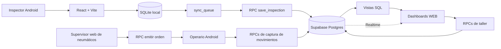

# Arquitectura del sistema

## Responsabilidades

### Dispositivo

- UI, validación inmediata y cálculos de captura.
- SQLite como buffer durable y copia de trabajo.
- UUID v4 para que reintentar no duplique.
- Cola de sync que sobrevive recargas y falta de red.
- La app separada `app movimientos/` autentica al operario, conserva la última bandeja y
  borradores localmente, y nunca permite seleccionar otra empresa: el tenant viene del perfil.

### Supabase

- Verdad consolidada multiempresa.
- Auth y RLS para dashboards/operaciones autenticadas.
- RPCs transaccionales para escrituras complejas.
- Vistas SQL para estados y rendimiento compartidos.
- Realtime para refrescar superficies que observan inspecciones.

### Web

- HTML/JS estático publicado con la SPA.
- `renova-ready.js` coordina disponibilidad de configuración.
- `supabase-demo.js` centraliza sesión, lecturas, badge y Realtime.
- La pestaña Movimientos acepta `tire_supervisor`, `fleet_manager` histórico o `admin`, persiste solo el borrador de indicaciones,
  emite órdenes y observa la captura. No ejecuta retiros ni instalaciones canónicas.
- Los HTML deben presentar datos; las reglas compartidas deben migrar a SQL.

## Fuentes de verdad

| Dato | Fuente |
|---|---|
| Captura que aún no subió | SQLite del dispositivo |
| Historial consolidado | Supabase |
| Reglas de fórmula | Specs + implementación TS/SQL con paridad |
| Umbral usado históricamente | Snapshot de la medición |
| Umbral vigente | `rtd_thresholds` por empresa/medida |
| Identidad física | casco -> ciclo -> instalación |
| Evento operativo | inspección/medición o evento de taller |
| Orden y captura de operario | `tire_movement_orders` / `tire_movement_executions` |
| Métricas agregadas | vistas SQL, no columnas editadas a mano |

## Fronteras importantes

- La app puede operar sin Supabase configurado.
- La captura no depende de que el inventario de taller esté perfecto; la vinculación se resuelve por unidad/posición/ventana temporal.
- Una instalación es un intervalo; un retiro la cierra.
- Un casco no es un ciclo y un ciclo no es una instalación. Ver [[05 - Datos y Supabase]].
