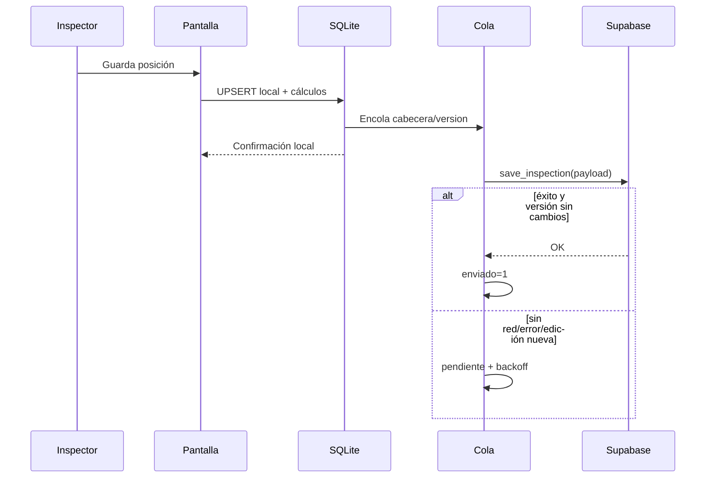

# Flujo de inspección y sincronización

## Camino feliz

1. `AppProvider` inicializa SQLite, ejecuta migraciones/seed y trata de refrescar empresas.
2. Se restaura la empresa guardada o se abre `/empresa`.
3. Al elegir empresa se inicia `pullUmbrales()` en segundo plano.
4. En `/unidad` se busca la placa localmente; si falta metadata, puede precargarse desde `get_unidad_preload`.
5. Se crea/reutiliza `inspeccion_cabecera` con UUID local y se navega a `/inspeccion/:cabeceraId`.
6. Cada posición se precarga desde la inspección anterior y sigue siendo editable.
7. Antes del primer guardado, `waitForUmbralesPendientes()` espera como máximo 3 s al pull activo.
8. `inspeccionRepo.upsertNeumatico()` calcula derivados, guarda snapshot de umbrales y encola la cabecera.
9. Un debounce de 1200 ms dispara `drainSyncQueue()`; el guardado local ya terminó.
10. `pushInspeccionToSupabase()` arma cabecera + todas las posiciones y llama `save_inspection(payload)`.
11. El RPC hace upsert idempotente; la cola marca enviado solo si la versión (`created_at`) no cambió durante el vuelo.

## Fallos y garantías

- Sin configuración Supabase: no se intenta enviar y la app sigue local.
- Error aislado: no bloquea otras cabeceras.
- Reintento: `2^intentos` segundos, tope 300 s.
- Disparadores: montaje de app, evento `online`, nuevo guardado y cierre del día.
- No existe un temporizador autónomo que despierte justo al vencer el backoff.
- Edición durante push: el guard por `created_at` evita marcar como enviada una versión vieja.
- Cierre del día: solo borra local si existe confirmación positiva; cabeceras legacy sin cola se pushean directamente antes de borrar.

## Contrato del payload

La app envía empresa por nombre, placa, fecha, odómetro, tipo/configuración y posiciones con identidad, RTD, presión, anomalía, condición y snapshots RTD. `operation` no tiene fuente actual en la app y queda `NULL`. `not_measured` se infiere de presión nula.

Ver [[06 - Reglas de negocio]] y [[10 - Roadmap deuda y riesgos]].

