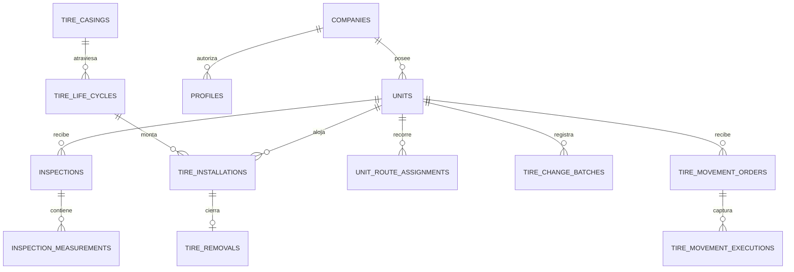

# Datos y Supabase

## Modelo local

- `empresa`, `unidad`: contexto de captura.
- `inspeccion_cabecera`: empresa, unidad, fecha, odómetro, sincronización.
- `inspeccion_neumatico`: una fila por posición con captura, derivados y snapshots.
- `cat_*`: marcas, modelos, medidas, reencauches, anomalías, válvulas, configuraciones y condiciones.
- `umbral_rtd`, `umbral_presion`: tablas LOCALES de SQLite; RTD activo, presión sigue inerte ahí.
- `rtd_thresholds`, `pressure_thresholds`: umbrales remotos por empresa. Presión desde 2026-07-25
  (ADR-0009): rangos mín–máx por medida y tipo de eje, resueltos por `fn_effective_pressure_thresholds`.
- `sync_queue`: una fila durable por cabecera pendiente.

## Modelo consolidado



### Cuatro niveles del neumático

- **Casco:** identidad física permanente.
- **Ciclo:** banda N/R1/R2..., OTD y costo de esa vida.
- **Instalación:** tramo del ciclo en una unidad/posición.
- **Inspección:** observación fechada de la posición.

Separarlos permite medir rendimiento de una banda, posición y vida completa sin pisar historia.

## APIs SQL activas relevantes

- Captura: `save_inspection(jsonb)`.
- Lectura móvil: `get_unidad_preload(text,text)`, `get_umbrales_rtd(text)`.
- Taller: `register_full_installation`, `register_removal`, `transfer_tire`.
- Cambios en lote: `confirm_tire_change_batch(jsonb)` aplica de forma atómica retiros a retén,
  descartes, montajes e intercambios. `fn_mount_existing_cycle` es un helper interno sin
  `EXECUTE` para clientes.
- Rutas: `assign_unit_route`.
- Seguridad interna: `fn_require_workshop_profile`, `fn_validate_free_position`, `current_company_id`.
- Órdenes de operario: `create_tire_movement_order`, `claim_tire_movement_order` y
  `complete_tire_movement_order`. La primera exige `tire_supervisor`; las otras dos, `operator`.

## Vistas principales

- Captura/flota: `v_inspection_dashboard_rows`, `v_unit_tire_status`, `v_fleet_unit_status`, `v_fleet_status_summary`.
- Rendimiento: `v_rendimiento_dashboard_rows`, `v_axle_performance`, vistas de ciclo/casco/instalación definidas en la migración base.
- Taller/historial: `v_unit_position_state` entrega todas las posiciones configuradas, incluso
  vacías; `v_tire_inventory_available` entrega ciclos activos disponibles para montar;
  `v_inventory_status` clasifica cascos instalados, en inventario y descartados;
  `v_casing_history_summary`, `v_casing_installations`, `v_casing_inspections`.
- Rutas: `v_unit_current_route`, `v_installation_route_attribution`.

`v_removal_cause_ranking` y `v_comparison_cycle_rows` (junto con las RPCs `reinstall_tire`/
`retread_casing`) se eliminaron de Supabase al retirar `inventario.html`/`comparativo.html`
del dashboard web.

`v_rendimiento_dashboard_rows` expone remotamente `last_inspection_on`; Rendimiento la usa para
filtrar frescura sin recalcular la fórmula. La definición remota de `v_tire_performance` y esa
extensión no están representadas fielmente en la cadena local de migraciones: no tomar
`schema_draft.sql` como autoridad. La vista conserva grants amplios a `anon, authenticated`, deuda
registrada en [[10 - Roadmap deuda y riesgos]].

No existe una vista de historial RTD para consumo por ventana. La fase de filtros la descartó antes
del DDL por cobertura: al 2026-07-19 solo 64 de 2.247 mediciones enlazaban `life_cycle_id`, sin dos
mediciones por casco en ventanas de 30/60 días. La autoridad de ese hallazgo es
`tasks_filtros_facetados/REVISION_FINAL.md`.

La pantalla `WEB/inventario.html` consume las dos vistas existentes sin agregar DDL: Retén usa
todo `v_tire_inventory_available` (incluye ciclos montables sin retiro previo) y Descartados filtra
`v_inventory_status` por `inventory_status='discarded'`. La empresa no se recibe como filtro del
navegador: se conserva el aislamiento de sesión/RLS.

## Lotes de cambios de neumáticos

`tire_change_batches` conserva la identidad, solicitud y resultado de cada lote confirmado. El
`batch_id` nace en el cliente: repetirlo devuelve el resultado guardado sin duplicar retiros ni
instalaciones. La RPC bloquea y revalida los ciclos esperados antes de escribir; un conflicto se
reporta como `[estado_desactualizado]` y no deja cambios parciales.

El contrato completo de columnas, payloads, respuestas y errores para la UI está en
`tasks_cambios_neumaticos/CONTRATOS_UI.md`. Las vistas `v_unit_position_state` /
`v_tire_inventory_available` y la RPC quedaron validadas contra la UI real con un lote mixto de
los cuatro tipos (retén, descarte con foto, intercambio y montaje) sobre la unidad de prueba
`QA-CN16`; evidencia en `tasks_cambios_neumaticos_ui/REVISION_FINAL.md`.

## Órdenes y captura de operarios

`tire_movement_orders` separa la indicación del supervisor de la ejecución en campo.
`tire_movement_executions` conserva cada salida/ingreso con identidad, posición, catálogo, RTD,
condición, observación y razón humana. `claim` es un tag explícito: no se infiere por poco
kilometraje. El odómetro se captura una vez por orden y no puede retroceder contra
`units.last_odometer`.

Estos hechos nacen `reconciliation_status='pending'`: permiten reemplazar las hojas desde ahora
aunque una empresa aún no haya importado su línea base. No crean una instalación anterior
ficticia; una fase posterior los liga con casco/ciclo/instalación.

## `v_search_index`

Vista de lectura (`security_invoker=true`, `SELECT` solo a `authenticated`) que alimenta el buscador
global. Se construye desde **tablas base** (`units`, `tire_casings`, con laterales
a `tire_life_cycles`/`tire_installations`/`inspections`/`inspection_measurements`), no desde las
vistas de inventario (`v_tire_inventory_available`, `v_inventory_status`). Razón: ninguna vista
existente cubre el universo completo de cascos a la vez (montados + retén + descartados) sin
solaparse parcialmente, y tres de ellas solo existen en remoto sin DDL versionado. `tire_casings`
garantiza que todo casco aparece exactamente una vez, sea cual sea su estado.

El `haystack` de un casco incluye `tire_casings.code` **y** el `tire_code` de su última medición: la
identidad del neumático puede discrepar entre ambas capas (`code_mismatch`), y ambas deben ser
buscables. `20260719180841_search_index_facets.sql` extendió la vista (aditivo, `create or replace
view`, mismo orden de columnas) con `brand_name`/`model_name`/`size_name`/`condition`/
`retread_design` crudos —sin normalizar— para enriquecer la búsqueda por catálogo; la
normalización para comparar ocurre en cliente con `normalizeSearchText`.
Sin filtro de `company_id` dentro de la vista: el aislamiento lo da la RLS de las tablas base
(`select_own_company` en las seis tablas involucradas, `authenticated` únicamente). Detalle y
porqué: ADR-0005 (`decisions/0005-buscador-global-objetos-navegables.md`).

## `v_tire_services`

Vista de lectura (`security_invoker=true`, `SELECT` solo a `authenticated`) construida desde
**tablas base** (`tire_movement_executions` con su orden), que alimenta `servicios.html`. Define la
unidad de conteo del negocio: **un servicio es una posición atendida** —el neumático que sale de esa
posición y el que entra—, así que un servicio son dos movimientos y una rotación entre dos
posiciones cuenta **2** (ADR-0008). Contar órdenes no sirve: una orden mixta tendría tipo
multivaluado.

El pareo es **estructural y por posición**: la entrada cierra la salida de `sequence - 1` **de su
misma posición**, verificado contra `request_items`, nunca por el texto de `observations`. La
condición de misma posición no es cosmética: sin ella un ingreso puede parear con la salida de otra
posición, que es el defecto que ADR-0008 corrigió. Como `complete_tire_movement_order` no valida la
longitud de `p_items`, la alineación sigue siendo propiedad emergente del cliente y no invariante
del esquema; por eso queda un segundo nivel inferido, ahora acotado por conteo **dentro de cada
posición**, y `rotation_pairing` (`exact`/`inferred`/`not_paired`/`not_applicable`) expone cuál
aplicó. Un `inferred` sobre datos reales significa que la emisión perdió la adyacencia del par: se
investiga aguas arriba, no se relaja la vista.

`service_type='installation'` queda para el ingreso que **no** reemplaza ninguna salida —un montaje
sobre posición vacía—. Sigue siendo derivado en la vista porque la constraint prohíbe que un `entry`
lleve `movement_reason`, pero ya no absorbe todo ingreso sin pareo.

`entry_origin_position` **deriva** de dónde viene el neumático que entra: la posición por la que
salió ese mismo `casing_code` en la misma orden. El operario no lo declara —sería pedirle un dato
que el sistema ya tiene—. Cuando el casco no salió en esa orden (viene de retén, de reparación o es
nuevo) la columna queda **NULL** y la pantalla lo muestra indeterminado: resolverlo exige el
historial del casco, que es el mismo problema que la reconciliación pendiente
([[10 - Roadmap deuda y riesgos]]).

Expone `brand_key`/`size_key` normalizados (`upper(btrim(...))`) además de la grafía cruda: agrupar
no tolera las variantes de caja que buscar sí tolera (ver deuda en
[[10 - Roadmap deuda y riesgos]]). Sin filtro de `company_id` dentro de la vista; el aislamiento lo
da la RLS de las tablas base. Índice de apoyo:
`tire_movement_executions (company_id, captured_at desc, sequence)`.

Definición y porqué: **ADR-0008** (`decisions/0008-servicio-por-posicion-atendida.md`), que supera la
unidad de conteo de ADR-0007 y conserva el resto. Contrato de columnas:
`tasks_servicios/CONTRATOS_DATOS.md` (histórico de Fase 1) más lo que ADR-0008 cambia.

## Convención de zona horaria del proyecto

**Toda agrupación de `timestamptz` por día usa `at time zone 'America/Lima'`** —no solo
`v_tire_services`, donde se decidió (D11, 2026-07-20)—:

```sql
(captured_at at time zone 'America/Lima')::date
```

**Por qué:** sin conversión explícita, PostgREST y `::date` resuelven en UTC, y un hecho capturado a
las 20:00 en Lima se agrupa al día siguiente. Un jefe de flota vería actividad de ayer contada como
de hoy. Antes de esta decisión el proyecto no tenía convención porque nunca había necesitado
agrupar por día (`grep "at time zone"` sobre las migraciones daba 0 resultados). No elegir un
default en silencio era el punto: la alternativa honesta descartada era dejar UTC y nombrar la
columna `captured_on_utc`.

## RLS

Las tablas de negocio se filtran por `company_id` derivado del perfil autenticado. Catálogos estructurales son legibles por usuarios autenticados. Excepciones móviles acotadas permiten a `anon` listar empresas y llamar RPCs específicos mientras la app no tenga login. Las vistas expuestas deben usar `security_invoker=true`.

La excepción `anon` anterior corresponde a la app de inspecciones. La app de movimientos exige
sesión, perfil activo `operator` y usa `v_operator_movement_orders` con `security_invoker=true`;
empresa y rol se vuelven a validar dentro de cada RPC de escritura.

Las vistas nuevas de cambios y `tire_change_batches` solo se leen con `authenticated`; no se
exponen a `anon`. La tabla permite al cliente consultar lotes de su empresa, pero toda escritura
pasa por `confirm_tire_change_batch`, que exige un perfil de taller y deriva la empresa del JWT.

No confundir `GRANT` con RLS: el primero permite acceder al objeto; RLS decide qué filas puede ver. Ver [[08 - Infraestructura seguridad y despliegue]].
