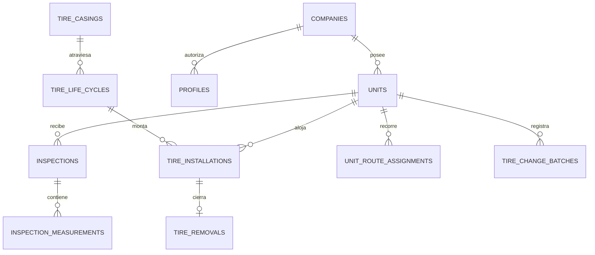

# Datos y Supabase

## Modelo local

- `empresa`, `unidad`: contexto de captura.
- `inspeccion_cabecera`: empresa, unidad, fecha, odómetro, sincronización.
- `inspeccion_neumatico`: una fila por posición con captura, derivados y snapshots.
- `cat_*`: marcas, modelos, medidas, reencauches, anomalías, válvulas, configuraciones y condiciones.
- `umbral_rtd`, `umbral_presion`: RTD activo; presión creada pero todavía inerte.
- `sync_queue`: una fila durable por cabecera pendiente.

## Modelo consolidado

### Cuatro niveles del neumático

- **Casco:** identidad física permanente.
- **Ciclo:** banda N/R1/R2..., OTD y costo de esa vida.
- **Instalación:** tramo del ciclo en una unidad/posición.
- **Inspección:** observación fechada de la posición.

Separarlos permite medir rendimiento de una banda, posición y vida completa sin pisar historia.

## APIs SQL activas relevantes

- Captura: `save_inspection(jsonb)`.
- Lectura móvil: `get_unidad_preload(text,text)`, `get_umbrales_rtd(text)`.
- Taller: `register_full_installation`, `register_removal`, `transfer_tire`.
- Cambios en lote: `confirm_tire_change_batch(jsonb)` aplica de forma atómica retiros a retén,
  descartes, montajes e intercambios. `fn_mount_existing_cycle` es un helper interno sin
  `EXECUTE` para clientes.
- Rutas: `assign_unit_route`.
- Seguridad interna: `fn_require_workshop_profile`, `fn_validate_free_position`, `current_company_id`.

## Vistas principales

- Captura/flota: `v_inspection_dashboard_rows`, `v_unit_tire_status`, `v_fleet_unit_status`, `v_fleet_status_summary`.
- Rendimiento: `v_rendimiento_dashboard_rows`, `v_axle_performance`, vistas de ciclo/casco/instalación definidas en la migración base.
- Taller/historial: `v_unit_position_state` entrega todas las posiciones configuradas, incluso
  vacías; `v_tire_inventory_available` entrega ciclos activos disponibles para montar;
  `v_inventory_status` (usada por `v_casing_history_summary`, ya no tiene pantalla propia),
  `v_casing_history_summary`, `v_casing_installations`, `v_casing_inspections`.
- Rutas: `v_unit_current_route`, `v_installation_route_attribution`.

`v_removal_cause_ranking` y `v_comparison_cycle_rows` (junto con las RPCs `reinstall_tire`/
`retread_casing`) se eliminaron de Supabase al retirar `inventario.html`/`comparativo.html`
del dashboard web.

## Lotes de cambios de neumáticos

`tire_change_batches` conserva la identidad, solicitud y resultado de cada lote confirmado. El
`batch_id` nace en el cliente: repetirlo devuelve el resultado guardado sin duplicar retiros ni
instalaciones. La RPC bloquea y revalida los ciclos esperados antes de escribir; un conflicto se
reporta como `[estado_desactualizado]` y no deja cambios parciales.

El contrato completo de columnas, payloads, respuestas y errores para la UI está en
`tasks_cambios_neumaticos/CONTRATOS_UI.md`. Las vistas `v_unit_position_state` /
`v_tire_inventory_available` y la RPC quedaron validadas contra la UI real con un lote mixto de
los cuatro tipos (retén, descarte con foto, intercambio y montaje) sobre la unidad de prueba
`QA-CN16`; evidencia en `tasks_cambios_neumaticos_ui/REVISION_FINAL.md`.

## RLS

Las tablas de negocio se filtran por `company_id` derivado del perfil autenticado. Catálogos estructurales son legibles por usuarios autenticados. Excepciones móviles acotadas permiten a `anon` listar empresas y llamar RPCs específicos mientras la app no tenga login. Las vistas expuestas deben usar `security_invoker=true`.

Las vistas nuevas de cambios y `tire_change_batches` solo se leen con `authenticated`; no se
exponen a `anon`. La tabla permite al cliente consultar lotes de su empresa, pero toda escritura
pasa por `confirm_tire_change_batch`, que exige un perfil de taller y deriva la empresa del JWT.

No confundir `GRANT` con RLS: el primero permite acceder al objeto; RLS decide qué filas puede ver. Ver [[08 - Infraestructura seguridad y despliegue]].
