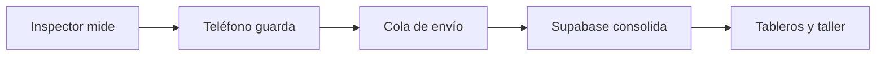

# Empezar aquí

RENOVA INSPECTOR es, en criollo, un **cuaderno de inspecciones que no se pierde cuando no hay internet**, más un archivo central que junta el trabajo de todos y arma tableros.

Pensalo como tres lugares:

1. **El teléfono del inspector** es la libreta que lleva al patio.
2. **Supabase** es el archivo central y vigilado de la empresa.
3. **Los tableros web** son las ventanas donde el jefe y el taller miran ese archivo.

## Lo más importante

- Si se corta internet, el inspector debe poder seguir trabajando.
- El teléfono guarda primero y manda después.
- Una inspección no se borra del teléfono hasta que la nube confirme que la recibió.
- Cada empresa debe ver solo lo suyo.
- Los límites de desgaste cambian por empresa y medida; no son números clavados para todos.
- La presión con neumático CALIENTE todavía no tiene una regla confirmada.

Seguir con [[01 - Que problema resuelve RENOVA]].

