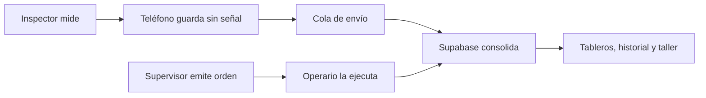

# Empezar aquí

RENOVA INSPECTOR es, en criollo, un **cuaderno de inspecciones que no se pierde cuando no hay
internet**, más un archivo central que junta el trabajo de todos, organiza el taller y arma
tableros.

Se puede pensar como cuatro lugares:

1. **El teléfono del inspector** es la libreta que lleva al patio.
2. **La app del operario** recibe órdenes y registra qué neumático sale y cuál entra.
3. **Supabase** es el archivo central de todas las empresas.
4. **Los tableros web** son las ventanas donde el jefe y el taller consultan y dirigen el trabajo.

## Lo más importante

- Si se corta internet, el inspector debe poder seguir trabajando.
- El teléfono guarda primero y manda después.
- Una inspección no se borra del teléfono hasta que la nube confirme que la recibió.
- En las pantallas con login, cada empresa debe ver solo lo suyo.
- La app de inspección todavía sincroniza sin identidad de inspector. Por eso tres ventanillas
  técnicas siguen abiertas con la clave pública: es un riesgo aceptado solo para el piloto y debe
  cerrarse antes de crecer con varios clientes reales.
- Los límites de desgaste cambian por empresa y medida; no son números clavados para todos.
- La presión en FRÍO usa rangos por medida y eje.
- La presión con neumático CALIENTE todavía no tiene una regla confirmada.
- Una orden del supervisor no equivale a un trabajo ejecutado: el operario registra la ejecución.
- Los movimientos ejecutados todavía deben reconciliarse con la historia canónica del neumático.

## Qué está realmente comprobado

Al 26 de julio de 2026:

- las ocho suites automáticas suman 411 pruebas y están verdes;
- las dos apps compilan;
- Supabase está activo;
- sus tablas tienen separación por empresa y sus vistas exigen sesión;
- siguen faltando pruebas completas en teléfonos y condiciones reales de campo.

Seguir con [[01 - Que problema resuelve RENOVA]].
