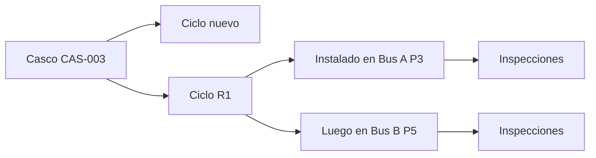

# La vida de un neumático

Para no mezclar historias, el sistema separa cuatro cosas.

## 1. Casco

Es el cuerpo físico. Sigue siendo el mismo aunque cambie de banda, bus o posición.

## 2. Ciclo

Es una vida de la banda: nueva, R1, R2, etc. Cada ciclo puede tener su costo y profundidad inicial. Cuando se reencaucha, empieza otro ciclo; el casco sigue siendo el mismo.

## 3. Instalación

Es el tramo en que ese ciclo estuvo montado en un bus y posición. Una transferencia cierra un tramo y abre otro.

## 4. Inspección

Es la foto de un día: cuánto marcó el odómetro y qué se midió en esa posición.

## Por qué tanta separación

Permite responder preguntas distintas:

- ¿Cuánto rindió esta banda?
- ¿En qué posición se gastó más?
- ¿Cuántos kilómetros dio el casco durante toda su vida?
- ¿Valió la pena reencaucharlo?

Una sola tabla “neumático” terminaría pisando o mezclando esas respuestas.

## Qué pasa cuando se mueve

- **Rotación o traslado:** cierra un tramo y abre otro, pero sigue el mismo ciclo.
- **Retiro:** cierra la instalación.
- **Retén:** el ciclo queda disponible para volver a montar.
- **Descarte:** termina definitivamente la vida del casco.
- **Reencauche:** debería abrir R1/R2, pero ese paso todavía no forma parte del RPC actual.

## La línea base

La flota no fue convertida de golpe al modelo de taller. Si una posición está vacía en la historia
canónica pero existe una inspección reciente, RENOVA la marca como `baseline_pending`: hay evidencia
de un neumático, pero no una fecha de instalación demostrada.

Una persona debe confirmar el primer montaje y declarar la fecha. El sistema guarda qué medición
sirvió como evidencia, pero no inventa que esa fecha fue la fecha real del montaje.

## Diferencias que todavía aparecen

Una inspección puede encontrar un código o marca diferente de la instalación activa. Eso puede ser
un cambio físico no registrado o un error de captura. Rendimiento lo señala si el RTD crece, pero no
reescribe solo la historia. Resolverlo exige un movimiento confirmado o una reconciliación humana.

Seguir con [[05 - Tableros inventario y taller]].
